# [WIP] okhi - Open Keylogger Hardware Implant

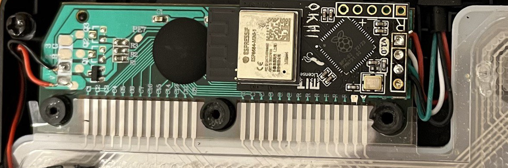

okhi is an implant that can be utilized to log keystrokes from a USB/PS2 keyboard. The implant is designed to be  easily concealable within a keyboard, laptop, or tower case. It is powered by the keyboard cable itself. The implant can be accessed via WiFi and enables real-time viewing of keystrokes.

It is based on the RP2040 + ESP chip. The RP2040 is responsible for sniffing & parsing the keyboard data, while the ESP chip is used to transmit the data over WiFi.

----

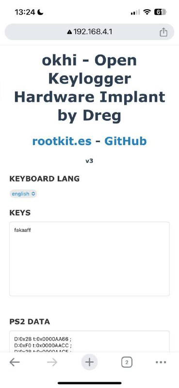

----

okhi is designed to be a proof of concept and educational tool. It is not intended to be used for malicious purposes.

okhi consumes ~120ma of current, the target & cable must be able to supply this amount, otherwise, the implant will not work. 

Note that the keyboard itself consumes power as well. The maximum current for USB 2.0 is 500mA. Never exceed this limit.

Just connect VBUS, GND and data lines to okhi, and you are ready to go. 

You can sniff keyboard data by connecting okhi to the end of the cable or to a through-hole pin connector inside the tower. It can also be connected to accessible pads or traces. If the keyboard data is present, okhi will be able to sniff it.

okhi connected using copper wires to keyboard PCB-pads:

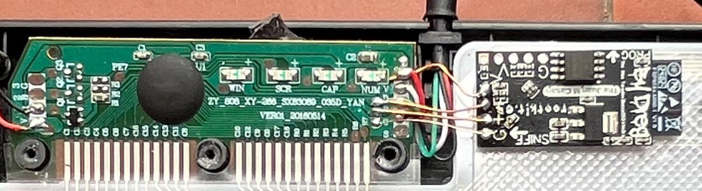

# Apparence

Front (black or green)

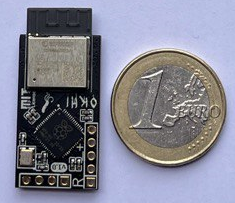

Back (black or green)

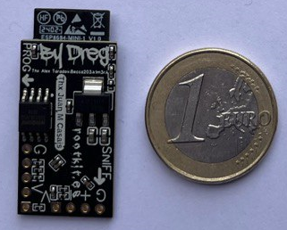

# Size (mm)

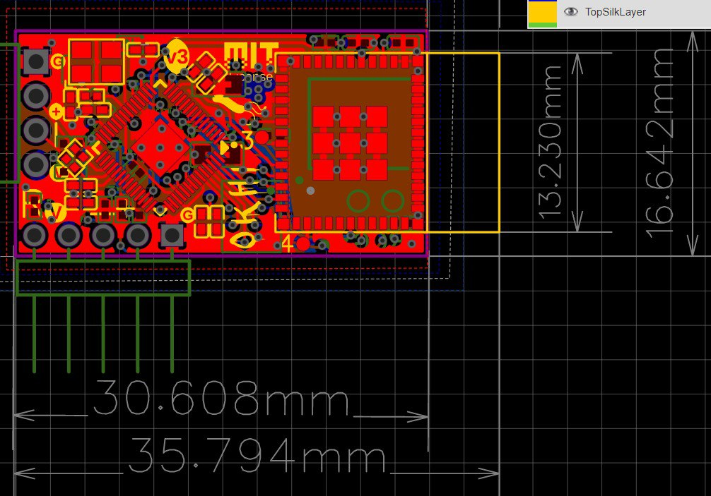

Check size before buying, maybe it is too big for your target. Or maybe you need drill some space inside the keyboard.

# Features

- PS2 and USB keyboard support
- WiFi + web support
- Real-time viewing of keystrokes
- Open Hadware
- Open Source (MIT License)
- Community support

# Where to buy

Early Stage project, so you can purchase it directly from me. Please send an email to dreg@rootkit.es for further inquiries.

In a few weeks, I will provide a public link to buy it.

Gerber files and BOM will be available soon.

----
 
 At this moment only Windows is documented. Linux and Mac will be documented soon. I am only one person, so please be patient....

 ----

# Firmware update

- Download the latest firmware from the releases section

- Connect the implant to auxboard PROG pins (R female-pin must match with the R male-pin of the implant):

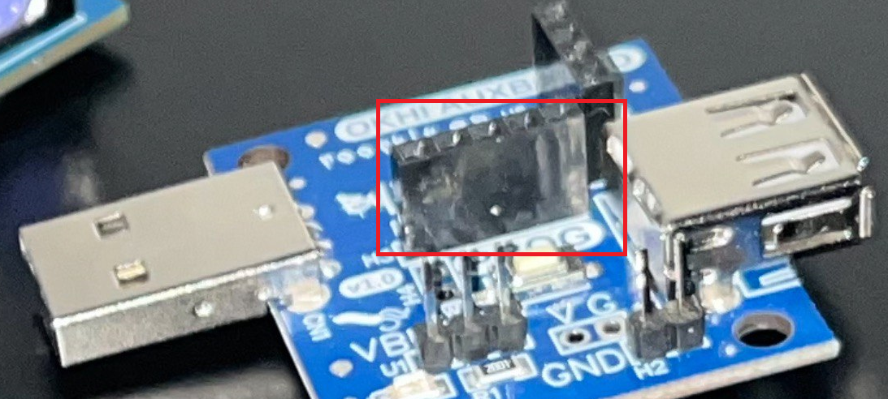

- Connect the auxboard to the computer using a USB cable (make sure the auxboard's USB female connector is not connected)

- Entering Program Mode for the OKHI Module: Before connecting the OKHI module to a USB port, ensure you press and hold the programming button (BOOT auxboard).

- Uploading the UART Bridge Firmware: Transfer the uart_bridge.uf2 file to the OKHI module, which will appear as a MASS STORAGE DEVICE on your computer (e.g., drive E:). The device will automatically eject once the file transfer completes.

- Switching to Normal Mode: To operate the OKHI module in normal mode, connect it to a USB port without pressing any buttons.

- Programming the ESP Module: Run the upload_firmware.bat script to start programming the ESP module. This script automates the firmware installation process.

- Selecting the COM Port: Input the COM port number where the OKHI module is connected (e.g., COM3). If you are uncertain of the correct COM port, the batch file will display a list of available COM ports. You may need to try each one sequentially to find the correct connection.

- Completing the Programming Process: Wait for the script to finish running. Once complete, the ESP module will be programmed and ready for use.

- Re-entering Program Mode: Disconnect the OKHI module from the USB, then reconnect it in program mode by pressing the programming button before plugging it back into the USB.

- Programming the RP2040 Chip: Copy the okhi.uf2 file to the OKHI module, now recognized again as a MASS STORAGE DEVICE (e.g., drive E:). The device will automatically eject after the file transfer.

- Finalizing Setup for RP2040: The RP2040 chip is now programmed and ready for operational use.

- Reconnecting for Regular Use: Disconnect the OKHI module from USB and then reconnect it without pressing the programming button for normal use.

- Connecting to the ESP WiFi Network: An ESP WiFi network will become available with the password '0123456789'. Connect to this network and open a web browser to access the web interface at: http://192.168.4.1/ 

# PS2<->USB adapters working with okhi

- 1 (adapter from hell, it works, but not recommended) (Amazon)

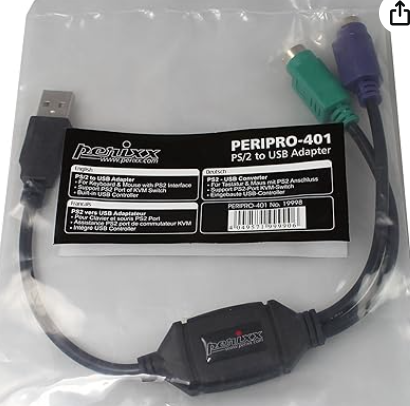

- 2 Aliexpress (OK)

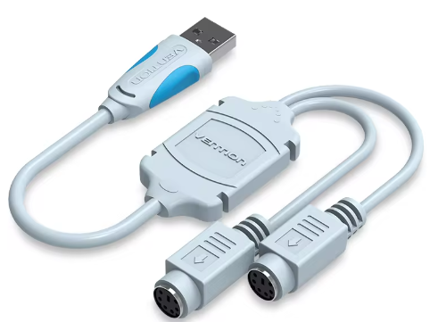

- 3 Aliexpress (OK)

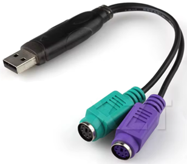

- 4 Aliexpress (OK)

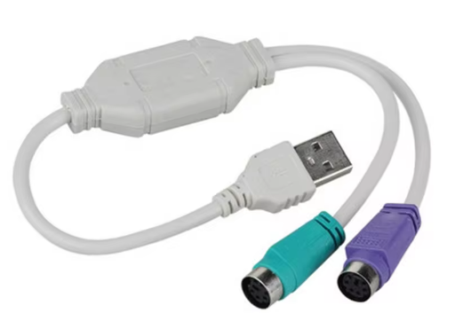

# NEVER BUY THIS PS2<->USB

# Developers setup

 - Install the latest version of pico-sdk: https://github.com/raspberrypi/pico-setup-windows/releases/latest/download/pico-setup-windows-x64-standalone.exe

 - Clone this repo or download the zip file: https://github.com/therealdreg/okhi/archive/refs/heads/main.zip

 - Open the "Pico - Visual Studio Code" shortcut (it is installed with the pico-setup-windows). Never use a normal Visual Studio Code!!

 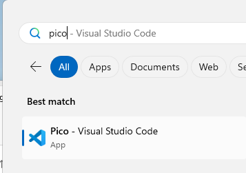

- Open the okhi project, File -> Open Folder...

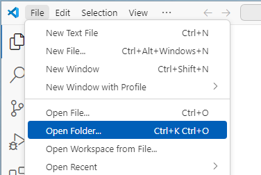

- Select oki folder: firmware\ps2\rp 

- Click Select Folder

- Click on "Trust the authors" if you see this message

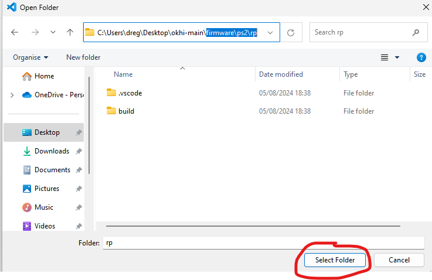

- Press shift+ctrl+p, type cmake cache and Select: "CMake: Delete Cache and Reconfigure"

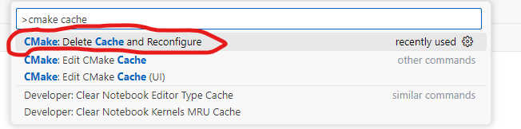

- Press shift+ctrl+p, type cmake build and Select: "CMake: Build"

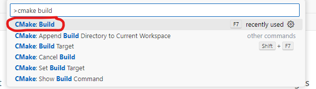

- If everything is ok, you will see a message like this in OUTPUT window (bottom):

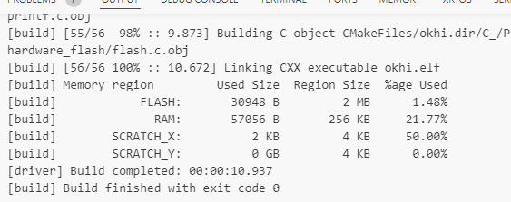

- Now a new firmware\ps2\rp\build\okhi.uf2 file is created and ready to be uploaded to okhi

- Install PlatformIO IDE in "Pico - Visual Studio Code", go to Extensions and search for PlatformIO and install it

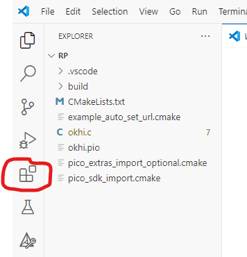

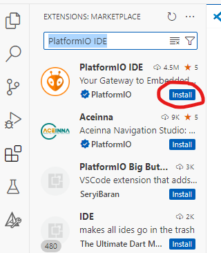

- Wait for the installation to finish, it will take a few minutes...

- Click on Reload Now

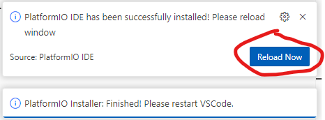

- Close all instances of the "Pico - Visual Studio Code" and open it again

- Open the okhi project, File -> Open Folder...

- Select oki folder: firmware\ps2\esp

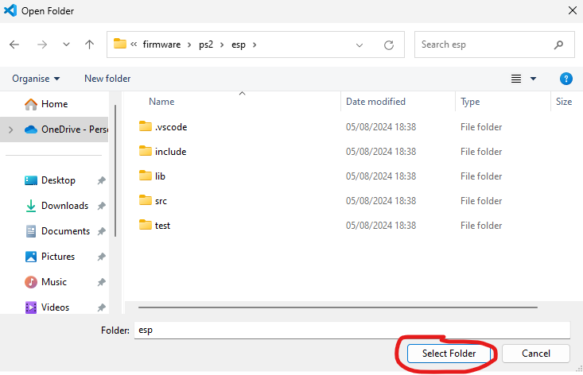

- Wait while PlatformIO is configuring the project, download the dependencies, etc... it will take a few minutes...

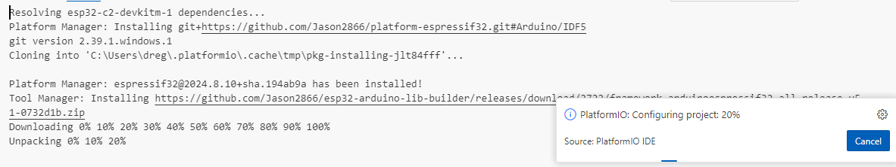

- Click on PlatformIO icon (left side), select esp32-c2-devkitm-1 and click on Build, it will take a few minutes... if everything is ok, a message like this will appear in TERMINAL window (bottom):

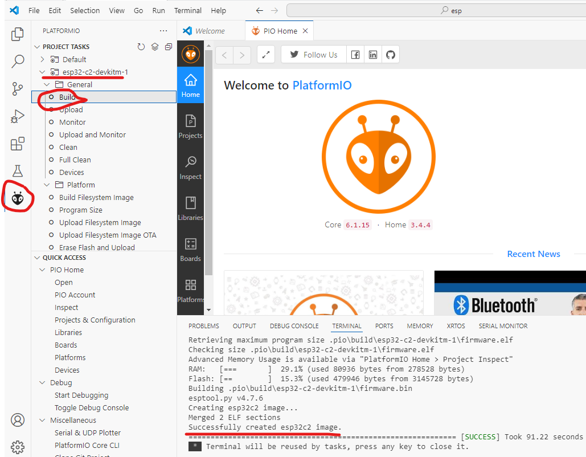

- A new .pio\build\esp32-c2-devkitm-1\firmware.bin file is created and ready to be uploaded to okhi

- Execute the following file to generate a new release to upload a new ESP firmware: make_release.bat

-----

To compile USB firmware, follow the same steps but select firmware\usb\ folder in the first step.

# Developers doc

- https://datasheets.raspberrypi.com/pico/getting-started-with-pico.pdf

- https://datasheets.raspberrypi.com/pico/raspberry-pi-pico-c-sdk.pdf

- https://docs.espressif.com/projects/esp-idf/en/latest/esp32c2/get-started/index.html

- https://www.usbmadesimple.co.uk/

- https://www.beyondlogic.org/usbnutshell/usb1.shtml

- [PS2 Keyboard - Adam Chapweske.pdf](stuff/PS2_Keyboard.pdf)

- [USB Documentation - Christopher D Leary and Devrin Talen.pdf](stuff/USB_doc.pdf) 

# Schematic

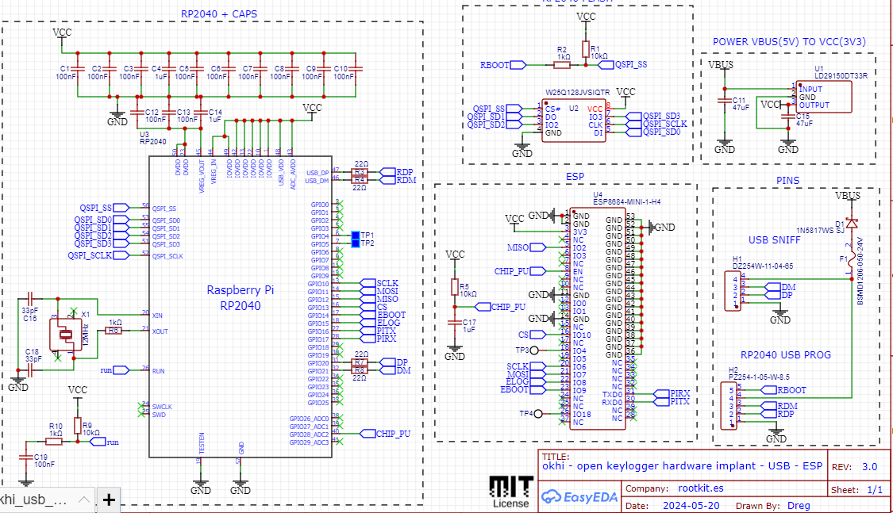

# Credits

- Juan M Martinez Casais: my friend who is a - GOD mode -  electronic engineer

- Alex Taradov (PIO USB): https://github.com/ataradov/usb-sniffer-lite
