# okhi - Open Keylogger Hardware Implant

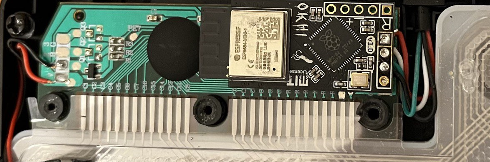

okhi is an implant that can be utilized to log keystrokes from a USB/PS2 keyboard. The implant is designed to be  easily concealable within a keyboard, laptop, or tower case. It is powered by the keyboard cable itself. The implant can be accessed via WiFi and enables real-time viewing of keystrokes.

It is based on the RP2040 + ESP chip. The RP2040 is responsible for sniffing & parsing the keyboard data, while the ESP chip is used to transmit the data over WiFi.

----

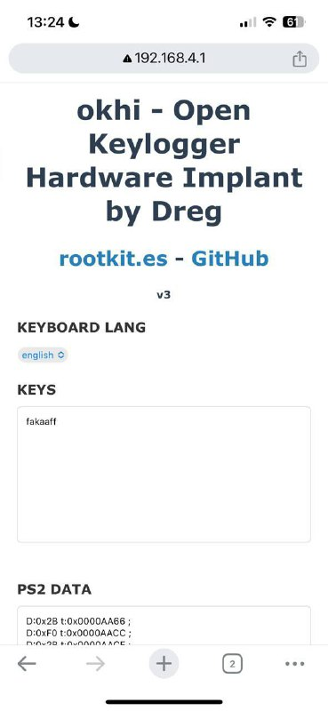

----

okhi is designed to be a proof of concept and educational tool. It is not intended to be used for malicious purposes.

okhi consumes ~120ma of current, the target & cable must be able to supply this amount, otherwise, the implant will not work. 

Note that the keyboard itself consumes power as well. The maximum current for USB 2.0 is 500mA. Never exceed this limit.

Just connect VBUS, GND and data lines to okhi, and you are ready to go. 

You can sniff keyboard data by connecting okhi to the end of the cable or to a through-hole pin connector inside the tower. It can also be connected to accessible pads or traces. If the keyboard data is present, okhi will be able to sniff it.

okhi connected using copper wires to keyboard PCB-pads:

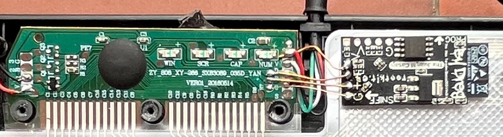

# Apparence

Front (black or green)

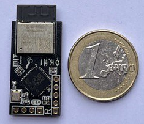

Back (black or green)

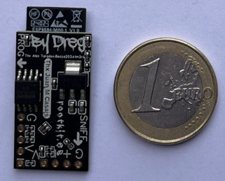

# Size (mm)

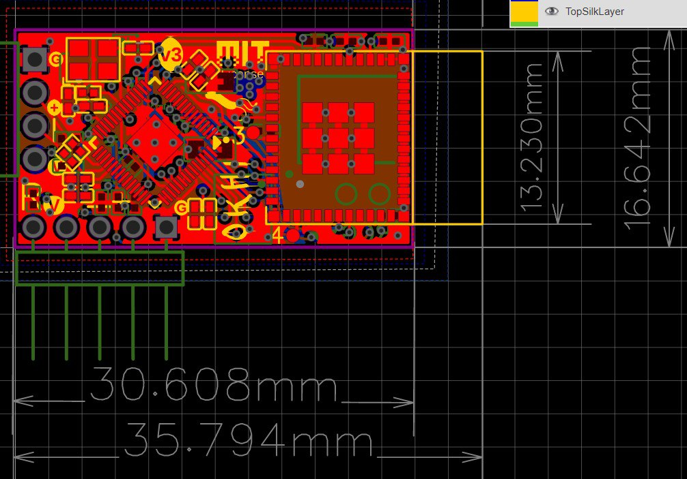

Check size before buying, maybe it is too big for your target. Or maybe you need drill some space inside the keyboard.

# Features

- PS2 and USB keyboard support
- WiFi + web support
- Real-time viewing of keystrokes
- Open Hadware
- Open Source (MIT License)
- Community support

# Where to buy

Early Stage project, so you can purchase it directly from me. Please send an email to dreg@rootkit.es for further inquiries.

In a few weeks, I will provide a public link to buy it.

Gerber, Pick and Place files and BOM will be available soon.

----
 
 At this moment only Windows is documented. Linux and Mac will be documented soon. I am only one person, so please be patient....

 ----

 # Starter pack
 
 Currently, the only way to buy okhi is with the starter pack. The starter pack includes:

- 1 okhi implant

- 1 auxboard: it allows you to program the implant. It is also used to test the implant out of the keyboard (man in the middle USB).

To test implant (USB): insert the sniff-male-pins (GND must coincide with G pin) into aux board sniff-female-pins, connect keyboard to USB female and connect the auxboard to the computer. You can see the keystrokes in the web interface.

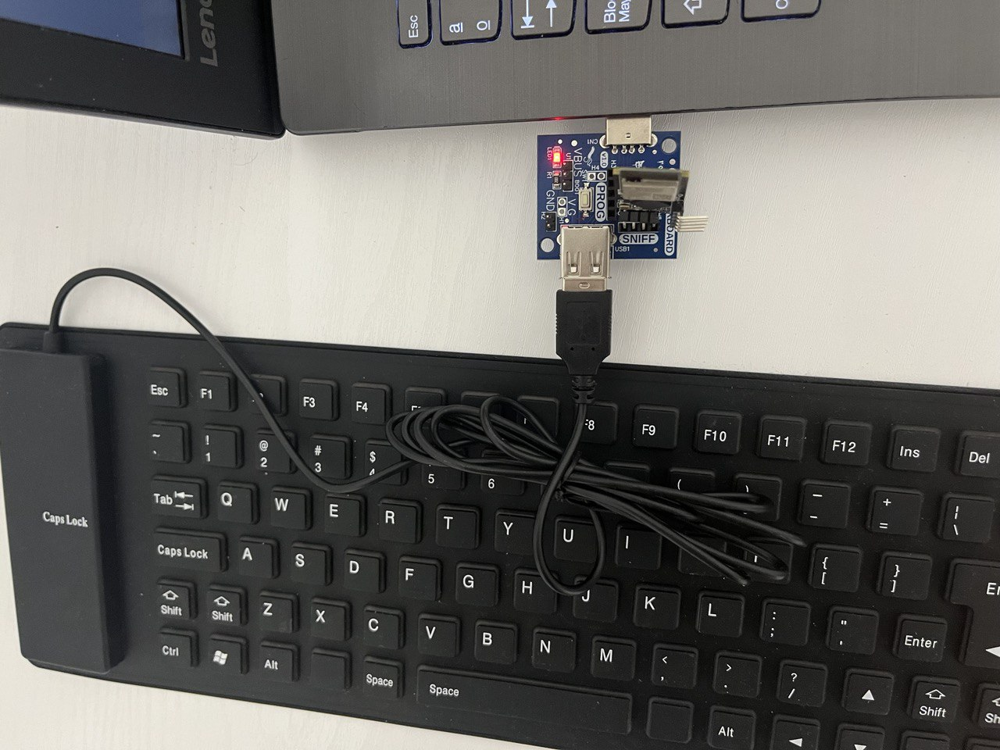

To program the implant: connect the implant prog-male-pins to auxboard PROG-female-pins (GND must coincide with G pin), press BOOT button and connect the auxboard to the computer. **Keyboard must be disconnected** from the auxboard!!

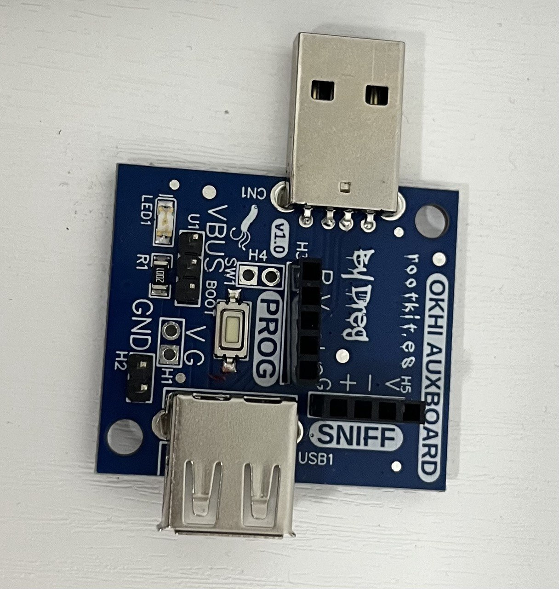

**NOTE: Future versions will include a USB male connector to give more power to the implant if needed.**

- 1 ps2 implant probe board: It is also used to test the implant out of the PS2 keyboard (man in the middle PS2). This board converts PS2 signals to 3v3 for okhi.

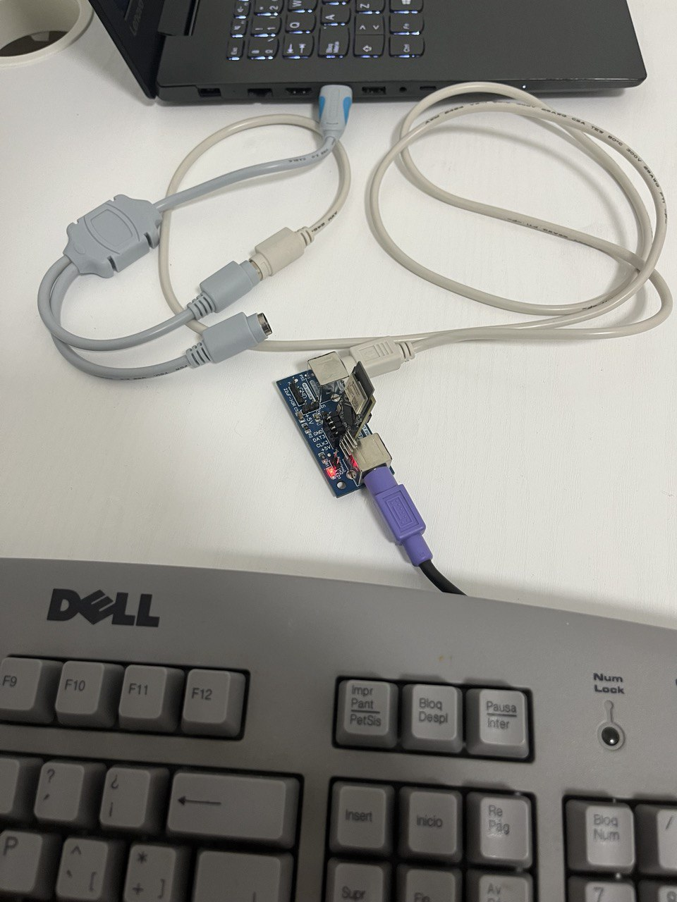

To test implant (PS2): insert the sniff-male-pins (GND must coincide with G pin) into sniff-female-pins, connect keyboard to PS2 connector and connect the implant probe to your computer PS2/or PS2<->USB adapter. You can see the keystrokes in the web interface.

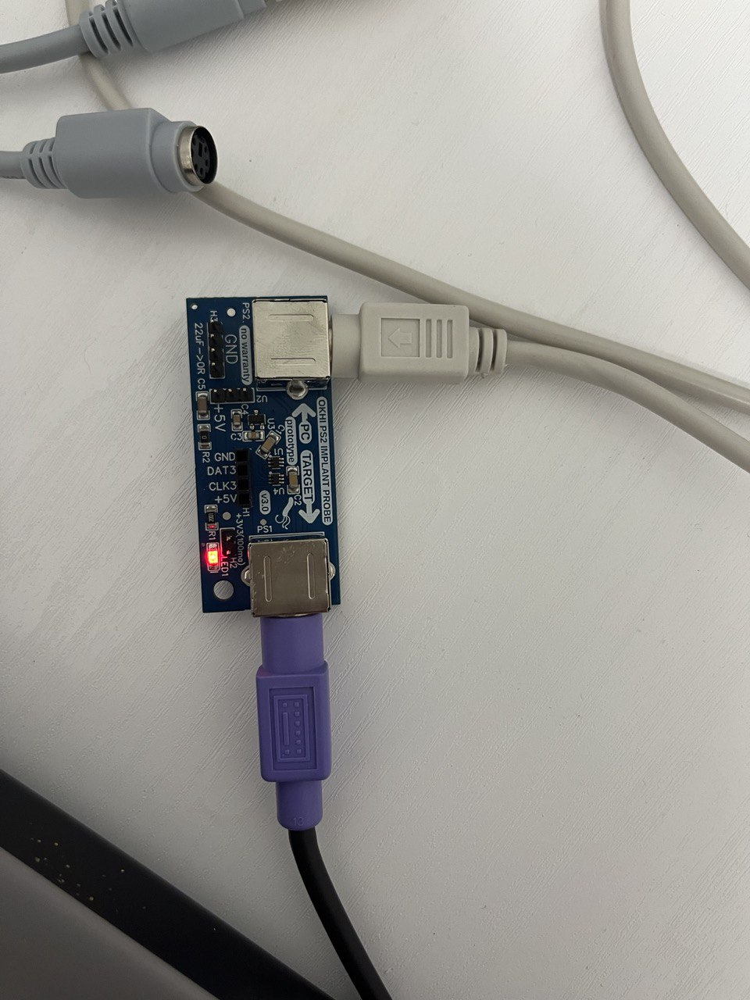

**NOTE: Future versions will include a USB male connector to give more power to the implant if needed.**

- 1 PS2 adapter board for okhi, okhi inputs only allow 3v3, so this board is necessary to convert PS2 signals to 3v3 (use only when you need intall okhi inside the PS2 keyboard/ower....).

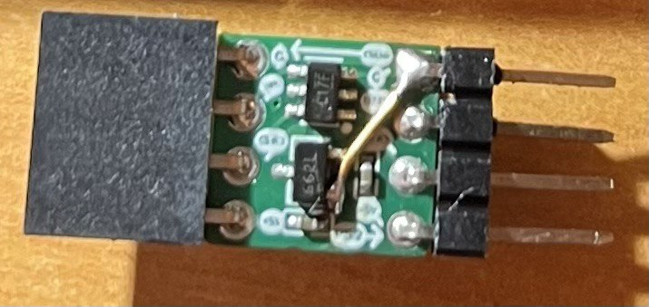

Just connect okhi-male-SNIFF-pins to the female pins (GND with G) and ps2adapter-male-pins to the PS2 keyboard. 

You need to buy by yourself:
- 1 PS2 male to PS2 male cable (MINI-DIN 6P)
- 1 PS2<->USB adapter
- 1 USB extension cable (optional)
- 1 USB Keyboard (optional)
- 1 PS2 Keyboard (Lenovo on Aliexpress is OK) (optional)

# Firmware update

It is necceary to update the firmware before using okhi. The firmware is divided into two parts: RP2040 and ESP32-C2.

RP2040 chip is the responsible for programming the ESP32-C2 chip. 

So first, you need burn a temporal firmware to the RP2040 chip to program the ESP32-C2 chip. After that, you need to burn the ESP firmware to the ESP32-C2 chip via RP2040 usb port. 

Finally, you need to burn the final firmware to the RP2040 chip, thats all. Can be done in a few minutes, and this task is only necessary when you need to update the firmware.

Follow these steps to update the firmware:

- Download the latest firmware from the releases section: https://github.com/therealdreg/okhi/releases/latest

- Connect the implant to auxboard PROG pins (R female-pin must match with the R male-pin of the implant):

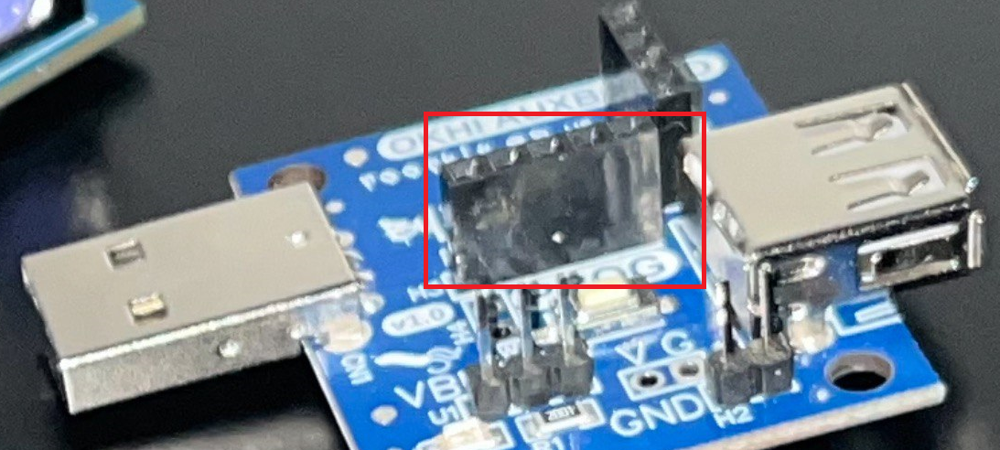

- Connect the auxboard to the computer using a USB cable (make sure the auxboard's USB female connector is not connected)

- Entering Program Mode for the OKHI Module: Before connecting the OKHI module to a USB port, ensure you press and hold the programming button (BOOT auxboard).

- Uploading the UART Bridge Firmware: Transfer the uart_bridge.uf2 file to the OKHI module, which will appear as a MASS STORAGE DEVICE on your computer (e.g., drive E:). The device will automatically eject once the file transfer completes.

- Switching to Normal Mode: To operate the OKHI module in normal mode, connect it to a USB port without pressing any buttons.

- Programming the ESP Module: Run the upload_firmware.bat script to start programming the ESP module. This script automates the firmware installation process.

- Selecting the COM Port: Input the COM port number where the OKHI module is connected (e.g., COM3). If you are uncertain of the correct COM port, the batch file will display a list of available COM ports. You may need to try each one sequentially to find the correct connection.

- Completing the Programming Process: Wait for the script to finish running. Once complete, the ESP module will be programmed and ready for use.

- Re-entering Program Mode: Disconnect the OKHI module from the USB, then reconnect it in program mode by pressing the programming button before plugging it back into the USB.

- Programming the RP2040 Chip: Copy the okhi.uf2 file to the OKHI module, now recognized again as a MASS STORAGE DEVICE (e.g., drive E:). The device will automatically eject after the file transfer.

- Finalizing Setup for RP2040: The RP2040 chip is now programmed and ready for operational use.

- Reconnecting for Regular Use: Disconnect the OKHI module from USB and then reconnect it without pressing the programming button for normal use.

- Connecting to the ESP WiFi Network: An ESP WiFi network will become available with the password '0123456789'. Connect to this network and open a web browser to access the web interface at: http://192.168.4.1/ 

# PS2<->USB adapters working with okhi

- 1 (adapter from hell, it works, but not recommended) (Amazon)

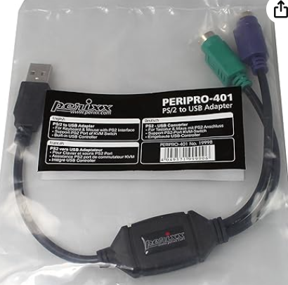

- 2 Aliexpress (OK)

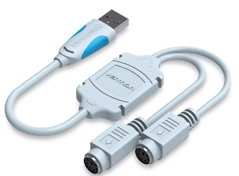

- 3 Aliexpress (OK)

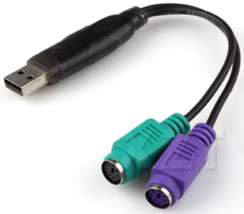

- 4 Aliexpress (OK)

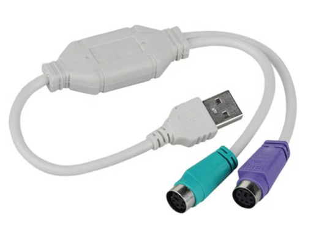

# NEVER BUY THIS PS2<->USB


# Developers setup

 - Install the latest version of pico-sdk: https://github.com/raspberrypi/pico-setup-windows/releases/latest/download/pico-setup-windows-x64-standalone.exe

 - Clone this repo or download the zip file: https://github.com/therealdreg/okhi/archive/refs/heads/main.zip

 - Open the "Pico - Visual Studio Code" shortcut (it is installed with the pico-setup-windows). Never use a normal Visual Studio Code!!

 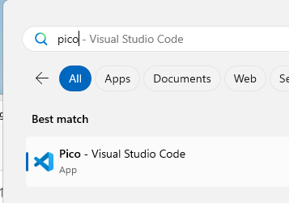

- Open the okhi project, File -> Open Folder...

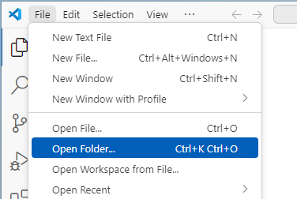

- Select oki folder: firmware\ps2\rp 

- Click Select Folder

- Click on "Trust the authors" if you see this message

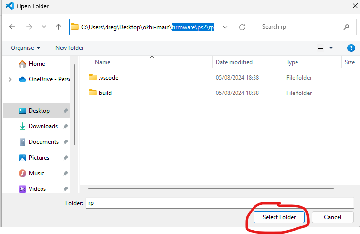

- Press shift+ctrl+p, type cmake cache and Select: "CMake: Delete Cache and Reconfigure"

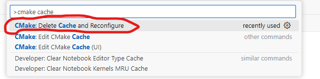

- Press shift+ctrl+p, type cmake build and Select: "CMake: Build"

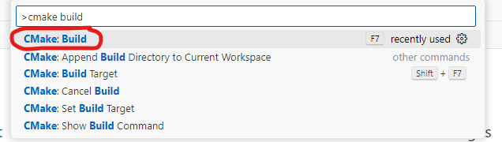

- If everything is ok, you will see a message like this in OUTPUT window (bottom):

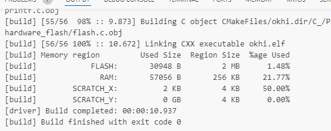

- Now a new firmware\ps2\rp\build\okhi.uf2 file is created and ready to be uploaded to okhi

- Install PlatformIO IDE in "Pico - Visual Studio Code", go to Extensions and search for PlatformIO and install it

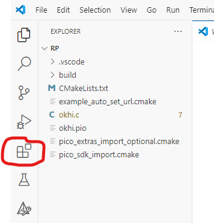

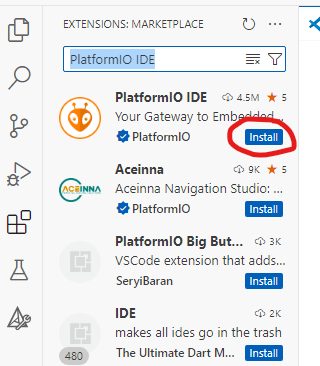

- Wait for the installation to finish, it will take a few minutes...

- Click on Reload Now

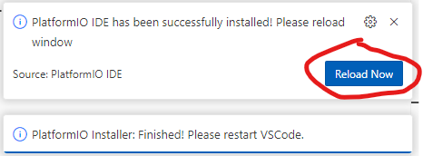

- Close all instances of the "Pico - Visual Studio Code" and open it again

- Open the okhi project, File -> Open Folder...


- Select oki folder: firmware\ps2\esp

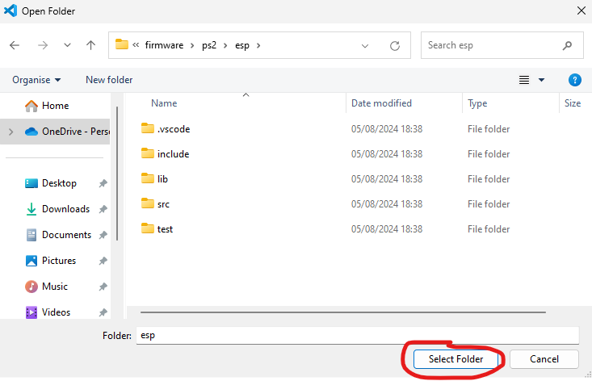

- Wait while PlatformIO is configuring the project, download the dependencies, etc... it will take a few minutes...

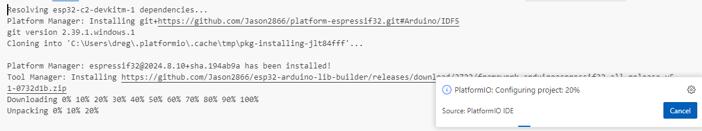

- Click on PlatformIO icon (left side), select esp32-c2-devkitm-1 and click on Build, it will take a few minutes... if everything is ok, a message like this will appear in TERMINAL window (bottom):

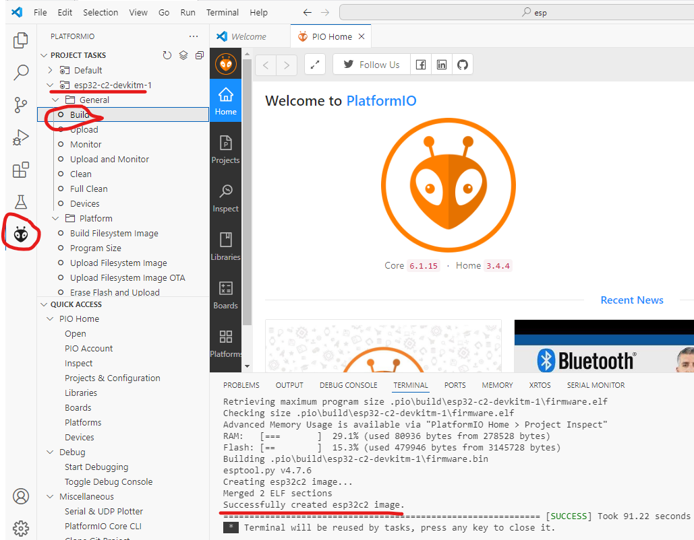

- A new .pio\build\esp32-c2-devkitm-1\firmware.bin file is created and ready to be uploaded to okhi

- Execute the following file to generate a new release to upload a new ESP firmware: make_release.bat

-----

To compile USB firmware, follow the same steps but RP2040 firmware compilation is different, so change these steps:

- Close all instances of the "Pico - Visual Studio Code" 

- Install Python 3: https://www.python.org/downloads/

- Select add python.exe to PATH before install

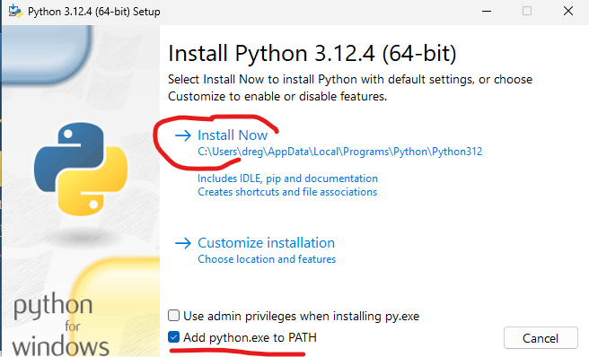

- Install MSYS2: https://www.msys2.org/

- Install make in MSYS2 console: pacman -S make

- Add C:\msys64\usr\bin to your ENV PATH

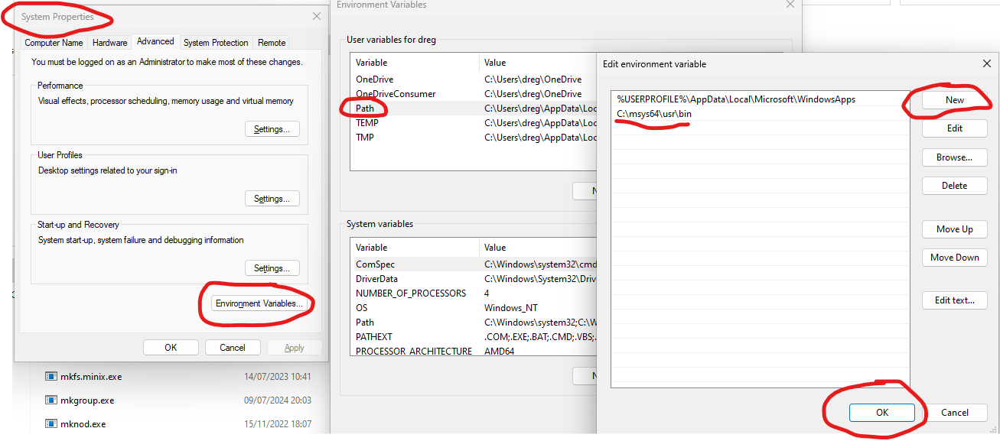

- Open the "Pico - Visual Studio Code" shortcut (it is installed with the pico-setup-windows). Never use a normal Visual Studio Code!!

- Select "firmware\usb\" folder
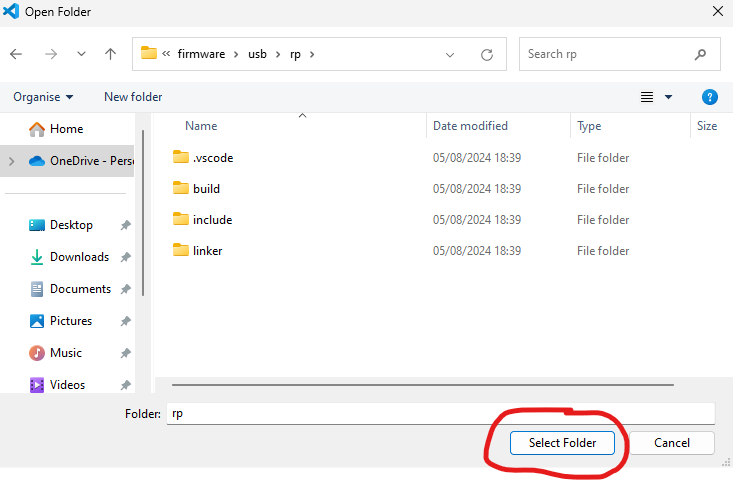

- Trust the authors if you see this message:
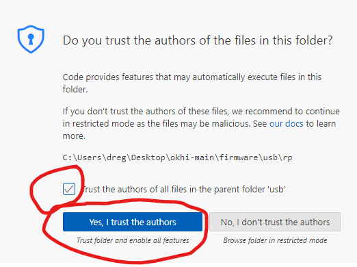

- Edit "firmware\usb\rp\build\build.bat" file and change the path to your pico-sdk installation path:

```
call "C:\Program Files\Raspberry Pi\Pico SDK v1.5.1\pico-env.cmd"
```

- To compile dont use cmake, just press shift+ctrl+p and type ">tasks build" and select "Run Build Task"

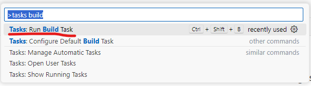

- If everything is ok, a new firmware\usb\rp\build\okhi.uf2 file is created and ready to be uploaded to okhi

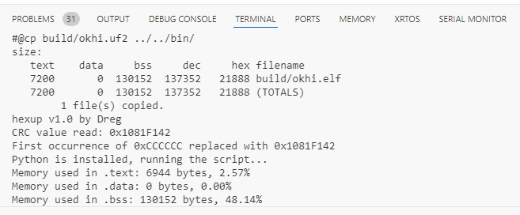

- The rest of the steps are the same

This RP2040-USB project only can be compiled on Windows. Linux and Mac will be supported soon.

Note: I modified the original usb-sniffer-lite project by Alex Taradov build process with own scripts, .exe files, etc...

# Developers web

The web is located in webps2\index.html for PS2 firmware and webusb\index.html for USB firmware. You can modify the web as you want, adding more keyboad layouts, improving keyboard protocol parsing (javascript)... 

Just modify the index.html, run node.js script "webps2\node.js" or "webusb\node.js" and compile ESP firmware again.

This script will generate a new "web buffer data" for ESP firmware, also it reduces the size of the web (minify).

Please, keep in mind that the web is very simple, it is only a proof of concept, and we must conserve the ESP flash memory for other features, so do not add tons of code, just the necessary for usefull features.

# Developers notes for PS2 PIO

As you noticed, the PS2 firmware is based on PIO (Programmable IO) of RP2040. The PIO is a very powerful tool to sniff and parse PS2 data. 

Currently, PS2 firmware can looks unnecessary complex, but it is the only-reliable-and-stable way to parse PS2 data because:

- 1 Adapter from hell (AMAZON). Please avoid this adapter!


This PS2->USB adapter is a little nightmare. Behaves very strange and the PIO code + main cores must be very robust to avoid problems.

PIO code for PS2 should be very, just simple waiting from idle to a start state (KEYBOARD to PC / PC to KEYBOARD), and then parse the data. 

## IDLE behavior (adapter from hell)

Normal PS2 behavior, from idle (CLK+DAT HIGH) to start state, and finish state return to idle: 

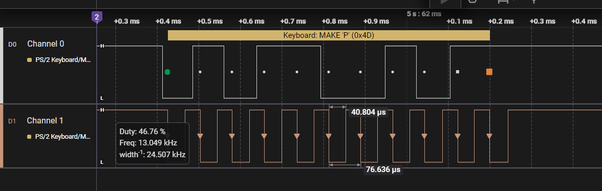

Now, the IDLE state for adapter from hell:

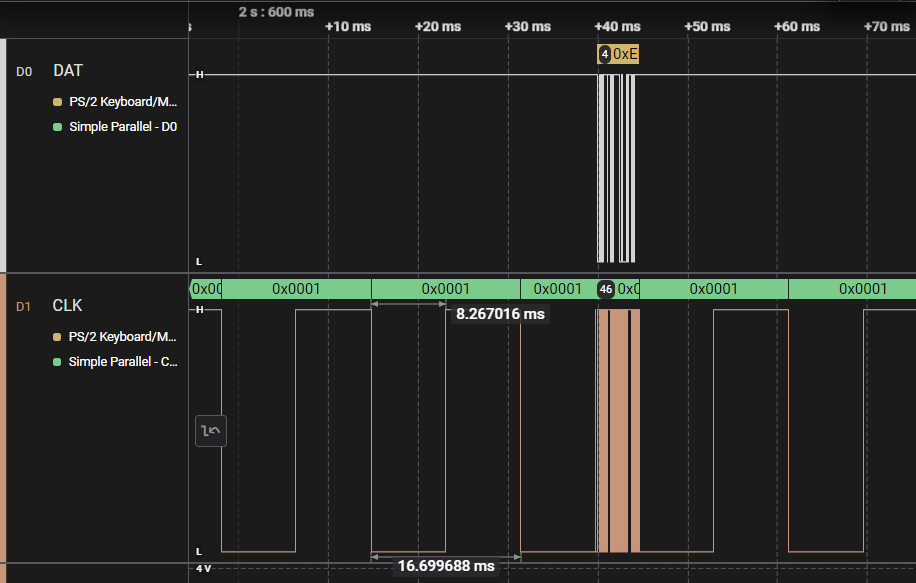

So, yes, the IDLE state for this adapter means a DAT HIGH (its ok), but.... wtf, a CLOCK pulse every time? as you can see this CLOCK pulse is longer than normal CLOCK pulses for PS2 protocol...

So, PIO code cant wait for a normal IDLE state like the ps2kbd library does:

https://github.com/lurk101/ps2kbd-lib/blob/master/ps2kbd.pio

```
.program ps2kbd

    wait 0 pin 1     ; skip start bit
    wait 1 pin 1

    set x, 7         ; 8 bit counter
bitloop:
    wait 0 pin 1 [1] ; wait negative clock edge 
    in pins, 1       ; sample data
    wait 1 pin 1     ; wait for positive edge
    jmp x-- bitloop

    wait 0 pin 1     ; skip parity and stop bits
    wait 1 pin 1
    wait 0 pin 1
    wait 1 pin 1
```

And one more thing... sometimes a wild very-short-pulse appears in the CLOCK line, look:

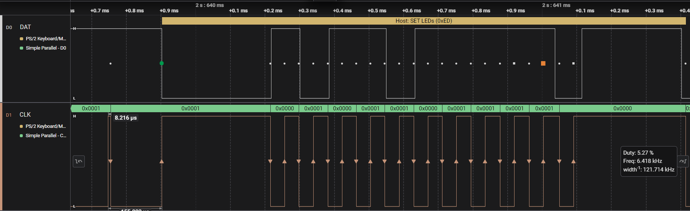

A ~8us pulse! so we have two main problems: a weird long CLOCK every time and short pulses before the real packet.... 

So, PIO code must be compatible with this adapter, and also with normal PS2 adapters. PIO code + main cores code will be more complex than expected, but it is the only way to make it work with all adapters. 

PIO code tasks:
- Track the IDLE state for all adapters (including adapter from hell)
- Track the start state for all adapters
- Track host to keyboard and keyboard to host states & data
- Helper to discard short pulses and long clock pulses

[Current PIO code for PS2](firmware/ps2/rp/okhi.pio)

Note: I just code (very fast) the necessary for the adapter from hell + others. So, the PIO code and main cores code will be improved in the future. And not all PIO code tasks are implemented yet (maybe will be not necessary).

I tested the currrent PIO + main cores code with different PS2 adapters and it works fine.

# Developers notes for USB firmware

Currently USB firmware is based on usb-sniffer-lite project by Alex Taradov: https://github.com/ataradov/usb-sniffer-lite

I've modified this project for my own needs. I've added a lot of code that's pretty much junk and it kind of works.

(I copy-paste code from the original pico-sdk because I am a very lazy bastard). 

The main goal is to parse USB keyboard data and send it to the ESP chip.

This is an educational project, so the idea is convert the bare-metal code by Alex Taradov to a "legacy" pico-sdk C/C++ code (including the PIO code). 

Thx Alex for your great work! 

I am not a RP2040 expert, so I am learning a lot with this project.

 # Developers hardware pack

Programming using the implant can be a pain, so I made some hardware PCBs to make it easier.

Pack includes:
- 1 USB man in the middle board for developers:

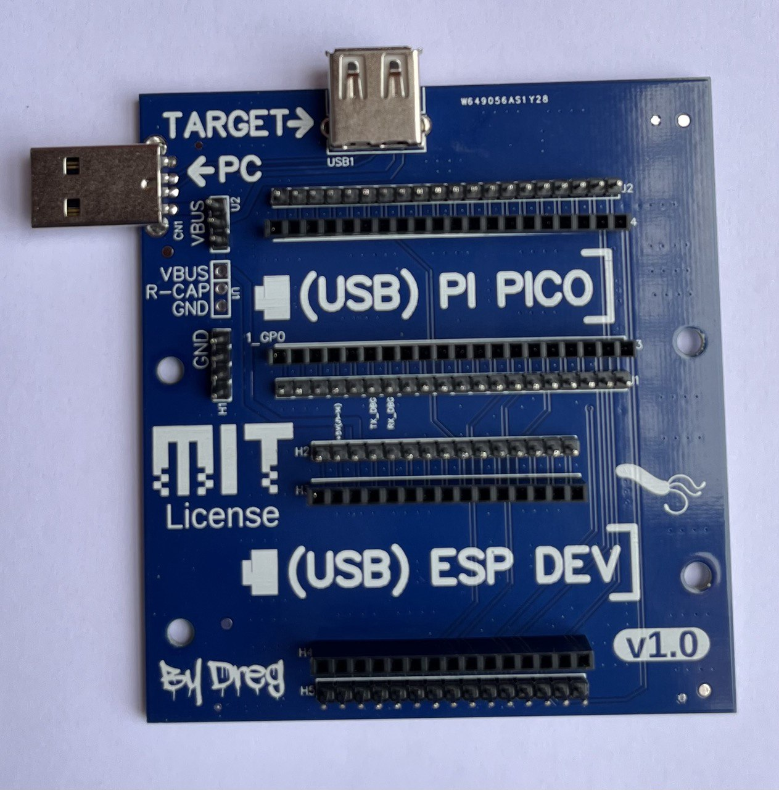

- 1 PS2 man in the middle board for developers (this board converts PS2 signals to 3v3 for Raspberry Pi Pico):

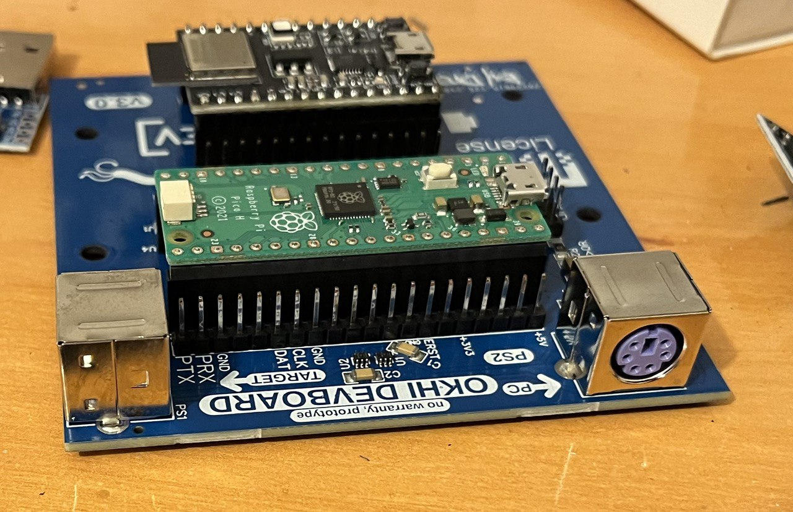

You need buy by yourself:

- 1 RASPERRY PI PICO (soldered version) + USB cable
- 1 Raspberry Debug probe (debugger) + USB cable
- 1 ESP8684-DevKitM-1 (solded version) + USB cable
- 1 kit Dupont cables (Female-Female, Male-Male, Male-Female)
- 1 Cheap logic analyzer ~8$ (compatible with saleae software if possible)
- 1 PS2<->USB adapter
- 1 PS2 male to PS2 male cable (MINI-DIN 6P)
- 1 USB extension cable (optional)
- 1 USB Keyboard (optional)
- 1 PS2 Keyboard (Lenovo on Aliexpress is OK) (optional)

So, this is basically the okhi implant in big format! the PCBs just allow an easy man in the middle stuff and interconection between Raspberry Pi Pico and ESP32-C2 and the keyboard.

With this setup, you can debug, test, and develop the implant firmware in a more comfortable way.

# Developers doc

- https://datasheets.raspberrypi.com/pico/getting-started-with-pico.pdf

- https://datasheets.raspberrypi.com/pico/raspberry-pi-pico-c-sdk.pdf

- https://docs.espressif.com/projects/esp-idf/en/latest/esp32c2/get-started/index.html

- https://www.usbmadesimple.co.uk/

- https://www.beyondlogic.org/usbnutshell/usb1.shtml

- [PS2 Keyboard - Adam Chapweske.pdf](stuff/PS2_Keyboard.pdf)

- [USB Documentation - Christopher D Leary and Devrin Talen.pdf](stuff/USB_doc.pdf) 

# Schematic

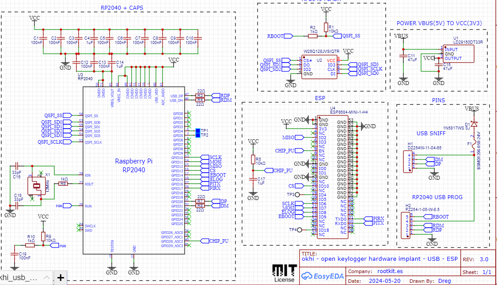


# Credits

- Juan M Martinez Casais: my friend who is a - GOD mode -  electronic engineer

- Alex Taradov (PIO USB & CODE): https://github.com/ataradov/usb-sniffer-lite
