# okhi: Open Keylogger Hardware Implant

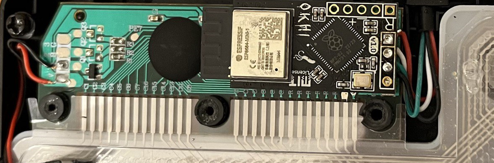

okhi is an implant that can be utilized to log keystrokes from a USB/PS2 keyboard. The implant is designed to be  easily concealable within a keyboard, laptop, or tower case. It is powered by the keyboard cable itself. The implant can be accessed via WiFi and enables real-time viewing of keystrokes.

## You can now buy it at [https://www.rootkit.es 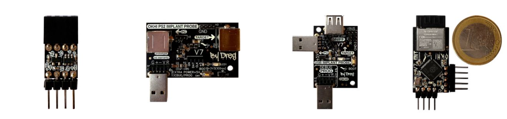](https://www.rootkit.es/)

If you register on Elecrow using this link before buying the product, you’ll help me support and maintain this project even more:

https://www.elecrow.com/referral-program/OTI1MDhqMnQ/

------

It is based on the RP2040 + ESP chip. The RP2040 is responsible for sniffing & parsing the keyboard data, while the ESP chip is used to transmit the data over WiFi.

The **RP2040** features a dual-core Arm Cortex-M0+ processor, making it highly efficient for handling multiple tasks simultaneously (PIO rlz!).

okhi leverages the **ESP32-C2**, a new chip from Espressif, specifically the **ESP8684**. This chip includes a RISC-V single-core CPU, which is known for its small size. It is important to note that the ESP8266, ESP8285, and ESP8654 are different chips and should not be confused with the **ESP8684**.

----

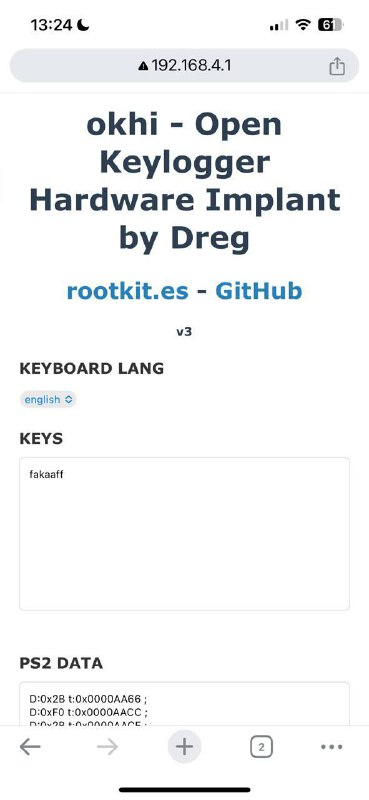

----

okhi is designed to be a proof of concept and educational tool. It is not intended to be used for malicious purposes.

okhi consumes ~120ma of current, the target & cable must be able to supply this amount, otherwise, the implant will not work.

Note that the keyboard itself consumes power as well. The maximum current for USB 2.0 is 500mA. Never exceed this limit.

Just connect VBUS, GND and data lines to okhi, and you are ready to go.

You can sniff keyboard data by connecting okhi to the end of the cable or to a through-hole pin connector inside the tower. It can also be connected to accessible pads or traces. If the keyboard data is present, okhi will be able to sniff it.

okhi connected using copper wires to keyboard PCB-pads:

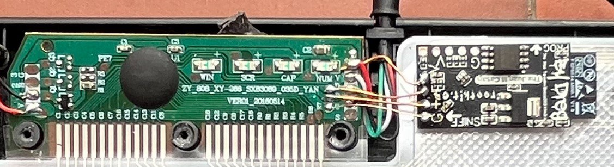

# Appearance

Front (black or green)

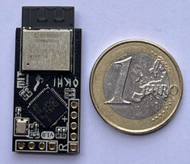

Back (black or green)

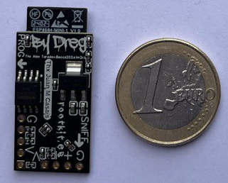

# Size (mm)

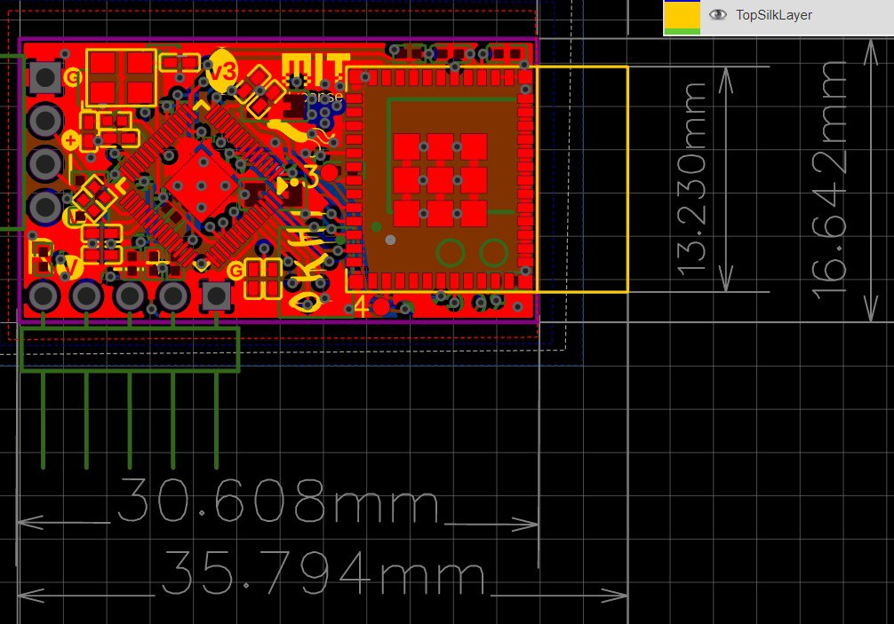

Check size before buying, maybe it is too big for your target. Or maybe you need drill some space inside the keyboard.

# Features

- Supports both PS2 and USB keyboards (limited to classic USB low-speed mode yet)
- WiFi + web support
- Real-time viewing of keystrokes
- **Persistent capture (new)**: every keystroke is also written to the implant's own flash the moment it happens, so nothing is lost across reboots, power cuts, or long stretches with nobody watching the page. Download or wipe the stored log from the web interface. See [Persistent keystroke log](#persistent-keystroke-log)
- Multi-language keyboard layouts (since v7): pick the layout of the target keyboard in the web interface and the keystrokes are decoded with it
- OTA updates (since v7): update both chips over WiFi from the web interface, no cables, no probe board, no disassembly
- **[Reusable dual-chip OTA](#reusable-dual-chip-ota-for-rp2040--esp32-boards)**: building your own RP2040 + ESP32 board? The whole OTA system is yours, MIT, commercial use included
- Open Hardware
- Open Source (MIT License)
- Community support

# Getting Started

First, let's get to know the different PCBs and understand the purpose of each one.

## okhi implant

This is the implant that connects between the USB/PS2 keyboard and the computer to record keystrokes and allows viewing them via WiFi in real-time.

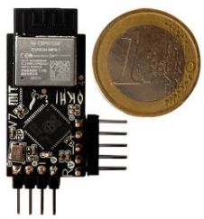

Note: You need an Implant probe board to program it and update the firmware.

Before using it, you must program the latest version of the firmware, as it comes without any pre-installed software.

## USB implant probe

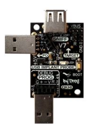

This board enables USB data sniffing without requiring any soldering or internal installation in the keyboard. It operates externally, making it a fully plug-and-play solution for testing the implant.

Moreover, this board plays a crucial role in programming and updating the firmware of the Okhi implant.

Note: In earlier PCB revisions, programming the implant required using the same USB port that was used for sniffing (and you had to disconnect the target keyboard each time); newer USB implant probe revisions provide a dedicated USB port specifically for programming the implant.

## PS2 implant probe

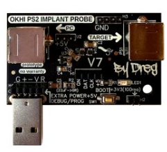

This board enables PS2 data sniffing without requiring any soldering or internal installation in the keyboard. It operates externally, making it a fully plug-and-play solution for testing the implant.

Moreover, this board plays a crucial role in programming and updating the firmware of the Okhi implant.

Important: In previous versions of the PCB, programming the implant was exclusively possible using the USB Implant Probe board; newer PS2 implant probe revisions provide a dedicated USB port specifically for programming the implant.

This board already converts PS2 signals from 5V to 3.3V, ensuring the Okhi implant operates safely.

## 5v -> 3V3 shifter mini board

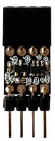

This board is essential for converting PS2 signals from 5V to 3.3V, which is necessary for the proper functioning of the Okhi implant. It is designed to be compact.

For USB sniffing, this is not necessary. Use it to connect the Okhi implant inside a PS2 keyboard.

## Buying the necessary components

You need to buy by yourself:
- 1 PS2 male to PS2 male cable (MINI-DIN 6P)
- 1 PS2<->USB adapter
- 1 USB extension cable 
- 1 USB LOW SPEED Keyboard 
- 1 PS2 Keyboard (Lenovo PS2 KEYBOARD on Aliexpress is OK) 

## How to program okhi implant

Insert the okhi implant into the **"program zone female pins"** on either the USB implant probe or the PS2 implant probe. Make sure the GND pin is aligned with **okhi-G**, then press and hold the **BOOT** button while connecting the probe to your computer through the program zone's USB male connector.

A RP2040 mass storage device will appear in your computer, and you can copy the firmware to it. The RP2040 will automatically reboot after copying the firmware.

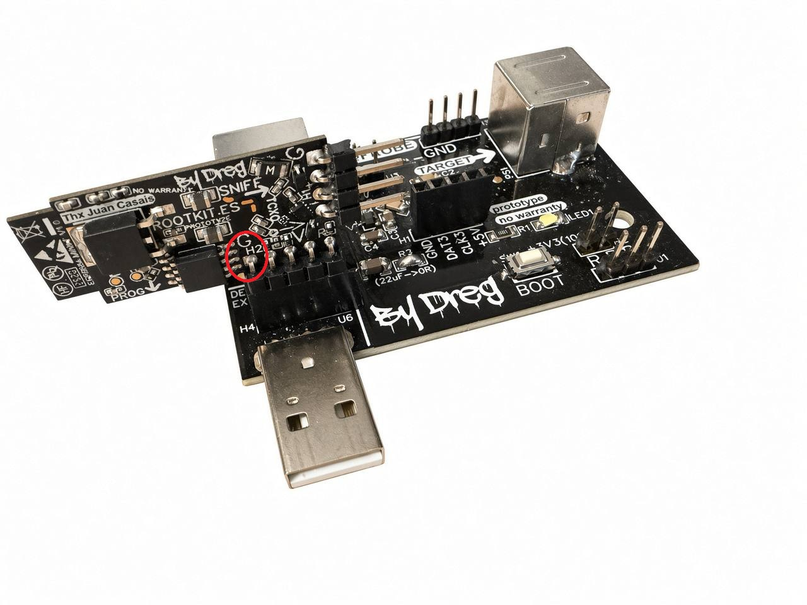

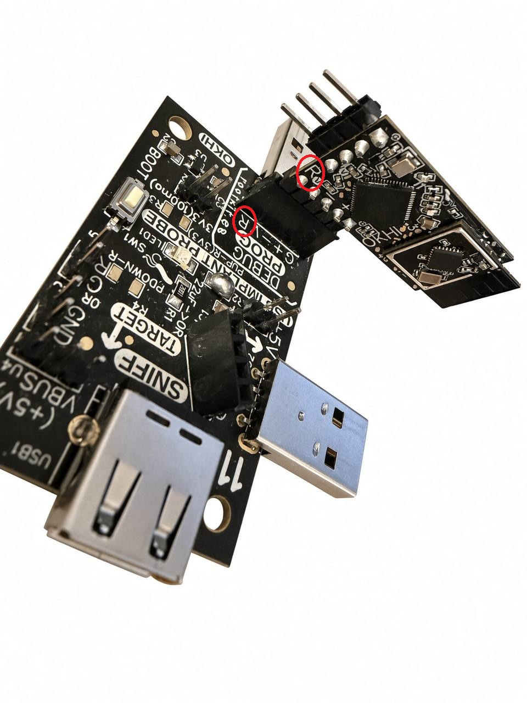

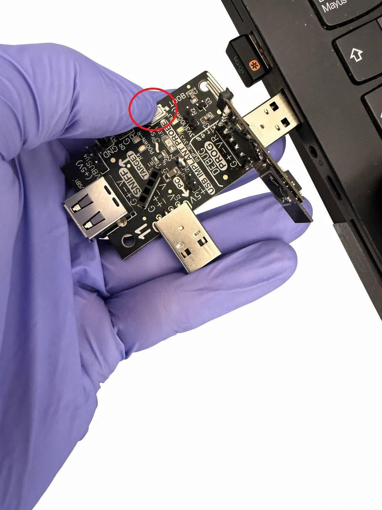

## How to test okhi implant

Insert the okhi implant into the **"sniff zone female pins"** of either the USB implant probe or the PS2 implant probe. Make sure the GND pin aligns with the **okhi-G** pin before connecting.

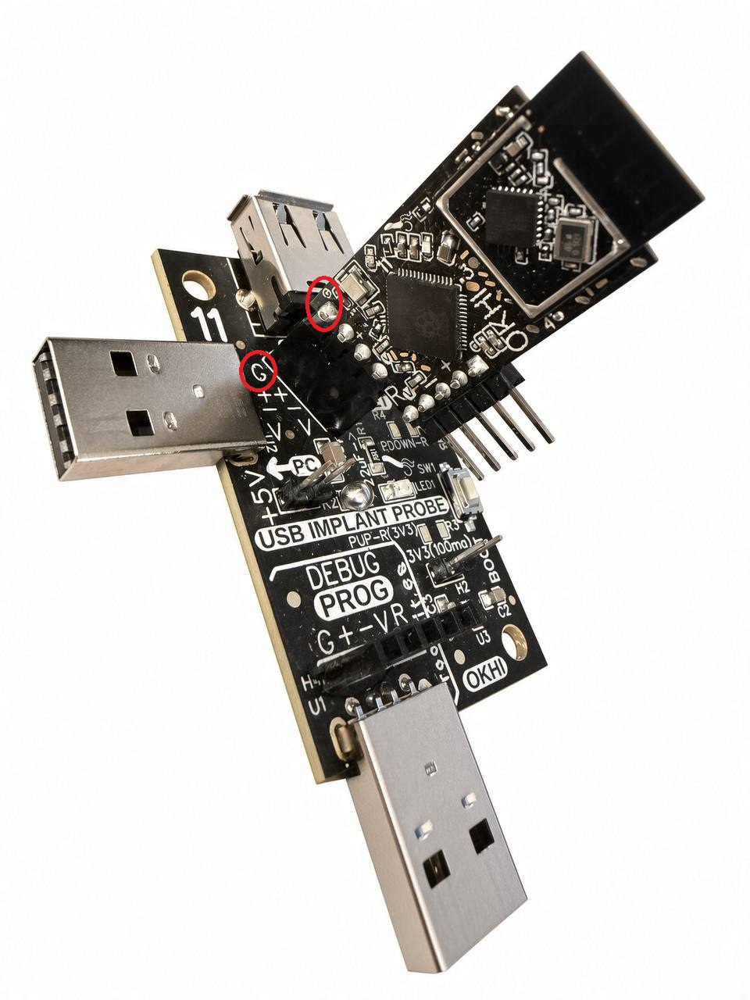

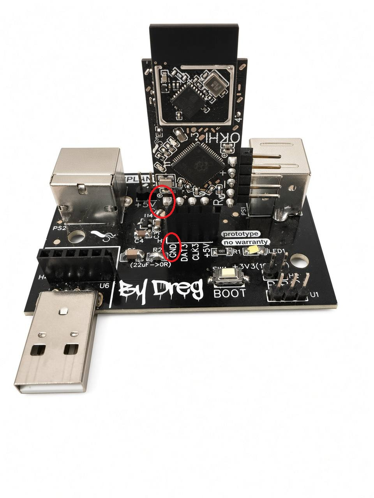

### Test USB low speed keyboard

Connect the **male USB of the sniff zone** to your computer, then connect the **USB keyboard** to the **female USB port of the sniff zone**. Additionally, connect the **program zone's USB** to your PC as an **extra power source** to ensure the **okhi implant has sufficient power**. 

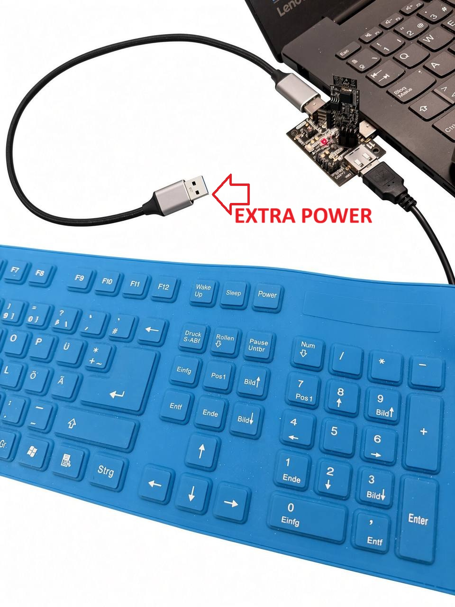

### Test PS2 keyboard

Plug the **PS2 keyboard** into the **PS2 port on the sniff zone 'TARGET'**. Next, use a **PS2 male-to-male cable** to connect the other 'PC' PS2 port on the sniff zone to a **PS2<->USB adapter**. Finally, connect the **program zone's USB** to your PC as an **additional power source** to make sure the **okhi implant receives enough power**.

For **PS2 adapters**, this extra power is especially important, since some adapters do not supply enough power for the implant.

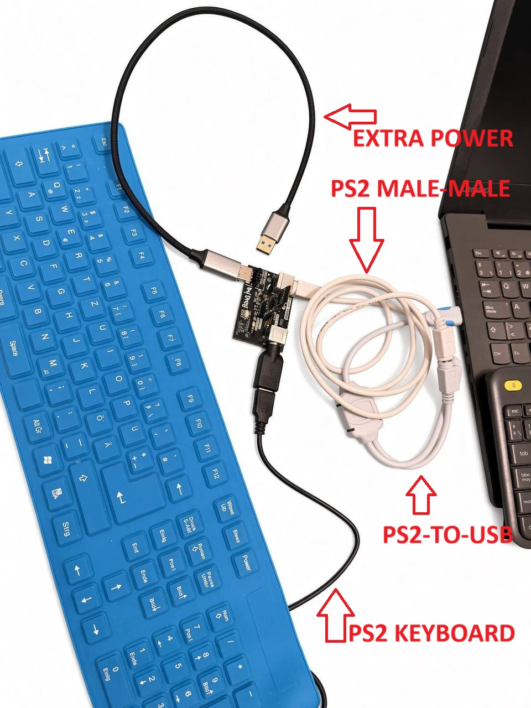

A **PS2 MALE-MALE** cable is required to bridge the PS2 keyboard and the PS2<->USB adapter. These cables are readily available on Amazon or AliExpress.

### Firmware update

It is necessary to update the firmware before using okhi. The firmware is divided into two parts: RP2040 and ESP32-C2.

RP2040 chip is the responsible for programming the ESP32-C2 chip.

So first, you need burn a temporal firmware to the RP2040 chip to program the ESP32-C2 chip. After that, you need to burn the ESP firmware to the ESP32-C2 chip via RP2040 usb port.

Finally, you need to burn the final firmware to the RP2040 chip, thats all. Can be done in a few minutes, and this task is only necessary when you need to update the firmware.

Follow these steps to update the firmware:

- Download the latest firmware from the releases section: https://github.com/therealdreg/okhi/releases/latest

- Connect the implant to implant probe PROG pins 


- Connect the implant probe to the computer 

- Entering Program Mode for the okhi Module: Before connecting the okhi module to a USB port, ensure you press and hold the programming button (BOOT).


- Uploading the UART Bridge Firmware: Transfer the uart_bridge.uf2 file to the okhi module, which will appear as a MASS STORAGE DEVICE RP2040 on your computer (e.g., drive E:). The device will automatically eject once the file transfer completes.

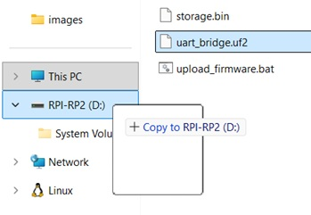

- Switching to Normal Mode: To return the okhi module to normal operation, disconnect it from USB, then reconnect it to a USB port without pressing any buttons.

- Programming the ESP Module: Run the upload_firmware.bat script to start programming the ESP module. This script automates the firmware installation process.

- Selecting the COM Port: Input the COM port number where the okhi module is connected (e.g., COM3). If you are uncertain of the correct COM port, the batch file will display a list of available COM ports. You may need to try each one sequentially to find the correct connection.

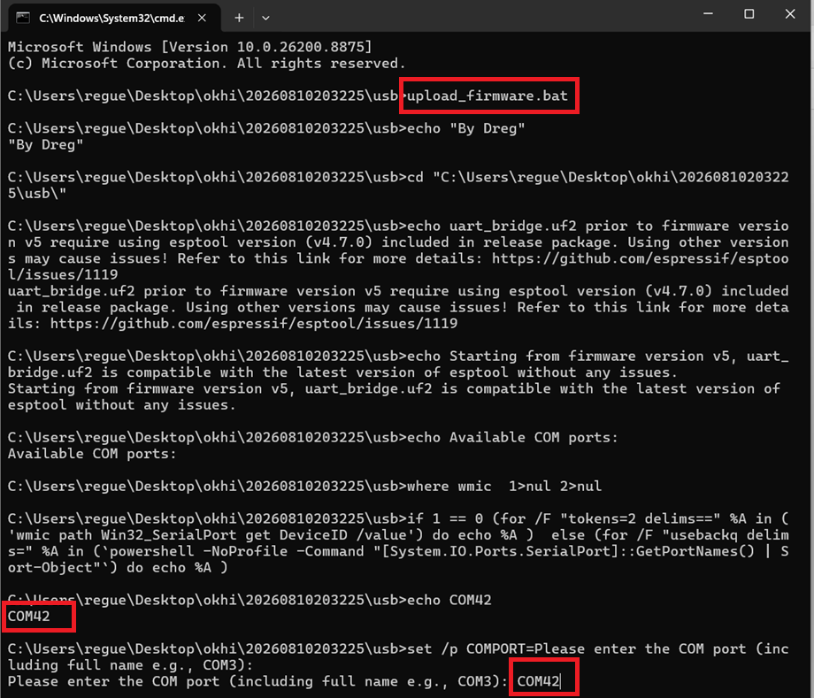

- Completing the Programming Process: Wait for the script to finish running. Once complete, the ESP module will be programmed and ready for use.

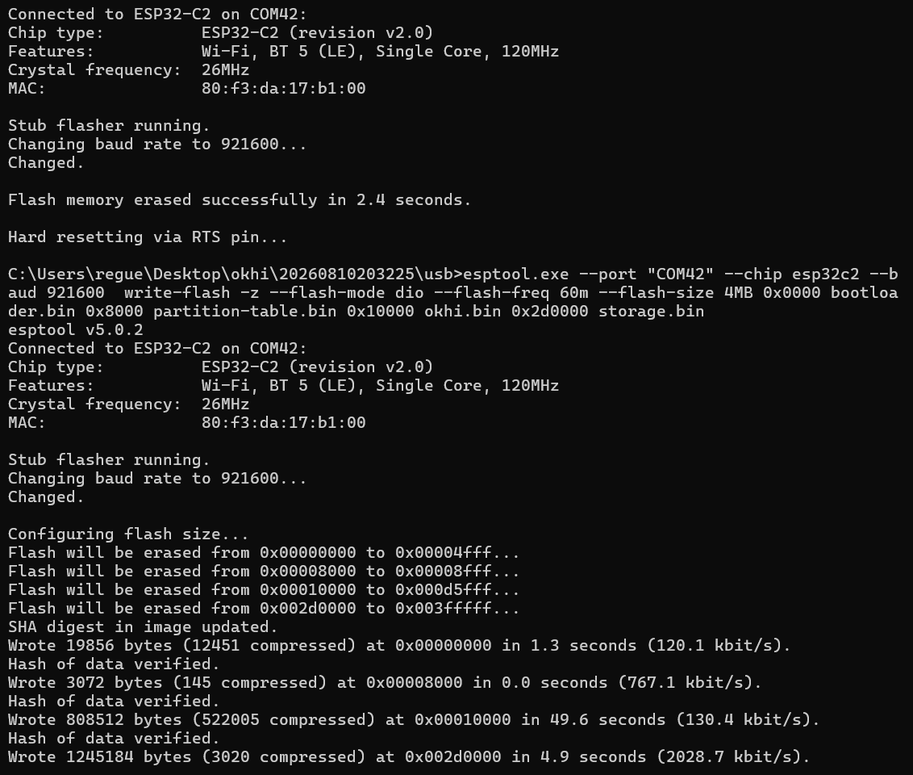

- Re-entering Program Mode: Disconnect the okhi module from the USB, then reconnect it in program mode by pressing the programming button before plugging it back into the USB.


- Programming the RP2040 Chip: Copy the okhi.uf2 file to the okhi module, now recognized again as a MASS STORAGE DEVICE RP2040 (e.g., drive E:). The device will automatically eject after the file transfer.

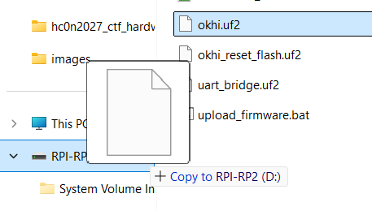

- Finalizing Setup for RP2040: The RP2040 chip is now programmed and ready for operational use.

- Reconnecting for Regular Use: Disconnect the okhi module from USB.

- Connect okhi to sniff zone of implant probe.


- Connect the implant probe to the computer.


- Additionally, connect the program zone's USB to your PC as an extra power source to ensure the okhi implant has sufficient power.

- Connecting to the ESP WiFi Network: An ESP WiFi network (PS2/USB_<device_id>) will become available with the password '1234567890'. Connect to this network and open a web browser to access the web interface at: http://192.168.4.1/

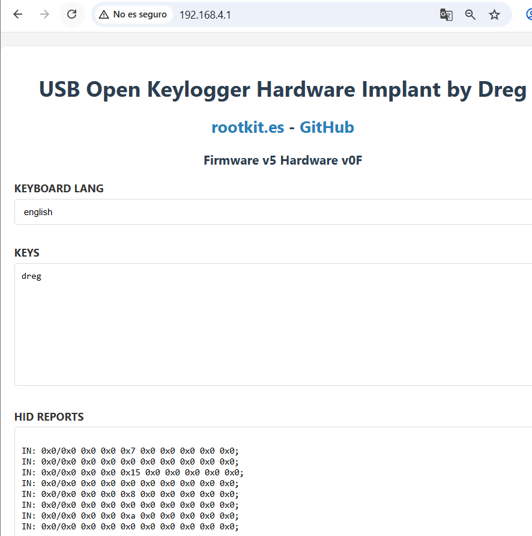

Note: old firmware SSID: ESP_PS2/USB, password: '0123456789'

**Note**: **uart_bridge.uf2** prior to firmware version v5 require using esptool version (**v4.7.0**) included in release package. Using other versions may cause issues! Refer to this link for more details: https://github.com/espressif/esptool/issues/1119
Starting from firmware version v5, uart_bridge.uf2 is compatible with the latest version of esptool without any issues.

**Note**: **Starting from firmware v5**, the release zip includes a `last_esptool` folder containing pre-built esptool binaries for multiple platforms, so you don't need to install Python or esptool separately. The available binaries are:

| Folder | Platform |
|---|---|
| `esptool-windows-amd64` | Windows 64-bit (x86_64) |
| `esptool-linux-amd64` | Linux 64-bit (x86_64) |
| `esptool-linux-aarch64` | Linux ARM 64-bit |
| `esptool-linux-armv7` | Linux ARM 32-bit |
| `esptool-macos-amd64` | macOS Intel (x86_64) |
| `esptool-macos-arm64` | macOS Apple Silicon (M1/M2/M3...) |

Just pick the binary that matches your OS and architecture — no installation needed.

### Firmware update over the air (OTA), since FirmwareV7

**OTA stands for "Over The Air"**: updating the firmware of the implant through its own WiFi network, instead of taking it out of the target, plugging it into an implant probe board and copying files over USB. Starting from firmware **FirmwareV7**, okhi can update **both chips** this way. Once an implant is hidden inside a keyboard, laptop or tower case, you never have to open it again to put a newer firmware on it: connect to its WiFi, open the web interface, upload one file.

The whole update is a single file, `okhi_USB_ota.pkg` or `okhi_PS2_ota.pkg`, included in the release package. It carries the ESP32-C2 firmware and the RP2040 firmware together, tagged with the variant (USB or PS2) and protected by a CRC32 for each half, so the device refuses a package built for the other variant or a corrupted one, and the two chips can never end up running mismatched firmware.

To update, join the device WiFi network (`USB_xxxxxxxxxxxx` or `PS2_xxxxxxxxxxxx`, password `1234567890`), open http://192.168.4.1/, use the **Upload firmware** button and pick the `.pkg`. From there everything is automatic: the ESP validates the package, writes its own half to the spare flash slot and reboots into it, then **you reconnect and load the page again to confirm the update**. Only after that confirmation does the RP2040 pull its own image over the internal SPI link, verify it with a CRC32, back up its current firmware to a golden slot, apply the new one and reboot.

That confirmation step is not optional, and it is the core of the safety design: if nobody loads the page within 5 minutes, the ESP assumes the new firmware is broken (or unreachable), rolls back to the previous one and never touches the RP2040. An update nobody could reach is an update that failed. In the same spirit, a power loss while the package is uploading is harmless (the old firmware keeps running from the other slot), and an RP2040 firmware that boots but cannot talk to the ESP is replaced by the golden backup after three attempts.

While the update runs, keystroke capture is suspended for the couple of seconds the SPI transfer and the commit take. The keyboard itself keeps working normally throughout, those keystrokes are simply not recorded.

Do not power the device off during an update.

#### Checking that an update really landed, the ESP, the RP2040 and the web page

An implant is three separate things that are updated at three different moments: the **ESP32-C2** firmware, the **RP2040** firmware and the **web page** you are reading (which is embedded inside the ESP firmware, not stored as a file). A page that loads and a device that answers prove none of them are current: the ESP can be new while the RP2040 is still the old one, and the page can be the one you edited but never regenerated. So do not judge an update by the fact that it worked, judge it by identity.

The web interface prints four lines at the very top, and every release folder contains a `MANIFEST.txt` with the values those lines are supposed to show. Compare them and you know exactly what is on the device:

```
ESP  v7  sha 1e2f76108b769e19  Aug 23 2026 20:20:43  [ps2, ota_0, idf v6.0.2]
RP   v7 ps2 Aug 24 2026 18:39:09  [hw vFF]
WEB  2026-08-24 16:48:26Z  src 114484 B  sha 6501b7cf566a  node v26.4.0
FP   14026b0bac96c826  (compare with the release manifest)
```

- **ESP** identifies the ESP32-C2 application by the `sha` right after the version. That sha is unique per compilation and is the value to compare. The date after it is the ESP-IDF build stamp, which is useful context but **does not change on an incremental rebuild**, so a date that looks old is normal and is not evidence of anything on its own.
- **RP** is the RP2040 identity string, baked in at compile time, unique per compilation.
- **WEB** is the page itself: when it was generated, the size of the source it came from and a hash of that source. If it says `NOT GENERATED`, the firmware was built around an `index.html` that nobody ran `webgen.js` over.
- **FP** is a single fingerprint computed over the other three. **This is the one line worth checking**: one value that matches means all three parts are the ones in that release, so a single glance replaces comparing three strings by eye.

If **FP** matches the manifest, the update is complete and everything on the device belongs to that release. If it does not match, look at the three lines above it to see which part is behind: that is the one that did not update. The usual causes are an ESP update that was never confirmed within 5 minutes and rolled back (upload it again and load the page this time), an interrupted update (repeat it, the device is designed to survive this), and mixing files from different release folders (take all of them from the same one).

Note that the two chips **can** legitimately end up on different releases, for example if the ESP rolls back after the RP2040 has already been updated. The implant keeps working, so nothing looks wrong; the fingerprint is what tells you, and repeating the update fixes it.

**Important**: OTA only works on devices already running an OTA capable firmware, that is v7 or newer. A device coming from an older release has to be programmed **once by cable** with `upload_firmware.bat` and the `.uf2` files, as described above, because the ESP partition table changed and that change cannot be migrated over the air. After that first cable install, every following update can be done over WiFi.

The release package also ships `ota_esp.bin` and `ota_rp.bin`, the same two images loose, to update one chip on its own. Those are meant for development; for normal use always use the `.pkg`. Full details, including the `curl` commands and how to check the result on http://192.168.4.1/stats, are in **OTA developer reference** in the Developers section below.

### Multi-language keyboard support, since FirmwareV7

A keyboard does not send characters, it sends **key positions** (HID usage IDs on USB, scan codes on PS2). What turns a position into a character is the keyboard layout configured in the target computer, so the same physical key is `;` on an english keyboard and `ñ` on a spanish one. Until FirmwareV7 okhi decoded everything as an english keyboard, which meant wrong characters whenever the target used a different layout.

Starting from firmware **FirmwareV7**, the web interface has a **Keyboard layout** selector at the top. Pick the layout the target machine is using and the keystrokes are decoded with it, including the characters typed with **AltGr** (`@`, `#`, `€`, `[`, `]`, and so on), which do not exist at all in the english layout. Decoding happens in the browser, so the selector changes how new keystrokes are shown from that moment on; the text already on screen keeps the characters it was decoded with, and the selected layout is saved together with the capture when you press **Download all data**.

The layouts currently included are **english** (default) and **spanish**. Adding a new one is easy and does not require touching any C code: the tables live in `webusb\index.html` (USB firmware, `LAYOUTS` object) and `webps2\index.html` (PS2 firmware, `PS2_LAYOUTS` object), with one entry per layout and three tables in each (`base`, `shift` and `altgr`) mapping key code to character. The USB tables are indexed by HID usage ID and the PS2 ones by set 2 scan code, since that is what each protocol puts on the wire. Add your layout there, add an `<option>` to the selector, regenerate the web with `webgen.js` and rebuild the ESP firmware, as described in the **Web Developers** section below. Pull requests with new layouts are very welcome.

Note: the raw stream is always kept next to the decoded keys (**HID reports** on USB, **PS/2 data** on PS2) and both go into the downloaded file, so nothing is lost by having the wrong layout selected while capturing.

### Persistent keystroke log

Every keystroke is written to the implant's own flash memory the moment it happens, so the log survives reboots, power cuts, and stretches where nobody is watching the web page. The ESP32-C2 has ~1.2 MB of SPIFFS storage; at an average of 62 bytes per keystroke, that is roughly 19,000 keystrokes before the log wraps and starts overwriting the oldest records.

To download the stored log, open the web interface and use the **Download persistent log** button in the "Persistent log" section. The browser will download a text file with both the decoded keystrokes (using the currently selected keyboard layout) and the raw wire records, so you can re-decode the log with a different layout afterwards without losing data. The status text shows download progress.

To erase the stored log, use the **Clear persistent log** button. This wipes the log files on the device's flash; the device will ask for confirmation because it cannot be undone.

Both operations work whether the device is in WiFi access-point mode or connected to your LAN as a station.

## Thanks to PCBWAY for sponsoring the okhi project

Special thanks to PCBWay for sponsoring this project! PCBWay is a well-known PCB prototyping and manufacturing service, providing high-quality boards and excellent customer support. I have worked with their boards in the past and can say that they are of great quality. I easily placed an order for PCBs on their platform for this project without any problems. The sponsorship also included a free quick delivery option. If you’re looking for reliable PCB prototyping and manufacturing services, I highly recommend checking them.


https://www.pcbway.com


## DIY USB & PS2Keylogger POC

https://github.com/therealdreg/pico-usb-sniffer-lite

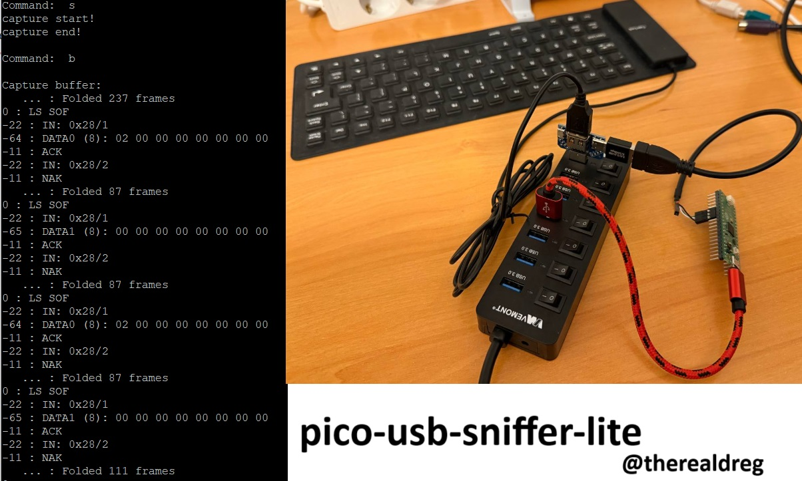

https://github.com/therealdreg/pico-ps2-sniffer

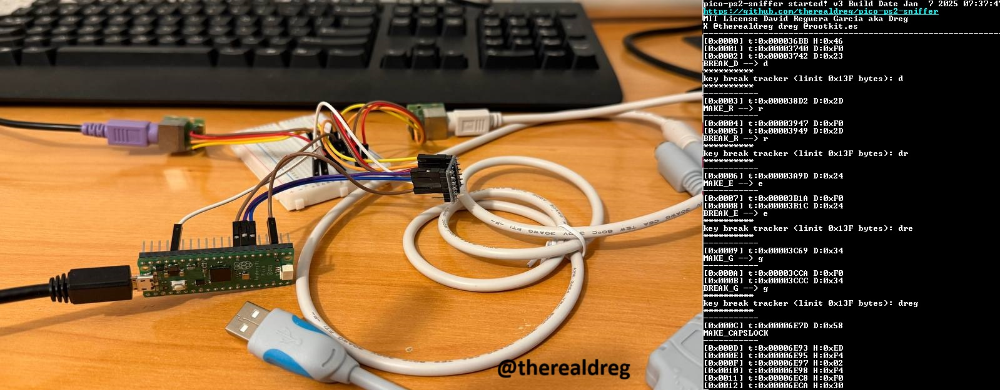

# Project files

Gerber, Pick and Place files and BOM will be available soon.

----

 At this moment only Windows is documented. Linux and Mac will be documented soon. I am only one person, so please be patient....

 ----

# What a mess of names!

The okhi board integrates two main processors: the RP2040 and the ESP8684-MINI-1-H4 / ESP8684-MINI-1-H4X. The RP2040 is a dual-core Arm Cortex-M0+ processor running at up to 133 MHz, equipped with 264 KB of on-chip SRAM. While the RP2040 does not include flash memory, an additional 16 MB of external flash has been added, enhancing its storage capabilities. Additionally, the RP2040 is well-suited for overclocking. This processor is also the foundation for the popular Raspberry Pi Pico microcontroller board.

Complementing the RP2040, the ESP8684-MINI-1-H4 module operates at speeds up to 120 MHz and includes 4 MB of internal flash memory. It features a built-in PCB antenna, eliminating the need for an external one, and is housed within a PCB-to-PCB module that incorporates the ESP8684 chip along with other essential components.

The ESP8684 / ESP8684H4X (Chip Revision v2.0) itself is a single-core RISC-V processor and serves as the core of the ESP32-C2 modules (ESP32-C2 is a generic name). The ESP32-C2 offers a cost-effective solution with Wi-Fi 4 and Bluetooth 5 (LE) connectivity, outperforming the older ESP8266 in both size and performance. It is built around a 32-bit single-core RISC-V processor, featuring 272 KB of SRAM (with 16 KB dedicated to cache) and 576 KB of ROM.

The ESP8684-DevKitM-1 provides a dedicated development board tailored for the ESP8684-MINI-1-H4 module.


# ESP8684-MINI-1-H4 module (ESP32-C2)

okhi uses ESP8684-MINI-1-H4 module (ESP32-C2), which is known for its small size.

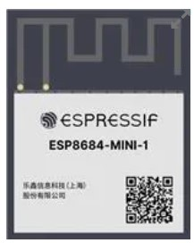

ESP8684-MINI-1-H4 module vs ESP8684-WROOM-02C-H4 module:

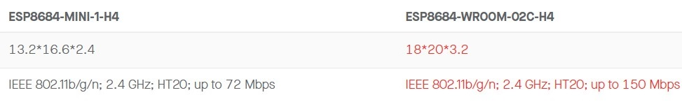

With WIFI speeds up to 72Mbps (9MB/s), this module is ideal for a physical keylogger. However, in real-world scenarios, the WIFI speed is typically much lower, but still sufficient for a web interface displaying keystrokes.

## Compatible with both modern and older ESP32-C2 versions

The okhi firmware is designed to support all versions of the ESP32-C2 chip, including both legacy v1.x and the v2.0 revision. This ensures seamless compatibility across different hardware versions without requiring separate firmware builds.

Note: You must use an **ESP32-C2** module with a **26 MHz crystal**. Some chips cannot work properly when equipped with 40 MHz crystal. Specific symptoms of the problem include clock issues, or printing garbled characters when powering on, etc.

Note: You must use an **ESP32-C2** module with **4 MB** of flash memory.

[Compatibility Advisory for ESP32-C2 Chip Revision v2.0 ar2025-001_en.pdf](stuff/Compatibility%20Advisory%20for%20ESP32-C2%20Chip%20Revision%20v2.0%20ar2025-001_en.pdf)

The ESP32-C2 v2.0 revision adds roughly 20 KB more usable SRAM and about 100 KB of extra flash. The current firmware does not exploit these gains so that a single binary runs unchanged on both v1.x and v2.0 devices. This avoids maintaining split build targets and keeps testing simpler.

Note: Build the firmware with an ESP-IDF version that produces binaries compatible with earlier ESP32-C2 (ESP8684) revisions.

Before compiling, confirm:
- The selected ESP-IDF version supports v1.x and v2.0 simultaneously.
- Compiler options are set for backward compatibility.

# PS2<->USB adapters working with okhi

Note: Some adapters use purple for the keyboard, others use green for the keyboard... wtf! If it doesn't work in one, try the other.

- 1 (adapter from hell, it works, but not recommended) (Amazon)

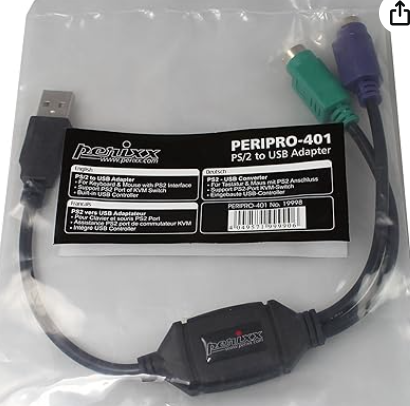

- 2 Aliexpress (OK)

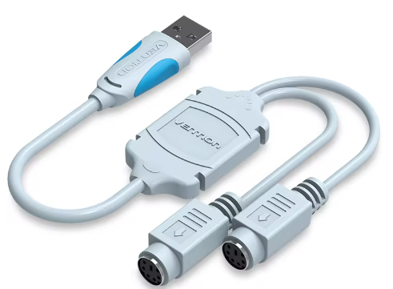

- 3 Aliexpress (OK)

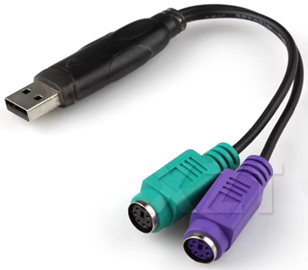

- 4 Aliexpress (OK)

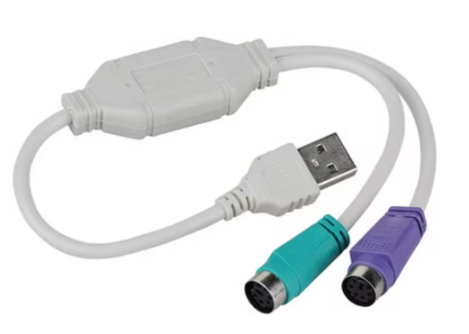

- 5 Aliexpress (OK)

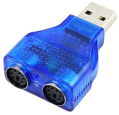

# NEVER BUY THIS PS2<->USB


# Reporting issues

If you have a PS2-USB adapter that doesn't work with the sniffer, please send me some captures of the device using a logic analyzer or the pico-ps2-diagnostic-tool. This tool is designed to capture and replay signals on a PS/2 interface, specifically targeting the DATA and CLOCK lines:

https://github.com/therealdreg/pico-ps2-diagnostic-tool

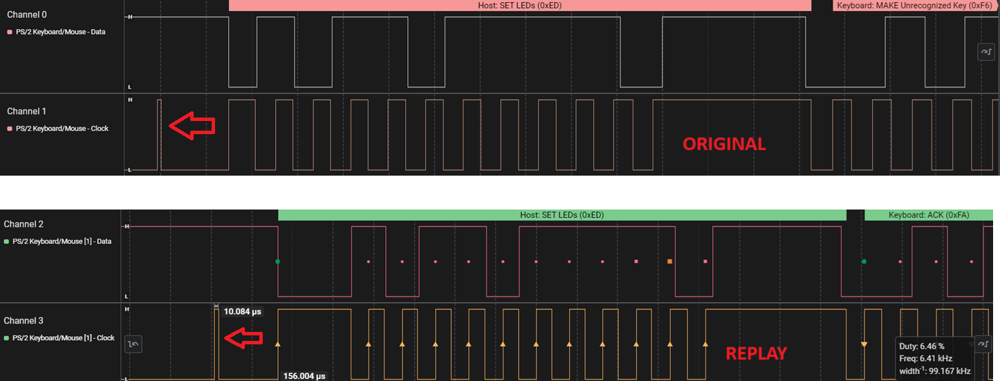

 A short pulse was captured on the original CLOCK signal, and the replayed signal successfully reproduced it.

# Wired USB Keyboards: Report Formats, Bus Packets and Product Classification

A reference for driver developers. Applies to USB 2.0 devices and the HID class definition version 1.11.

## 1. Scope and conventions

In scope: wired keyboards on USB 2.0 at low speed (1.5 Mb/s), full speed (12 Mb/s) and high speed (480 Mb/s); the HID interrupt pipe that carries key state; the control requests that configure it.

Out of scope: Bluetooth, proprietary 2.4 GHz links, HID over I2C, PS/2, and vendor protocols layered on HID (lighting, macros, profiles).

Conventions: hexadecimal bytes are written as two digits (`C3`). Multi-byte descriptor and request fields are little endian on the wire. Packet bytes are shown the way a byte-oriented bus decoder displays them, with SYNC and EOP omitted. The terms 6KRO, NKRO and anti-ghosting are product terms; none of them appears in the USB or HID specifications. In this document they mean: 6KRO, at most six non-modifier keys reported at once; NKRO, no fixed limit.

## 2. Timeline of keyboard report formats

The formats are numbered in the order in which they appeared. Every later section follows this numbering.

| Order | Format | Introduced | Origin | Status today |
|---|---|---|---|---|
| 1 | Boot layout under boot protocol: 8-byte report, six-key array, no report ID | 1996, first HID class specification | Defined so that firmware (BIOS, later UEFI) can read a keyboard without parsing descriptors | Mandatory on every boot-capable keyboard interface; used by BIOS, UEFI, KVM switches and consoles |
| 2 | Boot layout under report protocol: the same 8 bytes described by a report descriptor, optional report ID | Same specification, adopted by operating systems as their HID stacks appeared | Report protocol is the default mode after reset; the descriptor for the boot layout is the reference example in the HID specification | The format of nearly all office keyboards and of the boot interface of every gaming keyboard |
| 3 | Extended array: the array scheme with more than six slots | Late 2000s to early 2010s, proprietary firmware of the first NKRO-over-USB keyboards; the first product cannot be pinned down with certainty | Simplest change to the boot layout that raises the limit | Rare in current products |
| 4 | Multiple six-key reports: several boot-layout reports on separate interfaces or report IDs | Same period as format 3 | Works with any host that already handles the boot layout; the host sees several keyboards | Uncommon in current products |
| 5 | Bitmap: one bit per key usage, declared as Variable items | Early 2010s, open-source keyboard firmware (TMK, later inherited by QMK); adopted by most mechanical and gaming keyboards during the 2010s | Fixed size, unlimited rollover, cheapest diff on the host | The practical NKRO standard |
| 6 | Hybrid configuration: a boot-capable interface with format 1 and 2, plus a second interface or report ID with format 5 | 2010s gaming keyboards; the default configuration of QMK when NKRO is enabled | Keeps firmware compatibility while offering NKRO to operating systems | The standard configuration of gaming and mechanical keyboards |
| 7 | Sub-millisecond polling at high speed: the same formats, delivered on a 480 Mb/s device with bInterval 1 or 2 | October 2020 (Corsair K100 RGB, 4000 Hz), September 2021 (Razer Huntsman V2, 8000 Hz), 2021 (Corsair K65 RGB Mini, 8000 Hz), February 2022 (Corsair K70 RGB PRO, 8000 Hz), 2023 (Razer Huntsman V3 Pro, 8000 Hz), 2024 (Wooting 80HE, 8000 Hz) | Full speed cannot poll faster than 1000 Hz, so rates above that require high-speed operation | Premium gaming keyboards; ships at 1000 Hz and is raised by vendor software |

Format 7 is a transport change, not a report change: a high-speed keyboard sends the same bytes as a full-speed one.

## 3. USB transport as seen by a keyboard

### 3.1 Speed tiers

| Tier | Bit time | Max interrupt packet | bInterval | Fastest polling | EP0 max packet |
|---|---|---|---|---|---|
| Low speed, 1.5 Mb/s | 666.7 ns | 8 bytes | Milliseconds. The descriptor field accepts 1 to 255; the interrupt transfer rules restrict low-speed endpoints to 10 ms or more | 100 Hz declared, 125 Hz after host rounding | 8 bytes |
| Full speed, 12 Mb/s | 83.3 ns | 64 bytes | Milliseconds, 1 to 255 | 1000 Hz | 8, 16, 32 or 64 bytes |
| High speed, 480 Mb/s | 2.083 ns | 1024 bytes (up to 3 transactions per microframe for high-bandwidth endpoints) | Exponent, 1 to 16: period = 125 µs × 2^(bInterval minus 1). bInterval 1 = 125 µs, 2 = 250 µs, 4 = 1 ms | 8000 Hz | 64 bytes |

Rules that follow:

1. Windows and Linux round full-speed and low-speed interrupt intervals down to a power of two. A keyboard that declares 10 ms is polled every 8 ms (125 Hz); a keyboard that declares 1 ms is polled every 1 ms.
2. A report longer than wMaxPacketSize is delivered as consecutive maximum-size packets, one transaction per polling interval on a normal (single-bandwidth) endpoint, until a short packet or the declared length. A 32-byte report on a low-speed keyboard would occupy four polling intervals.
3. bInterval is read from the endpoint descriptor at enumeration. A change of polling interval therefore requires a new enumeration; how a vendor tool triggers it is implementation specific.
4. Low-speed devices never receive SOF packets; the hub sends a low-speed keep-alive (an EOP) on the port at least once per frame. On a full-speed segment, host-to-device low-speed packets are preceded by a PRE packet. Behind a high-speed hub, low-speed and full-speed transactions travel between host and hub as split transactions handled by the hub's transaction translator. None of this reaches the HID driver; it is listed because it appears in bus captures.
5. A device that runs at high speed answers the device qualifier descriptor request; a full-speed-only device returns STALL, which `lsusb -v` prints as an error. The message is suggestive, not conclusive, because hubs and some quirky devices print the same line.

### 3.2 The complete packet set

USB 2.0 defines 16 PID codes, 15 of them in use (PRE and ERR share one code). The PID byte carries the 4-bit code in its low nibble and the complement in its high nibble. A capture of a keyboard can contain at most 13 distinct PIDs.

| PID | Byte | Class | Structure after SYNC | When a keyboard driver sees it |
|---|---|---|---|---|
| IN | `69` | Token | PID, ADDR (7 bits), ENDP (4 bits), CRC5 | Every polling interval on the interrupt IN endpoint; data and status stages of control transfers |
| OUT | `E1` | Token | Same as IN | Data stage of SET_REPORT; status stage of GET_DESCRIPTOR; interrupt OUT endpoint when declared |
| SETUP | `2D` | Token | Same as IN | First packet of every control transfer |
| SOF | `A5` | Token | PID, frame number (11 bits), CRC5 | Every 1 ms at full speed, every 125 µs at high speed; never delivered to a low-speed device |
| PRE | `3C` | Special | PID only | Precedes host-to-device low-speed packets on a full-speed segment |
| SPLIT | `78` | Special | PID, hub address, port and control fields, CRC5 | Between host and high-speed hub for a low-speed or full-speed keyboard behind that hub; the keyboard never sees it |
| ERR | `3C` | Handshake | PID only | Returned by a high-speed hub's transaction translator on a split transaction error; same code as PRE |
| DATA0 | `C3` | Data | PID, 0 to N data bytes, CRC16 | Reports and control payloads; SETUP stage is always DATA0 |
| DATA1 | `4B` | Data | Same as DATA0 | Alternates with DATA0; first packet of a data stage and every status stage is DATA1 |
| DATA2 | `87` | Data | Same as DATA0 | Not used by keyboards (high-bandwidth high-speed endpoints only) |
| MDATA | `0F` | Data | Same as DATA0 | Not used by keyboards |
| ACK | `D2` | Handshake | PID only | Successful reception of a data packet |
| NAK | `5A` | Handshake | PID only | Keyboard has nothing new this interval, or cannot accept data yet |
| STALL | `1E` | Handshake | PID only | Endpoint halted, or unsupported control request |
| NYET | `96` | Handshake | PID only | High speed only: OUT data accepted but the next packet must be preceded by PING |
| PING | `B4` | Token | Same as IN | High speed only: flow control for control and bulk OUT data stages |

Field rules common to all packets: data fields are transmitted least significant bit first; the line code is NRZI with a stuffed zero after six consecutive ones; CRC5 (generator x^5 + x^2 + 1) protects the 11 bits after the PID in tokens; CRC16 (generator x^16 + x^15 + x^2 + 1) protects the data field of data packets. Both CRC generators start at all ones, and the remainder is transmitted inverted, most significant bit first. A receiver that shifts data plus CRC through the same generator obtains the residual 0x0C for CRC5 and 0x800D for CRC16 when the packet is intact. The SYNC field is 8 bits at low and full speed and 32 bits at high speed. The EOP is SE0 for two bit times followed by a J at low and full speed, and a deliberate bit-stuffing violation at high speed.

### 3.3 Token and data packet layouts

Token packet, 3 bytes:

| Byte | Bits 0 to 7 as transmitted |
|---|---|
| 0 | PID |
| 1 | ADDR bit 0 to ADDR bit 6, then ENDP bit 0 |
| 2 | ENDP bit 1 to ENDP bit 3, then the five CRC5 bits, most significant first |

Worked tokens (all verified against the CRC residual):

| Token | Bytes |
|---|---|
| SETUP, address 0, endpoint 0 (first request after reset) | `2D 00 10` |
| SETUP, address 3, endpoint 0 | `2D 03 50` |
| IN, address 3, endpoint 0 | `69 03 50` |
| OUT, address 3, endpoint 0 | `E1 03 50` |
| IN, address 3, endpoint 1 (interrupt IN of a keyboard) | `69 83 E0` |
| IN, address 3, endpoint 2 (second interface of a hybrid keyboard) | `69 03 79` |

Data packet: PID, then the data bytes in order, then the two CRC16 bytes. A zero-length DATA1 packet, used in every status stage, is `4B 00 00`.

### 3.4 One interrupt polling cycle, byte by byte

Device address 3, interrupt IN endpoint 1, full speed, bInterval 1. The keyboard uses format 1 and reports Left Shift, a and s held.

| Step | Direction | Bytes | Meaning |
|---|---|---|---|
| 1 | Host to device | `69 83 E0` | IN token |
| 2a | Device to host | `5A` | NAK, nothing changed. The host repeats step 1 at the next interval; no handshake follows a NAK. |
| 2b | Device to host | `C3 02 00 04 16 00 00 00 00 76 6A` | DATA0 with the 8-byte report and its CRC16 |
| 3 | Host to device | `D2` | ACK. Both sides advance the toggle; the next report is sent as DATA1. |

The same cycle carries every other format. Only the length of the data field changes:

| Report | Data packet |
|---|---|
| Format 1 or 2, nothing pressed | `C3 00 00 00 00 00 00 00 00 BF F4` |
| Format 1 or 2, Left Shift + a + s | `C3 02 00 04 16 00 00 00 00 76 6A` |
| Format 1 or 2, seven keys held (ErrorRollOver) | `C3 02 00 01 01 01 01 01 01 92 50` |
| Format 5 (QMK layout), Left Shift + a + s | `C3 06 02 10 00 40` followed by 27 bytes `00`, then CRC16 `7E 02` (32 data bytes) |

Three rules follow from the cycle:

1. The device never sends unsolicited data. Worst-case latency is the polling interval plus the device's scan and debounce time.
2. NAK is the normal answer when nothing changed. With idle duration 0 the keyboard reports only on change; with a non-zero idle duration it repeats the current report at that rate even when nothing changed.
3. The data toggle is reset to DATA0 by SET_CONFIGURATION, SET_INTERFACE and CLEAR_FEATURE(ENDPOINT_HALT). A receiver that sees the wrong toggle returns ACK and discards the packet; that is correct for a retransmission after a lost ACK, but a device whose toggle falls out of sync after a reset (a firmware bug) loses reports silently.

### 3.5 Control transfers used with a keyboard

Every control transfer runs on endpoint 0. Stages: SETUP stage (SETUP token, DATA0 with the 8-byte request, ACK), an optional data stage (IN or OUT tokens, data packets starting with DATA1 and alternating, ACK), and a status stage (a zero-length DATA1 in the opposite direction of the data stage, or IN direction when there is no data stage). Address 3, interface 0, endpoint 0.

| Request | SETUP stage data packet (DATA0 with request and CRC16) | Data stage | Status stage |
|---|---|---|---|
| SET_PROTOCOL, boot | `2D 03 50` then `C3 21 0B 00 00 00 00 00 00 C6 E0` then `D2` | None | `69 03 50`, device `4B 00 00`, host `D2` |
| SET_PROTOCOL, report | `2D 03 50` then `C3 21 0B 01 00 00 00 00 00 C7 31` then `D2` | None | Same as above |
| SET_IDLE, duration 0, all reports | `2D 03 50` then `C3 21 0A 00 00 00 00 00 00 D6 20` then `D2` | None | Same as above |
| SET_REPORT, Output, ID 0, 1 byte (LED report, Caps Lock on) | `2D 03 50` then `C3 21 09 00 02 00 00 01 00 9D 70` then `D2` | `E1 03 50`, host `4B 02 C1 7E`, device `D2` | `69 03 50`, device `4B 00 00`, host `D2` |
| GET_DESCRIPTOR, Report descriptor, 63 bytes | `2D 03 50` then `C3 81 06 00 22 00 00 3F 00 F9 AF` then `D2` | `69 03 50`, device `4B` + up to 64 descriptor bytes + CRC16, host `D2`, repeated with alternating DATA1/DATA0 until the last packet | `E1 03 50`, host `4B 00 00`, device `D2` |
| GET_REPORT, Input, ID 0, 8 bytes | `2D 03 50` then `C3 A1 01 00 01 00 00 08 00 5E 80` then `D2` | `69 03 50`, device `4B` + 8 report bytes + CRC16, host `D2` | `E1 03 50`, host `4B 00 00`, device `D2` |

Request bytes are bmRequestType, bRequest, wValue (low, high), wIndex (low, high), wLength (low, high). The data stage is limited by the EP0 packet size: on a low-speed keyboard with an 8-byte EP0, a 65-byte report descriptor arrives in nine IN transactions (eight full packets and one of a single byte). A device may answer NAK in the data or status stage; the host retries.

Which packets appear per tier, in summary: at low speed, IN, OUT, SETUP, DATA0, DATA1, ACK, NAK, STALL, plus PRE on full-speed segments and SPLIT and ERR between host and hub when a high-speed hub is in the path; at full speed, the same without PRE, plus SOF; at high speed, the same as full speed plus PING and NYET, with SOF every 125 µs.

## 4. HID layer

### 4.1 Descriptors

A keyboard interface has bInterfaceClass 3. A boot-capable keyboard interface adds bInterfaceSubClass 1 (Boot Interface) and bInterfaceProtocol 1 (Keyboard). The interface descriptor is followed by a HID descriptor (bDescriptorType `21`) that declares the length of the report descriptor (bDescriptorType `22`). The host fetches the report descriptor with a standard GET_DESCRIPTOR addressed to the interface: bmRequestType `81`, wValue `2200`, wIndex = interface number, wLength = the declared length.

Report descriptor items that determine a keyboard's format:

| Item | Bytes | Role |
|---|---|---|
| Usage Page | `05 xx` | Selects the usage table: `01` Generic Desktop, `07` Keyboard/Keypad, `08` LED, `0C` Consumer |
| Usage, Usage Minimum, Usage Maximum | `09 xx`, `19 xx`, `29 xx` | Assign usages to the fields that follow |
| Logical Minimum, Logical Maximum | `15 xx`, `25 xx` | Value range of each field |
| Report Size, Report Count | `75 xx`, `95 xx` | Bits per field and number of fields |
| Report ID | `85 xx` | Prefixes every report of that ID with one byte. Once any report on an interface declares an ID, every report on that interface carries its ID byte. Absent in format 1. |
| Input | `81 xx` | Declares fields of an Input report. Data byte: bit 0 Data (0) or Constant (1); bit 1 Array (0) or Variable (1); bit 2 Absolute (0) or Relative (1) |
| Output | `91 xx` | Declares fields of an Output report (LEDs), same data byte |
| Collection, End Collection | `A1 xx`, `C0` | A keyboard is an Application collection (`A1 01`) with Usage Keyboard (`09 06`) on the Generic Desktop page |

The Array versus Variable bit is the whole difference between the six-key formats and the bitmap:

1. `81 00` (Data, Array, Absolute): each field carries a usage index; the number of fields limits how many keys can be reported at once.
2. `81 02` (Data, Variable, Absolute): each field is one control; with Report Size 1 every key has its own bit.

### 4.2 Class-specific requests

All requests target the interface (wIndex = interface number).

| Request | bRequest | bmRequestType | wValue | Notes |
|---|---|---|---|---|
| GET_REPORT | `01` | `A1` | High byte report type (1 Input, 2 Output, 3 Feature), low byte report ID | Polled read through EP0; not the normal path for key input |
| SET_REPORT | `09` | `21` | Same encoding | Standard path for the LED Output report when no interrupt OUT endpoint exists |
| GET_IDLE | `02` | `A1` | Low byte report ID | Returns the idle duration |
| SET_IDLE | `0A` | `21` | High byte duration in units of 4 ms (0 = indefinite), low byte report ID (0 = all) | The HID specification recommends 500 ms as the default for keyboards; Linux sets 0 when it binds the interface, so the keyboard reports only on change |
| GET_PROTOCOL | `03` | `A1` | 0 | Returns 0 (boot) or 1 (report) |
| SET_PROTOCOL | `0B` | `21` | 0 = boot, 1 = report | Only meaningful on a boot-capable interface; devices default to report protocol after reset |

An interface may declare an interrupt OUT endpoint. When it does, Output reports are sent on that endpoint (Linux does this); otherwise they go through SET_REPORT on EP0.

### 4.3 The two protocols

| | Boot protocol | Report protocol |
|---|---|---|
| Selected by | SET_PROTOCOL with wValue 0 | Default after reset, or SET_PROTOCOL with wValue 1 |
| Report layout | Fixed 8-byte keyboard report, no report ID | Whatever the report descriptor declares |
| Host parses the report descriptor | No | Yes |
| Typical hosts | BIOS and UEFI firmware, KVM switches, game consoles, minimal embedded hosts | Operating systems |
| Rollover | 6 keys plus modifiers | Depends on the descriptor |

A boot-capable interface must produce the fixed layout whenever boot protocol is selected, whatever its descriptor declares for report protocol. Most boot-capable interfaces declare the boot layout itself as their report-protocol format, so both protocols produce the same bytes.

## 5. Key input report formats, in chronological order

All formats share one principle: a report is a snapshot of the keys currently held, not an event. The host keeps the previous snapshot and derives press and release events from the differences. USB keyboards do not implement auto-repeat; the host generates repeats from the held state.

### 5.1 Format 1: boot layout under boot protocol

Input report, 8 bytes, no report ID:

| Byte | Content | Encoding |
|---|---|---|
| 0 | Modifiers | Bit field, one bit per modifier usage `E0` to `E7` |
| 1 | Reserved | `00`, reserved for OEM use |
| 2 to 7 | Key array | Up to six usages from the Keyboard/Keypad page; `00` marks an empty slot |

Modifier bits of byte 0:

| Bit | Usage | Key |
|---|---|---|
| 0 | `E0` | Left Control |
| 1 | `E1` | Left Shift |
| 2 | `E2` | Left Alt |
| 3 | `E3` | Left GUI |
| 4 | `E4` | Right Control |
| 5 | `E5` | Right Shift |
| 6 | `E6` | Right Alt |
| 7 | `E7` | Right GUI |

Reserved values in the key array:

| Value | Name | Meaning |
|---|---|---|
| `00` | No event | Empty slot |
| `01` | ErrorRollOver | Too many keys pressed, or the matrix cannot resolve the combination (ghosting). All six slots carry `01`; the modifier byte remains valid. |
| `02` | POSTFail | Keyboard self-test failure |
| `03` | ErrorUndefined | Undefined error |

The order of usages inside the array carries no meaning; the host must not assume that slot 2 holds the oldest key.

Output report, 1 byte: bit 0 Num Lock, bit 1 Caps Lock, bit 2 Scroll Lock, bit 3 Compose, bit 4 Kana (LED page usages `01` to `05`); bits 5 to 7 are constant padding.

Reference report descriptor for this layout, 63 bytes. Real products often widen Logical Maximum and Usage Maximum to `FF` and reorder items; the resulting report is identical.

```
05 01        Usage Page (Generic Desktop)
09 06        Usage (Keyboard)
A1 01        Collection (Application)
05 07          Usage Page (Keyboard/Keypad)
19 E0          Usage Minimum (E0, Left Control)
29 E7          Usage Maximum (E7, Right GUI)
15 00          Logical Minimum (0)
25 01          Logical Maximum (1)
75 01          Report Size (1)
95 08          Report Count (8)
81 02          Input (Data, Variable, Absolute)      byte 0: modifier bits
95 01          Report Count (1)
75 08          Report Size (8)
81 01          Input (Constant)                       byte 1: reserved
95 05          Report Count (5)
75 01          Report Size (1)
05 08          Usage Page (LEDs)
19 01          Usage Minimum (Num Lock)
29 05          Usage Maximum (Kana)
91 02          Output (Data, Variable, Absolute)     LED report, 5 bits
95 01          Report Count (1)
75 03          Report Size (3)
91 01          Output (Constant)                      LED report, padding
95 06          Report Count (6)
75 08          Report Size (8)
15 00          Logical Minimum (0)
25 65          Logical Maximum (101)
05 07          Usage Page (Keyboard/Keypad)
19 00          Usage Minimum (0)
29 65          Usage Maximum (101)
81 00          Input (Data, Array, Absolute)          bytes 2 to 7: key array
C0           End Collection
```

Examples (Left Shift = bit 1 of byte 0, a = `04`, s = `16`):

| Situation | Report |
|---|---|
| Nothing pressed | `00 00 00 00 00 00 00 00` |
| Left Shift + a + s | `02 00 04 16 00 00 00 00` |
| Release a, keep Shift + s | `02 00 16 00 00 00 00 00` |
| Seven letters held with Left Shift | `02 00 01 01 01 01 01 01` (ErrorRollOver) |

### 5.2 Format 2: boot layout under report protocol

The same 8 bytes, described by the report descriptor and parsed by the operating system's HID stack. Two differences from format 1 are possible:

1. A report ID may prefix the report, making it 9 bytes on the interrupt pipe. When the host selects boot protocol, the ID is dropped and the fixed 8-byte layout is sent.
2. The descriptor may declare wider ranges (Usage Maximum `FF`, Logical Maximum `FF`), which changes nothing in the byte layout.

This is the format of nearly every office keyboard and of the boot interface of every gaming keyboard.

### 5.3 Format 3: extended array

The array scheme of format 1 with more slots: Report Count N (for example 10, 14 or 16) with `81 00`, so the report is 2 + N bytes and carries up to N keys. Overflow handling is device specific; some products signal ErrorRollOver, others drop the surplus keys. Any HID parser handles it, since Array items are standard, but it is rare in current products because the bitmap gives unlimited rollover at a fixed size.

### 5.4 Format 4: multiple six-key reports

Several boot-layout reports, each on its own report ID or on its own interface. The host enumerates them as several keyboards and merges their state; a given key always appears in the same report, so no coordination is needed on the host side. Implemented as separate interfaces without report IDs, each report is 8 bytes, which makes this the only NKRO scheme that fits the 8-byte packet limit of low speed. It is uncommon in current products.

### 5.5 Format 5: bitmap

The key field is declared as Variable with Report Size 1, so each key usage owns one bit. The structure below is the one QMK generates for its NKRO report with the default bitmap of 30 bytes; item order may differ between firmware versions.

```
05 01        Usage Page (Generic Desktop)
09 06        Usage (Keyboard)
A1 01        Collection (Application)
85 06          Report ID (6)
05 07          Usage Page (Keyboard/Keypad)
19 E0          Usage Minimum (E0)
29 E7          Usage Maximum (E7)
15 00          Logical Minimum (0)
25 01          Logical Maximum (1)
95 08          Report Count (8)
75 01          Report Size (1)
81 02          Input (Data, Variable, Absolute)      modifier bits
05 07          Usage Page (Keyboard/Keypad)
19 00          Usage Minimum (00)
29 EF          Usage Maximum (EF)
15 00          Logical Minimum (0)
25 01          Logical Maximum (1)
95 F0          Report Count (240)
75 01          Report Size (1)
81 02          Input (Data, Variable, Absolute)      240-bit key bitmap
05 08          Usage Page (LEDs)
19 01          Usage Minimum (Num Lock)
29 05          Usage Maximum (Kana)
95 05          Report Count (5)
75 01          Report Size (1)
91 02          Output (Data, Variable, Absolute)     LED report
95 01          Report Count (1)
75 03          Report Size (3)
91 01          Output (Constant)                      LED padding
C0           End Collection
```

Resulting Input report, 32 bytes on the interrupt pipe:

| Byte | Content |
|---|---|
| 0 | Report ID `06` (QMK versions before 2021 used ID 5 for this report) |
| 1 | Modifier bits, identical to byte 0 of format 1 |
| 2 to 31 | 240-bit key bitmap: usage u is bit (u & 7) of byte 2 + (u >> 3) |

Examples:

| Situation | Report |
|---|---|
| Left Shift + a + s | `06 02 10 00 40` followed by 27 bytes `00`. a = `04` sets bit 4 of byte 2; s = `16` sets bit 6 of byte 4. |
| Seven letters held | Seven bits set; same 32-byte length, no error state |

Properties: fixed size, no overflow state, trivial diffing (XOR with the previous report). The bitmap range also covers the modifier usages `E0` to `E7`; QMK reports modifiers in byte 1 and leaves those bits clear, so a host must accept a modifier from either location.

### 5.6 Format 6: hybrid configuration

A boot-capable interface with format 1 and 2, plus a second interface or report ID carrying format 5 (rarely format 3 or 4). Firmware compatibility is preserved by the boot interface; the operating system gets NKRO from the other one. In QMK, enabling NKRO places the bitmap report on a shared interface with report IDs while the keyboard interface keeps its 8-byte boot layout; the keycode NK_TOGG switches between six-key and bitmap reporting, and the default state depends on the firmware build.

### 5.7 Format 7: sub-millisecond polling at high speed

Not a new report: the device enumerates at 480 Mb/s and declares bInterval 1 (125 µs, 8000 Hz) or 2 (250 µs, 4000 Hz) on its interrupt IN endpoint. The report bytes are the same as at full speed. Vendors ship these keyboards at 1000 Hz and raise the rate from their software, since sustained 8000 Hz polling costs measurable CPU time on the host.

## 6. Differences at a glance

| Property | Formats 1 and 2 | Format 3 | Format 4 | Format 5 |
|---|---|---|---|---|
| Descriptor item for keys | `81 00`, Report Size 8, Count 6 | `81 00`, Report Size 8, Count N | Several `81 00`, Count 6 each | `81 02`, Report Size 1, Count = number of usages |
| Report length | 8 bytes (9 with report ID) | 2 + N bytes | 8 bytes each | 1 + bitmap bytes (+1 with report ID) |
| Data packet on the wire (payload only) | 8 bytes | 2 + N bytes | 8 bytes per report | 32 bytes in the QMK layout |
| Rollover | 6 | N | Unlimited in aggregate | Unlimited |
| Overflow signaling | ErrorRollOver in all slots | Device specific | None needed | None needed |
| Host cost per report | Set comparison of up to 6 values | Set comparison of up to N values | Set comparison per report | XOR of the bitmap |
| Works without parsing the descriptor | Yes (boot protocol) | No | No | No |
| Fits one low-speed packet | Yes (without report ID) | Only for N up to 6 | Yes, per interface | Not at practical sizes |
| Typical use | Office keyboards, boot interface of gaming keyboards | Legacy NKRO designs | A few proprietary firmwares | Mechanical and gaming keyboards, QMK |

## 7. Host-side processing

1. Protocol selection. Firmware-level hosts send SET_PROTOCOL with wValue 0 and read fixed 8-byte reports. Operating systems either leave the default (report protocol) or send SET_PROTOCOL with wValue 1, fetch the report descriptor and build field maps from it.
2. Report ID demultiplexing. If any report on the interface declares a report ID, every report on that interface starts with its ID byte and field offsets are counted after it.
3. Array fields. Build the set of non-zero usages in the array; usages that disappeared since the previous report are releases, usages that appeared are presses. Modifiers come from the separate bit field, but the driver should also accept usages `E0` to `E7` inside the array, because some devices place them there. Linux maps these usages to modifier keys by usage value, independent of item type.
4. ErrorRollOver. If an array field contains usage `01`, ignore the whole report and keep the previous key state; generating releases for every held key would be wrong. Linux's HID core skips the report in this case.
5. Variable fields. XOR the new bitmap with the previous one; each set bit of the result is a press or a release according to the new value. The usage of bit j in bitmap byte i is Usage Minimum + 8i + j.
6. Multiple keyboard collections. Treat each collection or interface as an independent source and merge into one key state; a well-behaved device never reports the same physical key in two collections at once.
7. Repeat and layout. Auto-repeat, keymap translation and modifier semantics are host responsibilities; the device delivers usages only.
8. LEDs. Send the 1-byte Output report through the interrupt OUT endpoint if declared, otherwise with SET_REPORT. Keyboards take lock state from this report, not from their own key presses.
9. Idle rate. Send SET_IDLE with duration 0 unless periodic repeats of the unchanged report are wanted.
10. Multi-packet reports. Reassemble reports longer than wMaxPacketSize before parsing; the host controller driver normally does this, but code that reads raw endpoints must do it itself.

## 8. Commercial keyboards and their classification

Format numbers refer to section 2. Descriptor data reflects the devices' own USB descriptors; polling and rollover figures are the vendors' specifications.

| Product (VID:PID) | Speed tier | Interfaces and endpoints | Formats | Rollover |
|---|---|---|---|---|
| Logitech K120 (046d:c31c) | Low speed (bcdUSB 1.10, EP0 8 bytes, 90 mA) | Interface 0: boot keyboard, report descriptor 65 bytes, EP1 IN 8 bytes, bInterval 10. Interface 1: HID with non-key usages (consumer and system control), report descriptor 159 bytes, EP2 IN 4 bytes, bInterval 255; Linux registers it as a generic HID device, not as a keyboard. | 1 and 2 on interface 0 | 6 keys |
| Dell KB216 (413c:2113) | Low speed | Boot-capable keyboard interface with the 8-byte layout; media keys on a separate report | 1 and 2 | 6 keys |
| Corsair K63 wired (1b1c:1b40) | Full speed (bcdUSB 2.00, EP0 64 bytes, 500 mA, no device qualifier) | Interface 0: boot keyboard, report descriptor 67 bytes, EP1 IN 8 bytes, bInterval 8. Interface 1: HID with keyboard usages, report descriptor 112 bytes, EP2 IN 64 bytes, bInterval 1; Linux registers it as a keyboard. Interface 2: vendor usage page FFC2, one 64-byte Feature report and one 64-byte Output report, EP3 OUT 64 bytes, used by iCUE. | 1 and 2 on interface 0; NKRO report on interface 1 (format 6) | 6 keys on interface 0, NKRO on interface 1 |
| Keychron Q1, Q2, Q3 wired (QMK firmware) | Full speed | Boot-capable keyboard interface with the 8-byte layout, plus a shared interface carrying the QMK reports with report IDs (NKRO bitmap = ID 6); NK_TOGG switches the mode | 1 and 2 on the keyboard interface, 5 on the shared interface (format 6) | 6 keys or NKRO |
| Corsair K70 RGB PRO (1b1c:1bb3), Corsair K65 RGB Mini | High speed (K70 RGB PRO: 480 Mb/s, three interfaces, 500 mA) | Boot keyboard interface plus NKRO reporting; polling selectable up to 8000 Hz (bInterval 1); ships at 1000 Hz, raised in iCUE | 6 and 7 | NKRO |
| Razer Huntsman V2, Huntsman V3 Pro | High speed | Boot keyboard interface plus NKRO reporting; 8000 Hz polling | 6 and 7 | NKRO |

Notes on the classification:

1. The K120 and the KB216 are the low-speed reference case: one 8-byte report, six keys, polled every 8 ms after host rounding, and nothing else on the keyboard interface.
2. The K63 is the full-speed hybrid reference case. Its boot interface is deliberately slow (8 ms) and small (8 bytes) for firmware compatibility; the second interface is polled every millisecond with 64-byte packets. The report descriptor of interface 1 has not been dumped for this document, so confirm its item layout before writing a device-specific driver; a single 64-byte report at 1 ms is consistent with format 5.
3. Keychron QMK boards are the open-source reference case: the descriptor is public in the QMK source and the NKRO report follows section 5.5 unless the vendor build changes the bitmap size.
4. The high-speed products carry the same report formats as full-speed products; their only transport difference is bInterval 1 at 480 Mb/s. A driver written for the full-speed hybrid case works unchanged. Their endpoint descriptors have not been dumped for this document.
5. No current mainstream product using format 3 or 4 was verified for this document, so none is listed.

## 9. Verification checklist on a host

1. `lsusb -t`: speed per interface (1.5M, 12M, 480M) and the bound driver.
2. `lsusb -v -d VID:PID`: bcdUSB, bMaxPacketSize0, bInterfaceSubClass and bInterfaceProtocol per interface, wMaxPacketSize and bInterval per endpoint, report descriptor length.
3. Report descriptor: `/sys/class/hidraw/hidrawN/device/report_descriptor` (binary) or `usbhid-dump -e descriptor`; decode with `hidrd-convert` or any HID descriptor parser. Look for `81 00` versus `81 02` on the Keyboard/Keypad page.
4. Live reports: `usbhid-dump -e stream` or `xxd /dev/hidrawN` shows raw Input reports including report IDs.
5. Bus level: Wireshark with usbmon (Linux) or USBPcap (Windows) shows tokens, data and handshakes as decoded by the host controller; a hardware analyzer is needed to see NAKs, PRE, SPLIT and CRCs.
6. Windows: USB Device Tree Viewer shows speed, descriptors and the parsed report descriptor.

## 10. Summary

1. HID defines two protocols. The boot protocol fixes an 8-byte six-key report; the report protocol lets the descriptor define anything.
2. Seven stages describe the history: boot layout (1), the same layout under report protocol (2), extended array (3), multiple six-key reports (4), bitmap (5), the hybrid configuration that combines 1, 2 and 5 (6), and sub-millisecond polling at high speed (7), which changes the transport and nothing else.
3. The bus never changes for a keyboard: one IN token per polling interval, a DATA packet with the report or a NAK, and an ACK. Only the payload length and the polling interval differ between formats and tiers. A keyboard capture contains at most 13 distinct PIDs; a full-speed keyboard driver deals with nine of them.
4. Low speed limits packets to 8 bytes and polling to 8 ms after rounding, which confines it to the boot layout. Full speed carries every format in one packet per millisecond. High speed adds polling below 1 ms.
5. Of the products examined, the Logitech K120 and Dell KB216 are low-speed boot-layout keyboards; the Corsair K63 and QMK-based Keychron Q boards are full-speed hybrids; the Corsair K70 RGB PRO, K65 RGB Mini and Razer Huntsman V2 and V3 Pro are high-speed hybrids.

# Reusable: dual-chip OTA for RP2040 + ESP32 boards

> **Building your own board with an RP2040 and an ESP32? Take this. It is MIT.**
> Use it in open source projects, in commercial products, in anything. No attribution
> dance, no license fee, no strings.

The RP2040 has no radio. That is the whole problem: you can put it next to an ESP32 and give
your board WiFi, but the moment you want to update the RP2040 *over the air* you discover
there is nothing to update it *with*. okhi solves that, and the solution is not
okhi-specific, so it is written down here as a component you can lift out.

**One file, uploaded from a browser, updates both chips.** The ESP32 takes the WiFi side and
its own half of the image, then feeds the RP2040 its half over the SPI link the two chips
already share. Neither chip can be left running firmware that does not match the other.

## What you actually get

| | |
|---|---|
| A combined package format | one `.pkg` carrying both firmwares, each CRC32'd, with a variant tag so a board refuses an image built for a different board |
| A/B updates on the ESP32 | standard `ota_0` / `ota_1` slots, plus a rollback window: if the new firmware never serves a page, the old one comes back |
| Self-update on the RP2040 | it fetches its own new image over SPI, stages it, verifies it, then rewrites its own application flash |
| A **golden image** rescue | a backup of the last known-good RP firmware. Three failed boots and the RP restores itself from it, with no host involved |
| Crash tolerance | the update state lives in flash. Lose power mid-update and the next boot picks up where it left off instead of bricking |
| A build and packaging script | `make_release.py` builds every target and produces the `.pkg`, self-tests its own CRC32 table, and re-parses what it wrote before declaring success. Pure Python, no dependencies, runs anywhere |

## How it flows

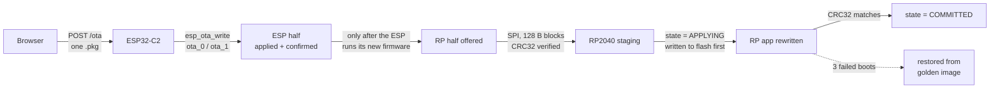
```mermaid
flowchart LR
    B["Browser"] -->|"POST /ota<br/>one .pkg"| E["ESP32-C2"]
    E -->|"esp_ota_write<br/>ota_0 / ota_1"| E2["ESP half<br/>applied + confirmed"]
    E2 -->|"only after the ESP<br/>runs its new firmware"| S["RP half offered"]
    S -->|"SPI, 128 B blocks<br/>CRC32 verified"| R["RP2040 staging"]
    R -->|"state = APPLYING<br/>written to flash first"| A["RP app rewritten"]
    A -->|"CRC32 matches"| C["state = COMMITTED"]
    A -.->|"3 failed boots"| G["restored from<br/>golden image"]
```

The ordering is the interesting part. The ESP writes and **confirms its own half first**, and
only once it has served a request on the new firmware does it offer the RP image. Reversing
that would let a broken ESP strand a perfectly good RP halfway through an update.

## RP2040 flash map

Needs an **8 MB or larger** flash part. `ota_map_fits_flash()` checks the JEDEC-detected size
at boot and simply disables OTA rather than risk corrupting a smaller one.

```
0x000000   app       1 MB    the running image
0x100000   golden    1 MB    last known-good backup, the rescue path
0x200000   staging   1 MB    incoming image, verified before it is used
0x300000   meta      4 KB    state + sizes + CRC32s, magic 0x494B4B4F
```

The meta record is what makes a power cut survivable: it is written **before** the app is
overwritten. If the board dies mid-copy, the next `ota_boot_check()` finds `OTA_STATE_APPLYING`,
re-verifies staging against its CRC32 and finishes the job.

## Taking it into your own project

Everything shared lives in [firmware/com/](firmware/com/) and is plain headers, no build
system to adopt:

| file | lines | what it is |
|---|---|---|
| [com_rp_ota.h](firmware/com/com_rp_ota.h) | 3517 | RP2040 side: SPI poll, fetch, stage, verify, apply, golden image, boot check |
| [com_esp.h](firmware/com/com_esp.h) | 5606 | ESP32 side: HTTP upload, package parsing, `esp_ota_*`, rollback window, block server |
| [com.h](firmware/com/com.h) | 344 | the wire contract: frame layout, package format, flags |
| [com_rp_hw.h](firmware/com/com_rp_hw.h) | 652 | RP2040 flash helpers and SPI wrappers |
| [com_rp_pins.h](firmware/com/com_rp_pins.h) | 66 | pin map, pure macros, no SDK includes |

On the RP2040 side the contract is four calls, documented at the top of `com_rp_ota.h`:

```c
ota_boot_check();      // very early in main(), BEFORE the watchdog and before touching flash
report_flash_size();   // optional
report_ota_state();    // optional
poll_esp_if_due();     // regularly, from whichever core owns the SPI bus
```

What you will need to change: the pins in `com_rp_pins.h`, the ESP partition table, the
variant tags if you want more than one board type, and `SPI_FRAME_VERSION` is yours to own.
If you enable a watchdog, you **must** define `OTA_WATCHDOG_UPDATE()` as `watchdog_update()`,
because applying an image takes seconds and the long loops feed it through that macro.

## What it actually guarantees

The image is CRC32 checked **three separate times** before it can become the running app:
in flight over the SPI stream, re-read back **from flash** at commit time, and again after
the copy. Re-reading staging from flash is what makes an interrupted transfer harmless, since
a half-written staging area no longer matches its recorded CRC.

The write ordering is where the crash safety actually lives:

1. the golden backup is written **and read back verified** before anything destructive
2. only then is the meta record armed with `OTA_STATE_APPLYING` and flushed to flash
3. only then is the app slot touched

So a power cut during the copy is recoverable, because the next boot finds `APPLYING` and
finishes the job. A power cut during the *golden* copy is harmless too: `golden_size` and
`golden_crc` are only updated after that copy verifies, so a torn golden slot can never be
restored over a good app. The meta record carries its own CRC32, so a torn sector reads as
invalid rather than as garbage that looks plausible.

## Being straight with you about the limits

This is a robust updater, not a secure one. Know exactly what you are getting:

- **No signature, no authentication, no anti-rollback.** CRC32 detects corruption, not
  tampering. Anyone who can reach the web endpoint can push arbitrary firmware to the RP2040.
  If your product needs signed updates, this is the layer you must add.
- **The golden image is not a factory image.** It is a rolling snapshot of whatever was in
  the app slot at the last commit. Two bad updates in a row, where the first one boots well
  enough to look healthy, and your safety net is now a copy of the first bad image.
- **"Healthy" means exactly one successful SPI poll.** That is the whole criterion that
  disarms the rollback. Firmware that boots and answers on SPI but is broken in every other
  way will happily disarm it.
- **The meta sector has no A/B copy.** `ota_meta_write()` erases and reprograms one sector;
  a power cut inside that window loses the only state record there is.
- **One window has no software recovery**: the couple of seconds while the RP2040 rewrites
  its own application flash. Lose power exactly there and it comes back as a USB mass storage
  device. Copy a `.uf2` onto it and it is fine.
- **Changing `SPI_FRAME_VERSION` breaks OTA for that release**, on both chips, because the
  update needs the very link it is changing. That one ships over a cable.
- **An ESP OTA wipes NVS** on a build-stamp mismatch, by design. Anything you keep there is
  gone after an update unless you compile your defaults in.

Protocol-level details, the exact package byte layout and single-chip update commands are in
**[OTA developer reference](#ota-developer-reference)** further down.

# Developers setup

## RP2040 DEV SETUP

We have now made the jump to **pico-sdk 2.3.0** (released July 2026). Just install the official **Raspberry Pi Pico** extension for Visual Studio Code and everything should work out of the box: https://marketplace.visualstudio.com/items?itemName=raspberry-pi.raspberry-pi-pico

The extension takes care of downloading and setting up pico-sdk 2.3.0, the toolchain and picotool for you.

**IMPORTANT: This code is only tested with, and entirely designed for, pico-sdk 2.3.0. Older SDK versions (and the old pico-setup-windows standalone installer) are no longer supported. Use pico-sdk 2.3.0 via the Raspberry Pi Pico VS Code extension.**

 - Clone this repo or download the zip file: https://github.com/therealdreg/okhi/archive/refs/heads/main.zip

 - Open Visual Studio Code with the Raspberry Pi Pico extension installed

- Open the okhi project, File -> Open Folder...

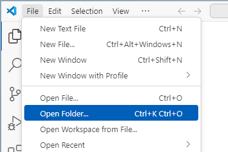

- Select oki folder: firmware\ps2\rp

- Click Select Folder

- Click on "Trust the authors" if you see this message

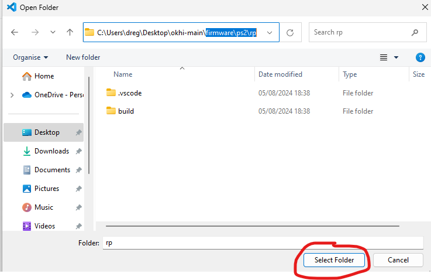

- Press shift+ctrl+p, type cmake cache and Select: "CMake: Delete Cache and Reconfigure"

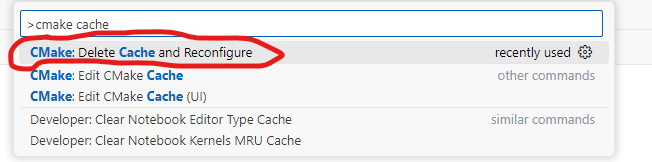

- Press shift+ctrl+p, type cmake build and Select: "CMake: Build"

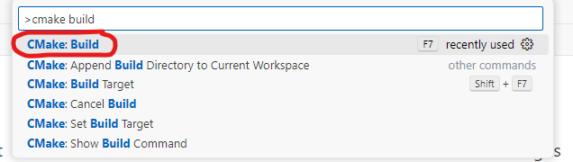

- If everything is ok, you will see a message like this in OUTPUT window (bottom):

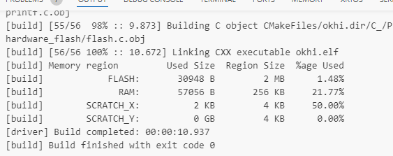

- Now a new firmware\ps2\rp\build\okhi.uf2 file is created and ready to be uploaded to okhi

### RP2040 minimal command-line build (no VS Code)

If you only want to build the RP2040 firmware and don't want to install VS Code or any extension, you can do it from a plain terminal. You just need the pico-sdk 2.3.0 sources plus the standard build tools. Example on a Debian/Ubuntu Linux box:

```
# 1. Install the build tools (cmake, ninja, the ARM cross-compiler and git)
sudo apt update
sudo apt install -y git cmake ninja-build gcc-arm-none-eabi libnewlib-arm-none-eabi build-essential

# 2. Get pico-sdk 2.3.0 (the ONLY tested/supported version) with its submodules
git clone --branch 2.3.0 --depth 1 https://github.com/raspberrypi/pico-sdk.git
cd pico-sdk
git submodule update --init
cd ..
export PICO_SDK_PATH=$PWD/pico-sdk

# 3. Get okhi and build the RP2040 firmware
git clone https://github.com/therealdreg/okhi.git
cd okhi/firmware/ps2/rp
cmake -G Ninja -B build
cmake --build build
```

When it finishes, the firmware is at `firmware/ps2/rp/build/okhi.uf2`, ready to be uploaded to okhi.

Notes:
- `PICO_SDK_PATH` must point at your pico-sdk 2.3.0 checkout; `pico_sdk_import.cmake` picks it up from that environment variable. Do not use a different SDK version, only 2.3.0 is tested and the code is designed for it.
- The same commands work on Windows/macOS as long as `cmake`, `ninja` and the `arm-none-eabi` GCC toolchain are on your `PATH` (on Windows use a shell where you can set `PICO_SDK_PATH`, e.g. `set PICO_SDK_PATH=...` in cmd or `$env:PICO_SDK_PATH=...` in PowerShell).
- No board/flashing tooling is needed just to compile: this produces the `.uf2` you then copy to the device as described in the Firmware update section.

## ESP-C2 DEV SETUP

**Note**: Starting with okhi firmware v5, the ESP firmware is built directly on the native **ESP-IDF** framework (dropping the PlatformIO + Arduino layer) to simplify unified support for both legacy and new ESP-C2 2.0 (H4X) chips (older versions of ESP-IDF cannot generate firmware for the new 2.0 chips).

H4X (ESP32-C2 2.0) flashing:
```
....
esptool v5.0.2
Connected to ESP32-C2 on COM42:
Chip type:          ESP32-C2 (revision v2.0)
Features:           Wi-Fi, BT 5 (LE), Single Core, 120MHz
Crystal frequency:  26MHz
MAC:                80:f3:da:17:b1:00

Stub flasher running.
Changing baud rate to 921600...
Changed.

Configuring flash size...
Flash will be erased from 0x00000000 to 0x00004fff...
Flash will be erased from 0x00008000 to 0x00008fff...
Flash will be erased from 0x00010000 to 0x000d1fff...
Flash will be erased from 0x00300000 to 0x003fffff...
SHA digest in image updated.
Wrote 19728 bytes (12367 compressed) at 0x00000000 in 1.3 seconds (121.6 kbit/s).
Hash of data verified.
Wrote 3072 bytes (119 compressed) at 0x00008000 in 0.0 seconds (788.6 kbit/s).
Hash of data verified.
Wrote 793920 bytes (473140 compressed) at 0x00010000 in 44.7 seconds (142.1 kbit/s).
Hash of data verified.
Wrote 1048576 bytes (5193 compressed) at 0x00300000 in 4.5 seconds (1884.1 kbit/s).
Hash of data verified.

Hard resetting via RTS pin...
```

Here are the official ESP-IDF installation instructions for your platform:

https://docs.espressif.com/projects/esp-idf/en/v6.0.2/esp32/get-started/index.html#installation

Windows: https://docs.espressif.com/projects/esp-idf/en/v6.0.2/esp32/get-started/windows-setup.html

```
winget install Espressif.EIM
```

Open EIM GUI app:


Create a new Installation

Select Custom Installation

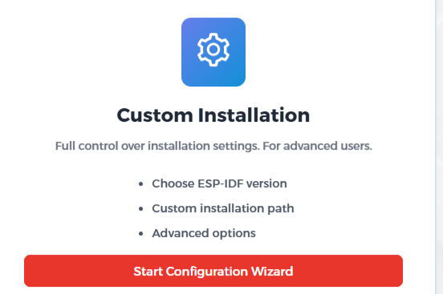

Select esp32c2 chip

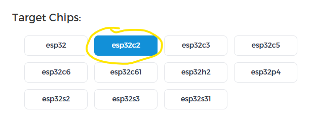

Install ESP-IDF **v6.0.2**. This is the latest version at the time of writing, but newer versions may appear in the future; always select **v6.0.2** regardless.

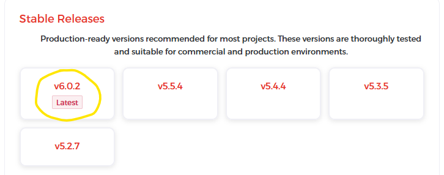

Note: Ensure you select this exact ESP-IDF version; do not use any other.

Click Next through the remaining prompts, leave everything at its default values, and complete the installation.

- Wait for the installation to finish, it will take a few minutes...

- Download the latest VSIX version: https://nightly.link/espressif/vscode-esp-idf-extension/workflows/ci/master/esp-idf-extension.vsix.zip

https://github.com/espressif/vscode-esp-idf-extension

**Note:** Make sure to install the latest version from the repository, as older versions may cause issues.

If the latest version fails, I have tested version **2.1.0**, and it works well.

- Close all instances of Visual Studio Code and open it again

- Go to View -> Command Palette

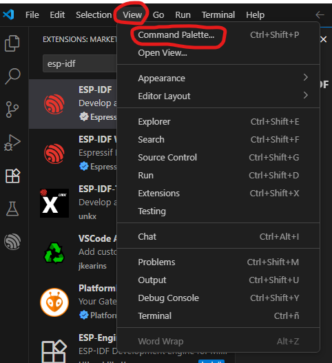

- Type: "> Extensions: Install from VSISX..."


- Select "esp-idf-extension.vsix"

- Install the extension and wait for it to finish.

- Close all instances of Visual Studio Code and open it again

- Go to File -> Open Folder


- Select the okhi-esp folder: firmware\ps2\esp

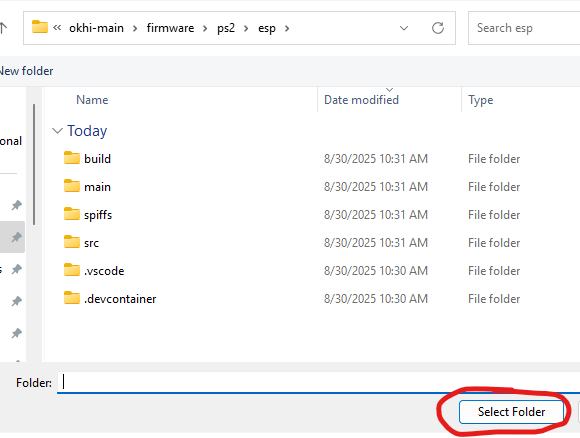

- Open the ESP-IDF extension and click "Full Clean"

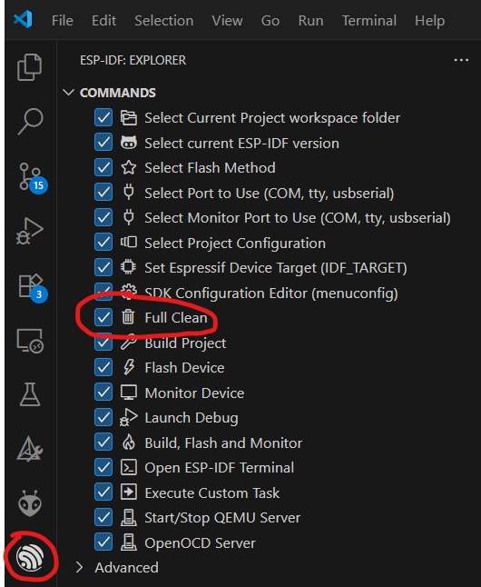

- Open the ESP-IDF extension and click "Select the correct ESP-IDF version"

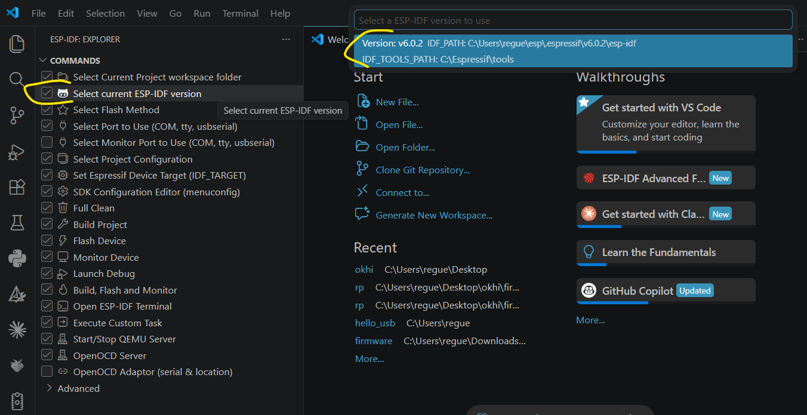

- Open the ESP-IDF extension and click "Build Project"

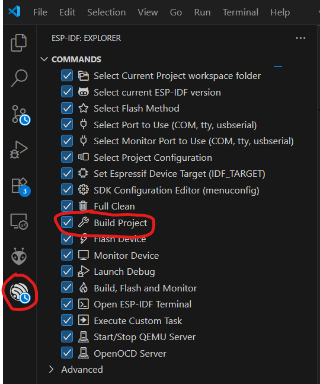

- Wait for the build process to complete.

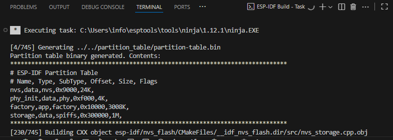

Done! The new firmware for ESP should have been created:

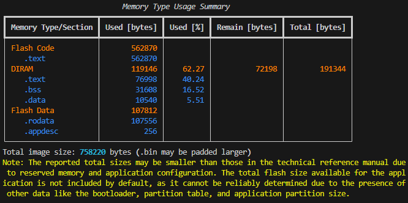

## ESP32-C2 firmware build & hardware notes

Settings that are easy to get wrong when touching the ESP build, pinned in `sdkconfig.defaults` rather than left to whatever a regenerated `sdkconfig` picks. They were lost once, silently, during the ESP-IDF 5.5 → 6.0.2 upgrade, and would have broken devices in the field. Treat `sdkconfig.defaults` as the source of truth; `sdkconfig` is generated and can be deleted at any time.

| Setting | Value | Why |
|---|---|---|
| `CONFIG_XTAL_FREQ_26` | 26 MHz, never 40 | every okhi board uses a 26 MHz crystal; wrong here garbles the serial console and breaks WiFi/timing |
| `CONFIG_ESP32C2_REV_MIN_1` | v1.0 | devices in the field are any revision from v1.0 to v2.0; a v2.0-minimum binary refuses to flash on anything older (Espressif advisory AR2025-001). Costs ~20 KB SRAM / ~100 KB flash that a v2.0-only build could reclaim, accepted on purpose |
| `CONFIG_ESPTOOLPY_FLASHSIZE_4MB` | 4 MB | the `storage` SPIFFS partition runs to the end of the chip; anything smaller does not fit |
| `CONFIG_PARTITION_TABLE_CUSTOM` | `partitions.csv` | the default single-app table has no `storage` partition |

Partition layout, two OTA slots and no `factory` slot on purpose (a third would leave under 60 KB headroom per app):

    nvs       0x9000    16K
    otadata   0xd000    8K
    phy_init  0xf000    4K
    ota_0     0x10000   1408K
    ota_1     0x170000  1408K
    storage   0x2d0000  1216K

That is the full 4 MB, no spare region: growing the app means taking space from `storage`, and since `ota_0`/`ota_1` must match, every extra 1 MB of app costs 2 MB of flash. Migrating a device from the old layout (`storage` used to sit at `0x300000`) requires a full erase, because `otadata` now sits where the old `nvs` used to be and the bootloader would misread the leftover bytes as a boot selector.

**ESP-IDF 6.0 migration notes:** the monolithic `driver` component split into per-peripheral ones, so `main/CMakeLists.txt` requires `esp_driver_gpio`, `esp_driver_spi` and `esp_driver_uart` explicitly. picolibc (the new default C library) no longer pulls in `<sys/stat.h>` transitively, so [firmware/com/com_esp.h](firmware/com/com_esp.h) includes it directly.

**The SPI callbacks must stay in IRAM** (`CONFIG_SPI_SLAVE_ISR_IN_IRAM`, `CONFIG_GPIO_CTRL_FUNC_IN_IRAM`, both callbacks marked `IRAM_ATTR`). The SPI slave ISR runs from IRAM and calls them to drive `ELOG_SLAVEREADY`; if either sat in flash, a transaction arriving while the cache is disabled (a SPIFFS read, an NVS write) would dereference unmapped memory, a crash, or a handshake that never rises and hangs the RP forever.

**DIRAM is a single pool** — the ESP32-C2 has no separate IRAM/DRAM, so anything placed in IRAM comes straight out of the ~191 KB heap. `CONFIG_ESP_WIFI_IRAM_OPT` and `CONFIG_ESP_WIFI_RX_IRAM_OPT` are both off (they default on and buy sustained WiFi throughput this firmware never needs), which returns ~30 KB. Watch `min_free_heap` in `/stats`, not the link-time "Remain" figure, since WiFi and lwIP allocate at runtime. Rule of thumb after a few minutes with the web page open: >20 KB comfortable, 10-20 KB no margin, <10 KB allocations start failing. `RING_ENTRIES` in `com/com_esp.h` (512 → 256) gives back ~16 KB at the cost of halving how much capture survives while nobody is browsing.

**HTTP server**: `HTTP_MAX_CONN` (4) connections in one `select()` loop, non-blocking sockets, so a browser's speculative preconnects that send nothing cannot stall it, which is what the old serial-accept-with-timeout server used to freeze on for seconds. Endpoints:

| Endpoint | What it does |
|---|---|
| `/` | `index.html.gz`, streamed from the embedded copy |
| `/buffer` | HID/PS2 records; `?from=N` for a stateless cursor |
| `/stats`, `/versions` | full counter dump; build identity of both chips plus link state |
| `/wifi` | network settings |
| `/selftest` | hardware self test, see **Built-in self test** above |
| `/spibench` | SPI/UART link benchmark, see **Link speed benchmarks** above |
| `/wifidown`, `/wifiup` | WiFi throughput test payload, see **WiFi speed test** above |
| `/rpreset`, `/rpbootsel` | ask the RP to reboot normally, or into BOOTSEL |
| `/ota`, `/rpimage` + `/rpcommit` | firmware update, see **OTA developer reference** below |

Raw esptool command, for when `upload_firmware.bat` is not an option (`erase-flash` first is mandatory when coming from a pre-OTA device, since `storage` moved from `0x300000` to `0x2d0000`):

    esptool --chip esp32c2 --baud 921600 erase-flash
    esptool --chip esp32c2 --baud 921600 write-flash -z --flash-mode dio --flash-freq 60m --flash-size 4MB \
        0x0000   bootloader.bin \
        0x8000   partition-table.bin \
        0x10000  okhi.bin \
        0x2d0000 storage.bin

Serial monitor: 115200 baud.

## Flashing over a cable, and the traps in it

Everything below was learned the hard way on a real board. None of it is obvious from the
commands themselves, and every item has bitten someone.

### Keep the machine idle while flashing

**Do not compile, run builds in the background, or do anything CPU heavy while a flash is in
progress.** Serial flashing sometimes just breaks when the PC is loaded: esptool has to keep
up with the port, and a CPU spike makes it lose frames. Wait for your builds to finish, then
flash. This is the single most common cause of a flash that fails for no visible reason.

### You have about 50 seconds per esptool command

This one surprises everyone. When esptool resets the ESP over DTR/RTS, the **RP2040 notices**
that reset on `ESP_RESET_GPIO`, prints

    external ESP-RESET detected!
    rebooting in 50 secs!!!

and reboots itself, leaving a marker in `.uninitialized_data`. On the way back up,
`delay_boot_if_esp_reset_detected()` runs `sleep_ms(50000)`. That deliberate 50 second nap is
the RP staying off the SPI bus and off the shared GPIOs so you can flash the ESP in peace.

**After those 50 seconds the RP wakes up, starts capturing and starts driving the bus, and it
can corrupt a flash that is still running.** Each esptool invocation triggers its own reset
and therefore gets its own fresh 50 second window, so run `erase-flash` and `write-flash` as
**separate commands** rather than chaining long work inside one window. In practice the erase
takes ~4 s and the write ~15 s, so there is plenty of room, but do not go looking for trouble.

### The full erase is not optional

    esptool --port COMx --chip esp32c2 --baud 921600 erase-flash

The OTA partition table puts `otadata` at 0xd000, where the old `nvs` partition used to live.
Skipping the erase leaves stale bytes there and the bootloader reads garbage out of the boot
selector. Two consequences worth knowing:

- **It wipes NVS**, so any saved WiFi settings are gone. The board only comes back on your
  network by itself if the credentials are compiled in (see *Putting the implant on your own
  WiFi*). Otherwise it returns as an access point at `192.168.4.1`.
- **`esp_partition` goes back to `ota_0`**, because `otadata` is left at 0xff and the
  bootloader falls back to the base slot. Seeing `ota_0` in `/versions` afterwards is
  confirmation that the erase actually happened, not a problem.

### Two error messages that are harmless

Both of these appear on a **successful** flash. Do not chase them:

- **openocd**, at the end of a perfectly good SWD flash:
  `Error: [rp2040.core0] Execution of event reset-init failed: args[i] option value ('CX') is
  not valid`. It is a quirk of `rp2040.cfg` in openocd 0.12; look for
  `** Programming Finished **` and `** Verified OK **` instead.
- **esptool**, right after the last partition reaches 100%:
  `A fatal error occurred: Invalid head of packet (0x00): Possible serial noise or
  corruption`. It fires during the final reset, most likely the RP2040 waking from its 50
  second nap. The partitions that matter each report `Hash of data verified` before it.

Because both tools can "fail" on a good flash, **never trust the exit code**. Verify against
the device instead:

    curl http://<board-ip>/versions

`esp_image` is the first 8 bytes of the `app_elf_sha256` embedded in the binary itself, so it
can be compared directly with `okhi.bin[0xB0:0xB8]`. `rp_identity` carries the RP's build
date and time, which is unique per compile. If both match what you built, it went in.

### Flashing the RP2040 over SWD

The Pico VS Code extension already ships openocd and a CMSIS-DAP setup works out of the box:

    openocd -f interface/cmsis-dap.cfg -f target/rp2040.cfg -c "adapter speed 5000" -c "program {path/to/firmware/usb/rp/build/okhi.elf} verify reset exit"

Pass the **`.elf`**, not the `.bin`, so openocd places every section correctly. To test the
probe without writing anything, swap the `program` line for `-c "init" -c "targets" -c
"shutdown"`; it should list `rp2040.core0` and `rp2040.core1`.

Note that flashing the RP this way writes straight over the app slot and leaves the OTA meta
record describing the image that *used* to be there. That is fine: the board boots, the first
successful SPI poll calls `ota_mark_healthy()` and the record settles. It does mean the
golden backup still holds the previous firmware until the next OTA commit refreshes it.

### The RP2040 UART log is the best debugging tool here

Hook a serial terminal to the RP at **115200 baud** and log to a file. It prints far more
than the web page can show, and it is the fastest way to understand what a board is doing:

    okhi USB started! Hardware vXX          identity and build timestamp
    flash JEDEC id / size detected          whether OTA is even possible on this part
    ota map: app/golden/staging/meta        the flash layout in use
    ota boot check: ...                     what it decided at boot
    ota meta: state N attempts N            OTA state machine and trial-boot counter
    esp link UP/DOWN, esp fw vN             SPI link transitions
    esp wifi client, address 192.168.x.x    the IP it just got
    rp image offered / STAGED ok / ABORTED  every step of an OTA, with byte counts and CRCs
    rp commit: backing up ... to golden     the commit sequence, in order

Seeing `rp image transfer ABORTED at block N (attempt 1)` followed by a successful retry is
**normal** during a combined OTA: the ESP reboots into its own new half partway through, the
link drops, and the RP simply starts the transfer again.

## Generating a New Release

**The repository does not carry build output**, so a release starts from source every time:

1. Build all five targets: `usb/esp`, `usb/rp`, `ps2/esp`, `ps2/rp` and `uart_bridge`.
2. Or skip step 1 entirely: `python make_release.py` builds all five targets and then
   packages them. Add `--deep-clean` to rebuild everything from scratch first.
3. The script gathers those artifacts into `release/<timestamp>/` and produces the combined
   `okhi_{USB,PS2}_ota.pkg` for both chips. That directory is gitignored, so a release you
   built for testing can never be committed by mistake.

If it reports `[MISSING]` for something, that target has not been built yet.

Why the extra step: the ESP binaries are compiled with `wifi_secret.h` baked in whenever it
is present, so tracking them would mean a development build could carry a real WiFi password
into a public repository. Keeping every `build/` directory out of git removes that risk
entirely rather than relying on anyone remembering to clean up first.

-----

To compile USB firmware, follow the same steps. Just select the firmware\usb\rp folder and firmware\usb\esp folder.

Note: I modified the original usb-sniffer-lite project by Alex Taradov (porting to pico-sdk). I am not a RP2040 expert, so I am learning a lot with this project.

## OTA developer reference

User-facing OTA usage is in **Firmware update over the air (OTA)** above; this is the protocol level, for updating one chip at a time during development or troubleshooting a failed update.

**Package format** (what `make_release.py` builds, magic `"OKHI"`):

    0   4   magic "OKHI"              4   4   package format version
    8   4   variant tag, "USB\0" or "PS2\0"
    12  4   ESP image length          16  4   ESP image crc32
    20  4   RP image length           24  4   RP image crc32
    28  4   crc32 of bytes 0..27
    32  ..  ESP image, then RP image

`POST /ota` also accepts a bare ESP image (magic `0xE9`, sniffed from the first byte), for updating just that chip.

**Updating one chip on its own:**

    curl -X POST -H "Expect:" --data-binary "@ota_esp.bin" http://<board-ip>/ota

    curl -X POST -H "Expect:" --data-binary "@ota_rp.bin" http://<board-ip>/rpimage
    curl http://<board-ip>/rpcommit

`/rpimage` only stages the image on the ESP's filesystem; `/rpcommit` tells the RP to fetch, verify and apply it. Use the combined `.pkg` for anything that leaves the lab: it is what guarantees the two chips can never end up on mismatched firmware.

**Why the commit order matters.** The ESP writes and confirms its own half FIRST; only once it has served an HTTP request on the new firmware does it flag the RP image as ready, so the RP starts fetching it. Reversing that order would let a broken ESP strand a good RP mid-update. The loop closes on its own: the RP's status frames carry the CRC32 of what it is running, and once that matches the staged image the ESP deletes it.

**RP flash map**, printed at boot (`report_ota_state()`) and why a bad RP update recovers on its own:

    0x000000  app        1 MB   the running image
    0x100000  golden     1 MB   backup of the image being replaced
    0x200000  staging    1 MB   incoming image
    0x300000  meta       4 KB

An RP firmware that boots but cannot talk to the ESP is replaced by the golden backup automatically after three failed attempts. This needs an 8 MB+ flash part (`ota_map_fits_flash()` checks the JEDEC-detected size and disables OTA rather than risk corrupting a 4 MB part).

**Two things that will bite you:**

- Bumping `SPI_FRAME_VERSION` (in [firmware/com/com.h](firmware/com/com.h)) breaks OTA for that release on both chips, because the update needs the very link it just changed. That one needs a cable release for the RP.
- The one step with no software recovery is the couple of seconds while the RP is rewriting its own application flash. Losing power exactly there leaves the RP as a USB mass storage device; recover it by copying `okhi.uf2` onto it.

**Checking the result**, `/stats` fields worth watching:

    partition        ESP slot in use, ota_0 or ota_1
    booted_pending   1 for the rest of the session after an OTA
    rp_image_ready   1 while an RP image is still staged
    ota_last_error   why the last upload was rejected, if it was

## The ESP32-C2 as an SPI slave: behavior, quirks, and how they shaped the code

The two chips talk over a private SPI link plus two side-band GPIO lines. The **RP2040 is the SPI master** and the **ESP32-C2 is the SPI slave**: the RP is the real time capture engine, so it owns the clock and decides when anything moves, while the ESP is the Wi-Fi / web / OTA brain that only ever answers. The slave side is ESP-IDF's `driver/spi_slave.h`, driven from [firmware/com/com_esp.h](firmware/com/com_esp.h); the RP master side lives in [firmware/com/com_rp_hw.h](firmware/com/com_rp_hw.h). Everything below is behavior of the ESP32-C2 slave and of the ESP-IDF `spi_slave` driver that we hit during development, and that the current protocol and timing hacks exist to work around. It is written down so anyone extending the link knows why the code looks the way it does.

**Wire and frame format.** SPI mode 0 (CPOL=0, CPHA=0), MSB first, about 5 MHz (`SPI_BAUD` in com_rp_hw.h), DMA on the ESP side. The frame layout is 256 bytes (`SPI_FRAME_SIZE` in [firmware/com/com.h](firmware/com/com.h)): a 16-byte lead, an `OKHI` / `OKHC` magic, a small header, then a payload area. The ESP arms its DMA buffers at that full size, but the master does not always clock all 256 bytes (see quirk 3). Both ends stamp `SPI_FRAME_VERSION` into their frames, and the ESP rejects a control frame whose version does not match (counted as `spi_proto_mismatch`), so a version skew between the two firmwares is caught rather than silently misparsed.

**Pins, clock and DMA.** The ESP-IDF slave driver caps non-DMA transfers at 64 bytes, so the 256-byte frames need DMA, which is why the slave is brought up with `SPI_DMA_CH_AUTO`. The ESP SPI pins (MOSI 7, MISO 2, SCLK 6, CS 10 in com_esp.h) are the ESP32-C2 IO_MUX defaults for SPI2, so the signals stay on the dedicated pins instead of going through the GPIO matrix. At 5 MHz that is not a performance requirement (the ESP-IDF docs note that at 80 MHz and below both routings behave identically), and 5 MHz sits far below the slave's rated 60 MHz ceiling.

### 1. The slave must be armed before the master clocks a single bit

An ESP SPI slave does not listen for free. A DMA transaction has to be queued with `spi_slave_queue_trans()` **before** the master pulls CS and starts clocking; if the master clocks while nothing is queued, that data is not captured. This one fact drives most of the design:

- The slave pre-queues a ring of 8 transactions at startup (`SPI_QUEUE_DEPTH`, `spi_task()` in com_esp.h) and re-queues each buffer as soon as it has processed it, so there is always one waiting.
- A dedicated ready line, `ELOG_SLAVEREADY` (ESP -> RP), tells the master when the slave actually has a transaction loaded. The slave raises it in `spi_post_setup_cb()`, which the driver fires after it has loaded a queued transaction into the SPI hardware, and drops it in `spi_post_trans_cb()`. Both callbacks are `IRAM_ATTR` because they run from interrupt context.
- The master treats that line as a hard interlock. `my_spi_to_esp_write_blocking()` in [firmware/usb/rp/okhi.c](firmware/usb/rp/okhi.c) raises `EBOOT_MASTERDATAREADY` (RP -> ESP), spins until `ELOG_SLAVEREADY` is high, and only then drives CS and clocks the frame out. At boot, `init_esp_seq()` waits for the slave to come up before the first poll.

None of this is an okhi invention. The ESP-IDF slave docs state plainly that "a Host should not start a transaction before its Device is ready for receiving data" and recommend a dedicated GPIO handshake to sync the two sides, and the official `spi_slave` receiver example raises that handshake line in its `post_setup_cb` and drops it in its `post_trans_cb`, which is exactly what okhi's `spi_post_setup_cb` / `spi_post_trans_cb` do with `ELOG_SLAVEREADY`. The line exists precisely because an SPI slave cannot be clocked on demand: the master has to be told when a transaction is armed. Both handshake GPIOs are pinned in [firmware/com/com_rp_pins.h](firmware/com/com_rp_pins.h).

### 2. CS setup and hold matter, and the official ESP example shows you must delay around CS

The ESP slave can miss the final bit of a frame when CS deasserts too close to the last clock edge, that is, when CS reaches the slave faster than the clock does. This is not okhi folklore. The official ESP-IDF `spi_slave` "sender" example handles exactly this on the master side by keeping CS asserted for a few SPI clock cycles after the last bit, with `cs_ena_posttrans = 3` in its master device config (that same example master runs at 5 MHz in mode 0, the exact clock and mode okhi uses). That example, its URL and the reasoning it gives ("Keep the CS low 3 cycles after transaction, to stop slave from missing the last bit when CS has less propagation delay than CLK") are quoted verbatim in the comment above the `delay_cs()` macro in [firmware/com/com_rp_hw.h](firmware/com/com_rp_hw.h).

okhi cannot use `cs_ena_posttrans`, because the RP drives CS in **software** rather than with the hardware CS pin (`rp_spi_master_init()` sets the CS GPIO by hand). So it reproduces the same margins itself, inside the `CS_LOW()` / `CS_HIGH()` macros that wrap every transfer:

- **Hold after the last bit**, the direct analog of `cs_ena_posttrans = 3`: `delay_cs_pos()` keeps CS low for a short NOP delay after the last clock, before releasing it. The comment in com_rp_hw.h works the sizing out (about 90 NOPs, on the order of a few SPI clock cycles at 5 MHz, matching the example's 3). Both variants use this default.
- **Setup after asserting CS**, before the first clock: the USB build additionally waits 25 us here (`delay_cs_pre()` / `SPI_CS_SETUP_US` in [firmware/usb/rp/okhi.c](firmware/usb/rp/okhi.c)); the PS/2 build leaves this at the same default NOP delay.

The point for anyone touching this: the software-CS, NOP and busy-wait arrangement is not cargo cult, it is there to give the ESP slave enough CS setup and hold time so it does not drop the last bit, mirroring what the official example does with `cs_ena_posttrans`. If you change the CPU clock or the SPI rate, re-check these delays, since the NOP timing scales with the clock (com_rp_hw.h spells out the 125 MHz and 250 MHz cases).

### 3. Fixed-size DMA buffers, word-aligned, with a separately reported transfer length

The slave's DMA works in fixed length buffers, so the RX and TX buffers are a fixed 256 bytes each and every transaction is armed for that full length (`length = SPI_FRAME_SIZE * 8` bits in `spi_task()`). The ESP-IDF docs are explicit that `length` is only the buffer capacity: the real transaction length is decided by the master's clock and CS, and can only be read afterwards from `trans_len`. So the master does not have to clock all 256 bytes: the driver reports the actual bit count through `trans_len` (the ESP keeps it for diagnostics), and the payload length itself is recovered by scanning the received buffer in `spi_payload_length()`. This is how the PS/2 variant can forward short keystroke lines while the poll, status and OTA-data frames use the full 256-byte layout. The RX/TX buffers carry `WORD_ALIGNED_ATTR` because, with DMA, the driver requires the buffer to start on a 32-bit boundary and be a multiple of 4 bytes long, and it errors out of `spi_slave_queue_trans()` otherwise; the fixed 256-byte size meets the length-multiple part. The net effect is that the slave side always deals in 256-byte buffers even when the payload is a short line.

### 4. The slave can never start a transfer, so everything is poll plus piggyback

A slave only responds. The ESP cannot push a byte when it wants to; it can only place data in its TX buffer and wait for the master to clock it out on MISO. The whole protocol is built around that constraint:

- The RP periodically clocks a control frame (magic `OKHC`, `SPI_CTRL_TYPE_POLL`) in `poll_esp()`, driven by `poll_esp_if_due()`, as one full-duplex 256-byte transfer. On that same transfer the ESP's already-queued TX buffer rides back on MISO as a status frame with flag bits (`SPI_FLAG_RP_IMAGE_READY`, `SPI_FLAG_RP_COMMIT`, and so on). Because the TX buffer was filled when the ESP re-armed it, the status the RP reads reflects the state as of that arming, one transfer behind.
- OTA of the RP image is pure request/response over polling: the RP asks for block N with `SPI_CTRL_TYPE_REQUEST_BLOCK`, the ESP only acts on that request after the transfer completes and loads block N into the *next* TX buffer in `spi_fill_frame()`, so the RP reads it back on a following poll (`ota_fetch_block()` retries for exactly this reason). Nothing "sends" the image; the RP pulls it 128 bytes at a time.
- Captured keystrokes travel the other way, RP -> ESP on MOSI, and the ESP just files whatever landed in its RX buffer into a ring for the web server to serve.

### 5. The two handshake GPIOs are also ESP32-C2 strapping pins, on purpose

This one catches people new to the ESP32-C2, so it is worth spelling out. The two side-band handshake lines are **not** ordinary GPIOs on the ESP side, they are the chip's **two strapping pins**:

| line | RP2040 pin | ESP32-C2 pin | ESP strapping role at reset |
|---|---|---|---|
| `EBOOT_MASTERDATAREADY` (RP -> ESP) | GPIO14 | **GPIO9** | selects the **boot mode** |
| `ELOG_SLAVEREADY` (ESP -> RP) | GPIO15 | **GPIO8** | selects **ROM-log printing** |

Pins are defined in [firmware/com/com_rp_pins.h](firmware/com/com_rp_pins.h) (RP side) and [firmware/com/com_esp.h](firmware/com/com_esp.h) (ESP side); the wiring is in the board schematic, `stuff/images/schematic.png`.

**What a strapping pin is.** At power-up or reset the ESP32-C2 samples a small fixed set of GPIOs to decide how it boots, latches those values, and then **frees the pins to be used as normal IO** for the rest of the run. The datasheet says exactly this (`stuff/esp8684_datasheet_en.pdf`, chapter 3 "Boot Configurations", tables 10, 12 and 13). So a strapping pin is a normal GPIO that is *also* read once, very early, before your firmware ever runs. Reusing these two for the SPI handshake afterwards is deliberate and perfectly legal, precisely because the datasheet guarantees they are free after reset, and it is why they were picked. The names are the hint: `EBOOT` = ESP boot-select, `ELOG` = ESP ROM-log.

**GPIO9 = boot mode (the `EBOOT` line).** GPIO9 is the ESP's BOOT pin, the equivalent of the BOOT button on a devkit. At reset:

- **GPIO9 = 1 -> SPI boot** (run the app in flash). This is the default: GPIO9 has an **internal weak pull-up** (datasheet table 10), so left alone it reads 1.
- **GPIO9 = 0 -> Joint Download Boot**, the UART flashing mode that esptool drives.

The rule the okhi RP follows: **while the ESP is in reset the RP must not pull GPIO9 low, or the ESP drops into flashing mode instead of running the app.** It does this by leaving `EBOOT` as an **input (high-Z)** during the ESP's boot, `rp_board_boot_init()` in [firmware/com/com_rp_hw.h](firmware/com/com_rp_hw.h) sets `GPIO_IN`, so the ESP's own pull-up wins and selects SPI boot, and only turns it into a driven output later, once the ESP is up, in `esp_link_master_init()`. The flip side of the same fact is how you deliberately enter flashing mode: hold GPIO9 low and reset.

**GPIO8 = ROM-log printing (the `ELOG` line).** GPIO8 is the other strap. For SPI boot its level is **don't-care for the boot mode itself** (datasheet table 12), but together with the `EFUSE_UART_PRINT_CONTROL` eFuse it still decides whether the boot ROM prints its messages on UART0 (table 13). Unlike GPIO9 it has **no internal pull** at all (table 10, "N/A"), so whatever pull you attach externally is what sets that strap at every reset. okhi puts an **internal pull-up** on `ELOG` from the RP side (`esp_link_uart_init()` in com_rp_hw.h), which pins the ROM-log strap high.

**The trap, and how to handle it safely.** Because the RP holds `ELOG` high with that pull-up, there is a window right after any ESP reset (an OTA of the ESP, a Wi-Fi settings change that restarts it, a brownout, the first seconds of power-on) where the **ESP has not yet driven GPIO8**, so the line just floats high on the RP's pull-up. The master then reads `SLAVEREADY = high = armed` while the slave is in fact still booting, clocks a frame at it, and those bytes are lost. The tempting "fix", flipping the RP pull to pull-**down** so a floating line reads not-ready, is **the wrong move**: that pin is the ROM-log strap, and a pull-down would change what the ESP samples at every single reset. The correct fix stays in software on the master side: the RP knows when it has just reset the ESP (it owns `ESP_RESET_GPIO`), so during that known boot window it should treat `SLAVEREADY` as not-ready and buffer, instead of trusting the raw level. **Never solve a strapping-pin problem by changing the strap.**

**If you are wiring your own two-chip board,** the portable lessons are: (1) read the strapping table *before* you assign a handshake to GPIO8 or GPIO9; (2) choose any pull on a strapping pin to match the level the *strap* needs at reset, not just the level your handshake wants when idle; and (3) prefer to leave a strapping pin at its strap default (high-Z, let its own pull decide) during the other chip's reset, driving it only once that chip is past boot, exactly as the `EBOOT` input-then-output flip does here. The strapping setup/hold window is short (datasheet table 11: hold 3 ms after CHIP_EN is released), but short is not zero, so a line that stays quiet across the other chip's reset is the safe design.

### ESP-IDF specifics

The ESP firmware is built on native **ESP-IDF** (v6.0.2 here). Since okhi v5 the old PlatformIO + Arduino layer was dropped, partly so a single codebase supports both the legacy ESP32-C2 and the new 2.0 (H4X) silicon, which older ESP-IDF cannot build for (see the note under **ESP-C2 DEV SETUP** above). The slave lives entirely in the `spi_slave` driver; the DMA queue, the two IRAM callbacks and the fixed-frame model above are all ESP-IDF behavior, not something okhi invented.

### In hindsight: the master and slave roles are arguably backwards

Every quirk in this section comes from the ESP32-C2 being the **slave**. Looking back, flipping the roles, making the **RP2040 the SPI slave** and the **ESP32-C2 the master**, would likely have been the cleaner choice. The RP2040's PIO can implement a tightly timed SPI slave in hardware, and an ESP master could initiate a transfer whenever it wanted data instead of waiting to be clocked. That would have removed the `SLAVEREADY` / `MASTERDATAREADY` arming handshake and much of the software-CS setup and hold tuning that the current direction forces. But that is not how it was built, and in practice it does not matter: the current design has proven reliable in the field and works well, so it stays as is. Treat this section as a heads-up for anyone extending the link, not a bug list.

## Link speed benchmarks (SPI & UART): measured limits

okhi ships a built-in link benchmark that stresses the RP2040 <-> ESP32-C2 bus over a
sweep of clocks/bauds, checks every frame with CRC32 and sequence numbers in both
directions, and reports the highest rate that stays clean. It is driven over HTTP (the
board's web page has buttons; the raw endpoint is `/spibench`), so you can characterize
your own PCB.

Measured on the production hw v0F board (firmware v7, 2026-08). A short sweep finds the
highest rate that survives a 300 ms burst, but that **overestimates** the sustainable rate:
a soak (the benchmark's `soak` mode, run here for a full hour) is the honest test and exposes
rare errors the sweep is too short to catch. Three numbers matter per link: the sweep ceiling,
that ceiling held for an hour, and the highest rate that survives an hour with **zero** errors.

| Link | Sweep ceiling (short burst) | Ceiling held 1 h | **Safe max (0 errors, 1 h soak)** | Normal operating rate |
|---|---|---|---|---|
| **SPI** (RP master <-> ESP slave, no core overclock) | ~34.5 MHz | 34.5 MHz: 20.7M frames, 2 corrupted, no reset (about 1 error per 10M) | **30 MHz**: 22.4M frames, **0 errors**, no reset | 5 MHz (~6x under the safe max) |
| **UART** (RP uart0 <-> ESP UART0) | 3 Mbaud (ladder top) | 1.5 Mbaud: 9M frames, 3 corrupted + 9 lost + 142 resyncs (3 Mbaud fails outright) | **1 Mbaud**: 6.5M frames, **0 errors**, no reset | 74880 baud (~13x under the safe max) |

So for this PCB the **safe maximum link speeds are 30 MHz (SPI) and 1 Mbaud (UART)**: each was
verified with a full hour of soak and zero errors of any kind, and no board reset. The sweep
ceilings (34.5 MHz / 3 Mbaud) are absolute maximums, not usable rates: at the ceiling a 1-hour
soak still runs without resetting the board, but a handful of frame errors creep in (typically
after 20-30 min, then leveling off, so likely thermal). Normal operation runs far below even the
safe maximum, with a large margin and zero errors. Both limits are set by signal integrity on
the PCB, not by the firmware; overclocking the RP2040 core to 240 MHz does not raise the SPI
ceiling (the wall is the bus, and the board browns out first, see the SPI slave notes above).

Reproduce it (replace the IP with your board's):

```
# SPI, no overclock, 2-40 MHz (values in kHz), 500 ms per step
curl "http://<board-ip>/spibench?start=1&kind=0&ms=500&min=2000&max=40000&steps=15&soak=0&down=0&oc=0"
# UART, full baud ladder 9600..3000000 (values in baud), 300 ms per step
curl "http://<board-ip>/spibench?start=1&kind=1&ms=300&min=9600&max=3000000&steps=13&soak=0&down=0"
# 1-hour soak at a single fixed rate (SPI 34.5 MHz here): min=max, steps=1, soak in ms
curl "http://<board-ip>/spibench?start=1&kind=0&ms=500&min=34500&max=34500&steps=1&soak=3600000&down=0&oc=0"
# then poll the result:
curl "http://<board-ip>/spibench"           # state= and best_khz=
curl "http://<board-ip>/spibench?from=0"    # per-step table
```

Parameters: `kind` is 0 for the SPI link or 1 for the UART; `ms` is the per-step duration;
`min`/`max` are in **kHz for SPI** and in **baud for UART**; `steps` is the coarse sweep
count; `oc=1` enables RP2040 core overclock for the SPI sweep (brownout-prone); `soak`
runs a longer confirmation at the best rate. The benchmark never stops at the first
failure (the link can be non-monotonic due to resonances): it sweeps the whole range and
then reports the highest clean rate.


## Built-in self test: what it checks and how to read it

Every board can test itself without any external instrument. The web page has a
**Self test** button; the raw endpoint is `/selftest`. Both halves take part: the ESP
checks itself and then arms the RP2040, which runs its own list and streams each result
back over the SPI link. A full run is 36 rows and takes a few seconds.

```
# run everything, including the flash read/write probe and the USB switch
curl "http://<board-ip>/selftest?start=1&flash=1&sw=1"
# poll the summary and the rows (8 per page)
curl "http://<board-ip>/selftest"
curl "http://<board-ip>/selftest?from=8"
```

Rows come back as `t=id,verdict,a,b,text`, with verdict `0` pass, `1` fail, `2` warn,
`3` skipped, `4` informational and `5` waiting for you to answer. `flash=1` adds the
erase/write/read check on the spare sector, and `sw=1` adds the USB switch and sniff pin
tests; both are opt-in because they touch state the running firmware otherwise owns.

A healthy hw v0F board with no target keyboard attached reports **29 pass, 0 fail,
0 warn**, with the rest informational, skipped, or waiting on you:

| Area | Covered by |
|---|---|
| RP2040 core | firmware build, hardware straps, die temperature |
| Clocks | `clk_sys` 120 MHz, `clk_peri`/`clk_usb`/`clk_adc` 48 MHz, U4 TCXO 12 MHz, ROSC |
| U3 flash (W25Q128) | JEDEC id, 16 MB size against what the build expects, erase/write/read |
| GPIO | pull-up and pull-down follow, push-pull drive, and a full pin-to-pin bridge scan |
| U1 USB switch | mux select and output enable both directions, sniff pair follows, previous state restored |
| SPI link | 256 real frames, magic and version verified, worst search offset reported |
| UART link | one real 460800 baud benchmark step, both directions CRC and sequence checked |
| Handshake lines | MASTERDATAREADY (RP14 to ESP IO9) and SLAVEREADY (ESP IO8 to RP15) both toggle |
| CHIP_PU | R7 holds the ESP enable up, and the RP can pull it down |
| ESP32-C2 | chip revision, MAC, flash id and size, heap, reset reason, partitions, SPIFFS, WiFi |
| LEDs | LED1 (ESP IO0 through R8) and LED2 (RP GPIO26 through R10), **you confirm these** |
| Clean exit | every pin the sweep borrowed is verified to be back exactly as it was found |
| WiFi speed | filed by the browser after the throughput test below, both directions with CRC32 |

The two LED rows are the only ones a machine cannot judge: the board blinks and you
answer with `?led=1&ok=1` for LED2 or `?led=2&ok=1` for LED1 (the web page turns that
into a yes/no prompt). `ST_RP_ADC_PIN` reports skipped on purpose, because GPIO27/ADC1
is not populated on this board. Nothing checks U2 (the 3V3 regulator), the protection
diodes and fuse, the RUN reset network, or the RP2040's own USB port on H2: the first
three have no observable output the firmware can read, and the last needs a host at the
other end.

Two design notes, because both cost real debugging time:

- **The link tests move real traffic instead of reading a status word.** A burst that
  arrives intact exercises the whole path at once, so a single row covers clock, both
  data lines, chip select and the two handshake wires. They reuse the benchmark code
  described above rather than reimplementing frame checking.
- **The handshake lines are latched, not sampled.** Neither line can be probed by
  holding a level and then asking the far side, because the only way to ask is an SPI
  transfer and every transfer drives both lines itself: the question always arrives
  after the answer has been overwritten. Each side therefore records both levels it
  sees while handshaking, and the test just runs traffic and reads that latch.
- **The board is fully usable the moment a run ends.** The sweep drives, pulls and
  reconfigures pins that the running firmware owns, so each one is photographed before
  the run (function, direction, level, pulls) and put back exactly as it was, with the
  peripheral function restored last so a pin belonging to PIO or the UART is not left
  on SIO. The link pins are then reasserted to their known running state, and the last
  row compares every borrowed pin against its photograph, so a test that forgets to
  clean up is caught immediately rather than showing up later as a board that
  misbehaves after a self test.


### Proving the USB switch with a ground wire

The sweep can tell that the switch's control pins move and that the sniff lines follow a
pull, but not that the switch itself actually passes and blocks a signal: with nothing
attached, both sides of it look the same. The web therefore offers a guided check, under
the self test, that settles it with a single dupont wire. It only applies to boards that
carry the TS3USB3000; earlier revisions without the switch simply skip it.

Unplug the target keyboard, then, **one line at a time**:

1. Bridge **D+** (DATA on a PS/2 board) on the sniff header to **GND** and press Check.
2. Move the wire to **D-** (CLOCK) and press Check again.

For each line the RP holds it up with its internal pull-up and takes three readings:

| Reading | What it proves |
|---|---|
| the line goes low with the switch closed | the switch really passes the signal through |
| the **other** line stays high at the same time | no solder bridge between the two neighbouring pins |
| the line springs back high with the switch open | the switch really isolates, it is not stuck closed |

Doing one wire at a time is the whole point of the bridge half: if the two pads are
bridged, grounding one drags the other down with it and the check fails. The verdict
names which of the three went wrong, so `no ground through it` means the wire or the
switch, `BRIDGED to its neighbour` means the two pads, and `will not open` means a switch
stuck closed. Both pins are put back exactly as they were afterwards, so the board is
sniffing again the moment you remove the wire.

### Rebooting the RP2040 as a USB drive

The card below the self test has a **Reboot the RP as a USB drive (BOOTSEL)** button. It
restarts the RP2040 into its own bootloader, where it enumerates as the usual RPI-RP2 mass
storage device on the USB programming header, ready for a `.uf2` to be copied onto it. This
is the escape hatch when the OTA path is not an option, for instance when flashing a
completely different firmware onto the RP.

The RP stops running the moment you press it, so the SPI link goes down and the page will
report the RP as missing until you either flash something or power cycle the board. The
ESP is unaffected and keeps serving the page throughout, which is what makes the button
usable in the first place.

**The RP reboots on its way there, and it has to.** The request arrives inside the SPI poll,
which runs on core 1, and `reset_usb_boot()` called from there does jump to the bootrom but
never produces a usable device: core 0 is still running the capture, with its PIO programs
and DMA channels live, over the RAM and the peripherals the bootrom needs for itself. The
board ends up stranded between the two, neither keylogger nor bootloader, and only a power
cycle recovers it. So core 1 records the request in a variable that survives a reset and
reboots instead; `ota_bootsel_check()` then enters the bootloader from the top of `main()`,
on core 0, before core 1 is launched and with every peripheral back at its reset state. That
is the same path the physical BOOTSEL button takes, which is why that one always worked. The
marker is cleared before the jump, so power cycling out of the bootloader brings the
keylogger back rather than dropping into it again.

When checking whether the jump happened, watch `rp_link_age_ms` in `/stats` rather than
`link`: the age starts climbing immediately, while `link` takes about three seconds to turn
`stale`. And a link that goes quiet only proves `reset_usb_boot()` ran, not that the
bootloader came up.


## WiFi speed test, measured from the browser

How fast the board can actually be reached matters as much as whether it answers at all, so
the page carries a throughput test under **WiFi speed**. It runs from the browser that is
looking at the page, one direction after the other, and files the result in the self test
table as well. **Time per direction** is a dropdown: 30 seconds, 1, 2, 5, 10 or 15 minutes.
Thirty seconds is enough to see roughly where a link sits; the longer settings are for
finding out whether it holds that rate, since a radio that starts fast and degrades, or an
access point that reshuffles rates under sustained load, only shows up over minutes.

What makes the number trustworthy is that nothing is taken on faith:

- **The payload is random, not zeros.** The board generates it from a linear congruential
  sequence, so it is spread out and incompressible enough that no layer in between can
  flatter the result by squeezing it.
- **Every block carries a CRC32 and is checked at the far end.** On the way down the board
  appends the checksum of the block as eight hex digits after the payload, and the browser
  recomputes it over what actually arrived. On the way up the browser sends the checksum of
  what it generated and the board recomputes it over what actually landed, answering `ok=1`
  or `ok=0`. A link that is fast but drops or mangles bytes fails instead of scoring well.
- **Nothing is stored.** The uploaded bytes are hashed as they arrive and discarded, so what
  is being measured is the radio and not the flash.

The browser loops one block at a time until its own stopwatch runs out, rather than doing a
single huge transfer, so a slow link still makes progress and a fast one is not dominated by
one long request. The average is total bytes over elapsed time, which is why the figure is
real throughput including every per request overhead, not a peak.

### What this PCB actually manages, a room away

Measured with the page's own benchmark at the 15 minute setting, which is 15 minutes down
followed by 15 minutes up, on a production board joined to an ordinary home network as a
client. The board sat about five metres from the laptop, in the next room, with one wall in
between. Signal at the board was **-45 dBm**, a strong link, and the self test reports it next
to the network name so the figures below always come with the conditions that produced them.

| direction | rate | in bytes per second | moved in 15 min | integrity |
|---|---|---|---|---|
| **download** (board to browser) | **2.50 Mbit/s** | **0.31 MB/s** = 313 KB/s (0.30 MiB/s, ~305 KiB/s) | 268 MiB | every block verified |
| **upload** (browser to board) | **1.31 Mbit/s** | **0.16 MB/s** = 164 KB/s (0.16 MiB/s, ~160 KiB/s) | 141 MiB | every block verified |

The test reports Mbit/s because that is what radios are rated in, but bytes per second is
what most people picture, so both are given. **Divide megabits by 8 to get megabytes**: 2.50
Mbit/s is 0.31 MB/s. The values in brackets are the binary units, MiB/s and KiB/s, which
divide by 1024 rather than 1000; they run about 5% lower for the same speed, which is exactly
why the two are spelled out separately instead of being mixed.

**Not one byte of 409 MiB failed its CRC.** At this range the link is not marginal, it is
simply not fast, and those two things are worth telling apart.

#### Read these numbers for what they are

This is **application throughput measured end to end from a browser**, not the radio's raw
rate, and the gap between the two is large and entirely normal. What the figures already have
subtracted from them:

- **802.11 itself**: preambles and framing, an acknowledgement for every frame, retries,
  waiting for the channel to be free, and the rate the access point decides to use.
- **TCP**: the page fetches one block at a time and the board answers `Connection: close`, so
  every block pays a fresh three way handshake and starts again in slow start. That is a
  deliberate part of the test, because it is also how anything else will talk to this board.
- **HTTP**: request and response headers on every block.
- **The ESP32-C2 doing the work**: a single small core that also generates the payload and
  computes its CRC32 as it streams, on a four connection server with a 2 kB send buffer, on
  top of lwIP. On a part this size the processor and the stack, not the antenna, are usually
  what sets the ceiling.

So the honest way to read the table is: *this is what a program pulling data off the board
will really see*, which is exactly the number worth knowing when the board is full of capture
and you want it out. It is not a measure of how good the radio or the antenna is, and it
should not be compared against a PHY rate or a phone's speed test.

#### It is a range, not a figure

The long run showed something a 30 second test cannot. Download held 2.5 Mbit/s flat for the
full fifteen minutes. Upload did not: it ran at roughly 2.1 Mbit/s for five minutes and then
settled to around 0.8, which is what drags its fifteen minute average down to 1.31. From then
on the whole link, both directions, sat at about 1.2 Mbit/s and stayed there. Leaving the board
idle for three minutes did not bring it back, and neither did rebooting it, while the signal
stayed at -45 dBm and the heap stayed flat at 31 kB free with no leak. So it is not the board
running out of memory and it is not a weak signal; something outside it, the access point or
the channel, settled into a slower arrangement and kept it.

Expect **1.2 to 2.5 Mbit/s at five metres through a wall**, which is **0.15 to 0.31 MB/s**
(150 to 313 KB/s, or roughly 146 to 305 KiB/s), and re-measure rather than assume. That
spread is exactly why the longer settings exist: a 30 second run would have reported 2.5
Mbit/s in both directions and told you nothing about what the link does once it is asked to
keep it up.

#### Is that fast enough for a keylogger?

For the job the board actually does, it is not close to being the limit. Worth spelling out,
because 2.5 Mbit/s sounds slow next to any modern link and the instinct is to read it as a
problem.

**Capturing keystrokes needs almost nothing.** Someone typing hard, around 120 words per
minute, produces roughly 20 HID events per second counting key down and key up. At the size
these records are stored and served, that is on the order of **300 to 600 bytes per second**.
The measured link moves **313 000 bytes per second** downward. The margin is about **500 to
1000 times** what the keylogger generates. Sustained typing does not stress this radio and
never will; the capture side is bounded by the USB bus and by human fingers, not by WiFi.

**The one place the speed is felt is the OTA.** A combined package is about 913 KB and
uploading it took **8.3 seconds** on this link, an effective 110 KB/s, which is 67% of the
1.31 Mbit/s the benchmark measured for uploads. That gap is the per block HTTP and TCP
overhead described above, and 8 seconds for a full two chip firmware update is perfectly
comfortable. On a weaker link this is the operation that gets uncomfortable first, not the
capturing.

**What matters more than the rate is what else those runs proved.** Not one byte of 409 MiB
failed its CRC, and the upload started at 2.1 Mbit/s and settled at 1.2 after five minutes.
For a device that is supposed to sit somewhere untouched and stay reachable, a link that is
slow but perfectly correct and predictable beats a fast one that occasionally mangles a
block. That is why the 15 minute setting is worth more here than the 30 second one.

**The real ceiling is the buffer, not the radio.** The ESP holds `RING_ENTRIES` = 512
captured records. While the page is open it polls `/buffer` every 800 ms, which at 20 events
per second is about 16 records per poll, so it never comes close to filling. With nobody
reading, that same ring fills in roughly **26 seconds of hard typing** and the oldest records
start being dropped, which the page reports as skipped. If you care about losing nothing,
keep a page polling or increase the ring; bandwidth is not what will lose you keystrokes.

The result lands in the self test as **WiFi speed**, which passes when both directions moved
verified data at a reasonable rate, warns when either direction crawls, and fails outright if
any block failed its checksum. The raw endpoints are there if you would rather drive it
yourself:

```
# download: <bytes> of payload followed by 8 hex digits, the CRC32 of that payload
curl -s "http://<board-ip>/wifidown?bytes=262144&seed=7" --output block.bin
# upload: the board replies bytes=, crc= and ok=, having hashed what it received
curl -s -X POST --data-binary @block.bin "http://<board-ip>/wifiup?crc=<crc32 as decimal>"
```

# Web Developers

The web is located in webps2\index.html for PS2 firmware and webusb\index.html for USB firmware. You can modify the web as you want, adding more keyboard layouts, improving keyboard protocol parsing (javascript)...

Installing node.js on Windows
```
https://github.com/coreybutler/nvm-windows
```

Open cmd

```
nvm.exe install latest
```

Execute "nvm use" with the **26.4.0** version, Example
```
nvm.exe use 26.4.0
```

Check node version
```
node.exe -v
v26.4.0
```

**WARNING: type "node.exe" instead of "node"**

----

Install deps

> **Note:** This dependency is no longer required in current versions of okhi. You only need it if you are using an older version of okhi.

```
npm.exe install html-minifier --no-audit
```

----

Just modify the index.html, run nodejs script "webps2\webgen.js" or "webusb\webgen.js" and compile ESP firmware again.

```
node.exe webgen.js
```

This script will generate a new web for ESP firmware.

Please, keep in mind that the web is very simple, it is only a proof of concept, and we must conserve the ESP flash memory for other features, so do not add tons of code, just the necessary for useful features.

**Why the page is embedded in the binary, not SPIFFS.** `webgen.js` writes `main/index.html.gz`, which links into the app via `EMBED_FILES` and is served straight out of mapped flash (`http_reply_index()`): no separate `storage.bin` reflash for a page change, no risk of firmware and page drifting apart (the old SPIFFS layout let a device run new firmware with an old page, which happened in practice), and it travels over OTA since that only ever writes app partitions. `webgen.js` gzips the **original** HTML, not a minified one, because `html-minifier`'s JS minifier only understands ES5 and the page uses template literals and arrow functions.

Rules for the page itself: everything inline, no CDN, web font or remote image (the device is an access point with no route to the internet, so a remote resource never loads, it does not just load slowly); `<meta name="viewport">` is mandatory or phones render it at desktop width and then zoom out; inputs need `font-size:16px` or iOS zooms the whole page on focus; colours come from CSS variables redefined under `prefers-color-scheme: dark` (JS-set status colours are inline on purpose and must stay readable in both themes); and `webusb/index.html` and `webps2/index.html` must stay feature-identical, only the captured-data panel and its decoder should legitimately differ.

# Developers notes for PS2 PIO

As you noticed, the PS2 firmware is based on PIO (Programmable IO) of RP2040. The PIO is a very powerful tool to sniff and parse PS2 data.

Currently, PS2 firmware can looks unnecessary complex, but it is the only-reliable-and-stable way to parse PS2 data because:

- 1 Adapter from hell (AMAZON). Please avoid this adapter!


This PS2->USB adapter is a little nightmare. Behaves very strange and the PIO code + main cores must be very robust to avoid problems.

PIO code for PS2 should be very, just simple waiting from idle to a start state (KEYBOARD to PC / PC to KEYBOARD), and then parse the data.

## IDLE behavior (adapter from hell)

Normal PS2 behavior, from idle (CLK+DAT HIGH) to start state, and finish state return to idle:

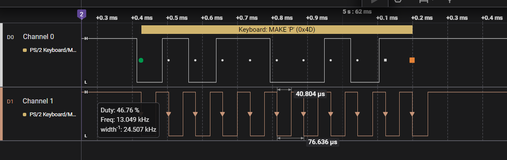

Now, the IDLE state for adapter from hell:

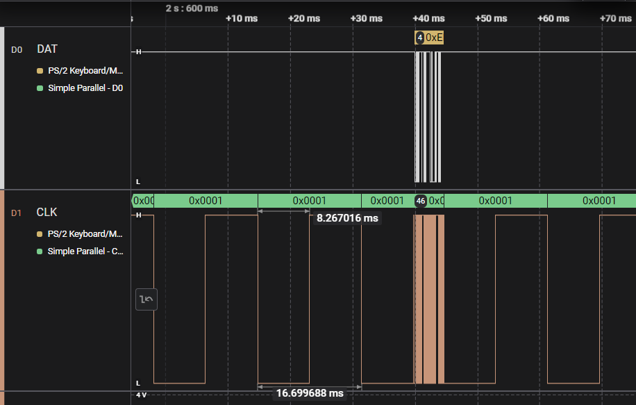

So, yes, the IDLE state for this adapter means a DAT HIGH (its ok), but.... wtf, a CLOCK pulse every time? as you can see this CLOCK pulse is longer than normal CLOCK pulses for PS2 protocol...

Another PS2 to USB Adapter from Aliexpress with a fast 1.8us low pulse (CLOCK LINE):

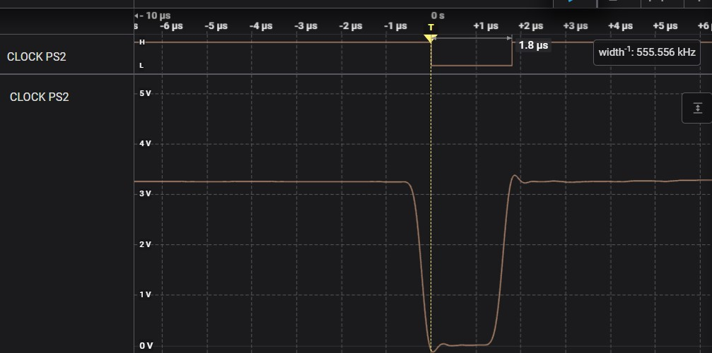

NOTE: These types of "glitches" do not affect the functionality of the PS2 keyboard and the adapter in any way, but they are a problem when creating a generic sniffer.

So, PIO code cant wait for a normal IDLE state like the ps2kbd library does:

https://github.com/lurk101/ps2kbd-lib/blob/master/ps2kbd.pio

```
.program ps2kbd

    wait 0 pin 1     ; skip start bit
    wait 1 pin 1

    set x, 7         ; 8 bit counter
bitloop:
    wait 0 pin 1 [1] ; wait negative clock edge
    in pins, 1       ; sample data
    wait 1 pin 1     ; wait for positive edge
    jmp x-- bitloop

    wait 0 pin 1     ; skip parity and stop bits
    wait 1 pin 1
    wait 0 pin 1
    wait 1 pin 1
```

And one more thing... sometimes a wild very-short-pulse appears in the CLOCK line, look:

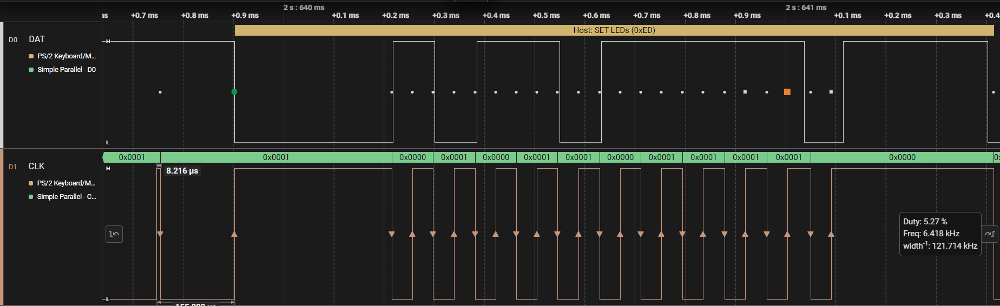

A ~8us pulse! so we have two main problems: a weird long CLOCK every time and short pulses before the real packet....

So, PIO code must be compatible with this adapter, and also with normal PS2 adapters. PIO code + main cores code will be more complex than expected, but it is the only way to make it work with all adapters.

PIO code tasks:
- Track the IDLE state for all adapters (including adapter from hell)
- Track the start state for all adapters
- Track host to keyboard and keyboard to host states & data
- Helper to discard short pulses and long clock pulses

[Current PIO code for PS2](firmware/ps2/rp/okhi.pio)

Note: I just code (very fast) the necessary for the adapter from hell + others. So, the PIO code and main cores code will be improved in the future. And not all PIO code tasks are implemented yet (maybe will be not necessary).

I tested the current PIO + main cores code with different PS2 adapters and it works fine.

# Developers hardware pack

Programming using the implant can be a pain, so I made some hardware PCBs to make it easier.

Pack includes:
- 1 USB sniffer board for developers:

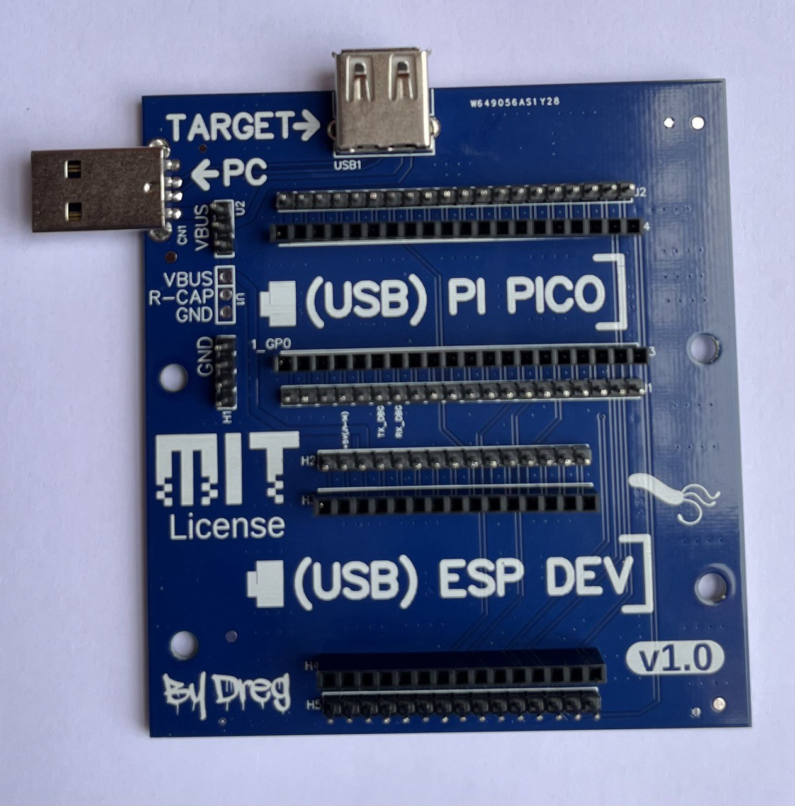

- 1 PS2 sniffer board for developers (this board converts PS2 signals to 3v3 for RP2040 BOARD):

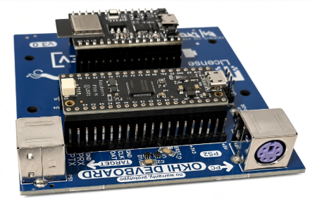

You need buy by yourself:

- 1 RP2040 board with 16 MB of flash, Raspberry Pi Pico form factor (soldered version) + USB cable. **A stock Raspberry Pi Pico will not work**, see the note below

- 1 Raspberry Pi Debug probe (debugger) + USB cable
- 1 ESP8684-DevKitM-1 (soldered version) + USB cable
- 1 kit Dupont cables (Female-Female, Male-Male, Male-Female)

-----

- 3-JST-SH to 3-Female DuPont cable 
- 3-JST-SH to 3-Male DuPont cable 
- 3-JST-SH to 3-JST-SH cable

This combination covers the vast majority of RP2040 boards available online, letting you connect the Raspberry Pi Debug Probe via SWD and UART regardless of the connector type used:

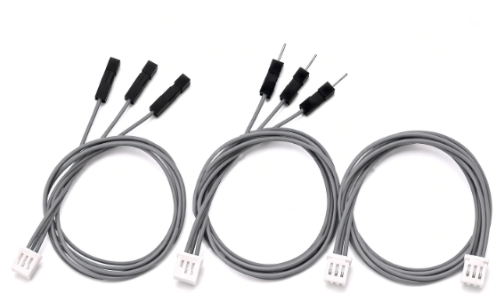

Recommendation: buy a couple of JST-SH sets of each cable so you have spares and avoid losing connectivity during testing or debugging.

-----

- 1 Cheap logic analyzer ~8$ (compatible with Saleae software if possible)
- 1 PS2<->USB adapter
- 1 PS2 male to PS2 male cable (MINI-DIN 6P)
- 1 USB extension cable (optional)
- 1 USB Keyboard (optional)
- 1 PS2 Keyboard (Lenovo on Aliexpress is OK) (optional)

So, this is basically the okhi implant in big format! the PCBs just allow an easy sniffer and interconnection between RP2040 board and ESP32-C2 and the keyboard.

With this setup, you can debug, test, and develop the implant firmware in a more comfortable way.

## About the RP2040 board

A stock Raspberry Pi Pico is **not** enough: it only carries 2 MB of flash, and okhi needs 16 MB. What you need is a board that keeps the same form factor, pinout and GPIO mapping as the Pico, but ships a 16 MB flash chip. Everything else must stay identical, otherwise the firmware and the developer boards above will not line up.

There are plenty of cheap ones on the internet, and many of them come with USB-C instead of micro-USB, which is a nice bonus. The one I use and recommend is the **YD-RP2040** (16 MB version).

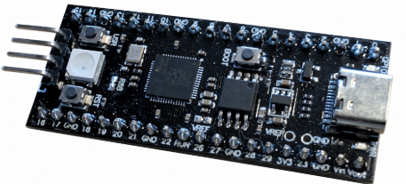

# Extract boards from the female header pins

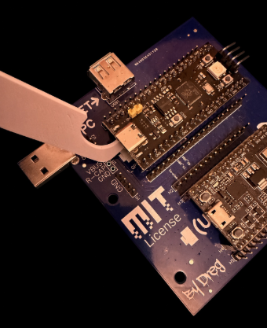

https://github.com/therealdreg/removal_tool_cw308_ufo_chipwhisperer

Use this 3D-printable removal tool for the CW308 UFO ChipWhisperer platform to remove the RP2040 board from the female header pins without damaging either the board or the pins. It is designed to fit the RP2040 board precisely, making it easy to extract it safely from the female headers.

Gently pry up each of the four corners of the board little by little, rotating around the board as you go, until it comes free from the female pins. Do not apply too much force; work slowly and carefully.

[Click here to watch a short video showing how to safely extract the board without damaging it: stuff/images/extractfig.gif](stuff/images/extractfig.gif)

# PS2 & USB keyboard by UART

A serial cable that types. Send `TYPE hello` down a 9600 baud line and the target PC sees a real keyboard type `hello`, over USB or PS/2, with nothing installed on that PC. It is a self-contained firmware for the ATmega32U4, running on a Pro Micro or an Arduino Leonardo, that shares no code with okhi.

**Why this exists, and why it is not a Rubber Ducky.** The usual keystroke injectors, Rubber Ducky and friends, replay a script off a microSD card or over WiFi, and they are judged by one thing only: did the text land in the OS. This board is the opposite instrument. Here it does not matter whether the keys reach the operating system, it matters **how they arrive on the wire**: which of the nine HID report formats carries them, at low speed or full speed, with what polling interval, how long each key is held down, how big the gap between keys is, boot protocol or report protocol, 6KRO or NKRO, which keyboard layout the characters are built from (es-ES or en-US), USB or PS/2. That is the whole point of the tool, fine grained control over exactly those details, so the okhi sniffer can be pushed through every shape a real keyboard can take, one variable at a time.

For a developer this is the automated end-to-end test rig: script the board to type known input into a PC while okhi captures it, then compare what okhi logged against what you sent, all programmatically and repeatably. Full documentation (wiring, flashing, command reference, test suite) is in [firmware/leonardo_uart2keyboard/README.md](firmware/leonardo_uart2keyboard/README.md).

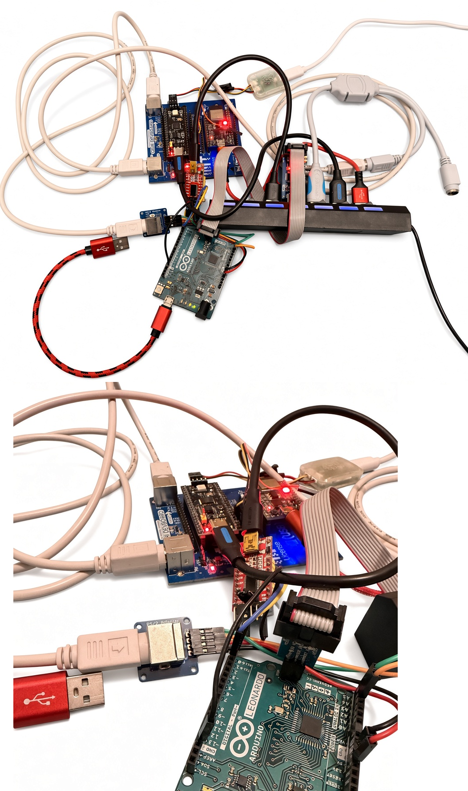

The photo above is one idea of how to wire that end-to-end setup, here in the PS/2 case:

- **Arduino Leonardo (ATmega32U4)** running the `okhi-kbd-avr` firmware, acting as the keyboard that types. In PS/2 mode it drives two GPIO pins into a PS/2 breakout: **D7 = CLK, A7 = DATA, plus GND**. That PS/2 socket is where the okhi PS/2 implant plugs in, so the implant sees a normal keyboard. (This photo predates the pin change and still shows the old A5/A4 wiring. Current firmware uses D7/A7 on both boards.)
- **USBasp clone** on the Leonardo's 2x3 ICSP header (the grey ribbon cable), used to flash and read back the firmware. With this project's fuses the USB bootloader is gone, so USBasp is the only way to program the board.
- **FTDI FT232 USB-to-UART adapter** on the Leonardo's pins 0/1 (adapter TX to board pin 0), 9600 8N1. This is the command channel: the test PC sends `TYPE ...` lines here to make the board type on demand.
- The **okhi PS/2 implant** captures those keystrokes and logs them, and the same PC then pulls the log back over WiFi to check it against what was sent.

Power the Leonardo from its own USB (or an external 5V), not from the UART adapter or USBasp, so each plug test is a real power-on. For USB mode instead of PS/2, skip the PS/2 breakout and let the implant sit between the Leonardo's USB and the host.


The same rig again, rebuilt properly. This one is a **DIY Pro Micro board on perfboard**: it does exactly what the Arduino Leonardo setup above does, but with no Dupont jumpers anywhere. Every connection is soldered underneath in enamelled copper wire, which makes the whole thing far more compact and leaves a much tidier, cleaner setup, one that survives being picked up and moved without a wire working loose.

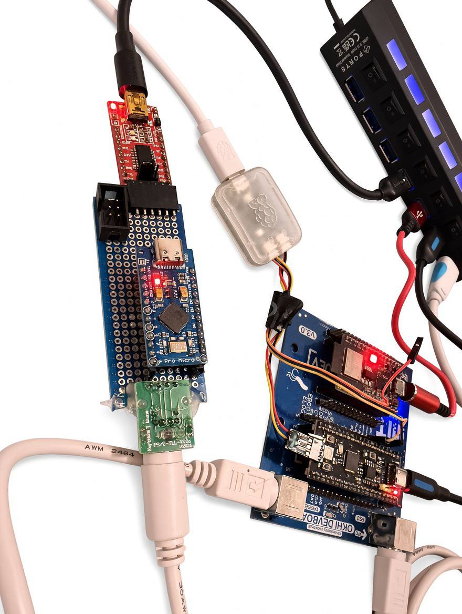

What is on that perfboard, top to bottom:

- **FTDI FT232 USB-to-UART adapter**, the small red board, on the Pro Micro's pins 0/1 (adapter TX to board pin 0), 9600 8N1. The command channel, same as before.
- **A 2x5 ICSP header, added by hand.** A stock Pro Micro has no ICSP header at all, so this one is soldered to the SPI pins on the perfboard. It gives the USBasp a proper connector to plug into instead of clipping jumpers onto pins 14, 15 and 16 every single time you reflash, and since this project's fuses kill the USB bootloader, you reflash over ISP a lot.
- **Pro Micro (ATmega32U4)** running `okhi-kbd-avr`, the board that does the typing.
- **PS/2 breakout**, the small green board at the bottom, carrying the mini-DIN-6 socket. In PS/2 mode the Pro Micro drives **D7 = CLK, A7 = DATA, plus GND** into it, and the okhi PS/2 implant plugs in there exactly as a real keyboard would.

**The pins are not the same as on the Leonardo build.** A Pro Micro does not break out PF0 or PF1, so the PS/2 lines moved from A5/A4 to **D7/A7**. It also leaves out PC7, so the status LED moved to the board's own RX LED on PB0, which is wired the other way round and the firmware inverts it. The one thing genuinely lost is **BUSY** on PD6, which has no pad to reach it. Details in [firmware/leonardo_uart2keyboard/README.md](firmware/leonardo_uart2keyboard/README.md).

To the right of the photo sits the okhi devboard itself with its ESP32-C2 and RP2040, a Raspberry Pi Debug Probe on the SWD header, and a powered USB hub feeding the whole bench.

## Flash RP2040 Board PS2 firmware using Raspberry Pi Debug Probe

- Connect the raspberry pi debug probe SWD + UART to the RP2040 board:


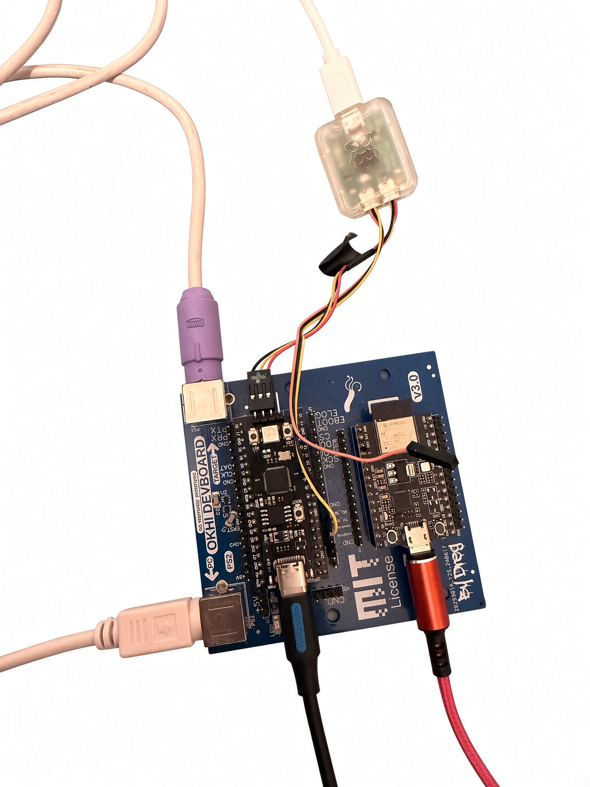

-----

Example PI PICO + Debug Probe:

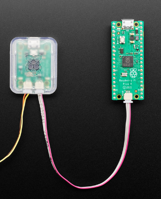

-----

Final setup for PS2 dev SWD + UART debugging:

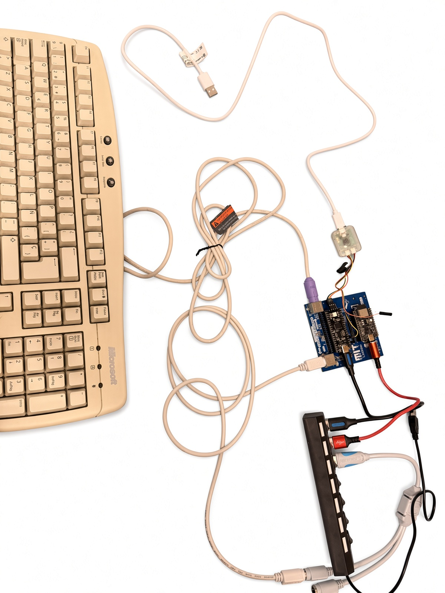

------

Connect the debug probe to the computer using a USB cable. Also connect the RP2040 board to the computer using a USB cable.

Open Visual Studio Code (with the Raspberry Pi Pico extension), open okhi ps2 project, shift+ctrl+p, type ">Tasks: Run Task", press enter, select "Flash", press enter. Done!

## Debugging RP2040 Board PS2 firmware using Raspberry Pi Debug Probe

- The same as flashing, but go to Run and Debug icon (shift+ctrl+d). Select "Pico Debug (Cortex Debug)" and press the green arrow. Done!

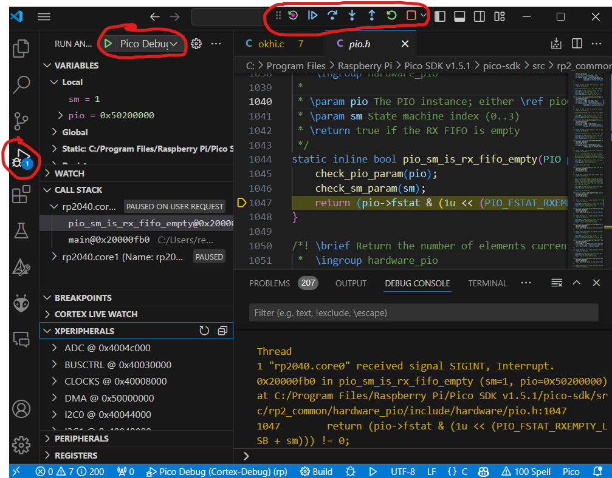

The debugger stops on platform_entry function, At this point, you can set a breakpoint in the main() code, etc...

## RP2040 Board Debug UART Console

Connect GND from USB to 3v3 UART adapter to GND PIN of the RP2040 board.

Connect a USB to 3v3 UART adapter -> RX From adapter to the TX PIN (GPIO 4) of the RP2040 board:

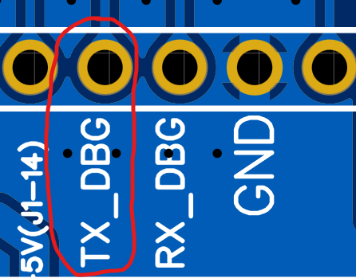

You can use Raspberry Pi Debug probe to debug UART because it has a USB to UART connector:

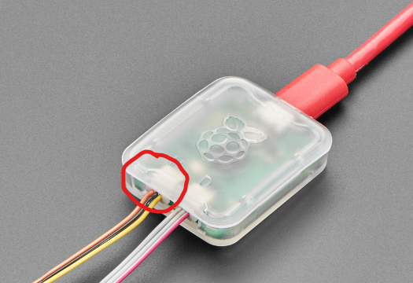

Note: RP2040 board is 3v3, so you need a 3v3 USB to UART adapter.

Open a terminal (putty, teraterm, etc...) and select the COM port of the USB to UART adapter. Set the baudrate to 921600 and done! you can see the debug messages in the terminal.

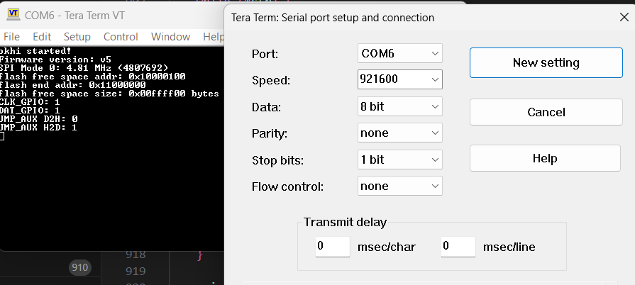

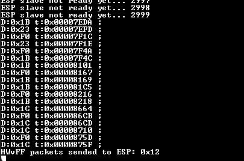

## Flash & Monitor ESP32-C2 firmware using ESP32-C2-DevKitM-1

Install CP210x Universal Windows Driver from Silicon Labs: https://www.silabs.com/documents/public/software/CP210x_Universal_Windows_Driver.zip

Connect the ESP32-C2-DevKitM-1 to the computer using a USB cable.

- Open Visual Studio Code

- Go to File -> Open Folder


- Select the okhi-esp folder: firmware\ps2\esp


- Go to ESP-IDF extension -> Select Flash Method -> UART

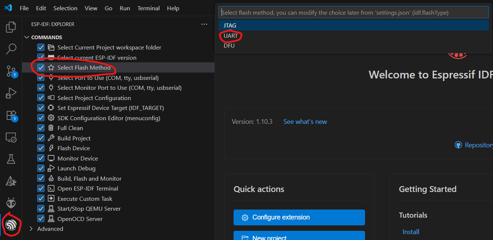

- Open Windows Device Manager to find the COM port of the ESP32-C2-DevKitM-1

- Go to ESP-IDF extension -> Select Port to use (COM,TTY, etc...) and select the correct port

- Go to ESP-IDF extension -> Select Monitor Port to use (COM,TTY, etc...) and select the correct port

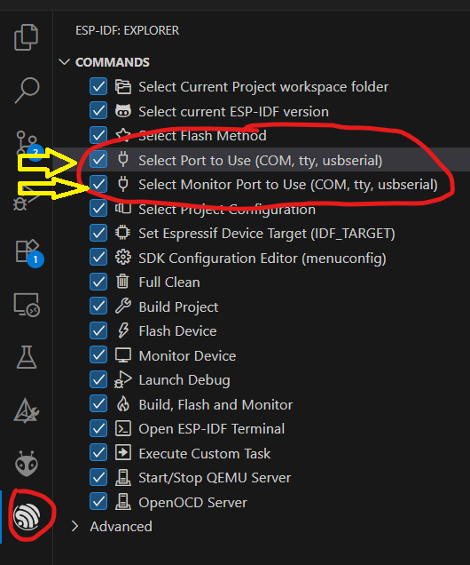

- Click on "Full Clean"


- Click on "Build, Flash and monitor":

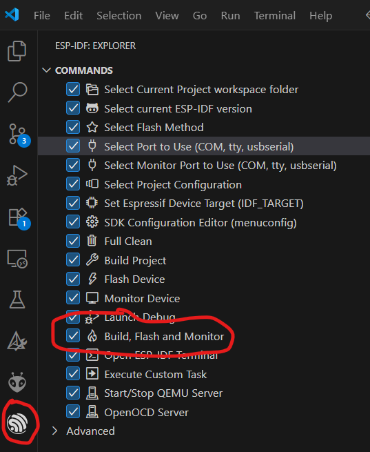

it will take a few minutes... if everything is ok, a message like this will appear in TERMINAL window (bottom):


```
Writing at 0x00070fa3... (85 %)
Writing at 0x00077235... (90 %)
Writing at 0x0007d5a6... (95 %)
Writing at 0x00082fd6... (100 %)
Wrote 485968 bytes (321297 compressed) at 0x00010000 in 7.7 seconds (effective 503.2 kbit/s)...
Hash of data verified.

Leaving...
Hard resetting via RTS pin...
================================= [SUCCESS] Took 18.55 seconds =================================
 *  Terminal will be reused by tasks, press any key to close it.
```

And then the debug UART window should appear

Somtimes is neccesary run a "Erase Flash Memory from Device" after build but before flash, to avoid problems with old firmware in the flash memory. Build the code, whe finish: Press Ctrl+Shift+P, type "> ESP-IDF: Erase Flash Memory from Device" and press enter. After that, you can flash again.


# PS2 male to PS2 male adapter (MINI-DIN 6P)

Instead of a PS/2 male-to-male cable, you can use a PS/2 male-to-male adapter, which is shorter and easier to work with.

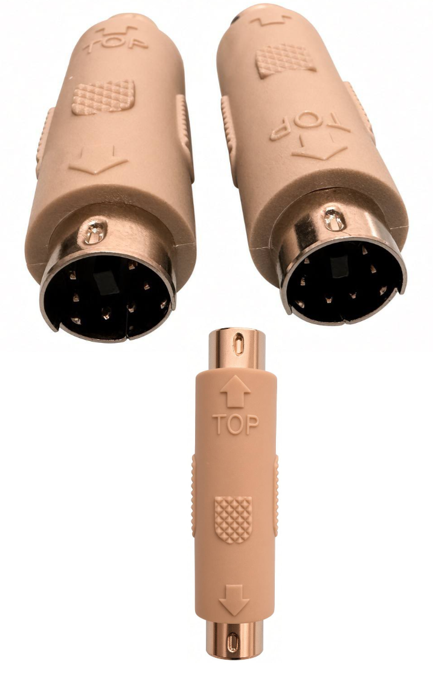

I have only found it for sale at one place, but I find it really handy.

https://cablematic.com/es/productos/adaptador-de-conector-ps2-minidin-6-pin-macho-a-macho-CS015/

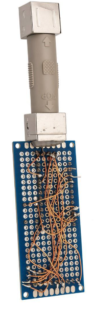

# Passive USB-to-PS/2 Adapters: the keyboard speaks PS/2, not the adapter

You can test the PS2 implant with an ordinary low-speed USB keyboard plugged into an adapter that presents a USB female socket on one side and a PS/2 male plug on the other. These are the inexpensive molded adapters sold under names like "USB Adapter Converter Keyboard Mouse USB Female To PS2 PS/2 Male".

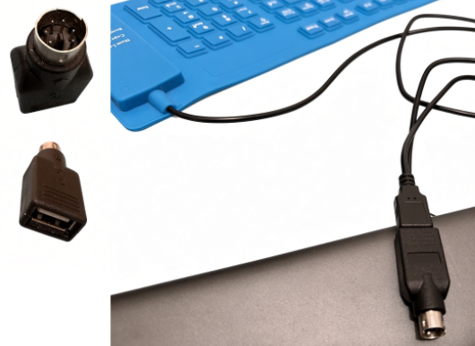

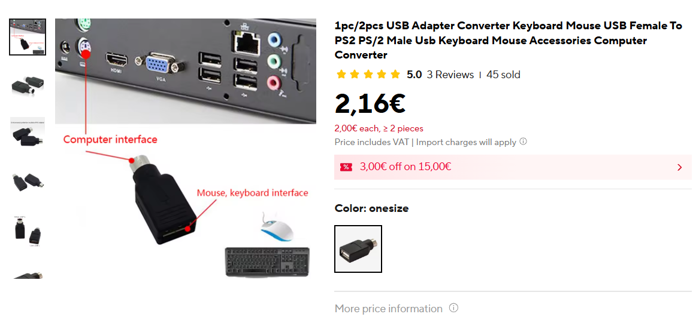

## The adapter is passive: it moves contacts, it does not translate

This adapter does not convert USB data into PS/2 data. It is passive: inside the shell there is no silicon, only four wires that remap the USB contacts onto the PS/2 connector. The conventional wiring is:

| USB Type-A pin | Signal | PS/2 mini-DIN pin | Signal |
| :---: | :--- | :---: | :--- |
| 1 | VBUS (+5V) | 4 | VCC (+5V) |
| 2 | D- | 1 | DATA |
| 3 | D+ | 5 | CLK |
| 4 | GND | 3 | GND |

+5V and GND are shared straight across. USB D+ lands on the PS/2 CLK pin and USB D- lands on the PS/2 DATA pin. Nothing else is present: no microcontroller, no level shifter, no logic.

## Proof: sniff the USB side and you already see PS/2

Plug the low-speed USB keyboard into the adapter, then clip a logic analyzer onto the two data conductors on the USB side, before the adapter.

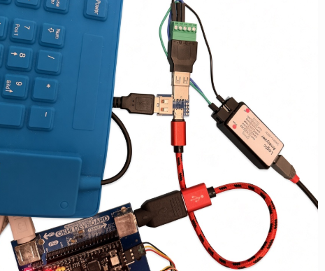

On what are physically the USB D+ and D- wires you will not find USB signaling. You will find PS/2 framing directly: a clock line toggling in the roughly 10 kHz to 16.7 kHz range and a data line carrying 11-bit frames. The keyboard is already speaking PS/2 on those two pins, so the adapter has nothing to translate.

## Why: the intelligence lives in the keyboard, not in the wire

Keyboards and mice from the period when both interfaces coexisted shipped with a dual-mode controller, often called a combo controller, that implements USB and PS/2 in the same chip and selects one of them at power-on. In a combo device the same two physical pins serve as USB D+/D- or as PS/2 CLK/DATA depending on the mode chosen, which is the whole reason a passive adapter can work at all. The controller can tell the two hosts apart because a USB host and a PS/2 host load the two data lines in opposite ways.

**USB host.** A USB downstream port holds both D+ and D- toward ground through 15 kOhm pull-down resistors. A low-speed device then identifies itself by asserting a 1.5 kOhm pull-up from D- to its 3.3V reference (a full-speed device would assert that pull-up on D+ instead). The result is one line raised to a valid high level (around 3V, set by the 1.5 kOhm pull-up working against the host 15 kOhm pull-down) while the other line stays low. Shortly after, the host drives both lines low into the single-ended zero state (SE0, both D+ and D- at ground), and SE0 persisting past a few microseconds is what a device recognizes as a USB bus reset.

**PS/2 host.** A PS/2 port has no pull-downs and generates no USB traffic. Both CLK and DATA idle high, pulled up to +5V through the host pull-up resistors (the exact value is host-dependent, commonly in the several kOhm range). The lines sit at that idle-high level and stay there until a device or the host clocks a frame.

So at power-on the combo controller samples the electrical condition of its two data pins. If it observes the idle-high, pulled-up state characteristic of a PS/2 port and no USB reset or bus activity arrives, it concludes it is attached to a PS/2 host through the adapter. It then reconfigures those same two pins away from the USB transceiver and drives them as open-collector PS/2 CLK and DATA lines, that is, actively pulling each line low and releasing it to the pull-up for the high level. Because the passive adapter connects those pins straight through, the PS/2 waveform appears on the conductors that would otherwise carry USB D+ and D-. That is exactly what the analyzer captures.

The precise detection sequence is vendor-specific. Some controllers key on the presence of the host pull-downs, some on the absence of a bus reset within a timeout, some on the idle voltage level (a PS/2 line can reach +5V while a USB pull-up only reaches about 3.3V). The common principle across all of them is that the two hosts present electrically distinguishable idle conditions, and the controller latches its decision before any keystroke is sent.

## What the implant sees on the wire

Once the keyboard has selected PS/2, the traffic reaching the implant is standard device-to-host PS/2:

- Serial and synchronous, clocked by the keyboard on the CLK line. The keyboard generates every clock edge, including during host-to-device transfers.
- 11 bits per frame: one start bit (always 0), eight data bits sent least significant bit first, one odd-parity bit, one stop bit (always 1).
- Clock in the roughly 10 kHz to 16.7 kHz range, so one bit lasts on the order of 60 to 100 microseconds and a complete frame is roughly 0.7 to 1.1 milliseconds.
- The host can hold CLK low to inhibit the device, and can request host-to-device communication by pulling DATA low after inhibiting the clock, but for a keylogging implant the direction of interest is the device-to-host scancode stream above.

This is genuine PS/2, not USB that has been converted or emulated, so it exercises the implant with exactly the protocol it is built to capture.

## Passive adapter versus active converter: do not confuse them

Two physically similar products exist and they are not interchangeable:

- A **passive adapter**, the kind described here, is a plain connector shell with four wires and no electronics. It works only because the keyboard itself can speak PS/2. Feed it a keyboard that cannot, and nothing comes out of the PS/2 side.
- An **active converter** contains a microcontroller that talks USB to the keyboard on one side and synthesizes PS/2 on the other. It presents a real USB host to the keyboard, so the keyboard stays in USB mode, and the converter is the thing generating PS/2. This one does translate protocols, and the PS/2 you would capture is produced by the converter, not by the keyboard.

For testing the PS2 implant you want the passive adapter, because it delivers untouched PS/2 straight from a real keyboard controller. You can tell the two apart by feel and price: the passive adapter is a small hollow molded plug with no board inside, while an active converter has a visible cable, a housing for the microcontroller, and usually a higher price.

## Consequences worth remembering

- This technique needs a keyboard whose controller still implements PS/2. The dual-mode controller was dropped gradually as PS/2 ports disappeared from motherboards, and most keyboards produced from the late 2000s onward are USB-only. With a USB-only keyboard a passive adapter does nothing, which is why a simple low-speed HID keyboard, the class most likely to still carry a combo controller, is the right choice for this test.
- What reaches the implant is authentic PS/2 with the framing and timing described above, so the passive adapter is a faithful way to drive the PS2 implant with real PS/2 traffic without needing a machine that still has a physical PS/2 port.

# PS2 Captures

Using the Saleae logic software, PulseView, and the pico-ps2-diagnostic-tool, I captured data from a variety of USB-to-PS2 adapters and real motherboards. This data illustrates the differences among these devices, showing that the PIO code must be compatible with them all. The diagnostic tool also allows you to replay the data to the implant to verify its functionality.

All captures are stored in the **stuff/ps2caps** folder. Each capture contains the following keystroke events:

drg[Caps Lock]

Additionally, by pressing [Caps Lock from another keyboard], the PS2 keyboard receives the LED SET event.

## ASUS 970 PRO GAMING/AURA ACPI BIOS Revision 1001

[Download Captures: ASUS 970 PRO GAMING/AURA ACPI BIOS Revision 1001](stuff/ps2caps/asus_970_pro_gaming_aura_acpi_bios_revision_1001.zip)

This board features dual PS2 ports, supporting both a PS2 keyboard and a PS2 mouse:

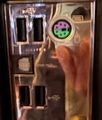

## Adapter from Hell (AMAZON)

[Download Captures: Adapter from Hell](stuff/ps2caps/adapter_from_hell.zip)

This adapter is notoriously difficult to work with due to its erratic behavior. The PIO code and main firmware must be carefully designed to accommodate its quirks.


## Adapter 2 from Aliexpress

[Download Captures: Adapter 2 from Aliexpress](stuff/ps2caps/adapter2_aliexpress.zip)

Although this adapter is somewhat easier to parse, it still presents challenges. Saleae’s Logic software PS2 parser may struggle to decode certain events.


## Adapter 5 from Aliexpress

[Download Captures: Adapter 5 from Aliexpress](stuff/ps2caps/adapter5_aliexpress.zip)

This adapter is one of the most reliable, as it is the easiest to parse. Saleae’s Logic software successfully decodes all events.


# Hardware Design

## USB SWITCH

The latest versions of okhi use the USB SWITCH **TS3USB3000RSER** (Texas Instruments) to protect the USB and PS2 sniffing lines while the RP2040 is powering on. This ensures that no voltage from the device being sniffed reaches the RP2040's sniffing GPIO pins during startup.

This is the current schematic:

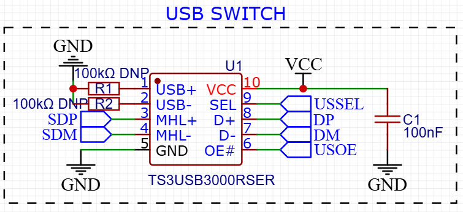

By default, while the RP2040 is powering on, the sniffing lines are routed to USB+ and USB- (where no GPIO is present). This is guaranteed by the TS3USB3000's internal 6 MΩ pull-down on SEL, which selects the USB channel whenever the RP2040 GPIO driving SEL is still high-impedance, and by its power-off protection, which forces every I/O pin to high-impedance while the switch's VCC is absent. Once the RP2040 firmware initializes, it drives SEL high to redirect the sniffing lines to MHL+ and MHL-, which are connected to the GPIO pins of the RP2040. (This assumes the switch's VCC and the RP2040's IOVDD come from the same 3.3 V rail, so they power up together.)

What is the advantage of using this switch? For USB it isn't needed for voltage reasons: the USB data lines D+/D- are 3.3 V logic (Full/Low-Speed) or only ~400 mV differential (High-Speed), never the 5 V of VBUS, so they are already GPIO-safe. The switch's real value is **power-up isolation**: it keeps the sniffing GPIOs disconnected from the target until firmware is ready. If you cannot fit the mini auxiliary 5V→3.3V adapter board and must sniff 5V PS2 directly, the implant can still be used, but be clear on what the switch does and does not do: it protects the *timing* (the GPIO is only connected once the RP2040 is powered and firmware-ready), it does **not** reduce the 5 V level. I strongly advise against directly sniffing 5V PS2 lines with the implant; the switch is not a safe substitute for the level shifter.

This is a high-speed USB 2.0 analog switch, so it is well suited to okhi's role as a USB sniffer (6.1 GHz bandwidth and ~5 Ω on-resistance are far more than USB or PS2 need). One important caveat about 5V PS2: the switch's I/O withstand up to 5.5 V (overvoltage tolerance), so the **switch itself** survives 5 V. But it is a passive pass-gate, not a level shifter, so it passes that 5 V straight through (RON ≈ 5.7 Ω) to the RP2040 GPIO, and 5 V is already above the switch's own recommended analog-I/O range of 0–3.6 V. In short: the switch tolerates 5 V, it does **not** make 5 V safe for the RP2040.

[TS3USB3000RSER Datasheet](stuff/ts3usb3000.pdf)

If you search online or consult forums about "RP2040 5V tolerance" and check the datasheet, the accurate picture is this: **the RP2040 GPIOs are NOT 5V-tolerant.** The datasheet sets the absolute-maximum pin voltage at IOVDD + 0.5 V (§5.2.3.1), only ~3.8 V at a 3.3 V IOVDD, so 5 V is outside the rated range. What people mean when they say it "handles" 5 V is narrower than it sounds: Raspberry Pi engineers have stated on the forums that the ordinary digital pins (GP0–GP25, which have no ESD diode to IOVDD) do *survive* up to 5 V **as an input**, but this is explicitly unqualified/untested, it applies **only while IOVDD (3.3 V) is powered**, it does **not** apply to a pin driven as an output, and it does **not** apply to the ADC-shared pins GP26–GP29 (which do have a clamp diode to IOVDD and must stay within the datasheet). With IOVDD unpowered, those same pins tolerate only ~3.6 V, so applying 5 V before the 3.3 V rail is up back-feeds and over-stresses the chip. And because the failure mode on the tolerant pins is voltage-driven transistor stress rather than current, **a series resistor does not make 5 V safe**. The only in-spec fix is to level-shift 5V PS2 down to ≤3.3 V.

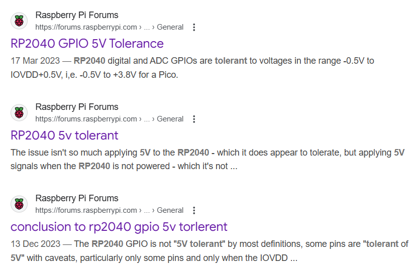

#### Why the forums insist "IOVDD must be present"

That phrase is everywhere, and it is easy to misread as "5 V is fine as long as the board is powered." It is not a green light; it describes a **survival condition**. Here is what is actually going on.

Raspberry Pi's engineers say the non-ADC pins survive ~5 V only while IOVDD (3.3 V) is up, and only ~3.6 V with IOVDD at 0 V. The 3.3 V rail changes what the pin can take for two reasons, both reported by Raspberry Pi engineers and seen in independent testing:

1. The pin's overvoltage tolerance is referenced to IOVDD. With a solid 3.3 V on IOVDD the input transistors are biased to hold off about 5 V; with IOVDD at 0 V the same transistors are over-stressed at about 3.6 V.
2. When a pin sits above IOVDD, current is injected from that pin into the chip. A real, low-impedance 3.3 V rail simply absorbs it. If IOVDD is missing or still ramping, that current has nowhere to go and starts to power the RP2040 "backwards" through the GPIO, an undefined state that can latch-up or degrade the pin.

The trap is timing. In a typical setup the sniffed device's 5 V is already up before okhi's 3.3 V, so at power-on there is a window with 5 V on the pin while IOVDD is still at 0 V, which is the exact damaging case. That window is precisely what the USB switch closes: it keeps the GPIO off the 5 V until firmware (and therefore IOVDD) is up.

So "IOVDD must be present" is a *necessary* condition for the pin to survive, not a *sufficient* one for it to be safe: 5 V is still above the datasheet's IOVDD + 0.5 V maximum, it still applies only to the non-ADC pins as inputs, and a series resistor still will not save it (the failure is voltage-driven, not current). If the board matters, level-shift to ≤3.3 V.

**WARNING**: If the RP2040 loses its 3.3V supply on the IOVDD pins for any reason and a 5V signal is present on the GPIO pins, it could damage the chip. It is strongly recommended to use the auxiliary 5V-to-3.3V adapter board alongside the implant to prevent this issue.

A Raspberry Pi Pico user has reported that after exposing their chips to risky scenarios involving 5V on the GPIO pins, the affected pins still work as inputs but no longer drive as outputs, a classic sign of a permanently damaged output driver. I have not tested this myself, but for input-only sniffing that failure mode would still be usable :)

### Failure scenarios: what the switch protects, and what it doesn't

Being blunt here, because sniffing 5V PS2 directly runs the RP2040 outside its ratings and you should know exactly where the safety net is and where it isn't. Everything below is documented TS3USB3000 behavior; the switch **isolates** lines, it does **not** lower the 5 V. The analysis assumes the sniff path is target → TS3USB3000 → RP2040 GPIO, with the switch's VCC and the RP2040's IOVDD on the same 3.3 V rail.

The one non-ideal path to know about: per datasheet §8.3.3 (Figure 14), if a **D+/D- (common) pin** rises more than 1 V above VCC, a defined leakage path to VCC starts conducting, with I_leak ≈ (V_pin − VCC) / 12 kΩ. At 5 V that is ~0.14 mA when VCC = 3.3 V, and ~0.4 mA when VCC = 0. It is small and current-limited (not a hard short), but it is **not zero**: the switch does not give perfect isolation.

| Scenario | What actually happens | Net result |
|---|---|---|
| okhi off, 5 V on the sniffed lines | VCC = 0 → power-off protection holds the pass-gates in Hi-Z, so the 5 V does **not** pass through to the other throw / the GPIO. The only remaining path is the §8.3.3 leakage into the VCC rail (~0.4 mA at 5 V). | Isolated through the switch; ≤ ~0.4 mA can trickle into the dead 3.3 V rail |
| okhi powering up (3.3 V rising), 5 V present | The internal 6 MΩ pull-down holds SEL low → the common is parked on the USB dead-end and the GPIO (MHL) side stays disconnected until firmware raises SEL, by which point IOVDD (same rail) is already up | GPIO protected during the power-up window |
| okhi loses 3.3 V mid-operation (brownout, yanked cable) | As VCC collapses the switch returns to power-off Hi-Z and pulls the 5 V off the now-unpowered GPIO, exactly the "5 V on an unpowered pin" danger the switch exists to mitigate | Big risk reduction; see caveats |
| Firmware running, sniffing 5 V PS2 directly | SEL is high, the GPIO is connected, and the passive switch (RON ≈ 5.7 Ω) passes the full 5 V straight through to the GPIO, over the RP2040's ~3.8 V absolute max | **Not protected**; only the level shifter fixes this |
| Spike > 5.5 V on the I/O, or 5 V forced onto SEL/OE | Switch I/O and control pins are rated 5.5 V absolute max (the 9 V rating on D+/D- only holds while VCC is powered and OE is high); beyond that the switch itself can be damaged | **Not protected** above 5.5 V |

Honest caveats on the "protected" rows:

- Power-off protection and the leakage figures are characterized for **VCC ≈ 0**. A real brownout can leave the rail at an *intermediate* voltage where neither the switch nor the RP2040 is cleanly powered or cleanly off; that grey zone is not guaranteed by any datasheet, and the ~0.4 mA leakage into a dead rail can leave the RP2040 in an undefined, partially-biased state. Treat the switch as **greatly reducing** the power-loss risk, not as a certified clamp.
- The switch only guards the path **through** it. Any 5 V that reaches the RP2040 by another route is not covered.
- None of this makes steady-state 5 V sniffing "in spec." It runs the GPIO over its absolute maximum, and, per Raspberry Pi's own engineers, a series resistor will not save it, because the failure mode is voltage-driven, not current.

Bottom line: the TS3USB3000 is here to survive the **power-sequencing hazards** (5 V present while okhi is off, powering up, or browning out), and within its specified conditions it does that well. It is **not** a level shifter and does **not** make direct 5 V sniffing safe. For anything you care about, use the 5V→3.3V shifter board below. If you choose to sniff 5 V lines directly without it, you are operating the RP2040 outside its datasheet ratings, and doing so is at your own risk. No guarantee is made or implied.

### Shifter board (5v->3V3)


------


## TCXO +-2.5 PPM for RP2040

The latest hardware revision uses an ATXAIG-H12-F-12.000MHz-F25 as a TCXO (Temperature Compensated Crystal Oscillator). It is much more stable and precise than a typical crystal and helps maintain clock accuracy under variable temperature conditions. Additionally, it does not require external capacitors with values dependent on the thickness and design of the PCB.

[ATXAIG-H12-F-12.000MHz-F25 Datasheet](stuff/ATXAIG-H12.pdf)

The cost of this TCXO is approximately €2.5 compared to €0.1 for a typical crystal. The price difference is justified by the advantages it offers.

This TCXO generates a 3.3V square wave signal at 12MHz, which can be directly fed into the XIN pin of the RP2040 while leaving the XOUT pin disconnected, and it works without any issues.

**NOTE**: The ATXAIG-H12-F-12.000MHz-F25 can directly drive the RP2040’s XIN at 3.3 V, because its CMOS output specifies VOH ≥ 0.9·Vdd and VOL ≤ 0.1·Vdd, while the RP2040 in square-wave input mode on XIN requires VIH ≥ 0.65·IOVDD and VIL ≤ 0.35·IOVDD; with both at 3.3 V, the logic levels are comfortably met (XOUT left unconnected).

**NOTE 2**: The ATXAIG-H12-F-12.000MHz-F25 output timing is specified for a 15 pF CMOS load (5 ns rise/fall time measured at 10%–90% Vdd); heavier capacitive loading will slow the edge.

**NOTE 3**: To preserve the ATXAIG-H12 output behavior assumed in this design, keep the clock trace as short as possible, route it to a single destination only, and avoid adding unnecessary capacitive loading from extra connections, long stubs, or measurement points.

**NOTE 4**: Per the ATXAIG-H12 datasheet, the tri-state control pin (INH, pin 1) must not be left floating: if you are not using the enable/disable function, tie it to Vdd (logic "1") so the oscillator always runs. The datasheet also recommends a ~0.01 µF bypass capacitor between Vdd (pin 4) and GND (pin 2).

Why did I decide to use a TCXO if I already had a good design with a typical crystal? Well, this is an open hardware and open source project, and there will be people who request their own PCBs with different thicknesses or make their own modifications.

And what does that have to do with the crystal?

Let's take a look online:

https://forums.raspberrypi.com/viewtopic.php?t=375990

```
custom RP2040 PCB - crystal does not oscillate
Report this post
Sun Sep 01, 2024 12:42 am

I'm designing PCBs around the RP2040 with KiCAD,
....
I've had a few wins! However, my second iteration
of this one fails to oscillate,
and I cannot figure out why.
....
What changed
The differences between PCB 1 and PCB 2:
- moved the crystal left and up,
but XIN/XOUT lengths changed only slightly
- switched from 1.6mm PCB to 1mm PCB - layer 2/3 dielectric
 thickness from 1.1mm to 0.45mm
- routed +1.1V under XIN/XOUT
...
Again using an online microstrip capacitance calculator,
it's appears that my 0.2104mm dielectric DOUBLES
capacitance relative to a 1mm dielectric.
```

------

If you search online, you will find other users experiencing issues with the crystal they selected, the capacitors they chose, the design of the crystal tracks, the thickness of the PCB, etc.

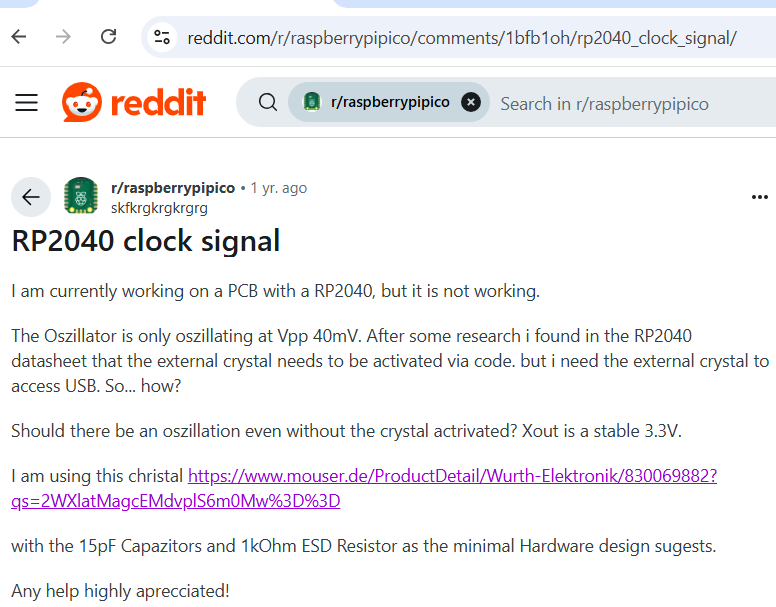

-----

Another issue arises with the pico-sdk, which assumes that the crystal startup time must not exceed a certain duration. Some users have had to modify the `PICO_XOSC_STARTUP_DELAY_MULTIPLIER` in their firmware to allow enough time for the crystal on their custom RP2040 PCB to oscillate correctly, ensuring the firmware operates as expected. This can be problematic because if a user is working with an RP2040 board exhibiting this "problem," they need to be aware of it to adjust the `PICO_XOSC_STARTUP_DELAY_MULTIPLIER` in their firmware for proper functionality.

For these reasons, the RP2040 datasheet and the "Hardware Design with RP2040.pdf" strongly recommend using the Abracon ABM8-272-T3 crystal along with their suggested design, including tracks and capacitors, to avoid all these issues. It seems everything is designed to "encourage" you to use that specific crystal ;-)

(Additionally, in some cases, it is necessary to adjust the `PICO_DEFAULT_BOOT_STAGE2=boot2_generic_03h` and define `PICO_BOOT_STAGE2_CHOOSE_GENERIC_03H 1` for the custom RP2040 board to function correctly)

To ensure the TCXO avoids any of these problems, I added a generous startup delay so that when the RP2040 powers up, the oscillator is fully stable, and there’s no need to adjust the `PICO_XOSC_STARTUP_DELAY_MULTIPLIER`. For typical use as a PS2 and USB keyboard sniffer, this startup delay is irrelevant. Missing a few startup events is not a concern in this context.

This is the current design:

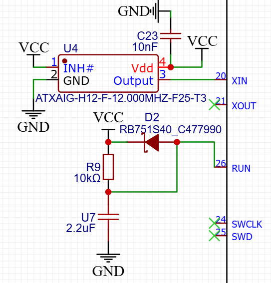

With such a generous delay, if in the future a modder wants to use a slower one, no further modifications will be necessary.

### If you want to keep using a crystal in okhi

If you don't understand why using a typical passive oscilloscope probe of 10pF in 10X on XIN or XOUT is a problem, USE THE TCXO!

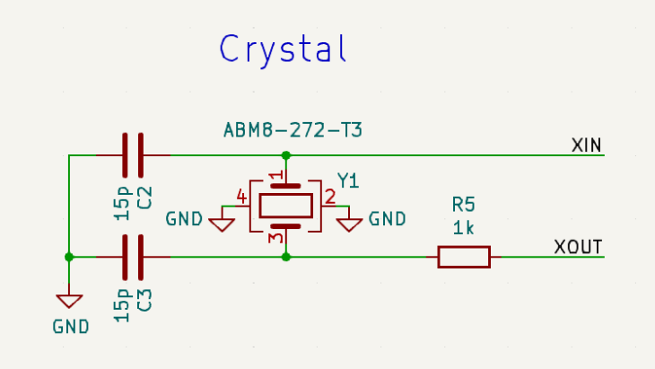

Here are my experiments.

1. **Select an appropriate crystal**: Make sure to choose a crystal that works well with the RP2040 and has characteristics similar to the Abracon ABM8-272-T3.

2. **Adjust the capacitors**: You may need to experiment with the load capacitor values for the crystal you choose. Use a frequency meter to adjust the capacitor values until the crystal oscillates at the desired frequency.

3. **Review the PCB design**: Ensure that the crystal tracks are designed correctly and that there is no interference from other signals. Keep the tracks as short as possible and avoid crossing other traces.

Adjust the 1k resistor specified in the "Hardware Design RP2040.pdf" to suit the crystal you have selected and the specific design of your PCB. Ensure the resistor value aligns with the crystal's requirements and the overall circuit design to achieve optimal performance.

Additional considerations for crystal selection include:

- **Load Capacitance**: Ensure the load capacitance matches the specifications of the crystal. Incorrect values can lead to frequency deviations or startup issues.

- **Maximum ESR (Equivalent Series Resistance)**: Choose a crystal with an ESR within the acceptable range for the RP2040. Higher ESR values can prevent the crystal from oscillating reliably.

- **Resistor to Prevent Over-Driving**: Include a series resistor to limit the drive level of the crystal. This prevents over-driving, which can damage the crystal or reduce its lifespan.

Properly addressing these factors ensures the crystal operates reliably and within its intended specifications.

If the crystal takes time to start, modify PICO_XOSC_STARTUP_DELAY_MULTIPLIER.

Here are the 12MHz crystals I have tested and found to work in earlier versions of okhi with a 6-layer PCB (0.8mm thickness):

- **ABM8-272-T3**: (okhi 15-18pF) Always use this one whenever possible.
- **X322512MSB4SI**: (okhi 27-33pF) Popular for the RP2040 and used in the Bus Pirate v5, but you need to know what you're doing.
- **ABM8-12.000MHZ-20-B1U-T**: (okhi 30-33pF) Worked in my prototypes and stress tests (what boredom can lead to, haha). I do not recommend it.

Note: I know that some crystals I have tested are outside the recommendations for the RP2040, such as MAX ESR, etc., but I wanted to test if they worked in my units after properly characterizing everything.

Here are some results from the first tests I conducted (ignoring the crystal's startup time and **focusing solely** on fine-tuning the frequency to 12MHz):

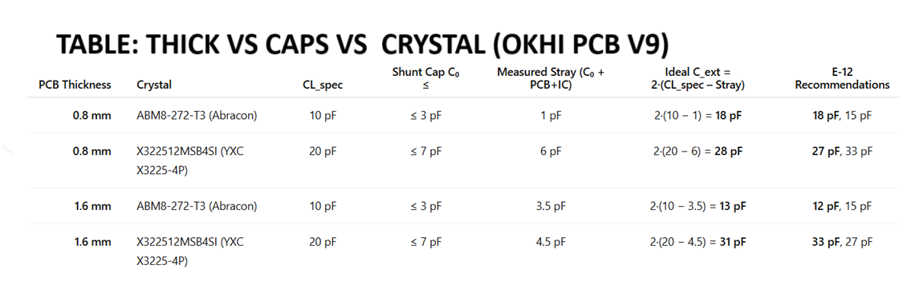

In some cases, it may be necessary to compromise on exact frequency to ensure a faster startup. As a designer, you must evaluate what is best for your specific use case of the board.

**WARNING**: just because a crystal you have purchased for your board, with certain capacitors, operates at a very precise frequency does not mean that this is the best capacitor value for your PCB. keep in mind that crystals have a tolerance, and each unit is slightly different. you must account for this tolerance and know how to measure the actual capacitance of your PCB design.

How can I measure the crystal of okhi/own RP2040 board with an oscilloscope in a "cheap," safer, and more precise way? I have used a 1.3 GHz FET Probe.

https://hackaday.io/project/184924-diy-13-ghz-fet-probe
https://lectronz.com/products/-1300-mhz-fet-probe

A 1.3 GHz active scope probe with FET input and very low input capacitance (about 0.3 pF):

- AC coupled
- Minimum frequency: 100 kHz
- Attenuation: 1:10 (1:20 with 50 Ohm termination)
- Supply: 5V through u.Fl
- Reverse voltage protection
- Output through u.Fl
- Can be soldered directly to the device under test for minimal lead inductance

Since the load is minimal, only a few pF, it is safer. Here's a photo of my setup:

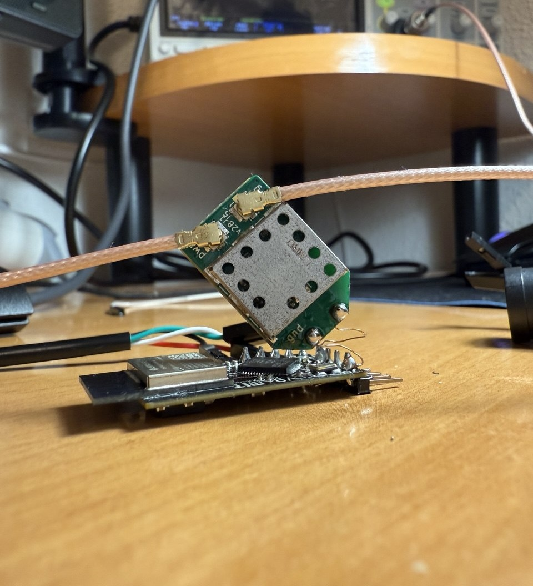

With the oscilloscope, I usually measure whether I am overloading or underloading the crystal, how long it takes to start, and if I notice any irregularities in the waveform.... don't just focus on the frequency.

Another tool I created to measure the frequency of my okhi RP2040 boards is a project called pico-freq-meter-tcxo-ref.

https://github.com/therealdreg/pico-freq-meter-tcxo-ref

Essentially, it uses a PICO along with an external reference signal that shares the same TCXO as the new OKHI boards (12MHz) to compare it with the crystal signal on the external implant. The crystal signal is extracted through a pin as a 3.3V square wave signal (clock_gpio_init + CLOCKS_CLK_GPOUT0_CTRL_AUXSRC_VALUE_XOSC_CLKSRC). This setup allows one of the OKHI pins used for sniffing to provide the clock signal without interfering with the original crystal, making it highly effective for fine-tuning the board's capacitors.

Since the latest OKHI boards include a TCXO, I created firmware for these implants that performs the same function as the pico-freq-meter-tcxo-ref.

This allows you to use an OKHI TCXO implant to adjust the capacitors of the crystals on your RP2040 boards.

Steps to measure the crystal of an OKHI implant using an OKHI TCXO implant:

1. Flash the following firmware onto your OKHI target board with a crystal installed: https://github.com/therealdreg/okhi/tree/main/stuff/clock/build/clock.uf2

2. Flash the firmware for the TCXO implant onto your OKHI target board: https://github.com/therealdreg/okhi/tree/main/stuff/pico_clock_calc/build/pico_clock_calc.uf2

3. Connect the TCXO implant to the appropriate pins on your OKHI target board.

4. Power both the OKHI target board and the TCXO implant.

Connect via USB using teraterm to TCXO implant.

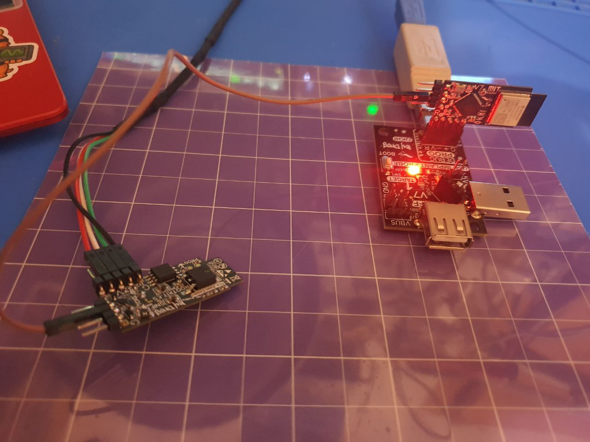

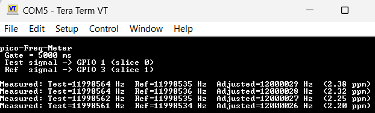

If at this moment we slightly increase the pF of the crystal's capacitors, we will get closer to 0, and if we go too far, it will result in a negative value. If we reduce the pF, the value will be higher. The idea is to stay close to (0 ppm).

-------

#### Example with ABM8-272-T3

ABM8-272-T3 **8pF** caps okhi-6-layer thick 0.8:

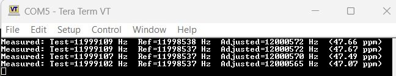

ABM8-272-T3 **15pF** caps okhi-6-layer thick 0.8:

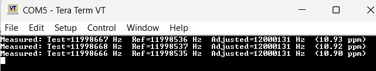

ABM8-272-T3 **18pF** caps okhi-6-layer thick 0.8:

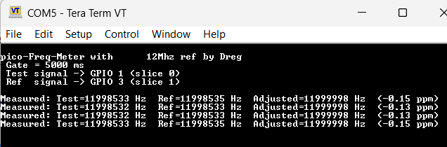

---------

#### Example X322512MSB4SI 33pF: 0.8 thick vs 1.6 thick

X322512MSB4SI **33pF** caps okhi-6-layer thick **0.8**:

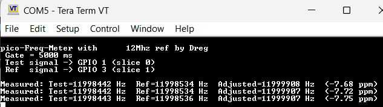

X322512MSB4SI **33pF** caps okhi-6-layer thick **1.6**:

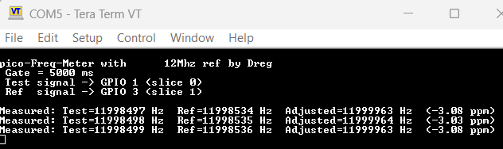

The same: crystal, PCB design, capacitors, and number of layers were used, but the difference in PCB thickness resulted in varying ppm values: ~-7.6 ppm versus ~-3.0 ppm (**~4.6 ppm difference**), highlighting the impact of thickness.

---------

**WARNING**: The startup time of the crystal is just as critical as its frequency! In some cases, it may be necessary to force certain crystals to operate, which could potentially reduce their lifespan, to ensure they start within the required delay at the specified frequency.

Note for your final design: If the TCXO has a maximum error of ±2.5 ppm and the tested crystal measures ±10 ppm, the worst‑case combined error is ±12.5 ppm. (The ±2.5 ppm is the TCXO's temperature-stability spec, the dominant term at roughly constant room temperature; its full accuracy as a reference also carries ~±1–2 ppm initial tolerance and ~±1 ppm/yr aging, so budget a few ppm total. Adding the reference error to the crystal's ±10 ppm tolerance as a worst‑case linear sum gives ±12.5 ppm; the statistical combination is RSS ≈ √(2.5² + 10²) ≈ 10.3 ppm, and ±12.5 ppm is the conservative bound on how well you know the finished board's frequency.)

Important: calculation using TCXO calc firmware applies only to the specific crystal unit and PCB used in the test. If you obtain the same crystal model from a different batch, the capacitor selection and ppm calculation from the tested unit may no longer be valid. Always measure the actual crystal on your own PCB and adjust capacitors or calculations accordingly; do not assume results transfer unchanged between different units (or different PCB thicknesses/designs).

We are only characterizing this specific unit with these specific components!

Which capacitor values should you use? Choose the value that centers the crystal’s frequency (i.e., brings it closest to the target) whether you test a worst‑case or best‑case crystal. That value is the ideal one to use.

Assess whether the TCXO's 2.5 ppm frequency meter tool error meets your requirements. If your crystal has an error of ±10 ppm, the combined error from this methodology may still be acceptable for your application.

For instance, if I use a TCXO with an error margin of ±2.5 ppm and a crystal with an error margin of ±10 ppm, the combined error would amount to ±12.5 ppm. This level of error is easily acceptable for the RP2040: USB full-speed tolerates ±2500 ppm, so ±12.5 ppm is roughly 200× inside spec. Therefore, it doesn’t matter which batch the crystal comes from, whether it represents the worst-case or best-case scenario. The capacitance (pF) of the capacitors selected for that specific unit can still be used in the final design without causing significant issues.

Ensures your oscillator is **robust at startup**, not just accurate in ppm. In a Pierce oscillator the MCU provides **negative resistance**; you want enough margin over the crystal’s **ESR** so it still starts across temperature, voltage, and part variation. To quantify that margin populate the series damping position between **XOUT** and the crystal with **increasing SMD resistor values** (e.g., 33 Ω → 68 Ω → 100 Ω → 150 Ω → 220 Ω → 330 Ω …), **power-cycle after each swap**, and record the **smallest value where startup fails** (**R\_FAIL**). Estimate the available negative resistance as $|R_{neg}| \approx R_{FAIL} + ESR_{crystal}$ and compute the **safety factor** $S_f = |R_{neg}|/ESR$; target **$S_f \ge 5$** for MHz crystals (ST AN2867 uses $\ge 5$ for MHz and $\ge 3$ for 32 kHz; some vendors, e.g. TI, want up to ~10 for extra startup margin). **Important:** if the board keeps a permanent series drive-limiting resistor $R_{ext}$ in that same XOUT position, that resistor is loss in the loop too, so per ST AN2867 (§3.5.3) you must fold it into the ESR and judge the shipped circuit with $S_f = |R_{neg}|/(ESR + R_{ext})$, not the bare-crystal figure. If margin is low, reduce the series resistor and/or trim the load caps slightly to recover gain. As a final sanity check, verify the **drive level** is within the crystal’s µW rating; one common approximation is $DL \approx ESR \cdot I_{RMS}^2$ (measure or infer the current), ensuring you’re not over-driving the unit. This simple swap-and-cycle method is standard in vendor notes and gives you a concrete, repeatable pass/fail criterion for startup robustness.

#### Example: choosing \~1 kΩ by startup-margin sweep

**Setup.** RP2040 + 12 MHz crystal (ESR≈50 Ω), 3.3 V, load caps \~12 pF. We place a **series resistor at XOUT→crystal** and power-cycle after each swap.

| Series R at XOUT | Starts? | Cold start time (ms) |
| ---------------: | :-----: | -------------------: |
|            220 Ω |    ✅    |                  0.25 |
|            330 Ω |    ✅    |                  0.35 |
|            470 Ω |    ✅    |                  0.45 |
|            680 Ω |    ✅    |                  0.52 |
|       **1.0 kΩ** |    ✅    |                  0.65 |
|           1.5 kΩ |    ✅    |                  0.80 |
|           2.2 kΩ |    ✅    |                 1.3 |
|           3.3 kΩ |    ✅    |                 2.3 |
|           3.9 kΩ |    ✅    |                 3.0 |
|       **4.7 kΩ** |    ❌    |                  n/a |

* Smallest value that **fails** to start: **R\_FAIL ≈ 4.7 kΩ** (the true threshold is somewhere between the 3.9 kΩ that still started and 4.7 kΩ, so treat it as ~4–5 kΩ, not an exact number).
* Estimate the oscillator's negative-resistance magnitude:

$$
|R_{neg}| \approx R_{FAIL} + ESR \approx 4700 + 50 \approx 4.75\ \text{k}\Omega
$$

* **Bare-crystal safety factor** (crystal-selection margin, no series resistor in the loop):

$$
S_f = \frac{|R_{neg}|}{ESR} \approx \frac{4750}{50} \approx 95
$$

That 95 describes the **bare crystal only**. The shipped board keeps a **1.0 kΩ drive-limiting resistor in the same XOUT position**, and per ST AN2867 (§3.5.3) that resistor adds to the ESR when you judge startup, so the margin that actually describes the production board is:

$$
S_{f,\text{eff}} = \frac{|R_{neg}|}{ESR + R_{ext}} \approx \frac{4750}{50 + 1000} \approx 4.5
$$

So the honest number for the shipped board is **~4.5**, right around AN2867's $\ge 5$ target for MHz crystals, **not** 95. This is also exactly *why* the RP2040 oscillator is famously fragile: the same 1 kΩ that protects the crystal from over-drive eats most of the startup margin, so a little extra stray capacitance (thick PCB / thin dielectric) or a higher-ESR crystal can push it below the startup threshold. The sweep confirms **this** unit still starts with far more than the 1 kΩ actually used, so ~1.0 kΩ is a reasonable compromise between drive-limiting and startup margin, but characterize your own board: Raspberry Pi does not publish the RP2040 oscillator's transconductance or negative resistance ([pico-feedback #351](https://github.com/raspberrypi/pico-feedback/issues/351)), so there is no datasheet figure to lean on. If you want a clean $S_{f,\text{eff}} \ge 5$, drop the series resistor a little (checking drive level stays in spec) or use a lower-ESR crystal.

**Drive-level sanity check (example).** Measure the crystal current with a current probe in series with the crystal (AN2867 §3.5.2). If that gives about **I\_RMS ≈ 1.2 mA**:

$$
DL \approx ESR \cdot I_{RMS}^2 \approx 50\,\Omega \cdot (1.2\,\text{mA})^2 \approx 72\,\mu W
$$

well within the ABM8-272-T3 drive-level range of **10–200 µW** (200 µW max). If your measured current is higher, increase the series resistor (re-check startup and DL).

**What if your R\_FAIL is low?**
If you find **R\_FAIL ≈ 1.2 kΩ**, then |R\_neg| ≈ 1.25 kΩ and picking **1 kΩ** sits right on the cliff: with the 1 kΩ in the loop the effective $S_f = 1250/(50+1000) \approx 1.2$, i.e. barely oscillating. Improve margin by **reducing load caps** slightly and/or **lowering losses** (smaller series R), then re-run the sweep until the *effective* $S_f = |R_{neg}|/(ESR + R_{ext}) \ge 5$.

> We verified startup robustness by sweeping the **series resistor at XOUT** until oscillation failed (**R\_FAIL ≈ 4.7 kΩ**). With crystal **ESR ≈ 50 Ω** the oscillator negative resistance is **|R\_neg| ≈ 4.75 kΩ**. The *bare-crystal* safety factor is ~95, but with the shipped **1.0 kΩ** drive-limiting resistor kept in the loop the **effective** safety factor is **|R\_neg|/(ESR + R\_ext) ≈ 4.5** (AN2867 §3.5.3), around the ≥5 target, adequate and empirically confirmed, not the 95 the bare figure suggests. We kept **1.0 kΩ** as the compromise between drive-limiting and startup margin, characterized per board since the RP2040 oscillator gain is not published.

After finalizing the PCB design, validate the crystal oscillator thoroughly. Confirm the chosen crystal frequency matches the firmware/clock requirements and use the manufacturer's recommended load capacitance (accounting for PCB stray capacitance). Verify the crystal's ESR and any recommended series or damping resistor so the drive level is safe and the oscillator is stable. Follow layout best practices: short, symmetric traces to the MCU, place load capacitors as close as possible to the crystal pins, use a solid ground plane, and avoid noisy signals nearby. Finally, validate on the bench with an oscilloscope and an active probe: check frequency, waveform shape and amplitude, startup time, and look for spurious or unstable oscillation modes. Compare each measurement against the crystal datasheet to ensure the design meets specs.

Now do you see why it’s better to use a TCXO instead of a regular crystal? It saves you a lot of trouble and headaches. And it also provides you with a TCXO frequency meter with an error of ±2.5ppm to measure crystals on your own RP2040 boards.

Thanks to Carlos (@EB4FBZ) for his feedback on my work with crystals and TCXO.

## Heat and Cold Testing for the Crystal and PCBs with TCXO

One thing I like to do is test the crystals and PCBs with a TCXO under different temperature conditions. This helps me understand how the components behave in extreme situations and ensures they function correctly in a variety of environments.

I use a spray to quickly cool the electronic components and a heat gun to test their behavior at high temperatures.

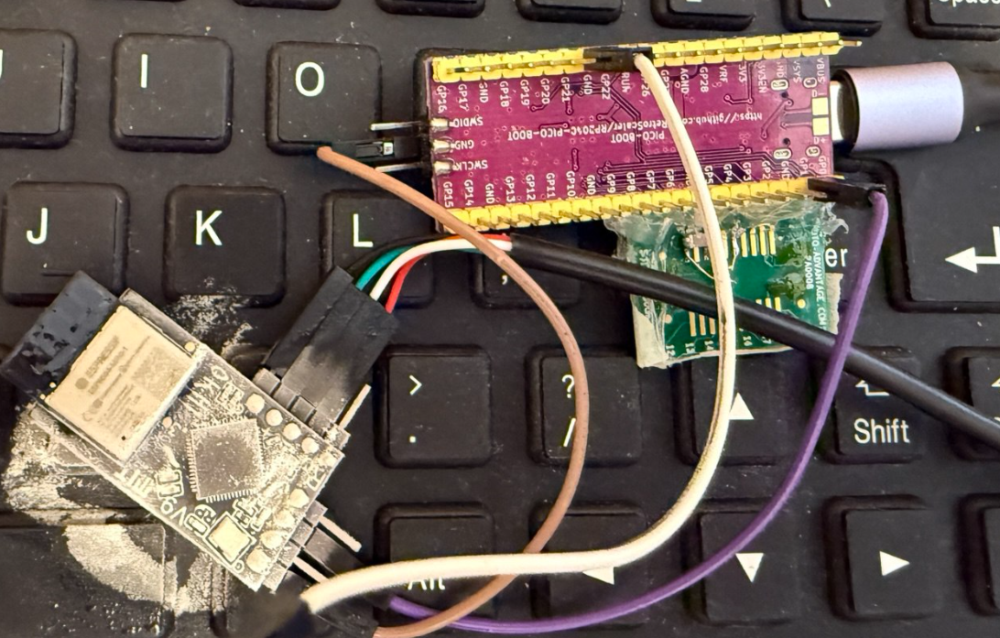

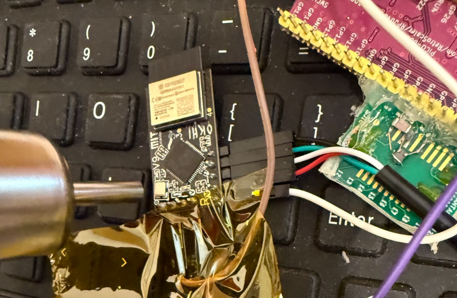

And with the infrared thermometer in hand, I checked the temperature ranges at which the units I had at home stopped functioning. I progressively heated and cooled the units slowly, measuring the temperature and observing that everything continued to function properly across many units. This allowed me to get a better idea of how well the product performs under varying conditions.

I also ensure at what temperatures, both in cold and heat, the unit powers on and functions properly.

I know my methodology is not the best, but with the tools, knowledge, and resources I have, it is the best I can do

------

# Power consumption (measured with a Nordic PPK2)

I profiled okhi's real power draw with a Nordic Power Profiler Kit II (PPK2) in Source Meter mode, feeding the implant 5 V and logging its current at 100 kS/s for 10 s. This was a worst case, everything on run: during the capture I was associated to okhi's WiFi and typing on the keyboard while watching the keystrokes live in the web interface, so the RP2040 sniffer and the ESP32-C2 radio were both fully active the whole time. These are okhi's own numbers, close to the roughly 120 mA nominal quoted at the top of this README, and a keyboard being sniffed draws its own current on top of them.

| Measurement | Value |
|---|---|
| Baseline (very stable) | about 100 mA |
| Mean over the run | 107 mA (about 0.54 W at 5 V) |
| Peak | 430 mA (about 2.1 W at 5 V) |
| Consumption | about 107 mAh per hour |

The draw is not flat. On a rock steady 100 mA baseline the ESP32-C2 fires short current bursts while it transmits over WiFi, reaching 430 mA and lasting up to about 6 ms. Those bursts are only a few percent of the time and about 10 percent of the total charge, but they are the whole story for powering okhi, because they are when the implant is most sensitive to a weak supply. For scale, the 107 mA average is only about a fifth of a USB 2.0 port's 500 mA budget and dissipates only about half a watt, low enough that heat is not a concern even when the implant is concealed inside a keyboard. As a steady load okhi is light; the catch is the peaks and the supply path, not the average.

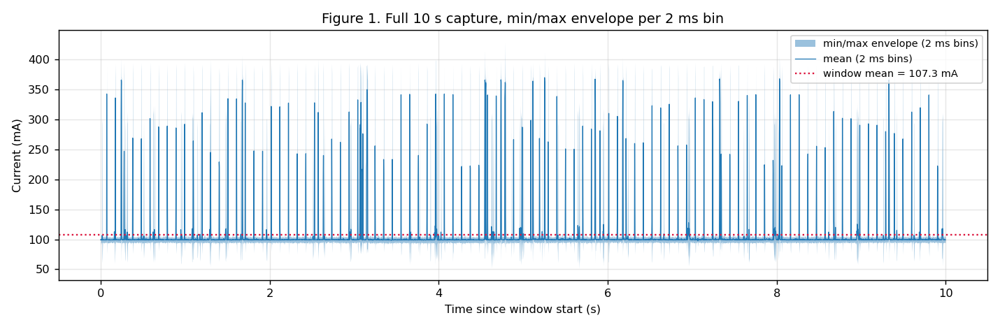

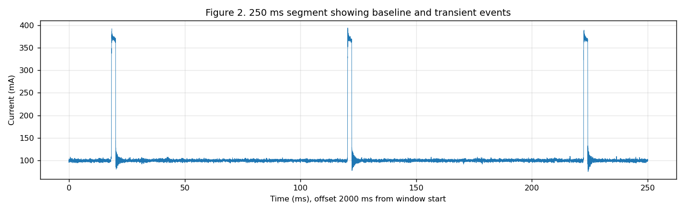

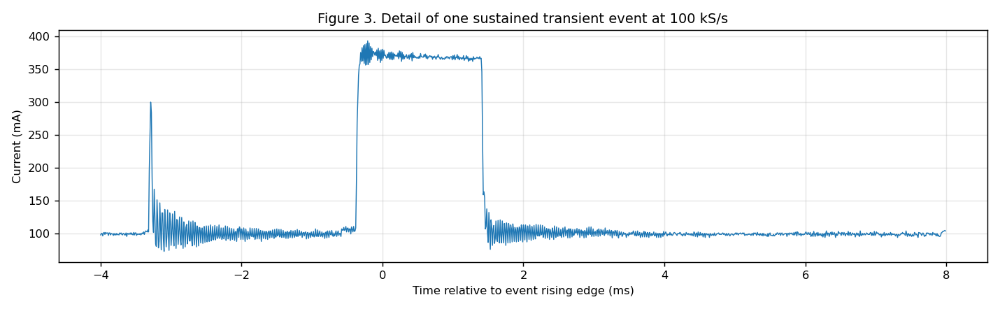

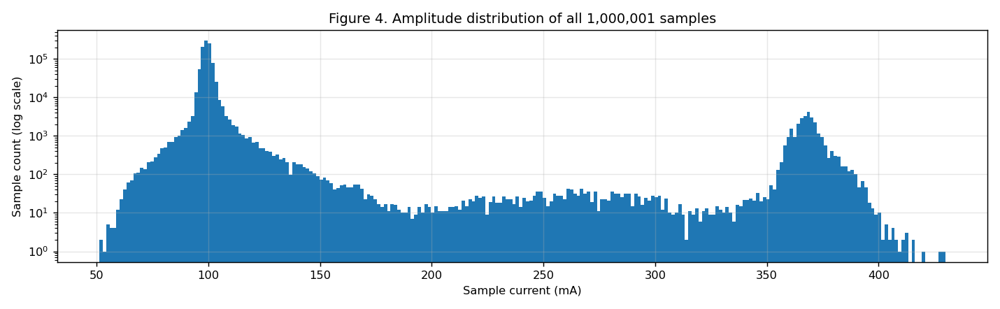

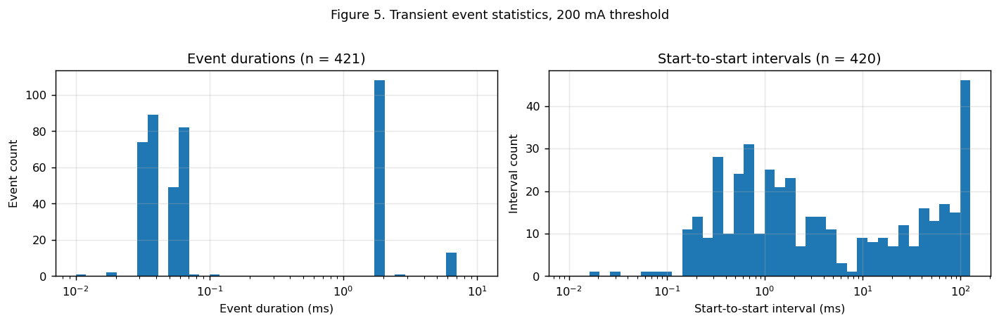

Powered from a battery instead of the cable, the same average sets the runtime: at 107 mA, a USB power bank good for about 2000 mAh at its 5 V output runs okhi for roughly 18 hours, or about 9 hours per 1000 mAh. Keep in mind that power banks are rated at the 3.7 V cell, so their real capacity at 5 V is lower than the printed number.

Power-on inrush: the full session was recorded from the instant the supply was switched on, so it also caught the turn-on transient that the 10 s table leaves out. At power-on okhi draws one brief inrush spike peaking at about 680 mA, roughly 1.6 times the steady WiFi peak and about six times the average, but it lasts under half a millisecond and carries almost no charge. That surge is normal and benign, just the board's input capacitance charging at switch-on, the kind any powered device produces and smaller than the inrush of many USB peripherals. The board then sits at only about 45 mA for the first few seconds while it boots with the radio not yet transmitting, and climbs to the roughly 100 mA baseline with WiFi bursts once the radio comes up. That inrush is the highest current the whole supply path ever sees, so a very weak cable could struggle to start okhi cleanly at plug-in, but it is far too short to be the running concern; the sustained WiFi bursts are. It was measured under the PPK2's controlled turn-on, so a hard hot-plug into a live USB port may look different.

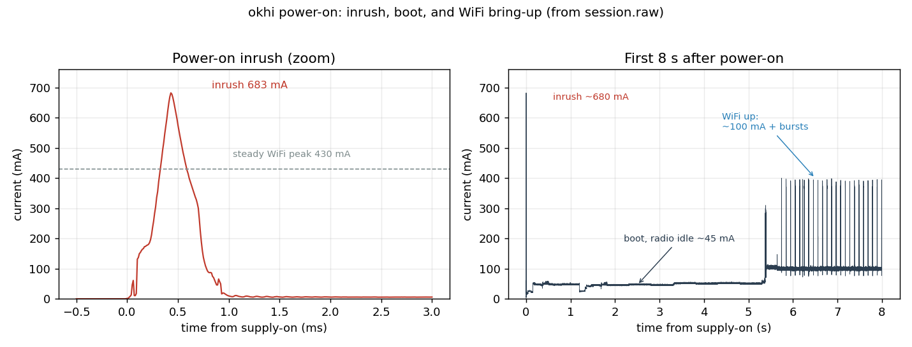

Instrument note: the table is steady-state operation with everything running; the power-on transient is covered just above. In this current range the PPK2 is specified to about plus or minus 15 percent typical, so treat these as solid relative figures rather than lab grade absolutes. Raw data: [ppk2 session](stuff/ppk2-20260720T082307.ppk2) and [CSV export](stuff/ppk-20260720T082257.csv).

## Powering okhi inside a real keyboard: what can go wrong

The real install is invasive: you open the target keyboard and solder okhi straight onto the USB lines where the cable lands on the keyboard PCB, tapping VBUS and GND for power and D+ and D- for sniffing at the same spot. That landing is the far end of the keyboard's own captive cable, the lowest-voltage point in the whole path, and the keyboard current and okhi current both flow through that cable. So okhi inherits the full voltage drop of the cable, and you do not get to choose a better tap near the PC: whatever cable the keyboard ships with is the cable okhi lives behind.

**The realistic scenario.** You buy some random cheap keyboard off Amazon or AliExpress to implant. It has a 1.5 to 2 m captive cable made of the thinnest wire the factory could get away with (a 28 or 30 AWG power pair), and okhi ends up soldered at the far end of exactly that cable. If the target then runs the keyboard through a cheap hub or extension, that only piles more drop on top. Two separate things can go wrong.

**1. The captive cable eats voltage exactly when okhi needs it.** Thin wire has real resistance, and the drop is the current times the round trip resistance of the cable (out on VBUS, back on GND). A cheap 2 m 28 AWG captive cable, plug included, is roughly 1 ohm round trip; a keyboard with a short, thick cable is a fraction of that. okhi's WiFi bursts pull 430 mA, so about 0.4 V vanishes in a 1 ohm cable on every burst, and because okhi is soldered at the far end it sees the worst of it. Add a power hungry backlit or RGB keyboard sharing the same wires and the implant can be down near 4.3 V during bursts. okhi makes its own 3.3 V on board and needs some headroom to ride through those sharp bursts, so when you starve it the ESP32-C2 browns out and resets, or WiFi drops and stutters. Because it only misbehaves during WiFi traffic, it looks like a flaky firmware bug when it is really the host keyboard's cable.

**2. The current budget.** The keyboard and okhi share whatever the port can give. okhi averages about 107 mA, which is nothing behind a plain keyboard, but a modern RGB, backlit, or gaming keyboard can already pull several hundred mA by itself, and keyboard plus okhi can cross 500 mA. That number matters because 500 mA is the classic USB 2.0 per-port budget. A modern PC is more generous: a USB 3.x (SuperSpeed) port is specified for up to 900 mA per port, and dedicated charging ports (USB Battery Charging) offer up to 1.5 A, while USB-C ports advertise 1.5 A or 3.0 A at 5 V, so on a current machine a combined draw approaching 900 mA is well within spec and not unusual. The tight case is an old USB 2.0 port, an unpowered hub, or some laptop ports: there, keyboard plus okhi crossing 500 mA can make the host trip its over-current protection and cut power to everything, so you lose the keyboard and the implant at once. Size the install for the weakest port the target might actually use.

**What to actually do.**

- The target keyboard's own captive cable is the single biggest factor, because soldering inside leaves okhi stuck at the far end of it with no better tap available. Favor a keyboard with a short, reasonably thick cable and avoid the ones with a long, hair-thin cable.
- Solder VBUS and GND right at the pads where the cable lands, and keep okhi's own leads short and of a decent gauge so you do not stack extra resistance on top of the cable.
- Verify before you close it up: with okhi soldered in, power the keyboard, open the web interface, and measure VBUS at okhi's pads while it transmits. Near 5 V with only a small dip is fine; sagging toward 4.4 V or dipping hard on every burst means this keyboard is a poor host, so pick another.
- Prepare and test the exact keyboard model on the bench beforehand when you can, so a marginal cable does not surprise you in the field.
- Tapping inside a tower instead, at a motherboard header or a front panel connector, puts okhi close to the source: that is the easy case, a small drop and nothing to worry about. A separate 5 V feed also fixes it, but a second wire out of a sealed keyboard usually breaks concealment, so it suits a tower install or the external test rig more than a covert keyboard implant.

**Bottom line:** the biggest lever is the keyboard you pick to implant, because soldering inside ties okhi to that keyboard's captive cable. A short, decent cable and okhi is a non issue; a long, hair-thin captive cable, or a power hungry RGB keyboard near the USB limit, and the supply sags on every WiFi burst. Test the exact keyboard before you deploy, and if okhi only acts up once WiFi is running, suspect the power path before the firmware.

# PS/2 Sniffer Firmware: Developer's Guide

> A from-scratch walkthrough for someone who has never touched the RP2040 PIO
> before. Read it top to bottom once; after that it works as a reference. Every
> instruction listing here matches the source, and every timing number was
> recomputed from the clock dividers rather than trusted from a comment. The
> arithmetic is collected in section 12 so you can check it yourself.

**Scope of this guide.** Two words describe everything below, and it helps to keep
them separate in your head:

- **Sniffing** is the hard-real-time half: the PIO state machines that recover the
  bits off the two PS/2 wires **without ever driving them**, and the interrupt
  choreography on core0 that decides *when* a byte on the bus is real.
- **Parsing** is the small, cheap half: turning the eight recovered bits of each
  frame back into a byte value and tagging it by direction of travel.

Anything above that (scancode to key translation, higher-level protocol meaning) is
deliberately **out of scope**: this firmware captures raw bytes and assigns meaning
nowhere. The transport that carries captured bytes to ESP is likewise not
covered here; this guide stops at the byte.

---

## 1. What this firmware actually does

This is a **passive PS/2 bus sniffer** running on an RP2040 (the chip on the
Raspberry Pi Pico). It sits on the two wires of a PS/2 bus, **CLOCK** and **DATA**,
that run between a *real host* (a PC, a KVM, a protocol converter) and a *real
device* (a keyboard or mouse), and it records the bytes flowing in **both
directions**, timestamps them, and hands them off for logging.

Four facts shape every design decision that follows. Get these straight first and
the rest of the document is just detail.

1. **It never drives the PS/2 lines.** `DAT_GPIO` and `CLK_GPIO` are configured as
   **inputs** with pull-ups (in `main()`). Every PIO program only ever *reads* those
   pins (`in`, `wait`, `jmp pin`). The sniffer is a tap, not a participant: it is
   neither the host nor the device, and nothing it does is visible on the bus.
2. **The program names describe traffic direction, not the sniffer.**
   `host_to_device` captures bytes the *host* sends toward the keyboard or mouse;
   `device_to_host` captures bytes the *keyboard or mouse* sends toward the host. The
   RP2040 is a bystander to both directions.
3. **It captures raw bytes; it does not decode them.** There is no scancode to key
   translation and **no parity checking**. Parity and stop bits are stepped over, not
   stored. Meaning is assigned nowhere in this firmware.
4. **The hard part is not reading bits; it is knowing *when* a byte is real.** Cheap
   PS/2 to USB adapters emit glitches, stretched clock pulses, and mid-frame aborts.
   Most of the cleverness in this codebase exists to throw away garbage *before* it
   ever becomes a byte in your stream, rather than logging it and filtering later.

---

## 2. The 30-second mental model

There are **four PIO state machines** working in two pairs, plus the **two CPU
cores**. Two machines do the bit capture; two watch the *shape* of the bus and raise
interrupts; core0 uses those interrupts to steer the capturers.

| Role | Program | Where | Runs at | Job |
|---|---|---|---|---|
| Capturer | `device_to_host` | PIO0, SM1 | ~133.6 kHz | Read the 8 data bits of a **device→host** byte |
| Capturer | `host_to_device` | PIO1, SM0 | ~133.6 kHz | Read the 8 data bits of a **host→device** byte |
| Referee | `inhibited_signal` | PIO0, SM0 | 1 MHz | Detect the host **inhibiting** the bus; raise IRQs |
| Referee | `idle_signal` | PIO1, SM1 | 1 MHz | Detect the bus going **idle**; raise an IRQ |

- The **two capturers** do the bit banging: skip the start bit, sample 8 data bits,
  `push` the byte into an RX FIFO. They store no timing and no framing bits.
- The **two referees** watch the bus shape (is it inhibited? is it idle?) and raise
  interrupts. They capture no data.
- **core0** runs the interrupt handlers that **arm, disarm, and restart the capturers
  at the right instants**, plus a loop that drains the two FIFOs, tags each byte by
  direction, and timestamps it.
- **core1** drains that log and ships it to ESP (out of scope here).

```
        PS/2 bus (CLOCK + DATA, both open-collector)
                       |  (read-only tap)
        +--------------+-------------------------------------+
        v              v                                     v
  inhibited_signal   device_to_host / host_to_device   idle_signal
  (PIO0 SM0)         (PIO0 SM1 / PIO1 SM0)              (PIO1 SM1)
     | IRQ0/IRQ1         | push byte                     | IRQ0
     v                   v                               v
  +---------------- core0 (main) ------------------------------+
  |  pio0_irq / pio1_irq  ->  arm / disarm / restart capturers |
  |  main loop            ->  drain RX FIFOs, tag + timestamp  |
  +-----------------------------------------------------------+
                              v
                            core1  ->  ESP
```

Keep this picture in your head; every later section is detail on one of these boxes.

---

## 3. PS/2 protocol crash course

The reference used throughout the code is Adam Chapweske's writeup
(`computer-engineering.org`). Here is exactly enough of it to read the PIO.

### 3.1 Open-collector lines

Both CLOCK and DATA have a pull-up to +5 V. Either side can only ever pull a line
**LOW**; releasing it lets the pull-up float it back **HIGH**. Nobody ever "drives
high", they release. That single fact is why "idle" means *both lines high*: it is
the state where nobody is pulling anything.

### 3.2 The four bus states

The device always generates the clock, but the host has ultimate control and can
seize the bus at any time. You read the current state from the two line levels:

| DATA | CLOCK | Meaning |
|---|---|---|
| high | high | **Idle**: nobody is transmitting |
| high | low | **Inhibited**: the host is holding the bus, nobody may transmit |
| low | high | **Request-to-Send (RTS)**: the host wants to transmit |
| any | toggling | A transfer is in progress |

The first three rows come straight from the protocol reference; the fourth is just
the observation that once bits are moving, CLOCK is pulsing.

### 3.3 Frame format: one byte per frame, LSB first

Every frame carries exactly one byte, sent least-significant-bit first, wrapped in
framing bits:

```
  start   data (LSB to MSB)             parity   stop   [ACK]
   0    b0 b1 b2 b3 b4 b5 b6 b7           P        1    (host->device only)
```

- **start bit**: always 0 (the falling edge that announces a frame).
- **8 data bits**: least significant first (`b0` leaves first, `b7` last).
- **parity bit**: odd parity. This firmware ignores it.
- **stop bit**: always 1.
- **ACK bit**: present *only* on host→device frames, and **the device drives it**
  (see the edge note below for why that one bit is special).

### 3.4 Worked example: the byte 0x1C

Use one byte as a running example for the rest of the guide. In the default scan code
set, pressing the **A** key makes a keyboard send the make code **0x1C**, so this is a
byte you can produce on a real bus and watch travel through the whole pipeline.

Written on paper, `0x1C = 0001 1100` (MSB on the left, LSB on the right). But that is
only how you *read* it. PS/2 puts the **LSB on the wire first**, so the bits leave in
this order:

```
 byte value:   0x1C  =  0 0 0 1 1 1 0 0     <- how you read it (MSB ... LSB)
                        |             |
                   b7 --+             +-- b0
                  (=0)                   (=0)

 on the wire (LSB first, b0 leaves first):
     b0 b1 b2 b3 b4 b5 b6 b7
      0  0  1  1  1  0  0  0
      ^ first             ^ last

 full frame:  0     0 0 1 1 1 0 0 0     0      1
             start      <- data ->    parity  stop
                                    (odd -> 0)
```

`0x1C` has three `1` bits (an odd count), so **odd** parity forces the parity bit to
`0` to keep the total odd. Had the byte contained an even number of `1` bits, the
parity bit would be `1` instead. This firmware ignores parity either way.

**The classic decode bug.** Read that same wire stream `0 0 1 1 1 0 0 0`
left-to-right as if the **MSB** came first and you decode `0x38` (the bit reversal of
`0x1C`) instead of `0x1C`. Getting LSB versus MSB backwards is the single most common
mistake when reading a serial bus by hand. Section 7 shows why the capture path gets
this right for free.

### 3.5 Which edge samples the data (the crux of the two capturers)

This is the idea that makes the two capturers look different, so it is worth slowing
down on. The rule: **the side that drives DATA changes it around one clock edge, and
the receiver samples on the other edge**, where the level has settled. Because the
*direction* of the frame decides which side owns DATA, it also decides which edge is
the valid sampling instant.

- **Device → Host:** the device drives DATA, and the host samples on the **falling**
  edge of CLOCK. DATA is valid *while CLOCK is LOW*. So `device_to_host` samples in
  the **LOW** half of each clock cycle.
- **Host → Device:** the host drives DATA, and the device samples on the **rising**
  edge of CLOCK. DATA is valid *while CLOCK is HIGH*. So `host_to_device` samples in
  the **HIGH** half of each clock cycle.

Side by side, sampling where the receiver would (the `v` marks the sniffer's sample
instant; the diagrams are schematic, not to scale):

```
device -> host   (DATA stable while CLOCK is LOW; sample after the FALLING edge)

           ____        ____        ____
 CLOCK ___/    \______/    \______/    \___
               |           |           |
               v           v           v          v = sniffer samples here
 DATA  __<   bit0   ><   bit1   ><   bit2   >__    (each bit stable through the LOW half)


host -> device   (DATA stable while CLOCK is HIGH; sample after the RISING edge)

       ____        ____        ____        ____
 CLOCK     \______/    \______/    \______/    \__
               |           |           |
               v           v           v          v = sniffer samples here
 DATA  __<   bit0   ><   bit1   ><   bit2   >__    (each bit stable through the HIGH half)
```

**The ACK exception.** The ACK bit (host→device frames only) is the one bit driven by
the *device* rather than the host, so it changes while CLOCK is HIGH and would be
sampled on the falling edge, the opposite of the other eleven bits in that frame. This
firmware does not need ACK, so it steps over it (section 6.2).

### 3.6 Timing you can rely on

CLOCK sits in the **10 to 16.7 kHz** range, so each half cycle (HIGH or LOW) lasts
about **30 to 50 µs**. A real host inhibit holds CLOCK low for **at least 100 µs**.
Those two numbers are the gap the referees exploit: at most about 50 µs of ordinary
clock-low, versus at least 100 µs for a deliberate inhibit. Anything low for that long
is the host grabbing the bus, not a normal clock pulse.

---

## 4. RP2040 PIO crash course

If you have never used PIO, here is exactly enough to read this project. PIO
(Programmable I/O) is a tiny, deterministic co-processor block. The RP2040 has **two
PIO blocks** (`pio0`, `pio1`), each with **four state machines (SMs)** that share the
block's 32-instruction program memory.

Concepts used in this codebase:

- **State machine (SM):** an independent little engine that executes PIO instructions.
  Nine instructions exist in total (`jmp`, `wait`, `in`, `out`, `push`, `pull`, `mov`,
  `irq`, `set`). Every instruction takes **one PIO clock cycle** unless it carries a
  delay (`[n]` adds `n` idle cycles).
- **Clock divider:** the SM clock is `clk_sys / divider`. This project sets the
  divider so referees run at exactly **1 MHz** (1 µs per instruction, which makes the
  timing math trivial) and capturers at **~133.6 kHz** (about 7.5 µs per instruction,
  giving at least 8 SM cycles per PS/2 clock cycle so the `wait`s have room to work).
- **`wait 0/1 pin N`:** stall until input pin *N* reads 0 or 1. `N` is an index from
  the SM's **IN pin base**. Here the base is `DAT_GPIO`, so `pin 0` is DATA and `pin 1`
  is CLOCK.
- **`in pins, 1`:** sample 1 bit from the IN base pin (DATA) into the **ISR** (Input
  Shift Register).
- **ISR and shift direction:** the ISR is a 32-bit register that data shifts into.
  Configured here to **shift right**, so each sampled bit enters at bit 31 and older
  bits slide toward bit 0. After 8 samples the byte sits in the **top byte**
  (bits [31:24]). This matters a lot; see section 7.
- **RX FIFO and `push`:** `push` moves the ISR into the RX FIFO, a small hardware
  queue the CPU reads. `push noblock` never stalls the SM even if the FIFO is full (it
  drops instead of blocking). `FIFO_JOIN_RX` merges the unused TX FIFO into the RX FIFO
  to make it **8 words deep**.
- **`jmp pin`:** conditional jump, taken **if a chosen single GPIO is HIGH**. The pin
  is set separately from the IN base (via `sm_config_set_jmp_pin`). This project uses
  it two ways: as a real bus test (jump if CLOCK is high) *and* as a software arm/abort
  switch driven by a spare GPIO (section 6.1).
- **`.wrap_target` / `.wrap`:** define a hardware loop. After executing the instruction
  at `.wrap`, the SM's program counter jumps back to `.wrap_target` with **zero cycle
  cost**, no explicit jump needed.
- **`irq nowait N`:** set PIO IRQ flag *N* and keep going (do not wait for the CPU to
  clear it). Routed to the NVIC, this calls a C handler.
- **`mov isr, null`:** zero the ISR. Cheap but load-bearing here (section 7c).

That is the entire vocabulary you need for the four programs.

---

## 5. Pin map, and why the order is not negotiable

From the `.c`:

```c
#define AUX_H2D_JMP_GPIO 19 // software JMP helper for host->device SM (free GPIO)
#define DAT_GPIO         20 // PS/2 DATA
#define CLK_GPIO         21 // PS/2 CLOCK
#define AUX_D2H_JMP_GPIO 22 // software JMP helper for device->host SM (free GPIO)
```

The numeric order **must** stay 19, 20, 21, 22, for two reasons:

1. **DATA and CLOCK must be consecutive** (`CLK = DAT + 1`). The capture programs set
   their IN pin base to `DAT_GPIO`, so the SDK sees DATA at "in pin 0" and CLOCK at "in
   pin 1". A single call,
   `pio_sm_set_consecutive_pindirs(..., DAT_GPIO, 2 or 3, false)`, then configures 2 or
   3 pins starting at DATA as inputs.
2. **`AUX_D2H_JMP_GPIO` (22) sits at base+2**, so the `device_to_host` SM can set 3
   consecutive input directions (DATA, CLOCK, AUX) in one call while still using pin 22
   as its `jmp pin` arm/abort switch.

The two `AUX_*` pins are **software-only** GPIOs that core0 toggles. They are **not**
wired to the PS/2 bus. They exist purely so a PIO `jmp pin` can be steered by the CPU.
(One subtlety about `AUX_H2D_JMP_GPIO`: it is set up but the loaded `host_to_device`
program keys off CLOCK, not this pin; see section 13, quirk 3.)

At startup, `main()` also enables internal pull-ups on DATA and CLOCK, drives
`AUX_D2H` **LOW** (device→host **armed**) and `AUX_H2D` **HIGH**, then loads the four
programs in a **fixed order** so the SM indices come out identical on every boot. The
author calls this out deliberately, to "avoid mental uncertainty when solving problems
and knowing where things are."

---

## 6. The four loaded programs

For each program: what it is for, how it is wired, and a plain-language walk through
the instructions. Line numbers match the `; NN` comments in the `.pio`.

A note on the recurring `wait ... [1]` pattern before every `in pins, 1`: the SM waits
for the clock edge, then delays **one PIO cycle** (about 7.5 µs) before sampling. That
step nudges the sample off the edge and into the settled region of the half cell,
where the level is stable, instead of reading right on the transition. There is room
to do this because the divider guarantees at least 8 SM cycles per PS/2 clock (section
10).

### 6.1 `device_to_host`: the device to host capturer (PIO0, SM1)

**Job:** capture one byte the keyboard or mouse sends to the host. Data is valid while
CLOCK is LOW, so every bit is sampled just after a **falling** edge.

**The arm/abort trick (the key idea).** Its `jmp pin` is set to `AUX_D2H_JMP_GPIO`,
*not* the clock. That spare GPIO is a software switch driven by core0:

- **AUX pin HIGH: parked.** Line 00, `jmp pin wait_for_start_signal`, keeps jumping to
  itself, so the SM idles harmlessly.
- **AUX pin LOW: capturing.** Line 00 falls through and the capture begins.
- **AUX pin raised mid-capture: abort.** Line 10 re-tests the same pin right before the
  `push`; if it went HIGH, the SM jumps back to the top and **pushes nothing**,
  discarding the half-formed byte.

That is how core0 can start, stop, and *abort* a device→host capture at will (via
`start/stop_device_to_host_sm()`, section 8).

```
00 wait_for_start_signal: jmp pin wait_for_start_signal   ; park while AUX(arm) HIGH; fall through when LOW
01                        mov isr, null                   ; clear leftover bits before a fresh capture
02 skip_start_bit:        wait 0 pin 1                     ; CLOCK LOW  -> start bit is being clocked
03                        wait 1 pin 1                     ; CLOCK HIGH -> start bit done (skipped)
04 proceed_to_capture:    set x, 7                         ; loop counter: 8 data bits (x = 7..0)
05 capture_8_bits_loop:   wait 0 pin 1 [1]                 ; falling edge, +1 cyc to settle in the LOW cell
06                        in pins, 1                       ; sample 1 DATA bit (LSB first, shift right)
07                        wait 1 pin 1 [1]                 ; rising edge (end of this bit cell)
08                        jmp x-- capture_8_bits_loop      ; repeat until all 8 bits are in
09 skip_parity_and_stop:  wait 0 pin 1 [1]                 ; falling edge of PARITY (not stored)
10                        jmp pin wait_for_start_signal [1]; ABORT HOOK: if AUX went HIGH, drop this frame
11                        push noblock                     ; commit the 8 bits to the RX FIFO
12                        wait 1 pin 1                      ; rising edge of parity bit
13                        wait 0 pin 1 [1]                 ; falling edge of STOP bit
14                        wait 1 pin 1                      ; rising edge of STOP bit -> frame complete -> .wrap
```

The park, capture, and abort states, drawn as one loop:

```
       AUX HIGH
   +---------------+
   |   line 00     |  <----------------------------+
   |  (parked,     |                               | AUX raised mid-capture:
   |   spins here) |                               | line 10 jumps back, push skipped
   +-------+-------+                               |
           | AUX LOW                               |
           v                                       |
   +-----------------------------+                 |
   | lines 01..09: clear ISR,    |                 |
   | skip start, sample 8 bits   |-----------------+
   +--------------+--------------+
                  | AUX still LOW at line 10
                  v
   +-----------------------------+
   | line 11: push byte to FIFO  |
   | lines 12..14: ride out      |  --> .wrap back to line 00
   | parity/stop, stay aligned   |
   +-----------------------------+
```

Note the deliberately "idle" waits at lines 12 to 14 after the push. They give core0 a
window to notice an anomaly and reset the SM before the *next* frame, and they keep the
SM phase-aligned to the real clock.

### 6.2 `host_to_device`: the host to device capturer (PIO1, SM0)

**Job:** capture one byte the host sends to the keyboard or mouse. A host transfer
*always* opens with an inhibit (CLOCK held low), so this program **triggers itself**
off that inhibit and needs no software arm pin. Its `jmp pin` is CLOCK. Data here is
valid while CLOCK is HIGH, so bits are sampled just after a **rising** edge.

```
00                       mov isr, null                 ; clear leftover bits from a previous/aborted frame
01 wait_for_inhibition:  set x, 5                       ; timeout counter; 2 cyc/iter x 6 iters ~= 90 us
02 check_inhibition_loop:jmp pin wait_for_inhibition    ; CLOCK HIGH? not inhibited yet -> reload & wait
03                       jmp x-- check_inhibition_loop  ; CLOCK LOW -> count down the ~90 us inhibit window
04 skip_start_bit:       wait 1 pin 1                    ; CLOCK HIGH -> start bit is being clocked
05                       wait 0 pin 1                    ; CLOCK LOW  -> start bit skipped
06 proceed_to_capture:   set x, 7                        ; loop counter: 8 data bits
07 capture_8_bits_loop:  wait 1 pin 1 [1]                ; rising edge, +1 cyc to settle in the HIGH cell
08                       in pins, 1                      ; sample 1 DATA bit (LSB first, shift right)
09                       wait 0 pin 1 [1]                ; falling edge (end of this bit cell)
10                       jmp x-- capture_8_bits_loop     ; repeat until all 8 bits are in
11 skip_parity_and_stop: wait 1 pin 1 [1]                ; rising edge of PARITY (not stored)
12                       push noblock                    ; commit the 8 bits to the RX FIFO
13                       wait 0 pin 1                     ; falling edge after parity
14                       wait 1 pin 1 [1]                ; rising edge of STOP bit
15 skip_ack_bit:         wait 0 pin 1 [1]                ; falling edge where the DEVICE drives ACK -> step over it
```

**Why the rising edge here but the falling edge in `device_to_host`?** Because the
*direction* flips which side owns DATA and therefore which edge is the valid sampling
instant, exactly the rule from section 3.5. The self-triggering inhibit gate at lines
01 to 03 is what lets this SM run without an arm pin: it simply waits for the host to
hold CLOCK low long enough (about 90 µs, the same threshold `inhibited_signal` uses)
and then proceeds. The ACK bit (line 15) is the lone bit driven by the device during a
host→device frame; capturing it would require sampling on the *falling* edge instead.
This firmware does not need ACK, so it steps over it. The `.pio` comment shows the
two-line change if you ever want to capture it.

> **Important quirk.** Because of the default-config getter used in the `.c`, this
> 16-instruction program actually runs with a **15-instruction wrap window**, so line
> 15 (`skip_ack_bit`) ends up just outside the loop and is effectively dead code. It is
> harmless, and section 13 (quirk 1) explains it in full. Worth knowing so nobody
> blindsides you with it in review.

### 6.3 `inhibited_signal`: the inhibit referee (PIO0, SM0)

**Job:** watch for the host **inhibiting** the bus (CLOCK held LOW about 90 µs while
DATA stays HIGH), then tell core0 whether the host followed it with a Request-to-Send.
Runs at 1 MHz.

**Why about 90 µs and not the textbook 100 µs?** Some PS/2 to USB adapters inhibit for
slightly *less* than the spec time. About 90 µs is a safe lower bound: it still never
fires on an ordinary clock-low half cycle (those last at most about 50 µs), but it
tolerates short-timing adapters.

```
      restart:            mov isr, null              ; 00 clear ISR so no stale bit pollutes the DATA sample below
      wait_for_inhibited: set x, 30                  ; 01 timeout counter; 3 cyc/iter x 31 iters ~= 93 us
      check_inhibited:    jmp pin wait_for_inhibited  ; 02 CLOCK HIGH? not inhibited -> reload & retry
                          jmp pin wait_for_inhibited  ; 03 sample CLOCK again to reject a sub-us glitch
                          jmp x-- check_inhibited     ; 04 CLOCK still LOW -> keep counting down
                          irq nowait 0                ; 05 window survived -> raise IRQ0 (INHIBIT detected)
                          wait 1 pin 1                ; 06 block until the host RELEASES CLOCK (CLOCK -> HIGH)
                          in pins, 1                  ; 07 sample DATA right after release: what does the host intend?
                          mov y, isr                  ; 08 move the sampled bit into Y to test it
                          jmp !y, restart             ; 09 DATA==0 -> host pulling DATA low -> valid RTS -> restart
                          irq nowait 1                ; 10 DATA==1 -> released with NO RTS -> raise IRQ1 ("nothing coming")
```

The double `jmp pin` at lines 02 and 03 is intentional glitch rejection: a real
inhibit must read LOW at both samples, so a sub-microsecond blip back to HIGH reloads
the whole counter. Lines 06 to 10 lean on the same ISR-clearing discipline as the
capturers: line 00 zeroes the ISR, line 07 samples exactly one DATA bit into it, and
`jmp !y` then tests just that bit. Clear the ISR first, and one clean bit decides the
branch.

The two IRQs mean different things to core0:

- **IRQ0**: the host is inhibiting the bus (a host→device frame is likely starting, or
  a device→host frame is being interrupted).
- **IRQ1**: the inhibit ended *without* an RTS (host let go, nothing coming).

Notice the elegant split. If the inhibit **is** followed by an RTS (DATA low at line
07), this SM stays silent and just restarts, because the `host_to_device` capturer is
already independently waiting for exactly that inhibit and will grab the byte. No IRQ
is needed on that path.

### 6.4 `idle_signal`: the idle referee (PIO1, SM1)

**Job:** detect the bus going **IDLE** (both CLOCK and DATA HIGH long enough to be
certain it is quiet) and raise IRQ0 so core0 can re-arm the capturers for the next
packet. Runs at 1 MHz.

```
      wait_for_idle:    set x, 30              ; 00 idle-window counter (see the ~124 us note below)
      check_idle_loop:  mov osr, !pins         ; 01 read DATA+CLOCK, INVERTED, into OSR (both-high -> both-zero)
                        out y, 2               ; 02 pull the two inverted line bits (DATA, CLOCK) into Y
                        jmp !y, next_idle_check ; 03 Y==0 -> both lines were HIGH -> still idle -> keep counting
      not_idle_detected:jmp wait_for_idle       ; 04 Y!=0 -> a line was LOW -> not idle -> reload & start over
      next_idle_check:  jmp x-- check_idle_loop  ; 05 decrement and re-sample until the window elapses
      idle_detected:    irq nowait 0            ; 06 both lines HIGH for the whole window -> raise IRQ0 (IDLE)
```

The confirmation window is about **124 µs** (the loop is 4 cycles per iteration times
31 iterations at 1 MHz), comfortably past the roughly 100 µs "reliably idle"
threshold, so a stray short clock pulse or a mid-frame gap can never be mistaken for
idle. It runs a touch longer than the roughly 90 µs referees because it does one extra
instruction per pass (the invert-and-extract). The trick `mov osr, !pins` then
`out y, 2` is a compact way to test *both* lines at once: both-high inverts to
both-zero, so a single `!y` test covers the whole idle condition.

---

## 7. From wire bits to a byte: the parsing step

This is the "parsing" half of the guide, and it is deliberately small. Three details
conspire to make byte reconstruction almost free. Understand these and the `in` to
`push` to FIFO-read chain stops looking mysterious.

### 7a. LSB first plus shift right lands the byte in the top FIFO byte

PS/2 sends the data LSB first. The ISR is configured to **shift right**
(`sm_config_set_in_shift(&c, true, false, 0)`, meaning *shift_right = true, autopush =
false*). Each `in pins, 1` pushes the new bit into bit 31 and slides everything toward
bit 0.

Follow the running example, capturing `0x1C` (wire order `b0..b7 = 0,0,1,1,1,0,0,0`).
The window below shows the top byte, bits 31 down to 24, filling from the left as each
bit arrives (a dot is a not-yet-filled slot):

```
 sampled bit     ISR bits [31..24]        note
   b0 = 0        0 . . . . . . .          b0 enters at bit 31
   b1 = 0        0 0 . . . . . .          b0 slid to bit 30, b1 at bit 31
   b2 = 1        1 0 0 . . . . .
   b3 = 1        1 1 0 0 . . . .
   b4 = 1        1 1 1 0 0 . . .
   b5 = 0        0 1 1 1 0 0 . .
   b6 = 0        0 0 1 1 1 0 0 .
   b7 = 0        0 0 0 1 1 1 0 0          8 bits in
                 ^bit31        ^bit24
```

After 8 samples, bit 31 holds `b7` (the last, most significant bit) and bit 24 holds
`b0` (the first, least significant bit). Read bits [31:24] as an ordinary byte and you
get `0b00011100 = 0x1C`, exactly the value the keyboard sent, already in the right
order.

**Why this works, and why shift right (not left) is the right choice.** On the wire,
`b0` arrives first and `b7` last. Shifting right means the *first* bit gets pushed the
*furthest*, so `b0` ends up at the bottom of the byte (bit 24) and `b7` stays at the
top (bit 31), which is the natural value layout. Shift *left* instead and the first
bit would land at the top: you would reconstruct the **bit reversal** (`0x38` for this
byte), which is precisely the decode bug from section 3.4. The shift direction is not
arbitrary; it is what quietly cancels out the LSB-first wire order. (Verified
numerically in section 12.)

### 7b. The C side reads only that top byte

There is no free PIO way to slide the byte down to bits [7:0], so instead of spending
an instruction on `in null, 24`, the firmware reads the **top byte of the 32-bit FIFO
word** directly:

```c
uint8_t byte = *((io_rw_8 *)&pio0->rxf[kbd_sm] + 3);   // "+3" = top byte [31:24] of the word
```

Casting the FIFO register to an 8-bit pointer and adding 3 selects bits [31:24]. PIO
instruction slots are scarce, so this trades one PIO instruction for one pointer offset
in C. (A DMA channel could harvest that top byte automatically as well.) The
host→device path does the same on `pio1->rxf[kbd_h2d_sm]`.

### 7c. `mov isr, null` is cleared constantly, on purpose

Every capture program zeroes the ISR at its very top. This is **not** removable dead
code. core0 can rewrite an SM's program counter at *any* instant (to abort a bad
capture, section 8), so a capture can be torn down half finished. Clearing the ISR up
front guarantees that no leftover bits from a previous, aborted frame can pollute the
next one. The `.pio` file explicitly warns against "optimizing" these lines away, and
the same reasoning is why `inhibited_signal` clears the ISR before its single DATA
sample (section 6.3).

### 7d. What a captured byte looks like

Once a byte is read from the FIFO, core0 tags it by direction, stamps it with a time,
and formats it as a short ASCII record:

```c
sprintf(..., "%c:0x%02X t:0x%08X ; ", 'D', byte, us_to_ms(time_us_64()));
```

So on the wire example above, pressing **A** shows up in the log as roughly:

```
D:0x1C t:0x........ ;
```

Reading the fields: the tag is **`D`** for a device→host byte or **`H`** for a
host→device byte; `0x1C` is the reconstructed byte value; and the `t:` field is a
timestamp derived from the RP2040 microsecond clock (`time_us_64()`), converted by
`us_to_ms`. That single line is the end of the pipeline this guide covers: two wires
in, one tagged and timestamped byte out.

---

## 8. The choreography: how the interrupts steer everything

The referees raise IRQs; two C handlers translate them into **arm, disarm, and
restart** actions on the capturers. This is where the whole system is coordinated.

**The arm/disarm/restart helpers.** "Restart" just forces an SM's program counter back
to its first instruction:

```c
// Force an SM back to its entry point.
static void restart_device_to_host_sm(void) {
    pio_sm_exec(pio0, kbd_sm, pio_encode_jmp(offset_kbd));
}
static void restart_host_to_device_sm(void) {
    pio_sm_exec(pio1, kbd_h2d_sm, pio_encode_jmp(offset_kbd_h2d));
}

// Disarm device->host: raise the arm pin, spin until we read it back HIGH (so the
// level really propagated), then restart the SM so it parks at line 00.
static void stop_device_to_host_sm(void) {
    gpio_put(AUX_D2H_JMP_GPIO, true);
    while (!gpio_get(AUX_D2H_JMP_GPIO)) { tight_loop_contents(); }
    restart_device_to_host_sm();
}

// Arm device->host: drop the arm pin LOW so the SM may leave its park loop, then
// restart it at the top to capture the next start bit cleanly.
static void start_device_to_host_sm(void) {
    gpio_put(AUX_D2H_JMP_GPIO, false);
    restart_device_to_host_sm();
}
```

**`pio0_irq`, inhibit events (from `inhibited_signal`):**

```c
void pio0_irq(void) {
    if (pio0_hw->irq & 1) {           // IRQ0: host is INHIBITING the bus
        pio0_hw->irq = 1;             //   clear the flag (write-1-to-clear)
        stop_device_to_host_sm();     //   disarm D->H so a half-formed byte can't be pushed as garbage
    } else if (pio0_hw->irq & 2) {    // IRQ1: inhibit ended with NO Request-to-Send
        pio0_hw->irq = 2;
        start_device_to_host_sm();    //   re-arm D->H
        restart_host_to_device_sm();  //   re-align H->D for whatever comes next
    }
}
```

**`pio1_irq`, idle events (from `idle_signal`):**

```c
void pio1_irq(void) {
    if (pio1_hw->irq & 1) {           // IRQ0: the bus is IDLE
        pio1_hw->irq = 1;
        start_device_to_host_sm();    //   arm D->H
        restart_host_to_device_sm();  //   re-align H->D
    } else if (pio1_hw->irq & 2) {    //   never raised by idle_signal; just clears the flag if it fires
        pio1_hw->irq = 2;
    }
}
```

The whole coordination reduces to one table. Read it as "when *this* happens on the
bus, *this* referee sees it, raises *this* signal, and core0 does *this*":

| Event on the bus | Detected by | Signal | core0 handler does | Net effect |
|---|---|---|---|---|
| Host inhibits (CLOCK low ~90 µs) | `inhibited_signal` | IRQ0 | `stop_device_to_host_sm()` | D→H disarmed and parked, so a half-byte cannot be pushed |
| Inhibit released **with** RTS (DATA low) | `inhibited_signal` | none | nothing | `host_to_device` grabs the byte on its own |
| Inhibit released **without** RTS (DATA high) | `inhibited_signal` | IRQ1 | `start_device_to_host_sm()` + `restart_host_to_device_sm()` | both capturers re-armed and re-aligned |
| Bus goes idle (both high ~124 µs) | `idle_signal` | IRQ0 | `start_device_to_host_sm()` + `restart_host_to_device_sm()` | both capturers armed, phase-aligned for the next packet |

The division of labour, stated once:

- **`inhibited_signal` protects device→host capture.** The moment the host grabs the
  bus, it disarms the D→H capturer (IRQ0). If the host then lets go without sending
  (IRQ1), it re-arms.
- **`host_to_device` needs no arming.** It self-triggers on the same inhibit and
  captures the host's byte on its own.
- **`idle_signal` re-arms everything** once the bus is provably quiet, so both
  capturers start the next packet phase-aligned and clean.

---

## 9. Three complete lifecycles

Walking three real scenarios end to end ties sections 6 through 8 together.

**A) Keyboard sends a scancode (device → host).**

1. The bus was idle, so `idle_signal` had fired IRQ0 and core0 armed D→H (`AUX_D2H`
   LOW). The `device_to_host` SM is parked past line 00, waiting for the first falling
   edge.
2. The keyboard starts clocking. `device_to_host` skips the start bit and samples the
   8 data bits, one per LOW cell.
3. Clock-low half cycles are about 30 to 50 µs, below the roughly 90 µs inhibit
   window, so `inhibited_signal` never fires. Capture proceeds undisturbed.
4. At line 11 the byte is `push`ed. core0 reads the top FIFO byte, tags it **`D`**,
   timestamps it, and logs it (for the A key, `D:0x1C`, from section 7d).

**B) Host sends a command (host → device).**

1. The host inhibits: CLOCK low for at least 100 µs. Two SMs react to the *same*
   inhibit:
   - `inhibited_signal` trips at about 90 µs, raises **IRQ0**, and core0 calls
     `stop_device_to_host_sm()` (disarm D→H, since this is not a device→host frame).
   - `host_to_device`'s own inhibit gate (lines 01 to 03) trips and it proceeds to
     capture.
2. The host asserts RTS (DATA low) and releases CLOCK. `inhibited_signal` samples DATA
   at line 07, sees 0 (RTS), and **silently restarts**, raising no IRQ1, because
   `host_to_device` is already on the job.
3. `host_to_device` skips the start bit, samples the 8 data bits (one per HIGH cell),
   and `push`es at line 12. core0 reads it, tags it **`H`**, timestamps it.
4. It steps over parity, stop, and ACK; the bus returns to idle; `idle_signal` fires
   IRQ0; core0 re-arms D→H for the next packet.

**C) A device→host frame gets interrupted (the reason all this machinery exists).**

1. The keyboard is mid-scancode when the host decides to grab the bus (holds CLOCK low
   longer than about 90 µs).
2. `inhibited_signal` fires **IRQ0**, so `stop_device_to_host_sm()` raises `AUX_D2H`
   and restarts the D→H SM. The half-captured byte is discarded two ways at once: the
   SM is restarted before its `push`, and even without that, the line-10 abort hook
   would have caught the arm pin going HIGH.
3. No garbage byte reaches the FIFO. Per the PS/2 spec, the device must *retransmit* an
   interrupted frame, so when the bus goes idle again and D→H is re-armed, the
   retransmission is captured cleanly.

This is the core value of the design: **a corrupted or interrupted frame is dropped
before it becomes a byte in your stream**, rather than being logged and having to be
filtered out later.

---

## 10. Timing budget and clock dividers

All values assume the default `clk_sys = 125 MHz`; the code reads the *actual*
`clock_get_hz(clk_sys)`, so it adapts if you change the system clock.

| Quantity | Formula in the `.c` | Result | Why |
|---|---|---|---|
| Capturer SM clock | `clk_sys / (8 * 16700)` | **133.6 kHz** (~7.485 µs/cyc) | at least 8 SM cycles per PS/2 clock (max 16.7 kHz) |
| Referee SM clock | `clk_sys / 1_000_000` | **1 MHz** (1 µs/cyc) | makes the µs windows trivial to count |
| Inhibit window (`inhibited_signal`) | 3 cyc/iter x 31 iters @ 1 MHz | **~93 µs** | above the real inhibit lower bound, above any clock-low half cycle |
| Inhibit gate (`host_to_device`) | 2 cyc/iter x 6 iters @ 7.485 µs | **~89.8 µs** | same threshold, computed in capturer time |
| Idle window (`idle_signal`) | 4 cyc/iter x 31 iters @ 1 MHz | **~124 µs** | comfortably past the roughly 100 µs "idle" threshold |

The "at least 8 SM cycles per PS/2 clock" rule is what makes the `wait ... [1]` pattern
safe (wait for an edge, then delay one cycle to settle inside the bit cell before
sampling): there is enough time resolution to land safely off the edge in each cell.

---

## 11. The auxiliary programs (not loaded)

The bottom of the `.pio` holds seven helper programs that the current firmware **does
not load**. They are building blocks for bring-up and for fighting the glitchy adapters
mentioned throughout; some adapters emit an extra-long CLOCK pulse during "idle", fast
pulses around 1.8 µs, and wild spikes around 8 µs on CLOCK before the real packet.
Keep them in mind when you need to *measure* a misbehaving bus.

**Pin mirrors and inverters** (run at the highest practical frequency; useful for
bring-up, level tests, and routing the two lines to scope-friendly outputs):

- `two_pin_mirror`: copy DATA to out0, CLOCK to out1 unchanged (`mov pins, pins`).
- `two_pin_reverse`: swap the two lines to the outputs (`mov pins, ::isr`, where `::`
  is bit reverse).
- `two_pin_inverter`: invert both lines in place (`mov pins, !pins`).
- `two_pin_mirror_reverse_inverter`: invert *and* swap the two lines.

**Glitch detectors** (run at 8 MHz, 0.125 µs per instruction; `AUTOPUSH` on, 32-bit
threshold; IN and JMP pin = CLOCK):

- `glitch_det_fast_rise`: measures from a falling edge to the next rising edge and
  flags a glitch if the rise happens within an approximately 8 µs window (64
  instructions = 32 loop iterations of 2). The counter `X` does double duty: it flags
  the event *and* its remaining value is a coarse timestamp of *when* inside the window
  the rise landed.
- `glitch_det_fast_fall`: the same idea for the opposite transition (rising edge to an
  early falling edge).

**High-resolution pulse timers** (run at 125 MHz, 8 ns per instruction; `AUTOPUSH` on;
IN and JMP pin = CLOCK):

- `rise_counter`: times a CLOCK-low period by seeding `X = 0xFFFFFFFF` and counting
  down (loop body of 2 instructions, 16 ns per iteration) until the rising edge, then
  pushing `X`. Elapsed time is `(0xFFFFFFFF - X) * 16 ns`. Overclocking to 250 MHz with
  divider 1 halves the resolution to 8 ns.
- `fall_counter`: the same for a CLOCK-high period (rising edge to falling edge).

Both counters carry a note to run in parallel with a glitch detector so the glitch
event and its timestamp line up.

---

## 12. Verification notes

Every number in this document was recomputed from the source rather than trusted from
a comment. If you change a divider or a counter, redo this arithmetic.

- Capturer divider: `125e6 / (8 * 16700) = 935.63`, giving **133 600 Hz**, period
  **7.485 µs**.
- Referee divider: `125e6 / 1e6 = 125`, giving **1 MHz**, period **1.000 µs**.
- Inhibit window: `3 * 31 * 1 µs = 93 µs`. Idle window: `4 * 31 * 1 µs = 124 µs`.
  Host→device inhibit gate: `2 * 6 * 7.485 µs = 89.8 µs`.
- Glitch window: `64 * 0.125 µs = 8.0 µs`. Counter step: `2 * 8 ns = 16 ns`.
- ISR shift-right reconstruction: injecting data bits `b0..b7 = 0,1,0,1,0,1,0,1` leaves
  the top byte `0xAA`, confirming LSB-first order and the `+3` top-byte read. Injecting
  the running example `0,0,1,1,1,0,0,0` leaves the top byte `0x1C`, and reading that
  same wire stream MSB-first would instead give the bit reversal `0x38`, which is the
  decode bug shift-right avoids.

The instruction counts behind the wrap quirk (section 13, quirk 1) were also
confirmed: `device_to_host` is 15 instructions (lines 00 to 14), `host_to_device` is
16 (lines 00 to 15).

---

## 13. Gotchas and known quirks

These are real, they are in the code today, and they are all either **by design** or
**harmless**, documented here so you are never caught off guard. If a reviewer raises
one, you already have the answer.

**1. `host_to_device` is configured with `device_to_host`'s default config.** In the
`.c`, the host→device SM is set up with
`device_to_host_program_get_default_config(offset_kbd_h2d)`, the wrong getter by name.
Both programs put `.wrap_target` on their first instruction, but `device_to_host` is 15
instructions (wrap bottom = offset+14) while `host_to_device` is 16 (offset+15). So the
wrap window comes out one instruction short: after line 14 (rising edge of the stop
bit) the SM wraps back to the top, and line 15 (`skip_ack_bit`) becomes **dead code**.
This is **harmless** because the firmware does not use ACK, and the short (about 30 to
50 µs) ACK clock-low can never trip the roughly 90 µs inhibit gate on the next loop.
(Documented in the source.)

**2. `pio_sm_set_consecutive_pindirs` is called with `kbd_sm` where `kbd_h2d_sm` was
meant.** At that point in `main()`, `kbd_sm` is still 0 and
`pio_claim_unused_sm(pio1, ...)` also returned SM 0 for `kbd_h2d_sm`, so the two names
happen to refer to the same SM. Pin directions apply at the GPIO level for the whole
PIO anyway, so DATA and CLOCK are configured as inputs correctly regardless. A
**harmless coincidence**, but note that it relies on both being SM 0.

**3. `AUX_H2D_JMP_GPIO` (GPIO 19) is set up but not used by the loaded program.** It is
initialized as an output and driven HIGH, but the active `host_to_device` program keys
its `jmp pin` off **CLOCK**, and its restarts are done by rewriting the PC
(`restart_host_to_device_sm`). Treat pin 19 as **reserved**; the host→device capturer
does not gate on it the way `device_to_host` gates on `AUX_D2H_JMP_GPIO`.

**4. No parity or stop-bit validation.** Both capturers *skip* parity and stop bits. A
byte with a parity error is captured and logged like any other; correctness is assumed
and passed along. If you ever need error detection, `device_to_host` has a spare slot
where parity could be sampled, and the frame-integrity check would live downstream, not
in the PIO.

**5. `idle_signal` re-fires roughly every 124 µs during a long idle.** Each time it
completes its window it raises IRQ0 again, so the handler re-arms the capturers
repeatedly while the bus stays quiet. That is a little wasteful but **intentional and
harmless**: re-arming an already-parked SM just resets it to the top. It even earns its
keep with buggy hardware, where some adapters emit spurious CLOCK pulses during idle
that can nudge a capturer into a half-started state. The periodic re-arm keeps snapping
the SMs back to a clean parked top, so the sniffer self-recovers on the next idle
window instead of staying out of sync.

-----

# USB Sniffing Code Documentation

This chapter documents the **USB sniffing subsystem** end to end: the two PIO
state-machine programs that recover bits off the wire, and the processor-side
pipeline that turns those raw samples into decoded USB packets. Everything here was
checked line-by-line against `.pio` and `.c`; the timing numbers and
the residual/constant values were recomputed. Peripheral concerns (flash management,
hardware version detection, ESP forwarding transport) are mentioned only where they
touch the capture path.

The firmware is a Raspberry Pi Pico SDK port of Alex Taradov's
[usb-sniffer-lite](https://github.com/ataradov/usb-sniffer-lite) (BSD-3-Clause), trimmed
to **USB Low Speed (1.5 Mbit/s) only**, the speed used by most legacy keyboards and mice.

**How to read this chapter.** Read it top to bottom once; after that it works as a
reference. The path a byte takes runs downhill through the document: the wire and its
encoding (§3), the clock that makes sampling possible (§4), the pins (§5), the two PIO
programs that do the real-time capture (§6, §7), the format they hand to the CPU (§8),
the two-core pipeline (§9), and finally the software that decodes and validates each
packet (§10, §11). If you only have five minutes, read §1, §2, and Appendix A (a single
packet traced through every stage). Keep Appendix B open while you work: it is the
one-screen cheat sheet of line states, PIDs, flags, and magic numbers.

The one thing to hold onto before anything else: **this is a passive tap.** It never
drives the bus, never acknowledges, never participates. Every PIO instruction only ever
*reads* the two data lines. It is a bystander that writes down what it sees.

---

## Where each piece lives in the source

The document is organised by the journey of a byte, not by file. This table is the map
back to the code. It refers to functions and PIO programs by name (stable) rather than by
line number (brittle), so a `grep` for the name always lands you in the right place.

| Doc section | File | Function / program to read |
|---|---|---|
| §3 Signalling primer | `.pio` | Header comment block |
| §4 Clocking | `.c` | `set_sys_clock_khz(120000, ...)`, the `div` computation in `main()` |
| §5 Pin mapping | `.c` | `DP_INDEX` / `DM_INDEX` / `START_INDEX`, `sm_config_set_in_pins` / `sm_config_set_jmp_pin` |
| §6 PIO0 sampler | `.pio` | `.program tar_lowsp_pio0` |
| §7 PIO1 start sync | `.pio` | `.program tar_pio1` |
| §8 FIFO format | both | PIO `push`/ISR side; consumed by the capture loop in `main()` |
| §9 Two-core pipeline | `.c` | capture loop in `main()` (core 0); `core1_main()` (core 1); `dbuff1` / `dbuff2`; `multicore_fifo_*` |
| §10 Software decoding | `.c` | `process_buffer()`, `process_packet()`, `crc5_usb()`, `crc16_usb()`, `handle_folding()` |
| §11 Data formats | `.c` | `dbuff_t`, `buffer_info_t`, the `CAPTURE_*` defines, the PID `enum`, `start_time()` |

---

## 1. What this code does

The firmware turns the RP2040 into a **passive** USB Low-Speed bus sniffer. It
never drives the bus; it only listens. The end-to-end flow is:

```
USB D+/D-  ->  PIO1 (SE0 start sync) --START--> PIO0 (bit sampler)
                                                    |
                                           RX FIFO  |  raw, still-encoded line samples
                                                    v
   [CORE 0]  drains PIO0's FIFO into a double buffer (dbuff1 / dbuff2)
                                                    |
                            multicore FIFO handoff  |
                                                    v
   [CORE 1]  process_buffer() -> process_packet():
               - NRZI decode
               - bit de-stuffing
               - SYNC / PID / CRC5 / CRC16 validation
             display_buffer() forwards the interesting traffic onward
```

Two pieces of hardware and two CPU cores cooperate so that no bus traffic is missed:
the PIO does the hard-real-time bit recovery, and the CPU does the (relatively) slow
protocol decoding. Those two halves are the subject of §6 to §8 (the PIO half) and §9 to
§11 (the CPU half). The reasoning behind the split is §2.

## 2. The big idea: split real-time and heavy lifting

USB Low Speed clocks a bit every 666.67 ns. Decoding NRZI, removing bit stuffing, and
checking CRCs in that window, for every bit, is more than fits in the time available. So
the work is split by latency budget:

- **The PIO does the minimum** needed to recover bits in real time: lock onto the bit
  clock, sample the line once per bit, detect start and end of packet, and push raw
  samples to the CPU. It performs **no** decoding.
- **The CPU does everything else** afterward, from a buffer, where timing is relaxed:
  NRZI decode, de-stuffing, and SYNC/PID/CRC validation.

Keeping the PIO simple is exactly what lets a 15 MHz state machine keep pace with the USB
line while software does the rest. Read that sentence twice: nearly every design choice
downstream is a consequence of it. The PIO refuses to interpret what it captures, which
is why the FIFO carries encoded line levels and not bytes (§8), and why the whole of §10
exists on the CPU side.

## 3. USB Low-Speed signalling primer

USB is a differential bus on two wires, **D+** and **D-**. Only a few line states exist,
and their meaning depends on bus speed. At **Low Speed** (this build):

| Line state | D+   | D-   | Meaning                                        |
|------------|------|------|------------------------------------------------|
| **J** (idle) | low  | high | Bus idle / logical resting state             |
| **K**        | high | low  | The "other" signalling state                 |
| **SE0**      | low  | low  | Single-Ended Zero: End-Of-Packet and bus reset |
| **SE1**      | high | high | Illegal, never occurs on a healthy bus       |

> **Full-Speed note:** at Full Speed the J/K polarity is **reversed** (J = D+ high / D- low).
> That single fact is why a full-speed build must sample the opposite line; see the pin
> notes below (§5) and the gotchas (§12).

**NRZI encoding.** USB does not send raw bit levels. A data bit of **0** is sent as a
**transition** (J to K, or K to J); a data bit of **1** is sent as **no transition** (the
line holds its current J or K state). The PIO does *not* decode NRZI; it records the raw
D+ level each bit time and lets the CPU reconstruct the data. The mechanical detail of how
one XOR undoes this for a whole 32-bit word at once is the centrepiece of §10.

**Bit stuffing.** To guarantee the receiver always sees edges to synchronise to, the
transmitter inserts a **0** (a forced transition) after any run of **six consecutive 1s**.
Those stuffed bits are on the wire, so the PIO captures them and the CPU strips them out
(§10, step 2).

**SYNC.** Every packet starts with the pattern **KJKJKJKK**. The seven leading J-to-K
toggles give the receiver a burst of edges to lock onto; the final `KK` (a missing
transition) marks where SYNC ends and the PID begins.

**Packet layout on the wire:**

```
SYNC (KJKJKJKK) | PID | [payload] | [CRC] | EOP
```

- **PID byte** = a 4-bit Packet ID in the low nibble + its one's-complement in the high
  nibble (a self-checking field).
- **Token / SOF** packets carry an 11-bit field guarded by a 5-bit CRC (**CRC5**).
- **DATA** packets carry 0 to 8 payload bytes guarded by a 16-bit CRC (**CRC16**).
- **Handshake** packets (ACK/NAK/STALL/NYET) are PID-only, with no payload and no CRC.

**SOP (Start-Of-Packet):** the idle J breaks into the first K of SYNC. **EOP
(End-Of-Packet):** two bit-times of SE0 followed by a return to J. A Low-Speed bus has no
SOF packet; instead the host sends a keep-alive EOP roughly every 1 ms, which this code
treats as the Low-Speed frame delimiter (see how it is classified in §10).

## 4. Clocking: why 120 MHz matters

Both PIO blocks run at **15 MHz**:

| Quantity                 | Value       |
|--------------------------|-------------|
| PIO cycle                | 66.67 ns (1 / 15 MHz) |
| USB Low-Speed bit        | 666.67 ns (1 / 1.5 MHz) |
| **PIO cycles per bit**   | **exactly 10** |

The PIO runs exactly 10 times the USB Low-Speed bit rate, so there are exactly **10 PIO
cycles per captured bit**. Each sampling loop in the PIO is hand-tuned to take exactly
those 10 cycles; that is how the state machine acts as its own bit clock. §6 shows the
cycle-by-cycle budget that makes both loops land on 10.

> ⚠️ **The system clock must be 120 MHz, not the default 125 MHz.**
> At 120 MHz the PIO clock divider is `120 / 15 = 8.000` exactly: an integer divider with no
> jitter. At 125 MHz it would be `8.333…`, a fractional divider that makes the PIO alternate
> between /8 and /9, smearing the sample point and causing capture errors. `main()` computes
> `div = clock_get_hz(clk_sys) / 15000000.0` and calls `set_sys_clock_khz(120000, true)` for
> exactly this reason.

The firmware also runs entirely **from RAM** (`copy_to_ram` enabled) to remove flash-wait
jitter from the cycle-counted capture loop.

## 5. Pin mapping

The PIO reads D+, D-, and START through a **single IN pin base**, so these three GPIOs
**must be consecutive and in this exact order**. The absolute GPIO numbers can be anything
as long as that `DP, DM, START` order is preserved.

| PIO-relative name | Signal | GPIO (this build) | Role                                  |
|-------------------|--------|-------------------|---------------------------------------|
| `PIN 0`           | D+     | `DP_INDEX` = 20   | Data line; also the Low-Speed JMP pin |
| `PIN 1`           | D-     | `DM_INDEX` = 21   | Data line                             |
| `PIN 2`           | START  | `START_INDEX` = 22 | PIO1 -> PIO0 handshake signal        |
| `JMP PIN`         | D+     | `DP_INDEX` = 20   | Low Speed uses D+ (Full Speed: D-)    |

**The `::PINS` bit-reverse trick.** The pins arrive in the order D+ (bit 0), D- (bit 1),
START (bit 2). The state machines want `{D+, D-}` but must ignore START. Because `OUT`
shifts from the MSB end, the code first bit-reverses the pin snapshot into `OSR` (moving D+
to bit 31, D- to bit 30) with `mov OSR, ::PINS`, then `out Y, 2` pulls the top two bits into
`Y`. The result is `Y = {D+, D-}`, with START cleanly dropped:

| `Y` | D+ | D- | Line state |
|-----|----|----|------------|
| 0   | 0  | 0  | SE0        |
| 1   | 0  | 1  | J (idle)   |
| 2   | 1  | 0  | K          |
| 3   | 1  | 1  | SE1        |

This `{ snapshot -> OUT 2 -> test }` idiom is the workhorse of both state machines: any time
either program needs to know the current line state, this is how it reads it. You will see
it in the sampler (§6), in the reset poll, and in the START synchroniser (§7). Memorise the
`Y` column above and those programs read almost like plain English.

## 6. PIO0: the bit sampler

**Program:** `tar_lowsp_pio0`, runs on PIO block 0. This is the sampler / bit-recovery
unit. It locks onto the USB bit clock, samples D+ once per bit, detects Start- and
End-Of-Packet, and streams the raw (still NRZI-encoded, still bit-stuffed) samples to the
CPU through the RX FIFO.

**State-machine configuration (set in C):**

- `FIFO_JOIN_RX`: RX FIFO depth 8, TX FIFO disabled (all FIFO space goes to capture).
- IN shift: **left**, autopush **on**, threshold **31 bits**.
- OUT shift: **left**, autopull **off**, threshold 32 bits (used for the `::PINS` trick).
- `IN base` = D+; `JMP PIN` = D+.

### The 32-instruction program and its two "wrap" behaviours

This is the one structural trick in the sampler worth pausing on. A PIO program can hold
**at most 32 instructions** (indices 0..31), and this one deliberately uses *all* 32. It
leans on two different ways the program counter can return to the top, and the whole thing
only works because the entry `WAIT` sits in the very last slot, index 31.

Start from the rule the RP2040 applies to the PC after **every** instruction (straight
from the datasheet):

1. If the instruction is a `JMP` whose condition is true, `PC` = the jump target.
2. Else if `PC` equals the wrap-top, `PC` = the wrap-bottom (the `.wrap` point).
3. Else `PC = PC + 1`, **or 0 if `PC` was 31** (the hardware roll-over).

The two wraps fall straight out of that rule:

- **Wrap 1, the explicit `.wrap`.** `.wrap_target` sits on `idle` (index 0) and the
  `.wrap` sits right after instruction 30. When execution runs off the bottom of the
  loop body at instruction 30 (the tail of the SE0 / bus-reset path), rule 2 redirects
  the PC back to `idle` with **no cycle spent on a `JMP`**. That is the normal
  top-of-loop return.

- **Wrap 2, the hardware PC roll-over.** The entry point is instruction **31**, a lone
  `wait 1 PIN 2` that blocks until PIO1 raises START. Index 31 lives *outside* the
  `.wrap` region (which ends at 30), so wrap 1 never touches it. Instead, the moment the
  `WAIT` unblocks, rule 3 applies: `PC` was 31, so it rolls over to **0** and execution
  simply "falls" into `idle`. Again no `JMP` is spent to get there.

Here is the whole control-flow at a glance. Two different arrows re-enter `idle` (index 0),
and neither costs an instruction:

```
   index                                          how PC returns to idle
   -----                                          ----------------------
   00  idle:        <=====================\   <===============\
   01  wait D- high (J)                    |                   |
   02  wait D- fall (SOP)                  |                   |
   03  start0: nop[1]  <--\  (resync)      | rule 2:           | rule 3:
   04..10 read0 loop -----/                | .wrap  falls      | PC 31 -> 0
   11..20 read1 loop --\                   | back to idle      | rolls into
          (4x jmp PIN)-/-> start0          | from the SE0 tail | idle after
   21..23 eop: push samples + SIZE word    |                   | START fires
   24..30 poll_reset: measure SE0 length --/ (.wrap here)      |
   ---------------------------------------------------------   |
   31  wait 1 PIN 2  (ENTRY: wait for START from PIO1) --------/
```

**Why it must be exactly 32 instructions.** The entry `WAIT` has to live at index 31 for
rule 3 to drop it onto index 0. If the program were any shorter, its last slot would not
be 31, the "fall from the entry `WAIT` straight into `idle`" would break, and you would
need an extra explicit `JMP` (a cycle this tight loop has no room for) or a different
entry point. Filling the program to a full 32 is what lets the START gate and the main
capture loop **share the same fall-through into `idle`**, so the program behaves as if it
had *two* wrap points instead of one.

It is started from C with `pio_sm_exec(pio0, pio0_sm, pio_encode_jmp(31))`, which forces
the PC to 31, so execution begins at that entry `WAIT` and only reaches `idle` once PIO1
has signalled a clean bus state.

### The sampling loop: two mirror loops, each exactly 10 cycles

After SOP is detected, the program enters a pair of mirror-image sampling loops, `read0`
and `read1`. The key to reading them is knowing what each one is *for*:

- **`read0` tracks K.** Recall K is D+ **high** at Low Speed. `read0` loops while D+ stays
  high, sampling once per bit, and **falls through to `read1` the instant D+ drops** (a
  K-to-J transition, which is an NRZI data `0`).
- **`read1` tracks J.** J is D+ **low**. `read1` loops while D+ stays low, and **jumps to
  `start0` the instant D+ rises** (a J-to-K transition, also an NRZI data `0`).

So every NRZI transition flips which loop is running; a run of no-transitions (NRZI `1`s)
keeps you in one loop, ticking off one sample every 10 cycles. That alternation *is* the
bit clock. Because the bus starts each packet with SOP (idle J breaking into the first K),
the sampler enters at `start0 -> read0`, already assuming the line is now K.

Each loop is hand-tuned to **exactly 10 PIO cycles = one USB bit**. Here is where the 10
cycles go. `read0` spends its slack on a single `nop [3]` so its one transition test lands
late in the bit cell:

| Cyc | Instr (index) | What it does |
|-----|---------------|--------------|
| 0   | `jmp X--` (04) | tick the bit counter (target is just the next instruction) |
| 1   | `in PINS, 1` (05) | sample D+ into the ISR (auto-push every 31 bits) |
| 2   | `mov OSR, ::PINS` (06) | bit-reversed pin snapshot |
| 3   | `out Y, 2` (07) | `Y = {D+, D-}` |
| 4   | `jmp !Y eop` (08) | `Y == 0` means SE0 -> End-Of-Packet |
| 5-8 | `nop [3]` (09) | 4-cycle pad: pushes the D+ test late in the cell |
| 9   | `jmp PIN read0` (10) | D+ still high? stay in `read0` : fall into `read1` |

`read1` spends its slack differently: it spreads the transition test across **four**
consecutive `jmp PIN start0` instructions.

| Cyc | Instr (index) | What it does |
|-----|---------------|--------------|
| 0   | `jmp X--` (11) | tick the bit counter |
| 1   | `in PINS, 1` (12) | sample D+ into the ISR |
| 2   | `mov OSR, ::PINS` (13) | bit-reversed pin snapshot |
| 3   | `out Y, 2` (14) | `Y = {D+, D-}` |
| 4   | `jmp !Y eop` (15) | SE0 -> End-Of-Packet |
| 5   | `jmp PIN start0` (16) | edge? -> resync (test 1 of 4) |
| 6   | `jmp PIN start0` (17) | edge? (test 2 of 4) |
| 7   | `jmp PIN start0` (18) | edge? (test 3 of 4) |
| 8   | `jmp PIN start0` (19) | edge? (test 4 of 4) |
| 9   | `jmp read1` (20) | no edge (line still J) -> loop for the next bit |

**Phase resync, a software DPLL.** This is why `read1` fans its test over four cycles. The
free-running PIO clock and the incoming USB bit clock drift against each other; a J-to-K
transition can therefore land on any of those four cycles. Whichever cycle catches it jumps
to `start0`, and `start0`'s `nop [1]` re-centres the sample point near the middle of the
next bit cell. Spreading the test over four cycles absorbs the phase offset, a DPLL-style
resynchronisation that keeps the sampler locked for the length of a packet. (The
re-centring happens on the `read1 -> start0` path; the `read0 -> read1` fall-through keeps
the existing cadence, which stays correct because every loop is exactly 10 cycles.)

### End-Of-Packet and reset detection

When SE0 is detected (either `jmp !Y eop`), the `eop` routine:

1. Flushes the ISR with `push noblock` (pushes the last, possibly partial, sample word;
   `noblock` means it drops rather than stalls if the FIFO is full).
2. Moves the X counter into the ISR and pushes it as the **SIZE word** (§8).
3. Enters `poll_reset`, which counts how long the bus stays in SE0. If SE0 clears quickly,
   it was a normal EOP and the SM returns to `idle`. If SE0 persists for ~32 samples, it is
   a **bus/line reset**: the SM pushes `0xFFFFFFFF` (which the CPU reads as bit count 0)
   before returning to `idle`.

Because the PIO tracks bit counts rather than wall-clock time, **inter-packet timing is
reconstructed on the host** from the known clock rate and per-packet bit counts (the
reciprocal trick in §11).

## 7. PIO1: the START synchroniser

**Program:** `tar_pio1`, runs on PIO block 1. Its only job is to start PIO0 *cleanly*. It
watches the bus and, once it sees a stable SE0 (both lines low, meaning a reset / detached /
inter-packet boundary), it raises the START signal that releases PIO0's entry `WAIT`. This
guarantees capture begins from a known bus state rather than mid-packet.

**How it works:**

1. Makes the START pin an output and drives it **low**, so PIO0 stays parked at its entry
   `WAIT` (§6, index 31).
2. Runs a start-up delay (four `nop [31]` instructions, ~128 cycles) so PIO0 is guaranteed
   to have reached its entry `WAIT` before START can possibly be asserted.
3. Reuses the same `{ snapshot -> OUT 2 -> test }` idiom (§5) to read `{D+, D-}` into `Y`,
   and requires SE0 to hold across **four consecutive samples** (a debounce). Any non-SE0
   sample restarts the debounce.
4. Once SE0 is confirmed stable, drives **START high** to release PIO0, then spins forever.

PIO1 is a **one-shot**: after firing once, it has no further job. Its four-sample debounce
is the same "trust nothing that does not hold" instinct that runs through the whole
codebase (compare the SYNC/PID/CRC gauntlet in §10): a single stray SE0 reading is never
enough to act on.

## 8. The FIFO output format

For every captured packet, PIO0 emits a stream of 32-bit words of **two kinds**,
distinguished by **bit 31**:

| Word type | Bit 31 | Contents |
|-----------|--------|----------|
| **DATA word** | `0` | Up to 31 raw line samples, MSB-first. The ISR auto-pushes every 31 bits, so bit 31 is always clear for data. |
| **SIZE word** | `1` | The value of the X counter. X is a down-counter seeded to `0xFFFFFFFF` and decremented once per captured bit, so its top bit stays set. The CPU recovers the bit count as `0xFFFFFFFF - word`. |

That is the entire contract between the two halves of the system, and it hinges on one
choice: X counts **down** from `0xFFFFFFFF`, so a SIZE word always has bit 31 set, while a
DATA word (only 31 samples wide) always has bit 31 clear. Bit 31 alone tells the CPU which
kind of word it is holding, with no separate framing.

A SIZE word of `0xFFFFFFFF` (bit count 0) is pushed for a sustained SE0 with no data,
meaning a **bus reset**. It is only ever emitted as a SIZE word, never as a DATA word.

Concretely, a short packet of, say, 20 sampled bits produces just two FIFO words:

```
   word 0:  0b0xxxxxxx...   <- DATA word: 20 samples in the high bits, bit 31 = 0
   word 1:  0b1111...1101   <- SIZE word: 0xFFFFFFFF - 20, bit 31 = 1
```

A longer packet whose sample count crosses a 31-bit boundary produces several DATA words
followed by the one SIZE word.

> **"FIFO word is 32 bits" vs "a packet may hold fewer than 32 sampled bits":** these are
> different things. The SIZE word is what tells the host how many bits were actually sampled
> for that packet.

## 9. The processor side: two-core pipeline

The two CPU cores pipeline **capture** against **decode** so the bus is never left
unmonitored.

### Core 0: capture (in `main()`)

Core 0 runs the tight capture loop: it drains PIO0's RX FIFO forever with
`pio_sm_get_blocking()`. For each word:

- **DATA word** (bit 31 = 0): appended to the current buffer at `index`.
- **SIZE word** (bit 31 = 1): closes the current packet. The bit count (`0xFFFFFFFF - v`) is
  written into the packet's header slot, a time slot is reserved, the packet count is
  incremented, and the next packet is opened.

Core 0 also calls `watchdog_update()` every word; if traffic ever stops for more than 4 s,
the watchdog reboots the device.

### Double buffering (ping-pong)

Two buffers, `dbuff1` and `dbuff2`, alternate roles:

- `curr_dbuff`: the buffer **core 0 is capturing into**.
- `last_dbuff`: the buffer **core 1 is decoding/displaying**.

When `curr_dbuff` fills (the packet limit, hard-coded to **5000 packets** in this build via
`capture_limit_value()`, is reached, or the buffer is nearly full), core 0 hands its pointer
to core 1 through the inter-core FIFO, waits for an acknowledgement sentinel (`0x69696969`),
then swaps to the other buffer and keeps capturing immediately. No bus traffic is lost
during decode.

### Core 1: decode and forward (in `core1_main()`)

Core 1 blocks on the inter-core FIFO. When core 0 hands over a full buffer, core 1 takes
ownership, acknowledges, then runs `process_buffer()` (decode) followed by `display_buffer()`
(format and forward). Notably, each buffer is decoded and **compacted in place**: decoded
output is always shorter than the raw input, so `process_buffer()` reads ahead of where it
writes, using two cursors (`g_rd_ptr` ahead, `g_wr_ptr` behind) in the same array. This is
the single most surprising thing about the buffer, so it is worth stating plainly: during
decode, one array simultaneously holds raw samples not yet read (ahead of `g_rd_ptr`) and
finished decoded packets (behind `g_wr_ptr`).

## 10. Software decoding, step by step

`process_buffer()` walks each raw entry and classifies it by its **bit count**:

| Bit count | Meaning | Action |
|-----------|---------|--------|
| `0` | Bus reset (sustained SE0) | Tag header `CAPTURE_RESET`; never folded |
| `1` | Low-Speed keep-alive EOP | Used as the LS frame delimiter (`CAPTURE_LS_SOF`); Full-Speed builds would discard it |
| `> 0xFFFF` | Impossible for a real packet | Synchronisation error, usually the wrong speed setting |
| otherwise | A real packet | Handed to `process_packet(size - 1)` |

> The bit count is one larger than the data bits because it includes the SOP reference, so
> `process_packet()` decodes `size - 1` actual bits.

`process_packet()` is the software half of the capture. Raw D+ samples (NRZI-encoded,
bit-stuffed) go in; clean packet bytes plus error flags come out. It runs six checks in
order (NRZI decode, de-stuff, byte assembly, then SYNC, PID and CRC validation), and any
failure sets a flag in the packet header rather than aborting, so even a malformed packet
is reported rather than silently dropped.

**1. NRZI decode.** The raw samples arrive packed 31 bits per word. For each word, the code
computes `v ^= (w ^ (w << 1))`, which sets a bit wherever two adjacent samples **differ** (a
transition). XOR-ing into the running accumulator `v` carries the phase across word
boundaries. Then, per bit: a **transition means data 0**, **no transition means data 1**.
The accumulator is seeded with a single top bit (`v = 0x80000000`) so the first decoded bit
has a defined "previous sample" reference.

**Why that one line decodes NRZI with no `if`s (`v ^= (w ^ (w << 1))`).** This is the line
that trips up newcomers, so here is the whole idea from the ground up.

*XOR is just a one-bit "did it change?" test.* By definition `a ^ b` is `1` exactly when the
two bits **differ**:

```
   0 ^ 0 = 0   (same)        0 ^ 1 = 1   (different)
   1 ^ 1 = 0   (same)        1 ^ 0 = 1   (different)
```

And NRZI is defined entirely in terms of "did the line change?": a **transition means data
0**, **no transition means data 1**. So the only thing the decoder ever has to ask, for each
sample, is "is it different from the sample just before it?" That question is literally one
XOR.

*The obvious way a beginner writes it* is a loop with a branch on every single bit:

```
   prev = reference
   for each sample s:
       if (s != prev)  emit 0        // the line changed  -> a transition
       else            emit 1        // the line held     -> no transition
       prev = s
```

*The trick does all of those "is it different?" tests at once, with just a shift and an XOR.*
Let's actually run `w ^ (w << 1)` on a real word and watch the bits move. To keep it short we
use 8 samples (the real code packs 31 into each word). Say the samples arrived as:

```
   w = 1 1 0 1 0 0 1 1
```

**First, `w << 1` slides every bit one place to the left.** The leftmost bit falls off the end
and a fresh `0` slides in on the right. That is *all* a left shift does:

```
   w        =  1 1 0 1 0 0 1 1
   w << 1   =  1 0 1 0 0 1 1 0      every bit moved one step left, a new 0 on the right
```

Why slide it? Because now each sample sits in the same column as its neighbour, so the two rows
line up as "each sample" on top of "the sample right next to it".

**Then `w ^ (w << 1)` XORs the two rows, column by column** (`1` where they differ, `0` where
they match):

```
   w         =  1 1 0 1 0 0 1 1
   w << 1    =  1 0 1 0 0 1 1 0
                ---------------   XOR column by column
   result    =  0 1 1 1 0 1 0 1
                s d d d s d s d   d = the two differ = a transition,   s = same
```

Every `d` (a `1` in the result) is a place where the line changed between two neighbouring
samples: an NRZI **transition**, which decodes to a data `0`. Every `s` (a `0`) means "no
change" = a data `1`. So a single shift and a single XOR have marked every transition in the
whole word at once, with no loop and no `if` anywhere.

**Finally, `v ^= (...)` folds that result into `v`** (`v ^= x` is just short for `v = v ^ x`).
`v` is the running value the loop then reads the decoded bits out of, one at a time, from the
top bit downward.

**Reading the decoded bits back out.** The loop now walks that `result` from the left, one bit
at a time: it takes the top bit and flips it into a data bit (a transition, `1`, becomes data
`0`; no transition, `0`, becomes data `1`), then shifts `v` left to bring the next bit up to the
top:

```
   result (transitions):  0 1 1 1 0 1 0 1
   data bits (flipped) :  1 0 0 0 1 0 1 0     read from the left, top bit first
```

So this one word of samples decodes to the data `1 0 0 0 1 0 1 0`. (The very first bit is the
special case the seed covers, because the leftmost sample has no earlier neighbour to compare
against; every bit after it is a genuine "did the line change?" answer.)

Put the whole pass in one sentence: **slide the samples by one (`<< 1`), XOR to light up every
transition (`^`), fold it into the running `v` (`^=`), then read the answers off the top.** No
per-bit `if`, no branches, no lookup tables. The CPU's XOR gate array evaluates all 31
"different?" comparisons in parallel, so the per-bit branch a beginner would write simply
vanishes. Two small pieces finish the job:

- **The seed `v = 0x80000000`** supplies a defined "previous sample" for the very first bit
  (the leftmost sample has nothing before it to compare against), so bit 0 always decodes the
  same way instead of depending on whatever happened to be in memory.
- **The `^=` (accumulate) instead of `=` (assign)** is what carries the phase across the
  31-bit word seam: once a word is consumed, its **last** sample is still sitting in the top
  of `v`, so XOR-ing the next word in automatically compares that leftover against the new
  word's first sample. The boundary between two words decodes correctly with no
  special-case code at all.

**Where this kind of thinking comes from (and how to get better at it).** There is nothing
innate about spotting `w ^ (w << 1)`. The people who reach for it have just internalised one
mental shift: stop seeing a 32-bit integer as *a number*, and start seeing it as **32 tiny
wires you can operate on all at once**. Through that lens, "compare every sample with its
neighbour" almost has to turn into "XOR the word with a shifted copy of itself", because a
shift is how you make the lanes line up and XOR is how you compare them in parallel. This
family of tricks even has names worth searching: **bit twiddling**, **branchless programming**,
and **SWAR** ("SIMD within a register"). Good places to collect more of them:

- **Bit Twiddling Hacks https://graphics.stanford.edu/~seander/bithacks.html** by Sean Eron
  Anderson: one page, dozens of these, each explained.
- **Hacker's Delight** by Henry S. Warren Jr.: the book on the subject.
- The **Chess Programming Wiki https://www.chessprogramming.org/Bitboards** bitboard pages:
  an entire engine culture built on doing 64 things per instruction.

Read a handful and you start seeing it everywhere: places where a loop full of `if`s quietly
collapses into a single shift-and-mask.

**2. Bit de-stuffing.** A running `stuff_count` tracks consecutive 1s. After six 1s, the
next bit is a stuffed 0 and is **discarded**. If that bit is instead a 1, that is seven 1s
in a row, a stuffing/line error (`CAPTURE_ERROR_STUFF`).

**Worked example.** Bit stuffing exists to keep the line full of edges for clock recovery:
the sender guarantees it will never let more than six `1`s go by, so after any run of six
`1`s it forces one extra `0` into the stream (recall a data `0` is an NRZI **transition**,
i.e. a guaranteed edge). That stuffed `0` is **unconditional** and carries no data; it
depends only on the bit pattern, never on where you are inside the packet. That locality is
the whole trick, and it is why undoing it needs no parser, no lookahead, and no separate
pass over the packet.

Suppose the device really wanted to send a run of **eight** `1`s:

```
real data   : 0  1 1 1 1 1 1 1 1  0        eight 1s the device meant to send
on the wire : 0  1 1 1 1 1 1 0 1 1  0      a 0 is stuffed in after the 6th 1
                             ^ stuffed 0 (forces an edge, carries no data)
```

The decoder just walks the NRZI-decoded bits with one counter, `stuff_count`:

```
   wire bit  :  1  1  1  1  1  1    0     1  1
   run count :  1  2  3  4  5  6    *     1  2       (* = reset to 0)
   emitted?  :  y  y  y  y  y  y   DROP   y  y
                               ^    ^
                 count reaches 6    the next bit is the stuffed 0 -> drop it,
                                    reset the count, and keep going
   recovered :  1  1  1  1  1  1          1  1   ->  1 1 1 1 1 1 1 1  (eight 1s, whole)
```

- Every `1` bumps the counter; every `0` resets it to `0`.
- The instant the counter reaches **6**, the *next* bit must be the stuffed one, so it is
  thrown away and the counter resets. The eight real `1`s come back out intact.
- If that next bit is a `1` instead of the expected `0`, that is a **seventh** consecutive
  `1`, which a healthy sender can never emit, so it is flagged `CAPTURE_ERROR_STUFF`.

The smart part: de-stuffing is **one integer counter and one branch**, running inline with
byte assembly. No second pass, no buffering, no awareness of SYNC / PID / CRC. The rule is
purely local ("drop the bit right after six `1`s"), which is exactly what lets it keep up
with the wire in plain software.

**3. Byte assembly.** Surviving bits are assembled into bytes **LSB-first** (USB bit order).
A packet that does not end on a whole-byte boundary is flagged `CAPTURE_ERROR_NBIT`.

**4. SYNC check.** Byte 0 must be the SYNC field. SYNC (KJKJKJKK) decodes to `0x80`, but at
Low Speed the inverted idle polarity shifts the reconstructed byte to **`0x81`**. A mismatch
sets `CAPTURE_ERROR_SYNC`.

**5. PID check.** Byte 1 is the PID byte: low nibble = PID, high nibble = its complement.
The two nibbles must be complementary, and PID 0 is reserved/illegal; otherwise
`CAPTURE_ERROR_PID`. (For an `IN` token, for instance, this byte is `0x69`: low nibble `9`
is the PID, high nibble `6` is its complement.)

**6. CRC check.**

- **Token / SOF / PING / SPLIT** packets carry a 5-bit CRC. The code checks the length first
  (SPLIT is 5 bytes, the rest are 4), then runs `crc5_usb()` over the field + received CRC.
  An intact token leaves the fixed residual **`0x09`**.
- **DATA** packets carry a 16-bit CRC. `crc16_usb()` runs over payload + received CRC; an
  intact data packet leaves the fixed residual **`0xB001`**.

Both CRCs use byte-wise lookup tables (`crc5_usb_tab`, `crc16_usb_tab`). Checking against a
fixed residual avoids having to split the received CRC out of the byte stream: you run the
whole field, CRC included, through the table and simply confirm the constant that a clean
packet always lands on.

**7. Result.** The packet's header word is rewritten in place as `error_flags | byte_count`,
and the write cursor advances past the decoded packet.

After decoding, `display_buffer()` walks the decoded packets and applies **frame-folding**:
an "empty" frame, meaning a keep-alive plus nothing but `IN`/`NAK` polling, is collapsed into
a single summary line so a quiet bus does not drown the output. `handle_folding()` is what
tracks whether the current frame has stayed empty and flags its frame marker retroactively.
The traffic that survives folding is what gets formatted and forwarded onward; the transport
that carries it off-chip is outside the scope of this chapter.

## 11. Buffer and packet data formats

**Capture buffer.** Each `dbuff_t` holds a `uint32_t g_buffer[16000]` plus a
`buffer_info_t` of metadata (counts of packets, errors, resets, frames, folded frames, and
the capture limit). During capture the buffer holds **raw words**; after `process_buffer()`
it holds **decoded packets**, compacted in place (§9).

**Decoded packet layout** (in `g_buffer`, per packet):

```
[ header word: flags | byte count ] [ time word ] [ ceil(size / 4) payload words ]
```

**Header word flag bits** (high bits are flags; the low 16 bits hold the decoded byte count,
`CAPTURE_SIZE_MASK = 0xFFFF`):

| Bit    | Macro                   | Meaning                                             |
|--------|-------------------------|-----------------------------------------------------|
| 31     | `CAPTURE_ERROR_STUFF`   | Bit-stuffing violation (a 7th consecutive 1)        |
| 30     | `CAPTURE_ERROR_CRC`     | CRC5/CRC16 check failed                             |
| 29     | `CAPTURE_ERROR_PID`     | PID nibble not the complement of its check nibble   |
| 28     | `CAPTURE_ERROR_SYNC`    | First decoded byte was not a valid SYNC             |
| 27     | `CAPTURE_ERROR_NBIT`    | Packet did not end on a whole-byte boundary         |
| 26     | `CAPTURE_ERROR_SIZE`    | Packet too short / wrong length for its PID         |
| 25     | `CAPTURE_RESET`         | Bus reset (sustained SE0, bit count 0)              |
| 24     | `CAPTURE_LS_SOF`        | Low-Speed keep-alive, used as the LS frame marker   |
| 23     | `CAPTURE_MAY_FOLD`      | Frame is "empty" (only IN/NAK), foldable in display |
| 0-15   | `CAPTURE_SIZE_MASK`     | Decoded packet length in bytes                      |

**USB Packet IDs** are defined in an enum grouped by class: tokens (`OUT`, `IN`, `SOF`,
`SETUP`), data (`DATA0`, `DATA1`, `DATA2`, `MDATA`), handshakes (`ACK`, `NAK`, `STALL`,
`NYET`), and specials (`PRE/ERR`, `SPLIT`, `PING`). Each value is the 4-bit PID code; the
full list with codes is in Appendix B.

**The time word, and reconstructing start times without a divide.** The middle word of each
decoded packet is a **timestamp of when the packet ended** (in microseconds). Often you want
the moment the packet *started* instead, for example to lay traffic out on a timeline. A
packet of `N` bits always takes the same time to go by, so the start is just:

```
   start_time = end_time - (packet duration)
   packet duration in us = N / bit_rate
```

At **Full Speed** the bus runs at 12 Mbit/s = **12 bits per us**, and at **Low Speed** at
1.5 Mbit/s = **1.5 bits per us**. So the duration is `N / 12` or `N / 1.5` microseconds.

The catch: the RP2040 core (Cortex-M0+) has **no divide instruction**. A plain `/ 12`
compiles to a slow software routine (or a trip through the SIO hardware divider), and this
runs for *every* packet on the decode path. So instead of dividing, the code **multiplies by
a pre-computed reciprocal and shifts**, which are both single fast instructions:

```
   N / 12   ~=  (N * 5461)  >> 16      // 5461  = round(65536 / 12)
   N / 1.5  ~=  (N * 43691) >> 16      // 43691 = round(65536 / 1.5)
```

The idea is plain **fixed-point (Q16)**: pick a scale of `2^16 = 65536`, store the reciprocal
of the divisor as the whole number `round(65536 / divisor)`, multiply by it, then `>> 16` to
strip the scale back off (a shift is a free power-of-two divide). It is the standard "divide
by a constant using a multiply" move: to divide by any fixed `c`, precompute
`k = round(2^s / c)` once and use `(x * k) >> s` from then on.

**Worked example.** A Low-Speed data packet of `N = 96` bits (SYNC + PID + 8 payload bytes +
CRC16) lasts `96 / 1.5 = 64` us. The reciprocal form lands on the same answer:

```
   96 * 43691        = 4 194 336
   4 194 336 >> 16   = 64        so  start_time = end_time - 64 us
```

**How accurate is it?** `5461 / 65536 = 0.0833282`, against a true `1/12 = 0.0833333`, a
relative error of roughly **0.006%**. Even on the longest packets that stays well under a
microsecond. The `>> 16` truncates (always rounds down), so a duration can come out one us
short on lengths that sit right on a boundary, but for a human-readable capture timeline that
is far more precision than needed, which is exactly why the cheap reciprocal beats a real
divide here.

## 12. Gotchas for new developers

- **System clock must be 120 MHz.** Not 125 MHz. This is the single most common source of
  capture corruption. See §4.
- **This build is Low-Speed only.** Full-Speed support would need a second PIO0 program (or a
  run-time patch), because the idle-line polarity (and therefore which line the `WAIT` /
  `JMP PIN` instructions watch) is inverted between the two speeds. The `fs` flag in
  `buffer_info_t` stays `false` throughout this build and flips the CPU decode paths to LS
  rules (e.g. the `0x81` SYNC value and the /1.5 timing reciprocal). Note that the
  `g_capture_speed` default reads `CaptureSpeed_Full`, but the effective capture is Low
  Speed regardless: do not read that default as "this build does Full Speed".
- **The three capture GPIOs must stay consecutive** in `D+, D-, START` order. The PIO refers
  to them by relative position, not absolute number (§5).
- **PIO0 must remain exactly 32 instructions.** Its entry-point-at-31 / roll-to-0 behaviour
  depends on the program occupying the full instruction memory (§6).
- **The PIO captures raw, encoded line levels, not USB data.** NRZI decode, de-stuffing, and
  all validation happen later on the CPU. Do not expect readable bytes in the FIFO; a
  logic-analyzer view of the FIFO shows sample levels, not PIDs.
- **The packet limit is hard-coded to 5000** in `capture_limit_value()` (an early `return`);
  the original configurable switch is kept below it but is currently unreachable. The other
  `g_capture_*` / `g_display_*` options should be read the same way: present in the source,
  but not all wired up in this build.
- **A bit count above `0xFFFF` means "check your speed setting."** It is the decoder's signal
  that the PIO fell out of sync.
- **During decode, one buffer holds both raw and decoded data at once** (§9). If you are
  poking at `g_buffer` in a debugger mid-decode, remember `g_rd_ptr` (raw, ahead) and
  `g_wr_ptr` (decoded, behind) point into the same array.

## Appendix A. Follow one packet end to end

Everything above describes the stages in isolation. This is the same story told once, all
the way through, for a single real packet: a Low-Speed **IN token**, the packet a host
sends when it polls a keyboard or mouse endpoint to ask "anything for me?". Follow the same
bytes down through every stage and the whole pipeline snaps into one picture. Section
references point back to the full treatment of each step.

**On the wire (§3).** The bus is idle (J). The host starts the packet:

```
   J (idle) | SOP | SYNC (KJKJKJKK) | PID=IN | 7-bit ADDR + 4-bit ENDP | CRC5 | EOP
```

That is SYNC (8) + PID (8) + address/endpoint (11) + CRC5 (5) = **32 data bits**, all
NRZI-encoded and subject to bit stuffing. EOP is two bit-times of SE0 followed by a return
to J.

**1. Start (§7, §6).** PIO1 has already seen a clean SE0 and pulsed START, so PIO0 left its
entry `WAIT` and is sitting at `idle`. `idle` waits for D- high (J), then for D- to fall,
which is SOP. Capture begins from a known bus state, never mid-packet.

**2. Sample (§6, §4).** PIO0 runs its 10-cycles-per-bit loops (`read0` tracking K, `read1`
tracking J), re-centring on each transition via the four-way DPLL test. It samples D+ once
per bit for all 32 bits, then the two SE0 bit-times of EOP trip `jmp !Y eop`. SE0 clears
quickly, so this is a normal EOP, not a reset.

**3. Hand to the CPU (§8).** The 32 data bits plus the SOP reference are **33 samples**. Packed
31 to a word, that is two DATA words (31 samples, then 2) followed by one SIZE word of
`0xFFFFFFFF - 33`. Bit 31 is clear on the DATA words and set on the SIZE word.

**4. Close the packet (§9).** Core 0 appends the two DATA words, then the SIZE word closes the
packet: it writes the bit count `0xFFFFFFFF - v = 33` into the header slot, reserves a time
slot, and bumps the packet count.

**5. Classify (§10).** On core 1, `process_buffer()` sees bit count 33: not 0 (reset), not 1
(keep-alive), not `> 0xFFFF` (desync), so it is a real packet. It records the start time and
calls `process_packet(33 - 1)` to decode the 32 actual bits.

**6. Decode (§10).** `process_packet()`:
- **NRZI decode** turns the D+ samples into data bits (`v ^= (w ^ (w << 1))`).
- **De-stuff** drops any stuffed `0`s (a bare token often has none).
- **Assemble LSB-first** into 4 bytes: `[0x81, 0x69, addr/endp low, endp/CRC5 high]`.
- 32 bits is exactly 4 bytes, so no `CAPTURE_ERROR_NBIT`.

**7. Validate (§10).**
- **SYNC:** byte 0 is `0x81` (the Low-Speed value). Pass.
- **PID:** byte 1 is `0x69`, so PID = `0x9` (IN) and its check nibble is `0x6`, complementary
  and non-zero. Pass.
- **CRC5:** IN is a token, so the length must be 4 (it is), and `crc5_usb()` over the last
  two bytes leaves the residual `0x09`. Pass.

**8. Record (§11).** No error bits were set, so the header word becomes `0 | 4` (four decoded
bytes, clean). The write cursor advances one payload word (`ceil(4 / 4)`).

**9. Display (§10).** `handle_folding()` was told the PID was `IN`, which is one of the
"empty frame" packets. If the surrounding frame carries nothing but `IN`/`NAK` polling, the
whole frame folds into a single summary line, so a keyboard sitting idle does not flood the
output with identical polls. Real traffic (a `DATA` packet with an actual HID report) breaks
the fold and is shown in full.

That is the entire journey: a clean IN token enters as line transitions on two wires and
leaves as `[0x81, 0x69, ...]` with a timestamp and zero error flags, ready to display or
forward.

### Low-Speed line states

| State | D+ | D- | Meaning |
|-------|----|----|---------|
| J (idle) | low | high | resting state; SOP breaks out of it |
| K | high | low | the other signalling state |
| SE0 | low | low | EOP and (if sustained) bus reset |
| SE1 | high | high | illegal, never on a healthy bus |

At Full Speed the J/K polarity is reversed; this build is Low Speed only.

### Packet IDs (from the PID enum)

| PID | Code | Group | | PID | Code | Group |
|-----|------|-------|-|-----|------|-------|
| `OUT`   | `0x1` | token | | `ACK`   | `0x2` | handshake |
| `IN`    | `0x9` | token | | `NAK`   | `0xA` | handshake |
| `SOF`   | `0x5` | token | | `STALL` | `0xE` | handshake |
| `SETUP` | `0xD` | token | | `NYET`  | `0x6` | handshake |
| `DATA0` | `0x3` | data  | | `PRE/ERR` | `0xC` | special |
| `DATA1` | `0xB` | data  | | `SPLIT` | `0x8` | special |
| `DATA2` | `0x7` | data  | | `PING`  | `0x4` | special |
| `MDATA` | `0xF` | data  | | `Reserved` | `0x0` | illegal |

On the wire the PID byte is `code` in the low nibble and its 4-bit complement in the high
nibble. Example: `IN` (`0x9`) is the byte `0x69`.

### Header word flags (per decoded packet)

The header word is `flags | byte_count`, with `CAPTURE_SIZE_MASK = 0xFFFF` in the low 16 bits.

| Bit | Macro | Meaning |
|-----|-------|---------|
| 31 | `CAPTURE_ERROR_STUFF` | 7th consecutive 1 (stuffing violation) |
| 30 | `CAPTURE_ERROR_CRC` | CRC5/CRC16 failed |
| 29 | `CAPTURE_ERROR_PID` | PID nibble not the complement of its check nibble |
| 28 | `CAPTURE_ERROR_SYNC` | byte 0 was not a valid SYNC |
| 27 | `CAPTURE_ERROR_NBIT` | did not end on a whole byte |
| 26 | `CAPTURE_ERROR_SIZE` | too short / wrong length for its PID |
| 25 | `CAPTURE_RESET` | bus reset (bit count 0) |
| 24 | `CAPTURE_LS_SOF` | Low-Speed keep-alive (frame marker) |
| 23 | `CAPTURE_MAY_FOLD` | empty frame (only IN/NAK), foldable |

### FIFO word format (PIO0 to CPU)

| Word | Bit 31 | Contents |
|------|--------|----------|
| DATA | 0 | up to 31 raw line samples, MSB-first |
| SIZE | 1 | `0xFFFFFFFF - bit_count`; `0xFFFFFFFF` itself means a reset (count 0) |

### Decoded packet layout in `g_buffer`

```
[ header: flags | byte count ] [ time word ] [ ceil(size / 4) payload words ]
```

### Key numbers and constants

| Thing | Value | Where |
|-------|-------|-------|
| PIO clock | 15 MHz (66.67 ns/cycle) | §4 |
| USB Low-Speed bit | 666.67 ns | §4 |
| PIO cycles per bit | exactly 10 | §4, §6 |
| System clock | 120 MHz (divider 8.000, integer) | §4 |
| SYNC decoded byte | `0x81` (LS) / `0x80` (FS) | §10 |
| NRZI accumulator seed | `0x80000000` | §10 |
| CRC5 residual (clean token) | `0x09` | §10 |
| CRC16 residual (clean DATA) | `0xB001` | §10 |
| Timing reciprocal, /12 (FS) | `5461` | §11 |
| Timing reciprocal, /1.5 (LS) | `43691` | §11 |
| Packet limit (this build) | 5000, hard-coded | §9, §12 |
| Capture buffer | `uint32_t g_buffer[16000]` | §11 |

### Reading the error flags (fast triage)

- **`SYNC` on nearly everything** -> almost always the clock. Confirm 120 MHz, not 125 (§4).
- **`SIZE` above `0xFFFF` reported as a desync** -> the speed setting or the sampler fell out
  of lock; check the clock and that the three GPIOs are still consecutive (§5, §12).
- **`STUFF`** -> a 7th consecutive 1 got through: line noise, or sampling drift from a bad
  clock divider.
- **`PID`** -> the PID byte's two nibbles were not complementary: a corrupted PID byte,
  usually downstream of a sampling problem rather than a bug in the decoder.
- **`CRC` alone, SYNC and PID clean** -> the header decoded fine but the payload/CRC did not
  match: genuine bus corruption on that packet, or a real device error worth keeping.

---


# Developers doc

## Putting the implant on your own WiFi

By default the ESP runs its own access point and you join that. While you are
working on it, it is far more convenient to have it join YOUR network instead:
the web page then lives at an address on your LAN, it stays reachable while you
keep your normal internet connection, and anything that can reach your LAN can
poke the endpoints.

Create the file below. It is in `.gitignore`, and it deliberately has a
different name from the tracked `wifi_client.h` so it has **never been in the
index** and cannot be committed by accident:

```
firmware/usb/esp/src/wifi_secret.h        (and/or the ps2 one)
```

```c
#ifndef __WIFI_SECRET_H__
#define __WIFI_SECRET_H__

#define OKHI_DEV_STA_SSID "your network"
#define OKHI_DEV_STA_PASS "your password"

#endif
```

Rebuild the ESP and flash it. `wifi_client.h` is tracked and holds no secrets;
all it does is `#include "wifi_secret.h"` when that file exists next to it.

**Never put credentials in `wifi_client.h` itself.** That file IS tracked, and
this repository is auto-committed, so anything written into it can end up in
history where removing it means rewriting every SHA.

### The trap this used to be, and why it is gone

Gitignoring the header was not the whole story for a long time.
`firmware/*/esp/build/okhi.bin` and `okhi.elf` used to be tracked so a fresh clone
could cut a release without compiling, and a build made with `wifi_secret.h`
present has your SSID and password sitting in those binaries in clear text.
Committing them published the password just as surely as committing the header
would, and the only defence was remembering to clean up first.

**Since 2026-08-23 the whole of `build/` is gitignored**, so those binaries are
not tracked at all and there is nothing to remember. The build still prints a
`#warning` whenever the secret is compiled in, which is useful for knowing what
kind of image you are holding, but it is no longer the thing standing between
your password and a public repository.

If you fork this and decide to track build output again, understand that you are
putting that trap back.

If you would rather not think about it at all, do not use the header. Set the
network from the **Network** card on the web page instead: it stores to NVS,
touches no build output, and is the same setting. The only thing the header buys
you is surviving a reflash, and a reflash wipes stored settings by design
anyway.

### What those two defines actually change

They change the FACTORY DEFAULT, nothing more. The order of precedence at boot
is:

1. Whatever is stored in NVS, if the build stamp matches. This is what the
   Network card on the web page writes.
2. Otherwise `OKHI_DEV_STA_SSID` / `OKHI_DEV_STA_PASS` if they were compiled in.
3. Otherwise the access point.

So a developer build comes up on your network the first time, and you can still
change it from the web page afterwards without rebuilding.

### Finding the address it landed on

Two ways, and neither needs you to go hunting in your router:

- The RP prints it on its debug UART whenever it changes, in either mode:
  `esp wifi client, address 192.168.1.57`. That is uart1 on **GPIO 4 and 5 at
  921600 baud**, the header marked TP1/TP2.
- `GET /wifi` returns it, along with the mode and the build stamp the stored
  settings belong to.

### Settings are wiped by any firmware change, on purpose

The ESP writes the build date and time of the running image into NVS. On every
boot it compares. A mismatch erases the WHOLE of NVS and starts again from the
factory default above.

That is deliberate, not a limitation. Settings that outlive the firmware which
understood them are how a board ends up joined to a network nobody remembers
configuring, with no way back except a serial cable. Reflashing is the escape
hatch, so it has to actually reset things. Rebuilding the same source twice
produces two different stamps, so a rebuild resets it too.

If a board cannot join the configured network twice in a row it gives up and
comes back as an access point, keeping the setting on record so you can see
what it was trying to join. A typo cannot lock you out.


- https://datasheets.raspberrypi.com/pico/getting-started-with-pico.pdf

- https://datasheets.raspberrypi.com/pico/raspberry-pi-pico-c-sdk.pdf

- https://datasheets.raspberrypi.com/rp2040/rp2040-datasheet.pdf

- https://docs.espressif.com/projects/esp-idf/en/latest/esp32c2/get-started/index.html

- https://www.espressif.com/sites/default/files/documentation/esp8684_datasheet_en.pdf

- https://www.espressif.com/sites/default/files/documentation/esp8684_technical_reference_manual_en.pdf

- https://esp32.com/

- https://forums.raspberrypi.com/

- https://www.usbmadesimple.co.uk/ or [USB_made_simple_part_1-7_2025.pdf](stuff/USB_made_simple_part_1-7_2025.pdf)

- https://www.beyondlogic.org/usbnutshell/usb1.shtml

- https://wiki.osdev.org/Universal_Serial_Bus

Take a look at the [stuff](stuff) folder, there are some useful documents.

- [PS2 Keyboard (Adam Chapweske).pdf](stuff/PS2_Keyboard.pdf)

- [USB Documentation (Christopher D Leary and Devrin Talen).pdf](stuff/USB_doc.pdf)

- [USB 101: An Introduction to Universal Serial Bus 2.0](stuff/infineon-an57294-usb-101-an-introduction-to-universal-serial-bus-2.0-applicationnotes-en.pdf)


# Related

- https://github.com/therealdreg/pico-usb-sniffer-lite

- https://github.com/therealdreg/pico-ps2-sniffer

- https://github.com/therealdreg/pico-ps2-diagnostic-tool

- https://github.com/therealdreg/pico-freq-meter-tcxo-ref

- https://github.com/therealdreg/pico-esp-flasher

# Old Schematic v3

VERY OLD SCHEMATIC! Use it only to get an idea of what the device looks like...

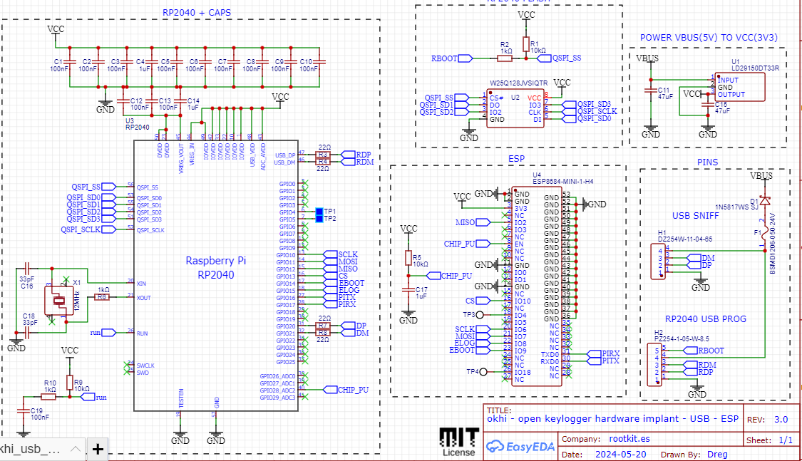

We are now well **beyond version 11**. The updated schematic will be included in a future update.

# Credits

- Juan M Martinez Casais: my friend, a GOD mode electronic engineer

- Alex Taradov (PIO USB & CODE): https://github.com/ataradov/usb-sniffer-lite

# Developers

- Main developer: Dreg

# Thank you

Thank you to our sponsors, early adopters, and everyone for your support! We are committed to improving this project every day.

Special thanks to the early adopters, who were the first to purchase our products.
