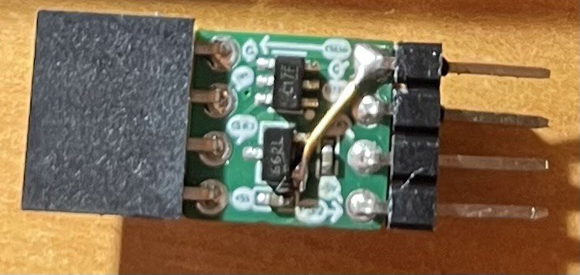
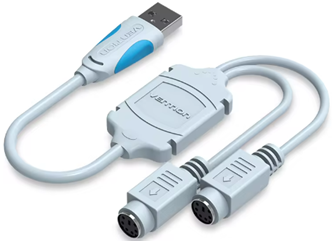
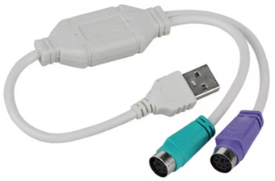
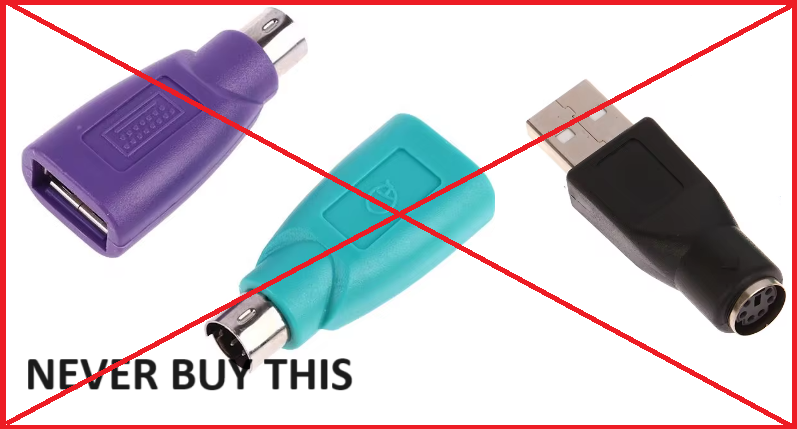
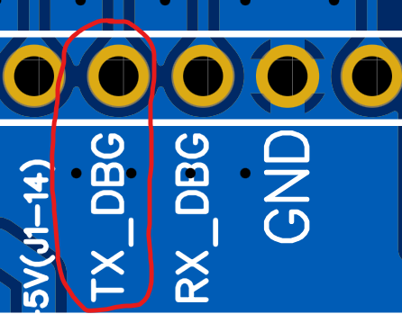
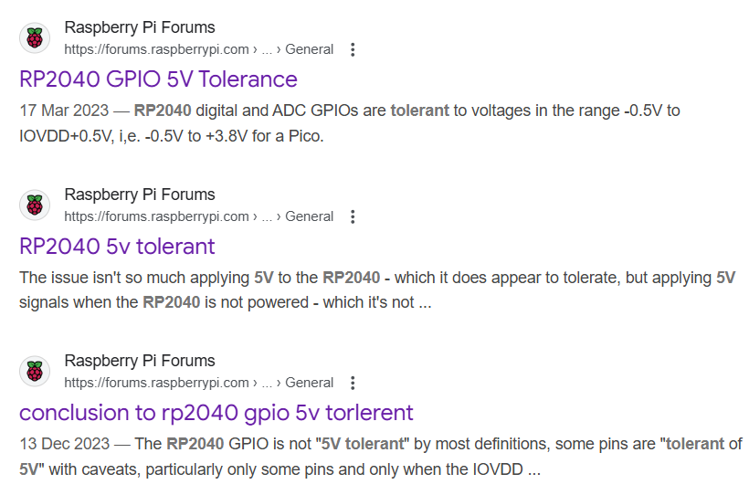

# okhi - Open Keylogger Hardware Implant


okhi is an implant that can be utilized to log keystrokes from a USB/PS2 keyboard. The implant is designed to be  easily concealable within a keyboard, laptop, or tower case. It is powered by the keyboard cable itself. The implant can be accessed via WiFi and enables real-time viewing of keystrokes.

## You can now buy it at [https://www.rootkit.es ](https://www.rootkit.es/)

It is based on the RP2040 + ESP chip. The RP2040 is responsible for sniffing & parsing the keyboard data, while the ESP chip is used to transmit the data over WiFi.

The **RP2040** features a dual-core Arm Cortex-M0+ processor, making it highly efficient for handling multiple tasks simultaneously (PIO rlz!).

okhi leverages the **ESP32-C2**, a new chip from Espressif, specifically the **ESP8684**. This chip includes a RISC-V single-core CPU, which is known for its small size. It is important to note that the ESP8266, ESP8285, and ESP8654 are different chips and should not be confused with the **ESP8684**.

----


----

okhi is designed to be a proof of concept and educational tool. It is not intended to be used for malicious purposes.

okhi consumes ~120ma of current, the target & cable must be able to supply this amount, otherwise, the implant will not work.

Note that the keyboard itself consumes power as well. The maximum current for USB 2.0 is 500mA. Never exceed this limit.

Just connect VBUS, GND and data lines to okhi, and you are ready to go.

You can sniff keyboard data by connecting okhi to the end of the cable or to a through-hole pin connector inside the tower. It can also be connected to accessible pads or traces. If the keyboard data is present, okhi will be able to sniff it.

okhi connected using copper wires to keyboard PCB-pads:


# Appearance

Front (black or green)


Back (black or green)


# Size (mm)


Check size before buying, maybe it is too big for your target. Or maybe you need drill some space inside the keyboard.

# Features

- Supports both PS2 and USB keyboards (limited to classic USB low-speed mode yet)
- WiFi + web support
- Real-time viewing of keystrokes
- Open Hardware
- Open Source (MIT License)
- Community support

# Getting Started

First, let's get to know the different PCBs and understand the purpose of each one.

## okhi implant

This is the implant that connects between the USB/PS2 keyboard and the computer to record keystrokes and allows viewing them via WiFi in real-time.


Note: You need an Implant probe board to program it and update the firmware.

Before using it, you must program the latest version of the firmware, as it comes without any pre-installed software.

## USB implant probe


This board enables USB data sniffing without requiring any soldering or internal installation in the keyboard. It operates externally, making it a fully plug-and-play solution for testing the implant.

Moreover, this board plays a crucial role in programming and updating the firmware of the Okhi implant.

Note: In earlier PCB revisions, programming the implant required using the same USB port that was used for sniffing (and you had to disconnect the target keyboard each time); newer USB implant probe revisions provide a dedicated USB port specifically for programming the implant. 

## PS2 implant probe


This board enables PS2 data sniffing without requiring any soldering or internal installation in the keyboard. It operates externally, making it a fully plug-and-play solution for testing the implant.

Moreover, this board plays a crucial role in programming and updating the firmware of the Okhi implant.

Important: In previous versions of the PCB, programming the implant was exclusively possible using the USB Implant Probe board; newer PS2 implant probe revisions provide a dedicated USB port specifically for programming the implant. 

This board already converts PS2 signals from 5V to 3.3V, ensuring the Okhi implant operates safely.

## 5v -> 3V3 shifter mini board


This board is essential for converting PS2 signals from 5V to 3.3V, which is necessary for the proper functioning of the Okhi implant. It is designed to be compact.

For USB sniffing, this is not necessary. Use it to connect the Okhi implant inside a PS2 keyboard.

## Thanks to PCBWAY for sponsoring the okhi project

Special thanks to PCBWay for sponsoring this project! PCBWay is a well-known PCB prototyping and manufacturing service, providing high-quality boards and excellent customer support. I have worked with their boards in the past and can say that they are of great quality. I easily placed an order for PCBs on their platform for this project without any problems. The sponsorship also included a free quick delivery option. If you’re looking for reliable PCB prototyping and manufacturing services, I highly recommend checking them.


https://www.pcbway.com


## DIY USB & PS2Keylogger POC

https://github.com/therealdreg/pico-usb-sniffer-lite


https://github.com/therealdreg/pico-ps2-sniffer


# Project files

Gerber, Pick and Place files and BOM will be available soon.

----

 At this moment only Windows is documented. Linux and Mac will be documented soon. I am only one person, so please be patient....

 ----

# What a mess of names!

The okhi board integrates two main processors: the RP2040 and the ESP8684-MINI-1-H4 / ESP8684-MINI-1-H4X. The RP2040 is a dual-core Arm Cortex-M0+ processor running at up to 133 MHz, equipped with 264 KB of on-chip SRAM. While the RP2040 does not include flash memory, an additional 16 MB of external flash has been added, enhancing its storage capabilities. Additionally, the RP2040 is well-suited for overclocking. This processor is also the foundation for the popular Raspberry Pi Pico microcontroller board.

Complementing the RP2040, the ESP8684-MINI-1-H4 module operates at speeds up to 120 MHz and includes 4 MB of internal flash memory. It features a built-in PCB antenna, eliminating the need for an external one, and is housed within a PCB-to-PCB module that incorporates the ESP8684 chip along with other essential components.

The ESP8684 / ESP8684H4X (Chip Revision v2.0) itself is a single-core RISC-V processor and serves as the core of the ESP32-C2 modules (ESP32-C2 is a generic name). The ESP32-C2 offers a cost-effective solution with Wi-Fi 4 and Bluetooth 5 (LE) connectivity, outperforming the older ESP8266 in both size and performance. It is built around a 32-bit single-core RISC-V processor, featuring 272 KB of SRAM (with 16 KB dedicated to cache) and 576 KB of ROM.

The ESP8684-DevKitM-1 provides a dedicated development board tailored for the ESP8684-MINI-1-H4 module.


# ESP8684-MINI-1-H4 module (ESP32-C2)

okhi uses ESP8684-MINI-1-H4 module (ESP32-C2), which is known for its small size.


ESP8684-MINI-1-H4 module vs ESP8684-WROOM-02C-H4 module:


With WIFI speeds up to 72Mbps (9MB/s), this module is ideal for a physical keylogger. However, in real-world scenarios, the WIFI speed is typically much lower, but still sufficient for a web interface displaying keystrokes.

## Compatible with both modern and older ESP32-C2 versions

The okhi firmware is designed to support all versions of the ESP32-C2 chip, including both legacy v1.x and the v2.0 revision. This ensures seamless compatibility across different hardware versions without requiring separate firmware builds.

Note: You must use an **ESP32-C2** module with a **26 MHz crystal**. Some chips cannot work properly when equipped with 40 MHz crystal. Specific symptoms of the problem include clock issues, or printing garbled characters when powering on, etc.

Note: You must use an **ESP32-C2** module with **4 MB** of flash memory.

[Compatibility Advisory for ESP32-C2 Chip Revision v2.0 ar2025-001_en.pdf](stuff/Compatibility%20Advisory%20for%20ESP32-C2%20Chip%20Revision%20v2.0%20ar2025-001_en.pdf)

The ESP32-C2 v2.0 revision adds roughly 20 KB more usable SRAM and about 100 KB of extra flash. The current firmware does not exploit these gains so that a single binary runs unchanged on both v1.x and v2.0 devices. This avoids maintaining split build targets and keeps testing simpler.

Note: Build the firmware with an ESP-IDF version that produces binaries compatible with earlier ESP32-C2 (ESP8684) revisions. 

Before compiling, confirm:
- The selected ESP-IDF version supports v1.x and v2.0 simultaneously.
- Compiler options are set for backward compatibility.

 # Starter pack

 Currently, the only way to buy okhi is with the starter pack. The starter pack includes:

- 1 okhi implant

- 1 auxboard: it allows you to program the implant. It is also used to test the implant out of the keyboard (man in the middle USB).

To test implant (USB): insert the sniff-male-pins (GND must coincide with G pin) into aux board sniff-female-pins, connect keyboard to USB female and connect the auxboard to the computer. You can see the keystrokes in the web interface.


To program the implant: connect the implant prog-male-pins to auxboard PROG-female-pins (GND must coincide with G pin), press BOOT button and connect the auxboard to the computer. **Keyboard must be disconnected** from the auxboard!!


**NOTE: Future versions will include a USB male connector to give more power to the implant if needed.**

- 1 ps2 implant probe board: It is also used to test the implant out of the PS2 keyboard (man in the middle PS2). This board converts PS2 signals to 3v3 for okhi.


To test implant (PS2): insert the sniff-male-pins (GND must coincide with G pin) into sniff-female-pins, connect keyboard to PS2 connector and connect the implant probe to your computer PS2/or PS2<->USB adapter. You can see the keystrokes in the web interface.


**NOTE: Future versions will include a USB male connector to give more power to the implant if needed.**

- 1 PS2 adapter board for okhi, okhi inputs only allow 3v3, so this board is necessary to convert PS2 signals to 3v3 (use only when you need install okhi inside the PS2 keyboard/tower....).



Just connect okhi-male-SNIFF-pins to the female pins (GND with G) and ps2adapter-male-pins to the PS2 keyboard.

You need to buy by yourself:
- 1 PS2 male to PS2 male cable (MINI-DIN 6P)
- 1 PS2<->USB adapter
- 1 USB extension cable (optional)
- 1 USB Keyboard (optional)
- 1 PS2 Keyboard (Lenovo on Aliexpress is OK) (optional)

# Firmware update

It is necessary to update the firmware before using okhi. The firmware is divided into two parts: RP2040 and ESP32-C2.

RP2040 chip is the responsible for programming the ESP32-C2 chip.

So first, you need burn a temporal firmware to the RP2040 chip to program the ESP32-C2 chip. After that, you need to burn the ESP firmware to the ESP32-C2 chip via RP2040 usb port.

Finally, you need to burn the final firmware to the RP2040 chip, thats all. Can be done in a few minutes, and this task is only necessary when you need to update the firmware.

Follow these steps to update the firmware:

- Download the latest firmware from the releases section: https://github.com/therealdreg/okhi/releases/latest

- Connect the implant to auxboard PROG pins (R female-pin must match with the R male-pin of the implant):


- Connect the auxboard to the computer using a USB cable (make sure the auxboard's USB female connector is not connected)

- Entering Program Mode for the okhi Module: Before connecting the okhi module to a USB port, ensure you press and hold the programming button (BOOT auxboard).

- Uploading the UART Bridge Firmware: Transfer the uart_bridge.uf2 file to the okhi module, which will appear as a MASS STORAGE DEVICE on your computer (e.g., drive E:). The device will automatically eject once the file transfer completes.

- Switching to Normal Mode: To operate the okhi module in normal mode, connect it to a USB port without pressing any buttons.

- Programming the ESP Module: Run the upload_firmware.bat script to start programming the ESP module. This script automates the firmware installation process.

- Selecting the COM Port: Input the COM port number where the okhi module is connected (e.g., COM3). If you are uncertain of the correct COM port, the batch file will display a list of available COM ports. You may need to try each one sequentially to find the correct connection.

- Completing the Programming Process: Wait for the script to finish running. Once complete, the ESP module will be programmed and ready for use.

- Re-entering Program Mode: Disconnect the okhi module from the USB, then reconnect it in program mode by pressing the programming button before plugging it back into the USB.

- Programming the RP2040 Chip: Copy the okhi.uf2 file to the okhi module, now recognized again as a MASS STORAGE DEVICE (e.g., drive E:). The device will automatically eject after the file transfer.

- Finalizing Setup for RP2040: The RP2040 chip is now programmed and ready for operational use.

- Reconnecting for Regular Use: Disconnect the okhi module from USB and then reconnect it without pressing the programming button for normal use.

- Connecting to the ESP WiFi Network: An ESP WiFi network (PS2/USB_<device_id>) will become available with the password '1234567890'. Connect to this network and open a web browser to access the web interface at: http://192.168.4.1/

Note: old firmware SSID: ESP_PS2/USB - password: '0123456789'

**Note**: **uart_bridge.uf2** prior to firmware version v5 require using esptool version (**v4.7.0**) included in release package. Using other versions may cause issues! Refer to this link for more details: https://github.com/espressif/esptool/issues/1119  
Starting from firmware version v5, uart_bridge.uf2 is compatible with the latest version of esptool without any issues.

# PS2<->USB adapters working with okhi

Note: Some adapters use purple for the keyboard, others use green for the keyboard... wtf! If it doesn't work in one, try the other.

- 1 (adapter from hell, it works, but not recommended) (Amazon)


- 2 Aliexpress (OK)



- 3 Aliexpress (OK)


- 4 Aliexpress (OK)



- 5 Aliexpress (OK)


# NEVER BUY THIS PS2<->USB



# Reporting issues

If you have a PS2-USB adapter that doesn't work with the sniffer, please send me some captures of the device using a logic analyzer or the pico-ps2-diagnostic-tool. This tool is designed to capture and replay signals on a PS/2 interface, specifically targeting the DATA and CLOCK lines:

https://github.com/therealdreg/pico-ps2-diagnostic-tool


 A short pulse was captured on the original CLOCK signal, and the replayed signal successfully reproduced it.

# Developers setup

## RP2040 DEV SETUP

 - Install pico-sdk SDK **v1.5.1**: https://github.com/raspberrypi/pico-setup-windows/releases/latest/download/pico-setup-windows-x64-standalone.exe

**WARNING: Do not install pico-sdk 2.0 or higher (including PICO VSCODE extensions), as it is not supported yet.**

 - Clone this repo or download the zip file: https://github.com/therealdreg/okhi/archive/refs/heads/main.zip

 - Open the "Pico - Visual Studio Code" shortcut (it is installed with the pico-setup-windows). Never use a normal Visual Studio Code!!

 

- Open the okhi project, File -> Open Folder...


- Select oki folder: firmware\ps2\rp

- Click Select Folder

- Click on "Trust the authors" if you see this message


- Press shift+ctrl+p, type cmake cache and Select: "CMake: Delete Cache and Reconfigure"


- Press shift+ctrl+p, type cmake build and Select: "CMake: Build"


- If everything is ok, you will see a message like this in OUTPUT window (bottom):


- Now a new firmware\ps2\rp\build\okhi.uf2 file is created and ready to be uploaded to okhi

## ESP-C2 DEV SETUP

**Note**: Starting with v5, the ESP firmware is built directly on the native **ESP-IDF** framework (dropping the PlatformIO + Arduino layer) to simplify unified support for both legacy and new ESP-C2 2.0 (H4X) chips (older versions of ESP-IDF cannot generate firmware for the new 2.0 chips).

- Download and install ESP-IDF **5.5** (universal online installer): https://dl.espressif.com/dl/esp-idf/?idf=5.5

Note: Ensure you select this exact ESP-IDF version; do not use any other.

- During installation, select "**ESP32-C2**".


- Leave everything checked


- Wait for the installation to finish, it will take a few minutes...

- Download the latest VSIX version: https://nightly.link/espressif/vscode-esp-idf-extension/workflows/ci/master/esp-idf-extension.vsix.zip

https://github.com/espressif/vscode-esp-idf-extension

**Note:** Make sure to install the latest version from the repository, as older versions may cause issues. 

If the latest version fails, I have tested version **1.10.3**, and it works well.

- Close all instances of the "Pico - Visual Studio Code" (already installed during the RP2040 DEV SETUP) and open it again

- Go to View -> Command Palette


- Type: "> Extensions: Install from VSISX..."


- Select "esp-idf-extension.vsix"


- Go to "Configure ESP-IDF extension"


- click on "Express"


- Select "Download Server: GITHUB", ESP-IDF VERSION: "**5.5**"


Click Install to begin the download.

- Wait for the installation to finish, it will take a few minutes...

- Go to File -> Open Folder


- Select the okhi-esp folder: firmware\ps2\esp


- Open the ESP-IDF extension and click "Full Clean"


- Open the ESP-IDF extension and click "Select current ESP-IDF version"


- Open the ESP-IDF extension and click "Build Project"


- Wait for the build process to complete.


Done! The new firmware for ESP should have been created:


## Generating a New Release

To create a new release with the updated RP and ESP firmware, follow these steps:

1. Navigate to the project directory.
2. Execute the `make_release.bat` script.
3. The script will generate a new release package containing the updated firmware for both the RP2040 and ESP32-C2.

-----

To compile USB firmware, follow the same steps. Just select the firmware\usb\rp folder and firmware\usb\esp folder.

Note: I modified the original usb-sniffer-lite project by Alex Taradov (porting to pico-sdk). I am not a RP2040 expert, so I am learning a lot with this project.

# Web Developers

The web is located in webps2\index.html for PS2 firmware and webusb\index.html for USB firmware. You can modify the web as you want, adding more keyboard layouts, improving keyboard protocol parsing (javascript)...

Installing node.js (**22.7.0**) on Windows
```
https://github.com/coreybutler/nvm-windows
```

Open cmd

```
nvm.exe install latest
```

Execute "nvm use" with the **22.7.0** version, Example
```
nvm.exe use 22.7.0
```

Check node version
```
node.exe -v
v22.7.0
```

**WARNING: type "node.exe" instead of "node"**

Install deps

```
npm.exe install html-minifier --no-audit
```

Just modify the index.html, run nodejs script "webps2\webgen.js" or "webusb\webgen.js" and compile ESP firmware again.

```
node.exe webgen.js
```

This script will generate a new web for ESP firmware.

Please, keep in mind that the web is very simple, it is only a proof of concept, and we must conserve the ESP flash memory for other features, so do not add tons of code, just the necessary for useful features.

# Developers notes for PS2 PIO

As you noticed, the PS2 firmware is based on PIO (Programmable IO) of RP2040. The PIO is a very powerful tool to sniff and parse PS2 data.

Currently, PS2 firmware can looks unnecessary complex, but it is the only-reliable-and-stable way to parse PS2 data because:

- 1 Adapter from hell (AMAZON). Please avoid this adapter!


This PS2->USB adapter is a little nightmare. Behaves very strange and the PIO code + main cores must be very robust to avoid problems.

PIO code for PS2 should be very, just simple waiting from idle to a start state (KEYBOARD to PC / PC to KEYBOARD), and then parse the data.

## IDLE behavior (adapter from hell)

Normal PS2 behavior, from idle (CLK+DAT HIGH) to start state, and finish state return to idle:


Now, the IDLE state for adapter from hell:


So, yes, the IDLE state for this adapter means a DAT HIGH (its ok), but.... wtf, a CLOCK pulse every time? as you can see this CLOCK pulse is longer than normal CLOCK pulses for PS2 protocol...

Another PS2 to USB Adapter from Aliexpress with a fast 1.8us low pulse (CLOCK LINE):


NOTE: These types of "glitches" do not affect the functionality of the PS2 keyboard and the adapter in any way, but they are a problem when creating a generic sniffer.

So, PIO code cant wait for a normal IDLE state like the ps2kbd library does:

https://github.com/lurk101/ps2kbd-lib/blob/master/ps2kbd.pio

```
.program ps2kbd

    wait 0 pin 1     ; skip start bit
    wait 1 pin 1

    set x, 7         ; 8 bit counter
bitloop:
    wait 0 pin 1 [1] ; wait negative clock edge
    in pins, 1       ; sample data
    wait 1 pin 1     ; wait for positive edge
    jmp x-- bitloop

    wait 0 pin 1     ; skip parity and stop bits
    wait 1 pin 1
    wait 0 pin 1
    wait 1 pin 1
```

And one more thing... sometimes a wild very-short-pulse appears in the CLOCK line, look:


A ~8us pulse! so we have two main problems: a weird long CLOCK every time and short pulses before the real packet....

So, PIO code must be compatible with this adapter, and also with normal PS2 adapters. PIO code + main cores code will be more complex than expected, but it is the only way to make it work with all adapters.

PIO code tasks:
- Track the IDLE state for all adapters (including adapter from hell)
- Track the start state for all adapters
- Track host to keyboard and keyboard to host states & data
- Helper to discard short pulses and long clock pulses

[Current PIO code for PS2](firmware/ps2/rp/okhi.pio)

Note: I just code (very fast) the necessary for the adapter from hell + others. So, the PIO code and main cores code will be improved in the future. And not all PIO code tasks are implemented yet (maybe will be not necessary).

I tested the current PIO + main cores code with different PS2 adapters and it works fine.

# Developers hardware pack

Programming using the implant can be a pain, so I made some hardware PCBs to make it easier.

Pack includes:
- 1 USB sniffer board for developers:


- 1 PS2 sniffer board for developers (this board converts PS2 signals to 3v3 for Raspberry Pi Pico):


You need buy by yourself:

- 1 RASPBERRY PI PICO (soldered version) + USB cable
- 1 Raspberry Debug probe (debugger) + USB cable
- 1 ESP8684-DevKitM-1 (soldered version) + USB cable
- 1 kit Dupont cables (Female-Female, Male-Male, Male-Female)
- 1 Cheap logic analyzer ~8$ (compatible with Saleae software if possible)
- 1 PS2<->USB adapter
- 1 PS2 male to PS2 male cable (MINI-DIN 6P)
- 1 USB extension cable (optional)
- 1 USB Keyboard (optional)
- 1 PS2 Keyboard (Lenovo on Aliexpress is OK) (optional)

So, this is basically the okhi implant in big format! the PCBs just allow an easy sniffer and interconnection between Raspberry Pi Pico and ESP32-C2 and the keyboard.

With this setup, you can debug, test, and develop the implant firmware in a more comfortable way.

## Flash PI PICO PS2 firmware using Raspberry Pi Debug Probe

- Connect the raspberry pi debug probe to the raspberry pi pico:


Connect the debug probe to the computer using a USB cable. Also connect raspberry pi pico to the computer using a USB cable.

Open "Pico - Visual Studio Code", open okhi ps2 project, shift+ctrl+p, type ">Tasks: Run Task", press enter, select "Flash", press enter. Done!

## Debugging PI PICO PS2 firmware using Raspberry Pi Debug Probe

- The same as flashing, but go to Run and Debug icon (shift+ctrl+d). Select "Pico Debug (Cortex Debug)" and press the green arrow. Done!


The debugger stops on platform_entry function, At this point, you can set a breakpoint in the main() code, etc...

## PI PICO Debug UART Console

Connect GND from USB to 3v3 UART adapter to GND PIN of the Raspberry Pi Pico.

Connect a USB to 3v3 UART adapter -> RX From adapter to the TX PIN (GPIO 4) of the Raspberry Pi Pico:



You can use Raspberry Pi Debug probe to debug UART because it has a USB to UART connector:


Note: Raspberry Pi Pico is 3v3, so you need a 3v3 USB to UART adapter.

Open a terminal (putty, teraterm, etc...) and select the COM port of the USB to UART adapter. Set the baudrate to 921600 and done! you can see the debug messages in the terminal.


## Flash & Monitor ESP32-C2 firmware using ESP32-C2-DevKitM-1

Install CP210x Universal Windows Driver from Silicon Labs: https://www.silabs.com/documents/public/software/CP210x_Universal_Windows_Driver.zip

Connect the ESP32-C2-DevKitM-1 to the computer using a USB cable.

- Open "Pico - Visual Studio Code"

- Go to File -> Open Folder


- Select the okhi-esp folder: firmware\ps2\esp


- Go to ESP-IDF extension -> Select Flash Method -> UART


- Open Windows Device Manager to find the COM port of the ESP32-C2-DevKitM-1

- Go to ESP-IDF extension -> Select Port to use (COM,TTY, etc...) and select the correct port

- Go to ESP-IDF extension -> Select Monitor Port to use (COM,TTY, etc...) and select the correct port


- Click on "Full Clean"


- Click on "Build, Flash and monitor":


it will take a few minutes... if everything is ok, a message like this will appear in TERMINAL window (bottom):


```
Writing at 0x00070fa3... (85 %)
Writing at 0x00077235... (90 %)
Writing at 0x0007d5a6... (95 %)
Writing at 0x00082fd6... (100 %)
Wrote 485968 bytes (321297 compressed) at 0x00010000 in 7.7 seconds (effective 503.2 kbit/s)...
Hash of data verified.

Leaving...
Hard resetting via RTS pin...
================================= [SUCCESS] Took 18.55 seconds =================================
 *  Terminal will be reused by tasks, press any key to close it.
```

And then the debug UART window should appear

# PS2 Captures 

Using the Saleae logic software, PulseView, and the pico-ps2-diagnostic-tool, I captured data from a variety of USB-to-PS2 adapters and real motherboards. This data illustrates the differences among these devices, showing that the PIO code must be compatible with them all. The diagnostic tool also allows you to replay the data to the implant to verify its functionality.

All captures are stored in the **stuff/ps2caps** folder. Each capture contains the following keystroke events:

drg[Caps Lock]

Additionally, by pressing [Caps Lock from another keyboard], the PS2 keyboard receives the LED SET event.

## ASUS 970 PRO GAMING/AURA ACPI BIOS Revision 1001

[Download Captures: ASUS 970 PRO GAMING/AURA ACPI BIOS Revision 1001](stuff/ps2caps/asus_970_pro_gaming_aura_acpi_bios_revision_1001.zip)

This board features dual PS2 ports, supporting both a PS2 keyboard and a PS2 mouse:


## Adapter from Hell (AMAZON)

[Download Captures: Adapter from Hell](stuff/ps2caps/adapter_from_hell.zip)

This adapter is notoriously difficult to work with due to its erratic behavior. The PIO code and main firmware must be carefully designed to accommodate its quirks.


## Adapter 2 from Aliexpress

[Download Captures: Adapter 2 from Aliexpress](stuff/ps2caps/adapter2_aliexpress.zip)

Although this adapter is somewhat easier to parse, it still presents challenges. Saleae’s Logic software PS2 parser may struggle to decode certain events.


## Adapter 5 from Aliexpress

[Download Captures: Adapter 5 from Aliexpress](stuff/ps2caps/adapter5_aliexpress.zip)

This adapter is one of the most reliable, as it is the easiest to parse. Saleae’s Logic software successfully decodes all events.


# Hardware Design

## USB SWITCH 

The latest versions of okhi use the USB SWITCH **TS3USB3000RSER** (Texas Instruments) to protect the USB and PS2 sniffing lines while the RP2040 is powering on. This ensures that no voltage from the device being sniffed reaches the RP2040's sniffing GPIO pins during startup.

This is the current schematic:


By default, while the RP2040 is powering on, the sniffing lines are routed to USB+ and USB- (where no GPIO is present). Once the RP2040 firmware initializes, the switch activates to redirect the sniffing lines to MHL+ and MHL-, which are connected to the GPIO pins of the RP2040.

What is the advantage of using this switch? For USB, it is not necessary because D+ and D- operate at 3.3V. However, if you cannot use the mini auxiliary adapter board to convert PS2 5V signals to 3.3V due to space constraints, the implant can still be used. That said, I strongly advise against directly sniffing 5V PS2 lines with the implant, as it poses a risk of damaging the device. This switch provides a "safe?" alternative solution.

Since this switch is specifically designed for USB lines, it is ideal for the okhi's role as a USB sniffer. Additionally, it works well for 5v PS2 signals, making it a great choice for the implant.

[TS3USB3000RSER Datasheet](stuff/ts3usb3000.pdf)

If you search online or consult forums about "RP2040 5V tolerance" and review the datasheet, you will find that the RP2040 can handle 5V signals on its GPIO pins. However, it is crucial to ensure that the RP2040 is powered with its IOVDD (3.3V) supply before applying any 5V signal to the GPIO pins. Failing to do so may result in damage to the chip, as the GPIO pins are not designed to safely tolerate 5V signals when the RP2040 is unpowered.



**WARNING**: If the RP2040 loses its 3.3V supply on the IOVDD pins for any reason and a 5V signal is present on the GPIO pins, it could damage the chip. It is strongly recommended to use the auxiliary 5V-to-3.3V adapter board alongside the implant to prevent this issue. 

A user with Raspberry Pi Pico have reported that after exposing their chips to risky scenarios involving 5V on the GPIO pins, the pins still function as inputs but no longer work as outputs. I have not conducted tests myself, but for sniffing purposes, this kind of damage would still be acceptable :)

### Shifter board (5v->3V3)


------


## TCXO +-2.5 PPM for RP2040

The latest hardware revision uses an ATXAIG-H12-F-12.000MHz-F25 as a TCXO (Temperature Compensated Crystal Oscillator). It is much more stable and precise than a typical crystal and helps maintain clock accuracy under variable temperature conditions. Additionally, it does not require external capacitors with values dependent on the thickness and design of the PCB.

[ATXAIG-H12-F-12.000MHz-F25 Datasheet](stuff/ATXAIG-H12.pdf)

The cost of this TCXO is approximately €2.5 compared to €0.1 for a typical crystal. The price difference is justified by the advantages it offers.

This TCXO generates a 3.3V square wave signal at 12MHz, which can be directly fed into the XIN pin of the RP2040 while leaving the XOUT pin disconnected, and it works without any issues.

Why did I decide to use a TCXO if I already had a good design with a typical crystal? Well, this is an open hardware and open source project, and there will be people who request their own PCBs with different thicknesses or make their own modifications. 

And what does that have to do with the crystal? 

Let's take a look online:

https://forums.raspberrypi.com/viewtopic.php?t=375990

```
custom RP2040 PCB - crystal does not oscillate
Report this post
Sun Sep 01, 2024 12:42 am

I'm designing PCBs around the RP2040 with KiCAD, 
....
I've had a few wins! However, my second iteration 
of this one fails to oscillate, 
and I cannot figure out why.
....
What changed
The differences between PCB 1 and PCB 2:
- moved the crystal left and up, 
but XIN/XOUT lengths changed only slightly
- switched from 1.6mm PCB to 1mm PCB - layer 2/3 dielectric
 thickness from 1.1mm to 0.45mm
- routed +1.1V under XIN/XOUT
...
Again using an online microstrip capacitance calculator, 
it's appears that my 0.2104mm dielectric DOUBLES 
capacitance relative to a 1mm dielectric. 
```

If you search online, you will find other users experiencing issues with the crystal they selected, the capacitors they chose, the design of the crystal tracks, the thickness of the PCB, etc.


Another issue arises with the pico-sdk, which assumes that the crystal startup time must not exceed a certain duration. Some users have had to modify the `PICO_XOSC_STARTUP_DELAY_MULTIPLIER` in their firmware to allow enough time for the crystal on their custom RP2040 PCB to oscillate correctly, ensuring the firmware operates as expected. This can be problematic because if a user is working with an RP2040 board exhibiting this "problem," they need to be aware of it to adjust the `PICO_XOSC_STARTUP_DELAY_MULTIPLIER` in their firmware for proper functionality.

For these reasons, the RP2040 datasheet and the "Hardware Design with RP2040.pdf" strongly recommend using the Abracon ABM8-272-T3 crystal along with their suggested design, including tracks and capacitors, to avoid all these issues. It seems everything is designed to "encourage" you to use that specific crystal ;-)

(Additionally, in some cases, it is necessary to adjust the `PICO_DEFAULT_BOOT_STAGE2=boot2_generic_03h` and define `PICO_BOOT_STAGE2_CHOOSE_GENERIC_03H 1` for the custom RP2040 board to function correctly)

To ensure the TCXO avoids any of these problems, I added a generous startup delay so that when the RP2040 powers up, the oscillator is fully stable, and there’s no need to adjust the `PICO_XOSC_STARTUP_DELAY_MULTIPLIER`. For typical use as a PS2 and USB keyboard sniffer, this startup delay is irrelevant. Missing a few startup events is not a concern in this context.

This is the current design:

 

With such a generous delay, if in the future a modder wants to use a slower one, no further modifications will be necessary.

### If you want to keep using a crystal in okhi

If you don't understand why using a typical passive oscilloscope probe of 10pF in 10X on XIN or XOUT is a problem, USE THE TCXO! 


Here are my experiments.

1. **Select an appropriate crystal**: Make sure to choose a crystal that works well with the RP2040 and has characteristics similar to the Abracon ABM8-272-T3.

2. **Adjust the capacitors**: You may need to experiment with the load capacitor values for the crystal you choose. Use a frequency meter to adjust the capacitor values until the crystal oscillates at the desired frequency.

3. **Review the PCB design**: Ensure that the crystal tracks are designed correctly and that there is no interference from other signals. Keep the tracks as short as possible and avoid crossing other traces.

Adjust the 1k resistor specified in the "Hardware Design RP2040.pdf" to suit the crystal you have selected and the specific design of your PCB. Ensure the resistor value aligns with the crystal's requirements and the overall circuit design to achieve optimal performance.

Additional considerations for crystal selection include:

- **Load Capacitance**: Ensure the load capacitance matches the specifications of the crystal. Incorrect values can lead to frequency deviations or startup issues.

- **Maximum ESR (Equivalent Series Resistance)**: Choose a crystal with an ESR within the acceptable range for the RP2040. Higher ESR values can prevent the crystal from oscillating reliably.

- **Resistor to Prevent Over-Driving**: Include a series resistor to limit the drive level of the crystal. This prevents over-driving, which can damage the crystal or reduce its lifespan.

Properly addressing these factors ensures the crystal operates reliably and within its intended specifications.

If the crystal takes time to start, modify PICO_XOSC_STARTUP_DELAY_MULTIPLIER.

Here are the 12MHz crystals I have tested and found to work in earlier versions of okhi with a 6-layer PCB (0.8mm thickness):

- **ABM8-272-T3**: (okhi 15-18pF) Always use this one whenever possible.
- **X322512MSB4SI**: (okhi 27-33pF) Popular for the RP2040 and used in the Bus Pirate v5, but you need to know what you're doing.
- **ABM8-12.000MHZ-20-B1U-T**: (okhi 30-33pF) Worked in my prototypes and stress tests (what boredom can lead to, haha). I do not recommend it.

Note: I know that some crystals I have tested are outside the recommendations for the RP2040, such as MAX ESR, etc., but I wanted to test if they worked in my units after properly characterizing everything.

Here are some results from the first tests I conducted (ignoring the crystal's startup time and **focusing solely** on fine-tuning the frequency to 12MHz):


In some cases, it may be necessary to compromise on exact frequency to ensure a faster startup. As a designer, you must evaluate what is best for your specific use case of the board.

**WARNING**: just because a crystal you have purchased for your board, with certain capacitors, operates at a very precise frequency does not mean that this is the best capacitor value for your PCB. keep in mind that crystals have a tolerance, and each unit is slightly different. you must account for this tolerance and know how to measure the actual capacitance of your PCB design.

How can I measure the crystal of okhi/own RP2040 board with an oscilloscope in a "cheap," safer, and more precise way? I have used a 1.3 GHz FET Probe.

https://hackaday.io/project/184924-diy-13-ghz-fet-probe  
https://lectronz.com/products/-1300-mhz-fet-probe  

A 1.3 GHz active scope probe with FET input and very low input capacitance (about 0.3 pF):  

- AC coupled  
- Minimum frequency: 100 kHz  
- Attenuation: 1:10 (1:20 with 50 Ohm termination)  
- Supply: 5V through u.Fl  
- Reverse voltage protection  
- Output through u.Fl  
- Can be soldered directly to the device under test for minimal lead inductance  

Since the load is minimal, only a few pF, it is safer. Here's a photo of my setup:


With the oscilloscope, I usually measure whether I am overloading or underloading the crystal, how long it takes to start, and if I notice any irregularities in the waveform.... don't just focus on the frequency.

Another tool I created to measure the frequency of my okhi RP2040 boards is a project called pico-freq-meter-tcxo-ref.

https://github.com/therealdreg/pico-freq-meter-tcxo-ref

Essentially, it uses a PICO along with an external reference signal that shares the same TCXO as the new OKHI boards (12MHz) to compare it with the crystal signal on the external implant. The crystal signal is extracted through a pin as a 3.3V square wave signal (clock_gpio_init + CLOCKS_CLK_GPOUT0_CTRL_AUXSRC_VALUE_XOSC_CLKSR). This setup allows one of the OKHI pins used for sniffing to provide the clock signal without interfering with the original crystal, making it highly effective for fine-tuning the board's capacitors.

Since the latest OKHI boards include a TCXO, I created firmware for these implants that performs the same function as the pico-freq-meter-tcxo-ref.

This allows you to use an OKHI TCXO implant to adjust the capacitors of the crystals on your RP2040 boards.

Steps to measure the crystal of an OKHI implant using an OKHI TCXO implant:

1. Flash the following firmware onto your OKHI target board with a crystal installed: https://github.com/therealdreg/okhi/tree/main/stuff/clock/build/clock.uf2

2. Flash the firmware for the TCXO implant onto your OKHI target board: https://github.com/therealdreg/okhi/tree/main/stuff/pico_clock_calc/build/pico_clock_calc.uf2

3. Connect the TCXO implant to the appropriate pins on your OKHI target board.

4. Power both the OKHI target board and the TCXO implant.

Connect via USB using teraterm to TCXO implant.


If at this moment we slightly increase the pF of the crystal's capacitors, we will get closer to 0, and if we go too far, it will result in a negative value. If we reduce the pF, the value will be higher. The idea is to stay close to (0 ppm).

-------

#### Example with ABM8-272-T3

ABM8-272-T3 **8pF** caps okhi-6-layer thick 0.8:


ABM8-272-T3 **15pF** caps okhi-6-layer thick 0.8:


ABM8-272-T3 **18pF** caps okhi-6-layer thick 0.8:


---------

#### Example X322512MSB4SI 33pF: 0.8 thick vs 1.6 thick

X322512MSB4SI **33pF** caps okhi-6-layer thick **0.8**:


X322512MSB4SI **33pF** caps okhi-6-layer thick **1.6**:


The same: crystal, PCB design, capacitors, and number of layers were used, but the difference in PCB thickness resulted in varying ppm values: ~-7.6 ppm versus ~-3.0 ppm (**~4.5 ppm difference**), highlighting the impact of thickness.

---------

**WARNING**: The startup time of the crystal is just as critical as its frequency! In some cases, it may be necessary to force certain crystals to operate, which could potentially reduce their lifespan, to ensure they start within the required delay at the specified frequency.

Note for your final design: If the TCXO has a maximum error of ±2.5 ppm and the tested crystal measures ±10 ppm, the worst‑case combined error is ±12.5 ppm.

Important: calculation using TCXO calc firmware applies only to the specific crystal unit and PCB used in the test. If you obtain the same crystal model from a different batch, the capacitor selection and ppm calculation from the tested unit may no longer be valid. Always measure the actual crystal on your own PCB and adjust capacitors or calculations accordingly; do not assume results transfer unchanged between different units (or different PCB thicknesses/designs).

We are only characterizing this specific unit with these specific components!

Which capacitor values should you use? Choose the value that centers the crystal’s frequency (i.e., brings it closest to the target) whether you test a worst‑case or best‑case crystal. That value is the ideal one to use. 

Assess whether the TCXO's 2.5 ppm frequency meter tool error meets your requirements. If your crystal has an error of ±10 ppm, the combined error from this methodology may still be acceptable for your application.

For instance, if I use a TCXO with an error margin of ±2.5 ppm and a crystal with an error margin of ±10 ppm, the combined error would amount to ±12.5 ppm. This level of error is  acceptable for RP2040. Therefore, it doesn’t matter which batch the crystal comes from, whether it represents the worst-case or best-case scenario. The capacitance (pF) of the capacitors selected for that specific unit can still be used in the final design without causing significant issues.

Ensures your oscillator is **robust at startup**, not just accurate in ppm. In a Pierce oscillator the MCU provides **negative resistance**; you want enough margin over the crystal’s **ESR** so it still starts across temperature, voltage, and part variation. To quantify that margin populate the series damping position between **XOUT** and the crystal with **increasing SMD resistor values** (e.g., 33 Ω → 68 Ω → 100 Ω → 150 Ω → 220 Ω → 330 Ω …), **power-cycle after each swap**, and record the **smallest value where startup fails** (**R\_FAIL**). Estimate the available negative resistance as $|R_{neg}| \approx R_{FAIL} + ESR_{crystal}$ and compute the **safety factor** $S_f = |R_{neg}|/ESR$; target **$S_f \ge 5$ (ideally 5–10)**. If margin is low, reduce the series resistor and/or trim the load caps slightly to recover gain. As a final sanity check, verify the **drive level** is within the crystal’s µW rating; one common approximation is $DL \approx ESR \cdot I_{RMS}^2$ (measure or infer the current), ensuring you’re not over-driving the unit. This simple swap-and-cycle method is standard in vendor notes and gives you a concrete, repeatable pass/fail criterion for startup robustness. 

#### Example: choosing \~1 kΩ by startup-margin sweep

**Setup.** RP2040 + 12 MHz crystal (ESR≈50 Ω), 3.3 V, load caps \~12 pF. We place a **series resistor at XOUT→crystal** and power-cycle after each swap.

| Series R at XOUT | Starts? | Cold start time (ms) |
| ---------------: | :-----: | -------------------: |
|            220 Ω |    ✅    |                  0.25 |
|            330 Ω |    ✅    |                  0.35 |
|            470 Ω |    ✅    |                  0.45 |
|            680 Ω |    ✅    |                  0.52 |
|       **1.0 kΩ** |    ✅    |                  0.65 |
|           1.5 kΩ |    ✅    |                  0.80 |
|           2.2 kΩ |    ✅    |                 1.3 |
|           3.3 kΩ |    ✅    |                 2.3 |
|           3.9 kΩ |    ✅    |                 3.0 |
|       **4.7 kΩ** |    ❌    |                    — |

* Smallest value that **fails** to start: **R\_FAIL = 4.7 kΩ**
* Estimate negative resistance magnitude:

$$
|R_{neg}| \approx R_{FAIL} + ESR \approx 4700 + 50 = 4750\ \Omega
$$

* **Safety factor** vs crystal ESR:

$$
S_f = \frac{|R_{neg}|}{ESR} \approx \frac{4750}{50} \approx 95 \ (\gg 5\text{–}10 target)
$$

Given this margin, choosing **\~1.0 kΩ** as the production series resistor is comfortably below the failure threshold (4.7 kΩ), so startup is robust and we still limit drive.

**Drive-level sanity check (example).** If you measure about **I\_RMS ≈ 1.2 mA** through the crystal at 1 kΩ, a common approximation gives:

$$
DL \approx ESR \cdot I_{RMS}^2 \approx 50\,\Omega \cdot (1.2\,\text{mA})^2 \approx 72\,\mu W
$$

which is inside a typical 100 µW nominal rating (max often 200 µW). If your measured current is higher, try **1.5 kΩ** (re-check startup and DL).

**What if your R\_FAIL is low?**
If you find **R\_FAIL ≈ 1.2 kΩ**, then |R\_neg| ≈ 1.25 kΩ and picking **1 kΩ** would sit too close to the cliff. Improve margin by **reducing load caps** slightly and/or **lowering losses** (smaller series R), then re-run the sweep until **S\_f ≥ 5–10**.

> We verified startup robustness by sweeping the **series resistor at XOUT** until oscillation failed (**R\_FAIL**). With **R\_FAIL = 4.7 kΩ** and crystal **ESR ≈ 50 Ω**, the estimated negative resistance is **|R\_neg| ≈ 4.75 kΩ** (**S\_f ≈ 95**). We selected **1.0 kΩ** for production: it is far from the failure point (strong startup margin) and keeps the crystal **drive level** within spec.

After finalizing the PCB design, validate the crystal oscillator thoroughly. Confirm the chosen crystal frequency matches the firmware/clock requirements and use the manufacturer's recommended load capacitance (accounting for PCB stray capacitance). Verify the crystal's ESR and any recommended series or damping resistor so the drive level is safe and the oscillator is stable. Follow layout best practices: short, symmetric traces to the MCU, place load capacitors as close as possible to the crystal pins, use a solid ground plane, and avoid noisy signals nearby. Finally, validate on the bench with an oscilloscope and an active probe: check frequency, waveform shape and amplitude, startup time, and look for spurious or unstable oscillation modes. Compare each measurement against the crystal datasheet to ensure the design meets specs.

Now do you see why it’s better to use a TCXO instead of a regular crystal? It saves you a lot of trouble and headaches. And it also provides you with a TCXO frequency meter with an error of ±2.5ppm to measure crystals on your own RP2040 boards.

Thanks to Carlos (@EB4FBZ) for his feedback on my work with crystals and TCXO.

## Heat and Cold Testing for the Crystal and PCBs with TCXO

One thing I like to do is test the crystals and PCBs with a TCXO under different temperature conditions. This helps me understand how the components behave in extreme situations and ensures they function correctly in a variety of environments.

I use a spray to quickly cool the electronic components and a heat gun to test their behavior at high temperatures.


And with the infrared thermometer in hand, I checked the temperature ranges at which the units I had at home stopped functioning. I progressively heated and cooled the units slowly, measuring the temperature and observing that everything continued to function properly across many units. This allowed me to get a better idea of how well the product performs under varying conditions.

I also ensure at what temperatures, both in cold and heat, the unit powers on and functions properly.

I know my methodology is not the best, but with the tools, knowledge, and resources I have, it is the best I can do

# Developers doc

- https://datasheets.raspberrypi.com/pico/getting-started-with-pico.pdf

- https://datasheets.raspberrypi.com/pico/raspberry-pi-pico-c-sdk.pdf

- https://datasheets.raspberrypi.com/rp2040/rp2040-datasheet.pdf

- https://docs.espressif.com/projects/esp-idf/en/latest/esp32c2/get-started/index.html

- https://www.espressif.com/sites/default/files/documentation/esp8684_datasheet_en.pdf

- https://www.espressif.com/sites/default/files/documentation/esp8684_technical_reference_manual_en.pdf

- https://esp32.com/

- https://forums.raspberrypi.com/

- https://www.usbmadesimple.co.uk/

- https://www.beyondlogic.org/usbnutshell/usb1.shtml

Take a look at the [stuff](stuff) folder, there are some useful documents.

- [PS2 Keyboard - Adam Chapweske.pdf](stuff/PS2_Keyboard.pdf)

- [USB Documentation - Christopher D Leary and Devrin Talen.pdf](stuff/USB_doc.pdf)

# Related

- https://github.com/therealdreg/pico-usb-sniffer-lite

- https://github.com/therealdreg/pico-ps2-sniffer

- https://github.com/therealdreg/pico-ps2-diagnostic-tool

- https://github.com/therealdreg/pico-freq-meter-tcxo-ref

- https://github.com/therealdreg/pico-esp-flasher

# Old Schematic v3

VERY OLD SCHEMATIC! Use it only to get an idea of what the device looks like...


We are now well **beyond version 11**. The updated schematic will be included in a future update.

# Credits

- Juan M Martinez Casais: my friend who is a - GOD mode -  electronic engineer

- Alex Taradov (PIO USB & CODE): https://github.com/ataradov/usb-sniffer-lite

# Developers

- Main developer: Dreg

# Thank you

Thank you to our sponsors, early adopters, and everyone for your support! We are committed to improving this project every day.

Special thanks to the early adopters, who were the first to purchase our products.