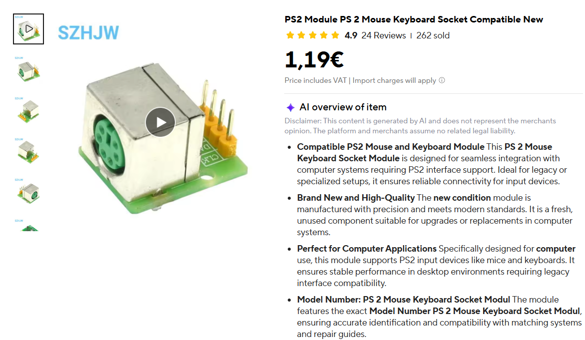
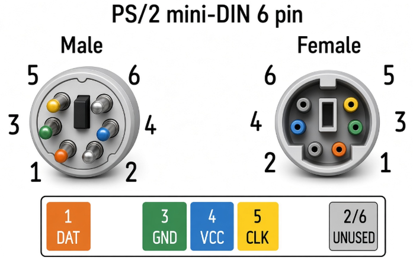

# leonardo_uart2keyboard

**A serial cable that types.** You send `TYPE hello` down a 9600 baud line, and a computer on the
other side sees a real keyboard typing `hello`. Nothing is installed on that computer, and to it the
board is indistinguishable from a normal keyboard.

**Why this exists, and why it is not a Rubber Ducky.** The usual keystroke injectors, Rubber Ducky
and friends, replay a script off a microSD card or over WiFi, and they are judged by one thing only:
did the text land in the OS. This board is the opposite instrument. Here it does not matter whether
the keys reach the operating system, it matters **how they arrive on the wire**: which of the nine
HID report formats carries them, at low speed or full speed, with what polling interval, how long
each key is held down, how big the gap between keys is, boot protocol or report protocol, 6KRO or
NKRO, which keyboard layout the characters are built from, USB or PS/2. That is the whole point of
the tool, fine grained control over exactly those details, so the okhi USB sniffer can be pushed
through every shape a real keyboard can take, one variable at a time.


That first photo is the original bench: an Arduino Leonardo wired with Dupont jumpers. Below is the
same rig rebuilt on perfboard around a **Pro Micro**, which is the board this firmware is developed
on today.


On that perfboard, top to bottom:

- the red **FTDI FT232 USB-to-UART adapter** on pins 0/1, which is the command channel
  ([section 3.1](#31-the-serial-adapter-always-needed));
- a **2x5 ICSP header soldered on by hand**. A stock Pro Micro has none, and this project's fuses
  remove the USB bootloader, so ISP becomes the only way to reflash and you do it often
  ([section 4.4](#44-setting-up-the-usbasp));
- the **Pro Micro** itself, running the firmware;
- the green **PS/2 breakout** carrying the mini-DIN-6 socket, fed by **D7 = CLK, A7 = DATA, plus
  GND** ([section 3.3](#33-option-b-ps2-keyboard)). The okhi PS/2 implant plugs in there and sees a
  normal keyboard.

Every connection is soldered underneath in enamelled copper wire instead of jumpered, which is more
compact and, more to the point, leaves nothing to work loose in the middle of a flash write.

> **The two photos do not show the same wiring.** The Leonardo shot still has the **old A5/A4** PS/2
> pins. A Pro Micro does not break out PF0/PF1, so those lines moved to **D7/A7**, and current
> firmware uses **D7/A7 on both boards**. See [section 3.5](#35-other-pins-the-firmware-uses) for the
> other pins a Pro Micro leaves out, and which LED it lights instead.

The board can present itself two ways, and picks automatically at boot:

- **USB keyboard**, through the board's own USB connector.
- **PS/2 keyboard**, through two ordinary GPIO pins you wire to a PS/2 socket (**D7 = CLK,
  A7 = DATA**).

Firmware `okhi-kbd-avr` v4.2, for the **ATmega32U4**. Developed on a **Pro Micro (5 V, 16 MHz)**,
and it runs on an **Arduino Leonardo** too. **The two boards do not break out the same pins**, so
read [section 3](#3-wiring-it-up) before you wire anything: the PS/2 lines, the status LED and the
BUSY output all differ between them. This file is the whole
documentation: what to buy, how to wire it, how to flash it, worked examples for both modes, the
complete command reference and the test suite. **Setting one up for the first time? Start at
[What you need](#2-what-you-need).**

| Path | What |
|---|---|
| [okhi_kbd.c](okhi_kbd.c) | The firmware, one translation unit |
| [build.py](build.py) | Build and flash |
| [bootloaders/](bootloaders/) | The stock Arduino and SparkFun bootloaders, to put a board back to factory, see [section 4.9](#49-putting-the-board-back-to-factory-state) |
| [test/](test/) | Hardware test suite, see [section 17](#17-test-suite) |

There is no Arduino core and no Arduino IDE involved. The firmware carries its own USB stack, which
is how it fits nine selectable HID report formats, two keyboard layouts and a bit-banged PS/2
device into 25 KB.

**There is no bootloader.** What gets written to the chip is the bare AVR application and nothing
else: the USBasp chip-erases the part and flashes `build/okhi_kbd.hex` alone, boot section included
in the erase. Turning the board back into an ordinary Arduino is three avrdude commands, and the
bootloaders you need are in [bootloaders/](bootloaders/) so you never have to go looking for them.
Step by step in [section 4.9](#49-putting-the-board-back-to-factory-state).


---

A handy way to wire the PS/2 side is a breakout module: a female PS/2 (mini-DIN 6P) socket mounted on a small PCB that breaks the pins out to a 2.54mm (0.1") header, so you can plug it straight into a breadboard or solder it to perfboard instead of butchering a cable. The pads are labelled (DAT, CLK, VCC, GND), which saves you tracing the connector pinout by hand.



Sold on AliExpress as "PS2 Module PS 2 Mouse Keyboard Socket Compatible" for about 1 EUR.


---

## PS2 PINOUT



## Contents

**Part 1, getting started**

1. [What you can do with it](#1-what-you-can-do-with-it)
2. [What you need](#2-what-you-need)
3. [Wiring it up](#3-wiring-it-up)
4. [Putting the firmware on the board](#4-putting-the-firmware-on-the-board)
5. [First run, step by step](#5-first-run-step-by-step)
6. [Recipes](#6-recipes)

**Part 2, reference**

7. [Talking to the board](#7-talking-to-the-board)
8. [Command index](#8-command-index)
9. [Typing commands](#9-typing-commands)
10. [Timing, and why it is a correctness knob](#10-timing-and-why-it-is-a-correctness-knob)
11. [USB configuration](#11-usb-configuration)
12. [PS/2 mode](#12-ps2-mode)
13. [Diagnostics](#13-diagnostics)
14. [Error reference](#14-error-reference)
15. [What survives a power cycle](#15-what-survives-a-power-cycle)
16. [Driving it from a script](#16-driving-it-from-a-script)
17. [Test suite](#17-test-suite)
18. [Troubleshooting](#18-troubleshooting)

---
---

# Part 1, getting started

## 1. What you can do with it

Send it a line of text and it types that text into whatever window has focus on the target machine.
Send it `COMBO CTRL+ALT+DELETE` and it presses those three keys. Send it `KEY F2 3` and it taps F2
three times.

Because the target sees a plain HID keyboard (or a plain PS/2 keyboard), it works before any
operating system has loaded: BIOS and UEFI setup screens, boot menus, login prompts, disk encryption
password fields. Anywhere a keyboard works, this works.

Practical uses: automating a machine that has no network, driving a BIOS setup screen, typing long
passwords into a locked console, testing how a host's keyboard driver behaves under nine different
HID report formats.

It carries two character maps, **Spanish (es-ES)** and **US ANSI (en-US)**, and you pick one with
the `LAYOUT` command. The target machine's keyboard layout has to match the one you pick, or the
punctuation and accents come out wrong. See [9.6](#96-character-set-and-layout).

---

## 2. What you need

### Always

| Item | Notes |
|---|---|
| **Pro Micro (5 V, 16 MHz)** | The board this is developed on. An **Arduino Leonardo** works too, with different pins, see [3.5](#35-other-pins-the-firmware-uses). It must be a genuine **5 V, 16 MHz** part: the firmware hard-codes `F_CPU=16000000UL`, so on a 3.3 V / 8 MHz Pro Micro every timing is off by 2x (serial baud, PS/2 bit timing) and the PS/2 lines cannot reach 5 V logic levels |
| **USB-to-serial adapter** | FTDI FT232 (`VID_0403`) or CH340 (`VID_1A86`), set to **5 V** TTL levels |
| **3 jumper wires** | For the serial link: TX, RX, GND |
| **A PC with a terminal** | PuTTY, Tera Term, the Arduino serial monitor, or PowerShell |

### To flash the board the first time

| Item | Notes |
|---|---|
| **USBasp programmer** | A few euros. Any AVR ISP programmer works (USBtinyISP, Atmel-ICE, or an Arduino running ArduinoISP) |
| **10-pin to 6-pin ICSP adapter** | Ships with most USBasp units. **Of no use on a Pro Micro**, which has no ICSP header: there you wire the bare 10-pin cable to ordinary broken-out pins, see [4.4](#44-setting-up-the-usbasp) |
| **Python 3** | To run the build script |
| **avr-gcc toolchain** | See [section 4.3](#43-installing-the-toolchain) |

Yes, you really do need a programmer. [Section 4.2](#42-do-i-need-a-usbasp) explains why.

### Only for PS/2 mode

| Item | Notes |
|---|---|
| **A PS/2 socket or cable** | Easiest source is a PS/2 extension cable or an old keyboard lead, cut in half |
| **3 more jumper wires** | CLK, DATA, GND. A fourth for +5 V if you want the PS/2 port to power the board |
| **A target with a real PS/2 port** | See the warning below |

> **Passive USB-to-PS/2 adapters do not work, at all.** Those little purple dongles contain no USB
> host. This was measured with the firmware's own bus counters: plugged into a real PC the board
> sees 2 bus resets and 18 setup packets; plugged into the dongle it sees **zero of everything**.
> Old keyboards work on them only because those keyboards are combo USB/PS-2 devices that speak PS/2
> in hardware. The ATmega32U4 cannot: `D+` and `D-` belong to the USB peripheral and are not
> general purpose I/O. That is exactly why PS/2 mode uses two separate GPIO pins.

---

## 3. Wiring it up

### 3.1 The serial adapter, always needed

This is your command channel. Three wires, and note that **TX and RX cross over**.

| Adapter | Board |
|---|---|
| TX | **pin 0 (RX1)** |
| RX | **pin 1 (TX1)** |
| GND | **GND** |

Then find the COM port:

```powershell
[System.IO.Ports.SerialPort]::getportnames()
```

> **The COM number changes when you move the adapter to a different USB port.** Check it every time
> before you suspect the firmware. This has cost real hours.

### 3.2 Option A, USB keyboard

Nothing extra to wire. Plug the board's own USB connector into the machine you want to type on. The
firmware detects the USB host and enters USB mode by itself.

> **It always claims to be an Arduino Leonardo, whatever board it is running on.** The descriptors
> hard-code `USB_VID 0x2341` and `USB_PID 0x8036`, so a Pro Micro running this firmware enumerates
> with Arduino's Leonardo identity, not the one printed on the board. That is deliberate, it is a
> known-good identity every OS already accepts as a keyboard, but do not be alarmed when a Pro Micro
> shows up as a Leonardo. The one place it matters is [section 11.2](#112-report-format), where the
> two-interface formats have to switch to PID `0xFEED` to stop Windows binding the Arduino CDC
> driver.

```
   [ your PC ]                       [ target PC ]
        |                                  |
        | USB                              | USB
   [ serial adapter ]                      |
        |  TX RX GND                       |
        +------------> [ Pro Micro (32U4) ]-+
                         pins 0, 1, GND
```

### 3.3 Option B, PS/2 keyboard

Two GPIO pins plus ground:

| PS/2 signal | Board pin | Also labelled | AVR pin |
|---|---|---|---|
| **CLK** | **D7** | digital 7 | PE6 |
| **DATA** | **A7** | digital 6 | PD7 |
| **GND** | GND | | |

These two are **adjacent pins** on the right-hand header of a Pro Micro, which is what makes them
convenient for a PS/2 socket. `A7` and `D7` are the Arduino labels: `A7` is the analog-7 alias of
digital pin 6 (PD7, ADC10), and `D7` is plain digital pin 7 (PE6). They are **on different ports**,
so each line carries its own `PS2_CLK_*` / `PS2_DAT_*` register trio in the firmware.

> **Earlier versions used A5 (PF0) for CLK and A4 (PF1) for DATA.** That works on a Leonardo but
> **not on a Pro Micro, which does not break out PF0 or PF1 at all**. If you are following an old
> build log or an old photo, this is the difference.

Now the connector. A PS/2 socket is a **mini-DIN-6**:

| mini-DIN-6 pin | Signal | Connect to |
|---|---|---|
| 1 | DATA | **A7** |
| 2 | not connected | leave open |
| 3 | GND | board **GND** |
| 4 | +5 V | optional, see below |
| 5 | CLK | **D7** |
| 6 | not connected | leave open |

**Find the pins with a multimeter, not with a drawing.** Wire colours inside PS/2 cables are not
standardised, and it is easy to mirror a connector diagram. Cut a PS/2 extension cable, put your
meter in continuity mode, and buzz each wire out against a known-good plug.

Things worth knowing:

- **GND is mandatory.** Without a common ground nothing works at all.
- **Pin 4 (+5 V) is optional.** The firmware never reads it. Connect it to the board's **5V** pin
  only if you want the PS/2 port to power the board, and then do not also power the board from USB
  or from the serial adapter.
- **No level shifter needed** on a genuine 5 V board, Pro Micro or Leonardo. PS/2 is a 5 V
  open-collector bus and the chip runs at 5 V. A 3.3 V / 8 MHz Pro Micro is the wrong board here
  twice over: it would need a shifter, and its clock would put every timing out by a factor of two.
- **No external resistors needed.** The host supplies the bus pull-ups (typically 1 k to 10 k). The
  firmware also turns on the AVR's internal pull-ups by default, which are much weaker (20 k to
  50 k) and just keep the lines idle-high when nothing is attached. `PS2 PULLUP OFF` turns them off
  if they get in the way.
- The firmware never drives a line high. It drives low or lets go, so the host always wins the bus.

### 3.4 Power rules, read this one

**Never power the board from the serial adapter or from the USBasp while you are testing USB
behaviour.** With any external 5 V present the board never power-on resets, `uptime` never drops
back to zero, and every plug test you do is meaningless.

Pick exactly one supply at a time:

- the target machine's USB port,
- the PS/2 port's +5 V,
- the serial adapter,
- the programmer.

### 3.5 Other pins the firmware uses

| What it does | Leonardo | Pro Micro |
|---|---|---|
| Status LED | pin **13**, PC7, lit when driven **high** | the on-board **RX LED**, PB0, lit when driven **low** |
| **BUSY output**, high for the whole of every typing burst | pin **12**, PD6 | PD6 exists but is **not broken out** |

On a Leonardo, pin 12 is a real output the firmware owns. If you wire something to D12 it will move
on its own. It is there so you can gate an external device or trigger a scope on a typing burst.

The firmware picks the right LED at compile time and `INFO` reports which one it chose:

```
# mode=ps2 ps2 clk=D7 dat=A7 pullups=1 enabled=1 board=promicro led=RX/PB0 busy=PD6/nc
```

Build for a Leonardo with `python build.py -DBOARD_LEONARDO=1`. The default is the Pro Micro.

> **What a Pro Micro actually costs you.** It breaks out 18 I/O and leaves out PB0, PC7, PD5, PD6,
> PF0 and PF1. Three of those matter here. **PF0/PF1** is why the PS/2 lines moved from A5/A4 to
> D7/A7. **PC7** is why the status LED moved to PB0, which is the Pro Micro's own RX LED and is
> wired the opposite way round, so the firmware inverts it. **PD6** is the one with no way out:
> BUSY is still driven inside the chip but there is no pad to reach it, so **on a Pro Micro you get
> the LED but not BUSY.** Everything else, typing, both modes and every command, is identical.

**Reading the LED**, in priority order. Works on both boards. Without a terminal this is your only
diagnostic:

| LED | Meaning |
|---|---|
| Fast flutter for 2 s | A byte just arrived on the serial port. Beats everything below |
| Solid | Typing |
| Solid | PS/2 mode, keyboard enabled |
| Fast blink | PS/2 mode, host disabled the keyboard |
| **Slow blink** | **USB mode, never enumerated.** The host is not talking to it |
| Fast blink | USB mode, suspended |
| Solid | USB mode, configured and ready |

---

## 4. Putting the firmware on the board

### 4.1 The short version

```bash
python build.py --flash
```

Then set one fuse, once. The rest of this section explains each part.

### 4.2 Do I need a USBasp?

**Yes.** Two independent reasons:

1. **Only an ISP programmer can change fuses**, and this project needs one fuse changed. A
   bootloader cannot do it.
2. **After that fuse change, USB uploads stop working permanently.** The programmer becomes the only
   way in.

Could you skip the fuse change, keep the factory bootloader and upload over USB like a normal
Arduino? Technically yes, on a board that still has its factory bootloader and fuses. But then the
Caterina bootloader holds the USB bus for **8 seconds** at every plug-in, presenting itself as a
serial device before handing over to your firmware. A device that changes its identity and its bus
speed 8 seconds after being plugged in is not a keyboard to anything picky, and it will fail exactly
where you most want it to work, in a BIOS screen. So: buy the programmer.

That is also why the build produces **one plain AVR image and nothing else**. The flash step
chip-erases the part and writes `build/okhi_kbd.hex`, so the boot section ends up blank and the only
thing on the chip is this firmware. Restoring the Arduino bootloader is a separate, documented,
one-command job ([section 4.9](#49-putting-the-board-back-to-factory-state)).

### 4.3 Installing the toolchain

You need the compiler, not the Arduino IDE. The build script looks for these exact paths:

| What | Where the script looks |
|---|---|
| avr-gcc | `%LOCALAPPDATA%\Arduino15\packages\arduino\tools\avr-gcc\7.3.0-atmel3.6.1-arduino7\bin` |
| avrdude (preferred) | `C:\Users\regue\Downloads\AVRDUDESS-2.20-portable (1)\avrdude.exe` |
| avrdude (fallback) | `%LOCALAPPDATA%\Arduino15\packages\arduino\tools\avrdude\8.0.0-arduino1\bin\avrdude.exe` |

Easiest way to get avr-gcc is to install the Arduino IDE once, let it download the AVR board
package, and then never open it again. The versions above are **hard coded**, there is no version
search, so if yours differ you must edit `build.py`.

> Building and flashing needs nothing else. `Caterina-Leonardo.hex` is worth having only for the
> factory restore in [section 4.9](#49-putting-the-board-back-to-factory-state), and the same board
> package installs it.

#### Versions installed on this machine

The IDE is only a delivery mechanism for the toolchain. What actually matters is the **board package
and tool versions**, because `build.py` hard-codes them in its paths.

| Component | Version | Location |
|---|---|---|
| **Arduino IDE** | **2.3.10** | `%LOCALAPPDATA%\Programs\Arduino IDE` |
| Board package `arduino:avr` | **1.8.8** | `%LOCALAPPDATA%\Arduino15\packages\arduino\hardware\avr\1.8.8` |
| avr-gcc | **7.3.0-atmel3.6.1-arduino7** | `...\packages\arduino\tools\avr-gcc\` |
| avrdude (Arduino's, the fallback) | **8.0.0-arduino1** | `...\packages\arduino\tools\avrdude\` |
| avrdude (preferred by `build.py`) | **8.1**, from AVRDUDESS 2.20 portable | `C:\Users\regue\Downloads\AVRDUDESS-2.20-portable (1)` |

Each of those is the **only** version present, so there is no ambiguity about which one gets picked.

> **You never open the IDE to build.** `build.py` calls avr-gcc directly, and the IDE could not
> compile this firmware anyway: it is a plain C file with its own USB stack, not a sketch.

> **On another PC it should just work.** `build.py` takes the newest avr-gcc and avrdude installed
> by the Arduino AVR package, on Windows, Linux or macOS, and falls back to whatever is on `PATH`.
> The one hard-coded path left is a personal AVRDUDESS folder, tried first and skipped when absent.
> Override any of it with `OKHI_AVR_GCC`, `OKHI_AVRDUDE` and `OKHI_AVRDUDE_CONF`, and run
> `python build.py --help` to see what it actually resolved.

### 4.4 Setting up the USBasp

A USBasp is a small USB dongle that speaks AVR ISP. It costs a few euros.

**Step 1, the Windows driver.** This is the number one first-time blocker. A USBasp ships with no
Windows driver and avrdude will simply not see it. Install one with
[Zadig](https://zadig.akeo.ie/): run it, pick the `USBasp` device from the list, choose **libusbK**
(or WinUSB), and click Replace Driver.

**Step 2, the cable.** This is the step that differs between the two boards.

#### On a Pro Micro

**There is no ICSP header.** The SPI pins are broken out as ordinary numbered pins, so the bare
10-pin USBasp cable goes straight to them. No adapter, no pin-1 alignment to get wrong:

| USBasp 10-pin | Signal | Pro Micro pin | AVR |
|---|---|---|---|
| 1 | MOSI | **16** | PB2 |
| 2 | VCC | **VCC** | |
| 5 | RESET | **RST** | |
| 7 | SCK | **15** | PB1 |
| 9 | MISO | **14** | PB3 |
| 4, 6, 8, 10 | GND | **GND** | |
| 3 | not connected | | |

Pins 14, 15 and 16 sit together on the left-hand side, which makes this less painful than it sounds.

> **Worth doing if you reflash often: solder your own ICSP header.** This project's fuses remove the
> USB bootloader, so ISP is the only way in and you will be plugging the programmer in over and over.
> Clipping six jumpers onto pins 14/15/16/RST/VCC/GND every time gets old fast, and a jumper that
> works loose mid-write is a corrupted flash. On a perfboard build you can bring those six signals
> out to an ordinary 2x5 (or 2x3) header and plug the USBasp ribbon straight in. There is a photo of
> exactly this in the [root README](../../README.md), on the DIY Pro Micro perfboard build.

#### On an Arduino Leonardo

The ISP connector is the **2x3 ICSP header** near the middle of the board. Pin 1 is marked with a
dot or a square pad.

```
      Leonardo ICSP header, pin 1 marked

        MISO  [1] [2]  VCC
         SCK  [3] [4]  MOSI
       RESET  [5] [6]  GND
```

> On a Leonardo the SPI pins exist **only** on this ICSP header. Unlike an Uno, they are not also on
> D11/D12/D13, and unlike a Pro Micro they are not on numbered pins either. The ICSP header is the
> only place an ISP programmer can connect.

Most USBasp units come with a 10-pin to 6-pin adapter. Use it, and line up pin 1 on both ends. The
ribbon cable's red stripe marks pin 1. If you only have the bare 10-pin cable, the mapping is:

| USBasp 10-pin | Signal | Leonardo ICSP |
|---|---|---|
| 1 | MOSI | 4 |
| 2 | VCC | 2 |
| 5 | RESET | 5 |
| 7 | SCK | 3 |
| 9 | MISO | 1 |
| 4, 6, 8, 10 | GND | 6 |
| 3 | not connected | |

**Step 3, power.** Most USBasp boards have a jumper (often labelled JP1) that feeds 5 V to the
target. Close it if the board is not powered any other way. Remember
[section 3.4](#34-power-rules-read-this-one): open it again before you test USB behaviour.

**Step 4, check it is alive.** This reads the chip signature and does nothing else:

```bash
avrdude -C "C:/Users/regue/Downloads/AVRDUDESS-2.20-portable (1)/avrdude.conf" -c usbasp -p m32u4
```

A working setup reports the ATmega32U4 signature `1e 95 87`. If it says it cannot find the
programmer, go back to step 1.

> **`avrdude: warning: cannot set sck period` is cosmetic.** It comes from old USBasp firmware and
> the flash works fine. Ignore it.

### 4.5 Build and flash

```bash
python build.py                    # compile only
python build.py --flash            # compile, check fuses, flash over USBasp, read back and verify
python build.py --fix-fuses        # check the fuses and write the correct ones, no flashing
python build.py -DUSB_LOW_SPEED=0  # compile with an extra define
python build.py --help             # usage, and the tool paths it resolved on this machine
```

Any argument starting with `-D` is appended to the gcc command line. **Anything it does not
recognise is an error**, so a typo like `--fix-fuse` stops the run with `unknown argument` and exit
code 2 instead of quietly doing nothing.

`--flash` reads `lfuse`, `hfuse` and `efuse` before it writes anything and compares them against the
values in [section 4.7](#47-the-fuse-set-it-once). A mismatch prints a loud block naming the bit and
what it costs you, and that block is printed again at the very end of the run so it cannot scroll
away behind the flash progress. The flash still goes ahead and the exit code does not change: a
wrong fuse is a warning, not a build failure. **No fuse is ever written unless you pass
`--fix-fuses`**, which only ever writes the three known-good values from that table.

Plain `python build.py` does not call avrdude at all, so it neither reads nor writes fuses.

A good build ends like this:

```
Program:   24946 bytes (76.1% Full)
Data:       1214 bytes (47.4% Full)
```

and `--flash` then adds:

```
readback verified: 24946 bytes match
```

`-DBOARD_LEONARDO=1` produces the same sizes, it only swaps which LED pin is compiled in.

Products land in `build/`:

| File | Purpose |
|---|---|
| `okhi_kbd.elf` | Linked image with symbols |
| `okhi_kbd.hex` | The firmware. This is what `--flash` writes, and it is the whole of what ends up on the chip |
| `readback.hex` | What was read back off the chip, for the verify step |

`--flash` writes that one file with no bootloader attached to it. avrdude chip-erases before every
write, so the boot section at 0x7000 is left blank too: after a flash the part holds this firmware
and nothing else.

The stock build is compiled **low speed** (`-DUSB_LOW_SPEED=1`). Passing `-DUSB_LOW_SPEED=0` makes
gcc print `warning: "USB_LOW_SPEED" redefined`, which is expected: the last define wins.

### 4.6 Why the build reads the chip back

Because **avrdude's own "verified" line answers a narrower question than the one you care about.**
It proves the flash matches the file avrdude was handed. It says nothing about whether that was the
right file, and nothing about a byte that changed after the write.

That matters because the only way into this board is six jumper wires or a hand-soldered header
clipped onto a USBasp, and the flash you are checking is the one that has to come up as a keyboard
in a BIOS screen with no way to debug it. So after writing, `build.py` reads the **entire** flash
back into `build/readback.hex` and compares it byte by byte against `build/okhi_kbd.hex`:

```
MISMATCH: <n> of <m> bytes differ, first at 0x<addr> (want 0x<hh> got 0x<hh>)
readback verified: 24946 bytes match
```

Only the second line means the board has what you built.

### 4.7 The fuse, set it once

**`build.py` never writes a fuse on its own.** `--flash` only *reads* the three fuses and warns when
they are wrong; the one thing that writes them is the explicit `python build.py --fix-fuses`. You can
also set them by hand, once, as below.

| | As shipped | This project |
|---|---|---|
| `lfuse` | `0xFF` | `0xFF` (unchanged) |
| **`hfuse`** | `0xD8` | **`0xD9`** |
| `efuse` | `0xCB` | `0xCB` (unchanged) |
| `lock` | `0xEF` | `0xEF` (unchanged) |

Those are Arduino's own values for the Leonardo, out of `boards.txt`, and the Pro Micro used for
this project read back the same `FF` / `D8` / `CB` before the change. **Only `hfuse` differs, by one
bit.**

`0xD9` leaves `BOOTRST` **unprogrammed** (bit set to 1), so the chip boots straight into your
application at 0x0000. In AVR fuse convention a bit of 0 means programmed, so it is the stock `0xD8`
that has `BOOTRST` programmed, and that is what makes reset land in the bootloader and gives you the
8-second delay described in [section 4.2](#42-do-i-need-a-usbasp).

**Order on a fresh board: flash first, then set the fuse.** Once `BOOTRST` is unprogrammed the
USBasp is your only way in.

```bash
# read the current fuses
avrdude -C "<avrdude.conf>" -c usbasp -p m32u4 -U lfuse:r:-:h -U hfuse:r:-:h -U efuse:r:-:h

# set the one that matters
avrdude -C "<avrdude.conf>" -c usbasp -p m32u4 -U hfuse:w:0xD9:m
```

> **Do not experiment with fuses.** Only `hfuse` needs changing. Clearing `SPIEN` or programming
> `RSTDISBL` disables ISP and leaves the chip recoverable only with a high-voltage programmer, and a
> wrong `lfuse` selects a clock source the board may not have. Either mistake bricks it for good
> with the tools in this list.

Consequences of `0xD9`, so nothing surprises you later:

- **USB uploads do not work. USBasp only.** Two things stop them: this fuse points reset at the
  application, and the flash carries no bootloader to upload to.
- All of it is reversible, and this repository ships the bootloaders you need.
  See [section 4.9](#49-putting-the-board-back-to-factory-state).

### 4.8 A reflash wipes your saved settings

A USBasp write chip-erases the part, which also erases EEPROM. Everything persisted goes back to
its default after every reflash: `SPEED`, `KRO`, `POLL`, `LAYOUT` and every `SET` value.
Reconfigure afterwards. The full list is in [15](#15-what-survives-a-power-cycle).

### 4.9 Putting the board back to factory state

Everything this project does to the board is reversible. A couple of minutes with the USBasp and it
is an ordinary Arduino again: uploads from the Arduino IDE over USB, double-tap reset for the
bootloader, all of it.

**The bootloaders ship with this repository**, in [bootloaders/](bootloaders/), so you do not have
to hunt for them or install anything to get them. You restore three things, in this order: the
**bootloader**, the **fuses**, and, optionally, the **lock bits**.

You need the USBasp wired up ([section 4.4](#44-setting-up-the-usbasp)). Once `hfuse` is `0xD9` it
is the only way into the chip.

#### Step 1. Pick the file for your board

| Your board | File | What is inside it |
|---|---|---|
| **Pro Micro 5 V / 16 MHz** | `bootloaders/Caterina-promicro16.hex` | SparkFun's Caterina, 4090 bytes at 0x7000 to 0x7FF9. Bootloader only, no sketch |
| **Arduino Leonardo** | `bootloaders/Caterina-Leonardo.hex` | Arduino's whole factory chip image, 32730 bytes: the factory sketch at 0x0000 to 0x12CB plus Caterina at 0x7000 to 0x7FD9 |

> **Use the file that matches your board.** The Leonardo image flashed on a Pro Micro does give you
> a working ATmega32U4 board, but it comes back with Arduino's Leonardo USB identity instead of the
> one printed on your Pro Micro, and the IDE will want the Leonardo board entry to upload to it. The
> SparkFun file keeps the Pro Micro's own identity. The fuse and lock steps are the same either way.

Both files are copied verbatim from their official packages:

| File | Comes from | sha256 |
|---|---|---|
| `Caterina-promicro16.hex` | SparkFun's Arduino board package for the Pro Micro | `bd2cffaedb0636d7cb85664800679ad239f00a736c968a5e5a4329ec37af25e7` |
| `Caterina-Leonardo.hex` | `arduino:avr` 1.8.8, `bootloaders/caterina/` | `2127dde14f22f9871fefe3b55361458489c32f89feb2de21a2157b2459d5b86e` |

#### Step 2. Flash the bootloader

Run this from the `firmware/leonardo_uart2keyboard/` folder, so the relative path to the file works.
Put your own avrdude.conf path in place of `<avrdude.conf>` ([section 4.3](#43-installing-the-toolchain)):

```bash
avrdude -C "<avrdude.conf>" -c usbasp -p m32u4 \
  -U flash:w:bootloaders/Caterina-promicro16.hex:i
```

On a Leonardo, same command with `bootloaders/Caterina-Leonardo.hex`.

avrdude chip-erases the part before writing, so **okhi and your saved settings go away at this
step**. On a Pro Micro the whole thing takes about five seconds and ends like this:

```
Reading 4090 bytes for flash from input file Caterina-promicro16.hex
Writing 4090 bytes to flash
Writing | ################################################## | 100% 2.57s
Reading | ################################################## | 100% 2.09s
4090 bytes of flash verified
```

#### Step 3. Restore the fuses

**Bootloader first, fuses second.** These fuses point reset at the boot section, so there has to be
a bootloader sitting in it already.

```bash
avrdude -C "<avrdude.conf>" -c usbasp -p m32u4 \
  -U lfuse:w:0xFF:m -U hfuse:w:0xD8:m -U efuse:w:0xCB:m
```

Only `hfuse` really changes, from `0xD9` back to `0xD8`; the other two already hold these values.
Writing all three costs nothing and saves you checking. Each one answers `1 byte written, 1 verified`.
Arduino and SparkFun use the same three values for the Leonardo and the Pro Micro.

#### Step 4. Restore the lock bits, optional

```bash
avrdude -C "<avrdude.conf>" -c usbasp -p m32u4 -U lock:w:0x2F:m
```

Genuinely optional. The chip erase in step 2 left the lock byte at `0xFF`, which means no locks at
all, and the board works perfectly like that. `0x2F` is what Arduino and SparkFun write, and it adds
exactly one thing: the bootloader can no longer overwrite itself. **It does not lock out the
USBasp.** You can still reflash and chip-erase over ISP with those lock bits in place.

#### Step 5. Check it worked

```bash
avrdude -C "<avrdude.conf>" -c usbasp -p m32u4 \
  -U lfuse:r:-:h -U hfuse:r:-:h -U efuse:r:-:h -U lock:r:-:h
```

Expect `0xff`, `0xd8`, `0xcb`, and then `0xef` if you did step 4 or `0xff` if you skipped it.

> **`0xef` is correct even though you wrote `0x2F`.** The AVR lock byte only defines bits 0 to 5;
> bits 6 and 7 are unused and always read back as 1. `0x2F` and `0xEF` are identical in every bit
> that means anything (`0x2F & 0x3F == 0xEF & 0x3F`). Do not chase this difference.

Now unplug the USBasp and plug the board into a PC by its own USB cable. What you should see:

| Restored with | USB ID | What the PC shows |
|---|---|---|
| `Caterina-promicro16.hex` | `1B4F:9205`, and `1B4F:9206` once you upload a sketch | A new COM port, `USB Serial Device`. Ready for an upload from the Arduino IDE |
| `Caterina-Leonardo.hex` | `2341:0036` for the first 8 s, then `2341:8036` | An `Arduino Leonardo` COM port, and once the factory sketch takes over an HID mouse and an HID keyboard as well |

> **On a Pro Micro that COM port stays there for good, and that is correct.** The SparkFun file is a
> bootloader with no sketch behind it, so Caterina finds an empty application area and waits in the
> bootloader instead of jumping into it. Upload any sketch from the IDE and it starts behaving like a
> normal board: after that the port only appears for 8 seconds after a reset.

> **The Leonardo file brings a sketch with it.** It is byte for byte Arduino's
> `Leonardo-prod-firmware-2012-12-10.hex`, the firmware Arduino flashes at the factory to test the
> board, which is why a restored Leonardo shows up as a mouse and a keyboard as well as a COM port.
> It does not answer on the UART. Upload your own sketch over it whenever you like.

#### What you lose

The chip erase wipes EEPROM, so the okhi `SPEED`, `KRO` and `POLL` settings are gone. That is part
of being factory. Nothing else on the board is affected.

#### Going back to okhi

Run `python build.py --flash --fix-fuses`. That reflashes the firmware and puts `hfuse` back to
`0xD9` in the same run, which is what you want, because **the flash step removes the bootloader you
just restored**: avrdude chip-erases before writing, boot section included, and nothing in the build
puts one back. It ends with `readback verified: 24946 bytes match`.

A plain `--flash` warns loudly about the leftover `0xD8` instead of fixing it, and you should fix it.
With `0xD8` the reset vector points at the boot section, which the flash leaves blank, so the board
comes up by sliding through erased flash until the program counter wraps back to 0x0000. It does
start, but it is not a state to leave a board in, and `--fix-fuses` is one flag.

---

## 5. First run, step by step

### 5.1 USB mode

1. Wire the serial adapter ([section 3.1](#31-the-serial-adapter-always-needed)).
2. Plug the board's own USB cable into the target machine.
3. Set the target's keyboard layout to **Spanish (Spain)**, or set it to **English (United States)**
   and send `LAYOUT US` to the board ([9.6](#96-character-set-and-layout)).
4. Open a terminal on the adapter's COM port at **9600 8N1**, line ending **LF**.
5. You should see the boot banner. If you missed it, press Enter and send `INFO`.

```
> INFO
# okhi-kbd-avr v4.2 layout=es-ES build=Aug 25 2026 10:30:00
# mode=usb ps2 clk=D7 dat=A7 pullups=0 enabled=1 board=promicro led=RX/PB0 busy=PD6/nc
# uart=9600 8N1 press=30ms gap=30ms settle=50ms dead=40ms jitter=5ms echo=ON guard=ON capsfix=ON
# usb=ready speed=low kro=boot ep0=8 bcd=0x0110 power=100mA interval=10
OK
```

The two things to check: **`mode=usb`** and **`usb=ready`**. If it says `usb=unconfigured`, the
target is not talking to it, and the LED will be blinking slowly.

6. Click into a text editor on the target, then:

```
> TYPE hello world
OK
```

`OK` arrives **after** the whole text has been typed, which is the point: it is your synchronisation
signal.

### 5.2 PS/2 mode

1. Wire the serial adapter and the PS/2 connector
   ([section 3.3](#33-option-b-ps2-keyboard)).
2. Power the board (USB power bank, the PS/2 port's +5 V, or the serial adapter, pick one).
3. Plug the PS/2 connector into the target and boot it.
4. Check the mode:

```
> PS2
# mode=ps2 pin=auto enabled=1 set=2 leds=0x00
# clk=1 dat=1 pullups=1 intpu=1 queued=0
# sent=0 cmds=4 lastcmd=0xf4 aborts=0 framing=0 dropped=0 resends=0
OK
```

What good looks like: **`mode=ps2`**, **`pullups=1`** (the host's pull-ups were detected, so a real
PS/2 host is there), `clk=1 dat=1` (bus idle), and a non-zero **`cmds=`** with `lastcmd=0xf4`, which
means the host sent commands and finished with "enable keyboard". That is a completed handshake.

5. Type something.

If the host does not see the keyboard at all, **force the mode**:

```
> PS2 ON
# mode=ps2 clk=D7 dat=A7 pullups=1
OK
```

The automatic path waits up to 2500 ms before announcing itself, and some hosts give up sooner. See
[section 12.1](#121-how-the-board-chooses).

### 5.3 If nothing happens

Work down this list in order:

1. **Is the serial link alive?** Send `PING`, expect `PONG`. No reply at all means wrong COM port or
   TX/RX not crossed. Garbage characters mean the wiring is fine and only the baud rate is wrong.
2. **What mode is it in?** `INFO`, look at `mode=`.
3. **In USB mode, is it enumerated?** `INFO`, look at `usb=ready`. If not, check `USB` and look at
   `udint_seen`. `0x00` means nothing is speaking USB on that connector at all.
4. **Do the layouts match?** `INFO` reports the board's as `layout=`; the target's must be the one
   that goes with it ([9.6](#96-character-set-and-layout)). A mismatch gives correct letters and
   digits but wrong punctuation and accents.
5. **Is the right window focused on the target?** The board types into whatever has focus.

---

## 6. Recipes

Copy-paste examples. Each one assumes the target window already has focus.

**Type a line and press Enter**

```
LINE dir C:\Windows
```

**Open the Run box and launch Notepad**

```
COMBO GUI+R
DELAY 500
LINE notepad
```

**Ctrl+Alt+Delete**

```
COMBO CTRL+ALT+DELETE
```

**Type a password into a login box, then submit**

```
TYPE MyP4ssw0rd
KEY ENTER
```

**Hold Shift while typing, to get uppercase without changing the text**

```
DOWN SHIFT
TYPE hola
UP SHIFT
```

That types `HOLA`. Modifiers you press with `DOWN` stay pressed until you `UP` them or 30 seconds
pass.

**Navigate a menu**

```
KEY F10
KEY RIGHT 3
KEY DOWNARROW 2
KEY ENTER
```

Careful: the vertical arrows are `UPARROW` and `DOWNARROW`. The words `UP` and `DOWN` are commands.

**Fix a typo three characters back**

```
TYPE hello wrold
KEY LEFT 3
KEY DELETE
TYPE o
KEY END
```

**Media keys** (needs a consumer format first)

```
KRO CONSUMER
DELAY 3000
CONSUMER VOLUP
CONSUMER MUTE
```

**Slow it down for a fussy host**

```
SET PRESS 50
SET GAP 50
SET SETTLE 80
TYPE a long line that was coming out wrong
```

**Type an accented Spanish line** (needs `LAYOUT ES`, the default, and a Spanish target)

```
TYPE el niño comió melón en León
```

**Switch to a US target and back**

```
LAYOUT US
TYPE user@host:~/dir$ ls -la | grep "[a-z]"
LAYOUT ES
```

**Send a raw HID usage** (both fields hexadecimal)

```
RAW 05 04
```

That is Ctrl+Alt+`a`.

**Check the board is healthy after a long run**

```
STATUS
```

Everything on the second line should be zero.

---
---

# Part 2, reference

## 7. Talking to the board

| Parameter | Value |
|---|---|
| Port | USART1, board pins 0 (RX1) and 1 (TX1) |
| Baud | 9600 |
| Frame | 8 data bits, no parity, 1 stop bit (8N1) |
| Flow control | None. Incoming XON (0x11) and XOFF (0x13) are discarded |
| Line ending you send | **Any of CR (`\r`), LF (`\n`), CRLF, or LFCR**. A two-character pair (CR+LF or LF+CR) counts as one terminator, not two blank lines. Stray NUL (0x00) padding bytes are ignored, so old CR+NUL teletype-style terminals also work |
| Line ending you receive | CRLF |
| Max line length | 200 characters |
| RX buffer | 256-byte ring |

### 7.1 Reading the replies

| Prefix | Meaning |
|---|---|
| `OK`, `OK SKIP <n>`, `OK ABORT <n>` | Command finished. `SKIP n` means n characters could not be typed. `ABORT n` means you interrupted it, and **n is still the skip count, not how much was lost**, so it is usually 0 |
| `PONG` | Answer to `PING` |
| `ERR <text>` | Command failed, see [section 14](#14-error-reference) |
| `# <text>` | Informational. Can arrive at any time, including unprompted |
| `READY` | Boot banner |

A host script should read until `\n`, treat `# ` lines as informational noise, and sync on `OK` or
`ERR`.

> **`PING` is the one exception, and it will hang a naive script.** It replies `PONG` and stops
> there: **no `OK` follows it.** Every other command in the index ends in `OK` or `ERR`, so a loop
> that reads until `^OK|^ERR` after each command works everywhere except here, where it blocks until
> your read timeout. Treat `PONG` as a terminator too.

### 7.2 What arrives without you asking

Open the port during a boot and you get **five `#` lines and then `READY`**: the four-line `INFO`
block, then `# probing: usb traffic wins, otherwise ps2 keyboard on D7=clk A7=dat`. Straight after
that first `READY` the probe usually reports what it settled on, `# mode=usb speed=low` or
`# mode=ps2 ...`, so do not assume `READY` is the last thing you will see. `READY` then repeats
every 3 s, up to 40 times, until the first byte arrives.

These can also appear mid-conversation, between any command and its reply:

```
# mode=usb speed=<low|full>          a USB host appeared while in PS/2 mode
# mode=ps2 clk=D7 dat=A7 pullups=<n> the probe settled on PS/2
# usb power lost, probing again      VBUS gone for 1500 ms
# auto-release: held keys timed out  a DOWN key hit its 30 s limit
# abort, queue flushed               you sent Ctrl-C
# HUNT: ...                          see section 11.5
```

A parser that does not tolerate stray `# ` lines will break.

### 7.3 Interrupting

**Ctrl-C (0x03)** or **Ctrl-X (0x18)** at any time aborts the current typing burst and flushes the
queue. The board prints `# abort, queue flushed` and the command replies `OK ABORT <n>`. `DELAY` is
abortable too, and answers `OK ABORT 0`.

### 7.4 Pacing

**Typing is slow, and there is no flow control. Always wait for `OK` before sending the next
command.**

With the default timings, one character costs:

| Character | Cost |
|---|---|
| Lowercase letter, digit, unshifted symbol | about 60 to 65 ms |
| Anything needing Shift or AltGr | about 160 to 165 ms |
| Accented lowercase (dead key plus letter) | about 160 to 170 ms |
| Accented uppercase | about 260 to 270 ms |

That is roughly **6 to 16 characters per second**. A 200-character line, the maximum, can take
**50 seconds**. Set your read timeout accordingly; the bundled tests use 40 s.

The consequence of no flow control: while the board spends 50 s typing, a host that keeps sending at
9600 baud can push about 48 KB at a 256-byte ring buffer. The overflow is dropped silently and
counted in `rxdrop`, so commands get corrupted with no error at all. Waiting for `OK` avoids this
completely.

### 7.5 Case and spacing

Command keywords, key names, modifier names and `ON`/`OFF` arguments are case-insensitive. The text
you pass to `TYPE` and `LINE` is byte-verbatim and case-sensitive.

Exactly one space is consumed after the command word, so `TYPE  hello` (two spaces) types a leading
space.

A `COMBO` longer than 47 characters is truncated silently and then fails with `ERR invalid combo`,
which does not hint at the real cause. Key names cap at 23 characters, command words at 15.

---

## 8. Command index

Every command the parser accepts. **There are no aliases and no abbreviations**: one name per
command, one spelling per value.

| Command | Section |
|---|---|
| `TYPE <text>` | [9.1](#91-commands) |
| `LINE <text>` | [9.1](#91-commands) |
| `KEY <key> [n]` | [9.1](#91-commands) |
| `COMBO <a+b+key> [n]` | [9.4](#94-modifier-names-and-combo-grammar) |
| `DOWN <key>` | [9.4](#94-modifier-names-and-combo-grammar) |
| `UP <key>` | [9.4](#94-modifier-names-and-combo-grammar) |
| `REL` | [9.4](#94-modifier-names-and-combo-grammar) |
| `DELAY <ms>` | [9.1](#91-commands) |
| `RAW <mod> <code>` | [9.5](#95-raw) |
| `SET <param> <value>` | [10](#10-timing-and-why-it-is-a-correctness-knob) |
| `SPEED FULL\|LOW\|DEFAULT` | [11.1](#111-bus-speed) |
| `KRO <format>` | [11.2](#112-report-format) |
| `LAYOUT [ES\|US\|DEFAULT]` | [9.6](#96-character-set-and-layout) |
| `POLL <1..64>\|DEFAULT` | [11.3](#113-polling-rate) |
| `CONSUMER <key>` | [11.4](#114-media-keys) |
| `REENUM` | [11.5](#115-re-enumerating) |
| `HUNT [ON\|OFF]` | [11.5](#115-re-enumerating) |
| `PS2 [subcommand]` | [12.2](#122-commands) |
| `PING` | [13](#13-diagnostics) |
| `INFO` | [13](#13-diagnostics) |
| `STATUS` | [13](#13-diagnostics) |
| `USB` | [13](#13-diagnostics) |
| `HELP` | [13](#13-diagnostics) |
| `RESET` | [13](#13-diagnostics) |
| `REBOOT` | [13](#13-diagnostics) |
| `FACTORY_RESET` | [13](#13-diagnostics) |

---

## 9. Typing commands

### 9.1 Commands

| Command | Does |
|---|---|
| `TYPE <text>` | `T` | Types the text |
| `LINE <text>` | `L` | Types the text, then Enter |
| `KEY <key> [n]` | `K` | Taps a named key, optionally n times |
| `COMBO <a+b+key> [n]` | `C` | Taps a modifier combination, optionally n times |
| `DOWN <key>` | | Presses and holds a key or modifier |
| `UP <key>` | | Releases one held key or modifier |
| `REL` | `RELEASE` | Releases everything held |
| `DELAY <ms>` | `WAIT`, `W` | Waits. Decimal, clamped to 60000, abortable |
| `RAW <mod> <code>` | | Taps one raw HID usage, both fields hexadecimal |

Replies: `TYPE`, `LINE`, `KEY` and `COMBO` answer `OK`, `OK SKIP <n>` or `OK ABORT <n>`. `DELAY`
answers `OK` or `OK ABORT 0`. `REL`, `DOWN`, `UP` and `RAW` only ever answer a plain `OK` or an
`ERR`.

The repeat count `[n]` on `KEY` and `COMBO` is decimal and must be at least 1. **`0` gives
`ERR bad count`, and anything above 200 is silently clamped to 200.**

### 9.2 Three things that surprise people

**`KEY <unknown>` types the token as text instead of failing.** `KEY hello` types `hello`, `KEY A`
types `A`. Only names in the table below are treated as keys, and **modifier names are not in that
table**, so `KEY SHIFT` types the word `SHIFT` into your document. Use `COMBO` or `DOWN` for
modifiers.

**`DOWN`, `UP` and `COMBO` do not fall back to typing.** They are strict: `DOWN hola` gives
`ERR invalid key`, `COMBO CTRL+hola` gives `ERR invalid combo`. Only `KEY` is lenient.

**There is no `UP` or `DOWN` arrow key name.** Those words are commands. The vertical arrows are
**`UPARROW`** and **`DOWNARROW`**. `LEFT` and `RIGHT` are real key names.

### 9.3 Key names

Complete list. **60 names covering 49 distinct keys**, nothing else is recognised:

```
ENTER RETURN        ESC ESCAPE          BACKSPACE BKSP      TAB
SPACE SPACEBAR      CAPSLOCK            F1 .. F12
PRINTSCREEN PRTSC   SCROLLLOCK          PAUSE BREAK         INSERT INS
HOME                PAGEUP PGUP         DELETE DEL          END
PAGEDOWN PGDN       RIGHT               LEFT                DOWNARROW
UPARROW             NUMLOCK             MENU APP
KPDIV KPMUL KPMINUS KPPLUS KPENTER KPDOT
KP0 KP1 KP2 KP3 KP4 KP5 KP6 KP7 KP8 KP9
```

Not available: F13 and above, media keys (use `CONSUMER`), and any international or language key.

### 9.4 Modifier names and COMBO grammar

| Names | Modifier |
|---|---|
| `CTRL`, `CONTROL`, `LCTRL` | Left Ctrl |
| `SHIFT`, `LSHIFT` | Left Shift |
| `ALT`, `LALT` | Left Alt |
| `GUI`, `WIN`, `WINDOWS`, `CMD`, `SUPER`, `META`, `LGUI` | Left GUI |
| `ALTGR`, `ALTGRAPH`, `RALT` | Right Alt (AltGr) |
| `RCTRL`, `RSHIFT`, `RGUI`, `RWIN` | The right-hand ones |

**Grammar**: elements joined by `+`, no spaces around the `+`. **Every element except the last must
be a modifier name.** The last may be a modifier, a named key, or a bare single character `A` to `Z`
or `0` to `9`. `COMBO CTRL+SHIFT` with no key is legal and just presses and releases those
modifiers. `COMBO a+b` fails.

`DOWN` and `UP` accept the same last-element set: a modifier name, a named key, or a bare single
character.

`DOWN` holds until you release it, or until a **30 second** timeout fires and the board prints
`# auto-release: held keys timed out`.

**A rollover overflow reports as `ERR invalid key`.** In `BOOT`, `CONSUMER` and `LSCONSUMER` formats
the report has six key slots, so the seventh `DOWN` is rejected with that message. It looks like a
typo and is not.

### 9.5 RAW

```
RAW <mod_hex> <code_hex>
```

Both fields are **hexadecimal**, with an optional `0x` prefix, range 0x00 to 0xFF. There is no
decimal mode: `RAW 0 10` means modifier 0x00 and usage 0x10, which is the letter `m`.

Modifier bitmask: `01` LCtrl, `02` LShift, `04` LAlt, `08` LGUI, `10` RCtrl, `20` RShift, `40` RAlt
(AltGr), `80` RGUI. They combine, so `RAW 05 04` is Ctrl+Alt+`a`. A code of `00` sends modifiers
only.

`RAW` is a full key tap, not a single endpoint write: it goes through the same warm-up, `SETTLE`,
`PRESS` and `GAP` machinery as everything else. `CAPSFIX` is the one thing not applied to it.

### 9.6 Character set and layout

The board carries **two character maps** and types with one of them at a time. The map decides which
key and which modifiers go on the wire for each character; the target decides what that key means.
So **the map has to match the target's keyboard layout**:

| `LAYOUT` | Map | The target's keyboard layout must be |
|---|---|---|
| `ES`, the default | Spanish, es-ES | Spanish (Spain) |
| `US` | US ANSI, en-US | English (United States) |

```
LAYOUT              report the one in use
LAYOUT ES|US        switch to that map
LAYOUT DEFAULT      clear the saved value, back to es-ES
```

Persistent the moment you send it ([15](#15-what-survives-a-power-cycle)), and it takes effect on the
very next `TYPE` or `LINE`, with no re-enumeration and no reboot. `INFO` reports it as
`layout=es-ES` or `layout=en-US`.

Get it wrong and letters and digits still come out right, because those sit on the same keys in both
layouts, while punctuation and accents do not. Typing `;\@(?` with `LAYOUT US` into a machine set to
Spanish gives `ñç")_`, which is a quick way to recognise the mistake, and is exactly what
`test_layout.ps1` asserts ([17](#17-test-suite)).

Text is decoded as UTF-8.

**In both layouts**: ASCII letters and digits, TAB, newline, and the whole printable ASCII
punctuation set ``space ! " # $ % & ' ( ) * + , - . / : ; < = > ? @ [ \ ] ^ _ ` { | } ~``. Also
non-breaking space, folded to a plain space, and typographic punctuation folded to ASCII: the en
dash – and the em dash — become `-`, curly single quotes become `'`, curly double quotes become
`"`.

**es-ES only**, because they need a key or a dead key that US ANSI does not have:

- Punctuation: `¡ ª ¬ · º ¿ €`
- Letters: `ñ Ñ ç Ç`
- Acute: `á Á é É í Í ó Ó ú Ú`
- Diaeresis: `ü Ü ï ë`
- Grave: `à è ì ò ù`
- Circumflex: `â ê î ô û`
- Tilde: `ã õ`
- Standalone marks, each typed as a dead key then a space: diaeresis `¨`, acute `´`

On es-ES the caret `^`, grave `` ` `` and tilde `~` are dead keys too, so they are also typed as the
dead key followed by a space; on en-US they are ordinary single keys.

**Dropped and counted in `OK SKIP <n>`**, in both layouts: uppercase `À È Ì Ò Ù Â Ê Î Ô Û Ã Õ Ë Ï`,
symbols like `£ § ¶ ° « »`, box drawing, CJK, emoji (any 4-byte UTF-8 sequence), and control
characters other than TAB. **In en-US, everything in the es-ES-only list above is dropped as well**,
because US ANSI has no dead keys: `TYPE ` + `áéíóúñ` under `LAYOUT US` answers `OK SKIP 6` and types
nothing at all.

Accented characters are typed as a dead key, then a `DEAD` millisecond pause, then the base letter.

---

## 10. Timing, and why it is a correctness knob

```
SET PRESS <ms>     key held down          default 30
SET GAP <ms>       idle between keys      default 30
SET SETTLE <ms>    modifier settle time   default 50
SET DEAD <ms>      dead key to vowel gap  default 40
SET JITTER <ms>    random 0..n added to GAP, default 5
SET ECHO ON|OFF    local echo of what you type, default ON
SET GUARD ON|OFF   wait for USB before typing, default ON
SET CAPSFIX ON|OFF compensate host CapsLock, default ON
```

Ranges: 0 to 1000 ms, values above are silently clamped, not rejected. Values are decimal, and the
flags take `ON` or `OFF`.

**Every one of these is persistent the moment you send it.** There is no save step: the settings
live in a single EEPROM image that the board rewrites on any change, so a profile you tune once is
the profile the board boots with from then on. `RESET` puts all eight back to the compiled defaults,
also persistently. Full picture in [15](#15-what-survives-a-power-cycle).

### The case-flip failure

The defaults are deliberately conservative. The failure they guard against is a rare **case flip**
on a long line, for example one `N` typed uppercase among 72 random characters. It was root-caused
to the **host**, not the device: Windows drops the occasional modifier transition when HID reports
arrive faster than it can process them.

What it is not: not CapsLock (it reproduces with `CAPSFIX OFF`), not PS/2 (it happens on direct USB
too), and not a coalesced device report (the IN endpoint is single-banked and each report blocks
until it is polled). It is deterministic per line and timing combination, so jitter and chunking do
not fix it. **Larger `PRESS`, `GAP` and `SETTLE` do**, by giving the host time.

Measured 0 flips in many thousands of characters at `25/25/40`. The defaults sit above that for
margin. Same result at full speed and at low speed.

**If typing ever flips case or drops a character, raise PRESS, GAP and SETTLE.** Correctness beats
speed here. The test harness auto-retries with an escalating timing profile for exactly this reason.

### The three flags

- **`ECHO`** is a true local echo and is **ON by default**: every character you send is echoed
  straight back as it arrives, so a plain terminal shows what you type. Pressing Enter echoes CRLF,
  and Backspace (0x08 or DEL 0x7F) erases the last character with `\b \b`. It is per character, not
  line based. `SET ECHO OFF` turns it off, after which nothing is echoed and the received bytes are
  handled byte-for-byte with no output. A programmatic host that dislikes seeing its own input come
  back should send `SET ECHO OFF` once at start-up, or simply ignore any line that is not `OK`/`ERR`.
- **`GUARD`** makes `TYPE`, `LINE`, `KEY`, `COMBO`, `DOWN` and `RAW` wait up to **1500 ms** for the
  USB link to be configured. If it never is, the command aborts before typing anything with
  `ERR link not ready`. With `GUARD OFF` keystrokes go out regardless and simply fail, showing up in
  `USB` as `reports failed=`. In PS/2 mode the guard always passes immediately.
- **`CAPSFIX`** learns the host's real CapsLock state and flips the Shift bit so `TYPE` produces the
  text you asked for even with CapsLock on. It applies to letters and mapped characters in `TYPE`
  and `LINE`, and **not** to digits, `KEY`, `COMBO`, `DOWN`/`UP` or `RAW`. It works in PS/2 mode
  too, because the PS/2 LED command feeds the same state.

---

## 11. USB configuration

**Four commands re-enumerate the device and go deaf for about 800 ms**: `SPEED`, `KRO`, `POLL` and
`REENUM`. All four answer `OK` immediately, then detach, wait 300 ms, re-init, wait 500 ms, and only
then print their final block. Anything you send inside that window is lost. The test scripts sleep
2.5 to 3.5 s after a `KRO` for this reason.

**They also zero USB counters**, which matters because those counters are your main diagnostic:

| Command | Zeroes |
|---|---|
| `SPEED`, `KRO`, `POLL` | resets, sof, setups, getdesc, setaddr, setconfig, stalls, lastreq/lastreqtype/lastdesc, reports ok and failed |
| `REENUM` | the same minus reports ok/failed |
| `HUNT ON` | resets, setups, getdesc, setaddr, setconfig, stalls, **udint_seen, suspends, wakeups** |

Note that **only `HUNT ON` clears `udint_seen`**. After a `KRO` change it still holds the truth about
whether anything ever spoke USB.

### 11.1 Bus speed

```
SPEED FULL          full speed, saved
SPEED LOW           low speed, saved
SPEED DEFAULT       back to the compiled default, low in the stock build
```

Persistent and applied at every boot. `INFO` shows the effective one as `speed=low` or `speed=full`,
which a wide `KRO` format can force to `full` whatever you asked for.

Any report format wider than the 8-byte boot layout needs full speed, because a low-speed packet is
8 bytes. The firmware enforces that **at boot, on every `KRO` change, and on `SPEED` itself**, so
`SPEED LOW` while a wide format is active is refused and answers with:

```
OK
# note: current kro format requires full speed
```

Use `REBOOT` for a clean restart when you want to see the saved value take effect
without a power cycle.

### 11.2 Report format

```
KRO BOOT|NKRO|ARRAY|MULTI|HYBRID|HYBRID2|CONSUMER|LSMULTI|LSCONSUMER
```

Persistent. A bare
`NKRO` with no argument selects NKRO.

This exists to exercise every keyboard-driver code path on the host. **If you just want a keyboard,
leave it at `BOOT`.**

| `KRO` | Interfaces | Report on the interrupt pipe | Rollover | Forces full speed | PID |
|---|---|---|---|---|---|
| `BOOT` (default) | 1 | 8-byte boot layout, no report ID | 6 | no | `8036` |
| `ARRAY` | 1 | modifier + reserved + 16-key array (18 B) | 16 | yes | `8036` |
| `MULTI` | 1 | two 6-key reports on IDs 1 and 2 (9 B each) | 12 | yes | `8036` |
| `NKRO` | 1 | modifier + 120-bit bitmap (16 B) | unlimited | yes | `8036` |
| `HYBRID` | 1 | IDs 1 (6-key) and 6 (NKRO); keys ride ID 6 | unlimited | yes | `8036` |
| `HYBRID2` | **2** | IF0 boot 6KRO (EP1), IF1 NKRO (EP2); keys ride IF1 | unlimited | yes | **`FEED`** |
| `CONSUMER` | 1 | boot 6-key (ID 1) plus Consumer Control (ID 2) | 6 | yes | `8036` |
| `LSMULTI` | **2** | two 6-key interfaces, 8 B each, no report IDs | 12 | no | **`FEED`** |
| `LSCONSUMER` | **2** | boot keyboard IF0 + Consumer Control IF1 (2 B, no ID) | 6 | no | **`FEED`** |

**Boot protocol always wins.** Whatever the format, when the host asks for boot protocol (BIOS and
UEFI do) the board sends the fixed 8-byte layout, so rollover there is 6 in every format.

#### The composite-device PID trap

The two-interface formats present PID **`0xFEED`** instead of the Leonardo `0x8036`. With the
Leonardo VID:PID on a composite device, Windows matches the Arduino composite INF and **binds
interface 0 to the Arduino CDC serial driver**. It shows up as "Arduino Leonardo (COMxx)", class
Ports, in error, and interface 0's keystrokes never arrive. Device Manager shows MI_00 as a COM port
and MI_01 as the keyboard.

A single-interface config is not composite, so it is never MI-matched and works fine on `0x8036`.
The PID is patched per format at descriptor-request time.

The board identifies as VID `0x2341`, manufacturer string `okhi la`, product string `keyboard`, no
serial number.

### 11.3 Polling rate

```
POLL <1..64>        milliseconds, saved
POLL DEFAULT        back to 10 ms
```

Persistent. At **full speed** 1 to 64 ms is honoured verbatim
(1 ms = 1000 Hz, 2 = 500 Hz, 4 = 250 Hz, 8 = 125 Hz). At **low speed** anything below 10 is reported
as 10, the USB spec floor. The stored value is not clamped, so switching to a full-speed format
later un-clamps it automatically.

The value is patched into every endpoint descriptor, including both endpoints of `HYBRID2`. `INFO`
reports the effective value as `interval=<n>`, which is the clamp and not what you asked for when
the two differ.

Verifying the true poll rate needs a bus analyser. The tests only confirm that typing stays
byte-exact at any rate.

### 11.4 Media keys

```
CONSUMER VOLUP|VOLDN|MUTE|PLAY|NEXT|PREV|STOP
```

Two preconditions, each with its own error:

- The format must be `CONSUMER` or `LSCONSUMER`, else `ERR set KRO CONSUMER or LSCONSUMER first`.
- The board must be in USB mode, configured, and in report protocol, else
  `ERR consumer needs usb report protocol`. Media keys are a USB report-protocol feature, so they do
  not exist in PS/2 mode or under boot protocol.

### 11.5 Re-enumerating

```
REENUM      detach and re-attach without changing anything
HUNT [ON]   cycle detach, attach, speed and resume every 1200 ms until a host reacts
HUNT OFF    stop
```

`REENUM` answers `OK` then prints the `USB` block.

`HUNT` is a diagnostic for a connector that appears dead. With no argument it means `ON`, and it
also accepts `1`/`0`. It reports `# HUNT: host reacted at step <n> round <m>` when something
responds, and `# HUNT: round <n> done, no reaction (speed=...)` otherwise. It suspends USB/PS-2
arbitration while it runs.

Two caveats: **`HUNT` is a silent no-op in PS/2 mode.** And its "host reacted" verdict fires on a
**single** reset, whereas mode arbitration requires a setup packet or two resets. Since unplugging a
connector also produces a reset-like signal, a `HUNT` success is weaker evidence than a `mode=usb`
transition.

---

## 12. PS/2 mode

### 12.1 How the board chooses

At boot it starts in probe mode and decides like this:

1. **USB traffic always wins.** As soon as it sees a setup packet, or two or more bus resets, it
   goes USB. Two resets are required because unplugging the connector also produces the electrical
   signal that looks like a reset.
2. At 60 ms it measures whether the PS/2 lines have **external** pull-ups, which only a live PS/2
   host provides.
3. It then waits, and if no USB host appeared it enters PS/2 mode:

| Condition | Wait before entering PS/2 |
|---|---|
| No USB VBUS at all | 300 ms |
| VBUS present, PS/2 pull-ups detected | 800 ms |
| VBUS present, no pull-ups | 2500 ms |

4. Once in PS/2 mode, a real USB host appearing later still switches it to USB, **but only while
   `pin=auto`**. `PS2 ON` turns that off: a board forced to PS/2 stays there no matter what you plug
   into the USB port.
5. Once in USB mode, VBUS lost for 1500 ms restarts the probe, with `# usb power lost, probing
   again`.

On entering PS/2 mode the board queues a **BAT `0xAA`** and prints
`# mode=ps2 clk=D7 dat=A7 pullups=<n>`.

**If your PS/2 host is slow to detect the keyboard**, force it with `PS2 ON`. The automatic path
waits 2500 ms before announcing itself when VBUS is present and no pull-ups were detected, and some
hosts will not wait that long.

### 12.2 Commands

| Command | Does |
|---|---|
| `PS2` | Print the PS/2 status block |
| `PS2 ON` | Force PS/2 mode, disables auto |
| `PS2 OFF` | Force USB mode |
| `PS2 AUTO` | Back to auto probing, restarts the probe |
| `PS2 BAT` | Queue a `0xAA` BAT-OK and pump for up to 300 ms |
| `PS2 ENABLE` | Undo a host disable command without a reset |
| `PS2 PROBE` | Re-measure external pull-ups, then print the block |
| `PS2 PULLUP ON\|OFF` | Internal AVR pull-ups on D7/A7 |
| `PS2 RAW <hex>` | Inject one raw device-to-host byte into the scancode queue |

`PS2 ON`/`OFF` accept only the words `ON` and `OFF` here, not `1`/`0`.

Neither the mode nor the pull-up choice is saved. Every boot starts at `pin=auto`, `intpu=1`.

### 12.3 What it implements

- 11-bit frames both directions: start `0`, 8 data bits LSB first, odd parity, stop `1`.
- Device clock around **10.5 kHz** sending, 12.5 kHz receiving, both inside the 10 to 16.7 kHz spec
  window.
- **Scancode set 2**, with correct extended and break prefixes, including the multi-byte
  PrintScreen and Pause sequences.
- Host commands: `0xFF` reset (answers `0xFA 0xAA`), `0xFE` resend, `0xEE` echo, `0xED` set LEDs,
  `0xF0` set/get scancode set, `0xF2` read ID (answers `0xFA 0xAB 0x83`, MF2 keyboard), `0xF3` set
  typematic, `0xF4` enable, `0xF5` disable, `0xF6` set defaults, and `0xF7` to `0xFD` accepted with
  no effect. Anything else answers `0xFE`.
- Host inhibit and request-to-send detection, with the device aborting a frame mid-transmission when
  the host takes the bus.
- The host's LED state feeds the same internal state `CAPSFIX` uses, so CapsLock compensation works
  in PS/2 mode.

### 12.4 PS/2 limitations

1. **PS/2 is always 6-key rollover.** It reads only the boot report, so the `KRO` setting is
   USB-only. Worse, in a wide format a seventh key is accepted by the command layer (it went into
   the bitmap) but PS/2 never looks at that bitmap, so **a lost key can look like a success**. Use
   `KRO BOOT` in PS/2, where the overflow is reported as `ERR invalid key` instead.
2. **Media keys do not work**, see [section 11.4](#114-media-keys).
3. **Scancode sets 1 and 3 are not implemented.** They are acknowledged and reported back in `set=`,
   but the device keeps sending set 2.
4. **No typematic auto-repeat.** The command is acknowledged and its argument discarded. Repeat has
   to come from the host or from `KEY <key> <n>`.
5. **No hot-plug detection on the PS/2 side.** Plugging the connector produces no event, and the
   pull-up measurement only runs once per probe at 60 ms. If you plug the cable in later, `pullups=`
   stays stale until you issue `PS2 PROBE` or `PS2 AUTO`.
6. **`PS2 BAT` and `PS2 RAW` in USB mode** queue bytes that never go out, and still answer `OK`.
   They pile up in `queued=`, which tops out at 127, and the next byte starts raising `dropped=`.
7. **`PS2 ON` while already in PS/2 is a no-op**, so it sends no fresh BAT. Use `PS2 BAT`, or
   `PS2 OFF` then `PS2 ON`.
8. Keys with no set-2 equivalent are dropped silently.

---

## 13. Diagnostics

### `INFO`

```
# okhi-kbd-avr v4.2 layout=<es-ES|en-US> build=<date> <time>
# mode=<usb|ps2|probe> ps2 clk=D7 dat=A7 pullups=<0|1> enabled=<0|1> board=<promicro|leonardo> led=<RX/PB0|13/PC7> busy=<PD6/nc|12/PD6>
# uart=9600 8N1 press=30ms gap=30ms settle=50ms dead=40ms jitter=5ms echo=ON guard=ON capsfix=ON
# usb=<unconfigured|suspended|ready> speed=<low|full> kro=<format> ep0=8 bcd=0x0110 power=100mA interval=<ms>
OK
```

### `STATUS`

```
# uptime=<s>s lines=<n> errors=<n> typed=<n> skipped=<n>
# rxdrop=<n> longline=<n> aborts=<n> heldmods=0x<hh> heldkeys=<n>
OK
```

`rxdrop` counts bytes lost to a full RX ring, `longline` counts lines discarded by the 200-character
limit, `aborts` counts Ctrl-C events. **A healthy run has zeros across the second line.**

An `uptime` that drops back to 0 on its own means the **4-second watchdog** fired. It is a reboot,
so the forced mode and all counters go, and the `SET` values come back from EEPROM: the saved
profile if there is one ([15](#15-what-survives-a-power-cycle)), the compiled defaults otherwise.
Either way, unsaved tweaks are lost.

### `USB`

```
# vbus=<0|1> udaddr=0x<hh> udcon=0x<hh> usbcon=0x<hh> usbsta=0x<hh>
# resets=<n> sof=<n> setups=<n> getdesc=<n> setaddr=<0|1> setconfig=<0|1> stalls=<n>
# lastreq=0x<hh> lastreqtype=0x<hh> lastdesc=0x<hh> protocol=<boot|report> leds=0x<hh>
# reports ok=<n> failed=<n>
# udint_seen=0x<hh> vbus_changes=<n> vbus_last_ms=<n> suspends=<n> wakeups=<n>
OK
```

`udint_seen` is the OR of every USB interrupt bit ever seen. It is the single most useful field for
"is anything speaking USB on this connector", and only `HUNT ON` clears it.

Three false positives to avoid when reading this block:

- Unplugging the connector produces the same electrical signature as a bus reset, so `resets` can
  tick up from the plug itself. Only believe a reset that arrives together with other traffic.
- At low speed the device's own pull-up puts the bus in the idle state, so the chip self-suspends
  after 3 ms. **`suspends=1` on its own is not evidence of a host.**
- `sof=0` is normal at low speed. Low-speed hosts send keep-alives, not Start-of-Frame packets.

### `PS2`

```
# mode=<probe|usb|ps2> pin=<auto|usb|ps2> enabled=<0|1> set=<n> leds=0x<hh>
# clk=<0|1> dat=<0|1> pullups=<0|1> intpu=<0|1> queued=<n>
# sent=<n> cmds=<n> lastcmd=0x<hh> aborts=<n> framing=<n> dropped=<n> resends=<n>
OK
```

`pullups` is the **external** measurement (a host is present), `intpu` is whether the **internal**
AVR pull-ups are on. `framing` counts bad parity or bad stop bits, `aborts` counts frames the host
interrupted, `dropped` counts bytes lost to a full queue, `resends` counts host resend requests
(a rising count means line noise). `queued` covers the scancode queue only.

Careful: `aborts` in `PS2` and `aborts` in `STATUS` are **different counters**. The first is host
inhibit, the second is Ctrl-C.

### The rest

| Command | Does |
|---|---|
| `PING` | Answers `PONG` |
| `HELP` | Prints the command summary. Not exhaustive, use [section 8](#8-command-index) |
| `RESET` | The eight `SET` knobs back to the compiled defaults, plus release all keys and clear the RX ring. Leaves the rest of the settings alone and does not reboot |
| `REBOOT` | Clean watchdog restart, prints the boot banner afterwards |
| `FACTORY_RESET` | Erases the whole settings image and reboots, so the board comes up exactly as a freshly flashed one. See [15](#15-what-survives-a-power-cycle) |

---

## 14. Error reference

Every `ERR` line the firmware can emit. All of them increment `errors=` in `STATUS`.

| Message | Cause |
|---|---|
| `ERR unknown command: <CMD>` | No such command. The name is shown uppercased and truncated to 15 characters |
| `ERR line too long` | Over 200 characters. **The whole line is discarded, nothing is typed** |
| `ERR link not ready` | `GUARD` is on and USB was not configured within 1500 ms. Nothing was typed |
| `ERR missing key` | `KEY`, `DOWN` or `UP` with no argument |
| `ERR invalid key` | Unknown name for `DOWN`/`UP`, **or a rollover overflow on a 6-key format** |
| `ERR missing combo` | `COMBO` with no argument |
| `ERR invalid combo` | Bad `COMBO` grammar, a non-modifier before the last `+`, or a token over 47 characters |
| `ERR bad count` | Repeat count of `0` or non-numeric |
| `ERR bad ms` | `DELAY` with a missing or non-numeric argument |
| `ERR hid report rejected` | `RAW` could not be delivered |
| `ERR usage: RAW <mod_hex> <code_hex>` | Missing or non-hex `RAW` field, or a value above 0xFF |
| `ERR bad value` | A `SET` timing value that is missing or not decimal |
| `ERR usage: ON\|OFF` | A `SET` flag given something other than `ON`/`OFF`/`1`/`0` |
| `ERR unknown SET parameter` | No such `SET` knob |
| `ERR usage: SET PRESS\|GAP\|SETTLE\|DEAD\|JITTER\|ECHO\|GUARD\|CAPSFIX <value>` | `SET` with no parameter |
| `ERR usage: SPEED FULL\|LOW\|DEFAULT` | Bad or missing `SPEED` argument |
| `ERR usage: KRO BOOT\|NKRO\|...` | Bad `KRO` argument |
| `ERR usage: LAYOUT ES\|US\|DEFAULT` | Bad `LAYOUT` argument |
| `ERR usage: POLL <1..64 ms>\|DEFAULT` | Out of range, non-numeric, or missing |
| `ERR usage: CONSUMER VOLUP\|VOLDN\|...` | `CONSUMER` with no argument |
| `ERR unknown media key` | `CONSUMER` with an unrecognised key |
| `ERR set KRO CONSUMER or LSCONSUMER first` | `CONSUMER` in a format that has no consumer report |
| `ERR consumer needs usb report protocol` | `CONSUMER` in PS/2 mode, unconfigured, or under boot protocol |
| `ERR usage: HUNT ON\|OFF` | Bad `HUNT` argument |
| `ERR usage: PS2 [...]` | Unknown `PS2` subcommand |
| `ERR usage: PS2 PULLUP ON\|OFF` | `PS2 PULLUP` with a bad value |
| `ERR usage: PS2 RAW <hex>` | `PS2 RAW` with a missing or bad hex byte |

---

## 15. What survives a power cycle

**Everything persisted lives in one EEPROM image**, a single struct at address 0, and it is a plain
mirror of the live configuration:

| Setting | Command |
|---|---|
| USB bus speed | `SPEED` |
| Report format | `KRO` |
| Poll interval | `POLL` |
| Character layout | `LAYOUT` |
| `PRESS`, `GAP`, `SETTLE`, `DEAD`, `JITTER`, `ECHO`, `GUARD`, `CAPSFIX` | `SET` |

**Any command that changes a setting rewrites the whole image**, and the board reads the whole image
once at boot. There is no save step, no per-setting cell and no offsets: what you see in `INFO` is
what is in EEPROM. The image carries a magic number, a version and a checksum, and if any of the
three fails to match, the board falls back to the compiled defaults for **all** of it rather than
trusting half an image.

> Writing goes through `eeprom_update_block`, which only burns the cells that actually differ, so
> rewriting the image on every change costs the endurance of the bytes that moved and nothing more.

**Not saved**, back to defaults at every boot: USB/PS-2 mode and the `PS2 ON|OFF|AUTO` choice, PS/2
internal pull-ups, `HUNT` state, every counter, and any held keys.

### Clearing it

| Command | Effect |
|---|---|
| `RESET` | The eight `SET` knobs back to the compiled defaults, plus release all keys and clear the RX ring. Leaves `SPEED`, `KRO`, `POLL` and `LAYOUT` alone, and does not reboot |
| `FACTORY_RESET` | Erases the whole image and reboots. The board comes up exactly like a freshly flashed one |
| A USBasp reflash | Chip-erases the part, which wipes EEPROM too. Same end result as `FACTORY_RESET`, and easy to forget |

`FACTORY_RESET` answers with a `#` line and `OK`, then reboots itself, so the boot banner follows
immediately:

```
> FACTORY_RESET
# factory reset: eeprom cleared, rebooting into the compiled defaults
OK
# okhi-kbd-avr v4.2 layout=es-ES build=<date> <time>
...
READY
```

---

## 16. Driving it from a script

The rules that matter: wait for `OK`, allow up to 50 s for a full line, tolerate `# ` lines at any
moment, and sleep about 3 s after `SPEED`, `KRO`, `POLL` or `REENUM`. Two things that catch scripts
out: **`PING` answers `PONG`, not `OK`**, so a strict `^OK|^ERR` loop hangs on it, and **`LAYOUT`
needs no sleep at all**, because it does not re-enumerate.

```powershell
$ser = New-Object System.IO.Ports.SerialPort("COM35", 9600, "None", 8, "One")
$ser.NewLine = "`n"           # LF, CR or CRLF all work as line terminators
$ser.Encoding = [System.Text.Encoding]::UTF8
$ser.ReadTimeout = 400
$ser.Open()
Start-Sleep -Milliseconds 250 # let the boot banner land

function Cmd-Wait([string]$cmd, [int]$timeoutMs = 40000) {
    $ser.DiscardInBuffer()
    $ser.WriteLine($cmd)
    $deadline = (Get-Date).AddMilliseconds($timeoutMs)
    while ((Get-Date) -lt $deadline) {
        try { $line = $ser.ReadLine() } catch { continue }   # read timeout, keep waiting
        if ($line -match '^OK')  { return $true }
        if ($line -match '^ERR') { Write-Warning $line; return $false }
        # anything else is a '#' informational line, ignore it
    }
    Write-Warning "timeout on: $cmd"
    return $false
}

Cmd-Wait "SET PRESS 30"
Cmd-Wait "SET GAP 30"
Cmd-Wait "LINE hola mundo"
Cmd-Wait "COMBO CTRL+S"
$ser.Close()
```

For a fuller version with focus handling and screen readback, see
[test/ps2lib.ps1](test/ps2lib.ps1).

---

## 17. Test suite

In [test/](test/). These are **hardware** tests: they drive a real board over the UART and
verify what it actually types into a real Windows application, byte for byte. They work in both
`usb` and `ps2` mode.

### 17.1 How they verify

- **Readback uses UI Automation**, not the clipboard and not by reading keystrokes back. It cannot
  be corrupted by a stale clipboard and does not depend on focus timing.
- **Focus is verified by window handle**, not by title. Windows 11 Notepad rewrites its title as you
  type (it adds a `*` and the first line), which breaks title-based activation. The handle is stable.
- **Synchronisation is by the firmware's `OK`**, which it prints only after the whole line has been
  typed, so a readback is never premature.
- **Focus is taken with `AttachThreadInput`.** Windows refuses `SetForegroundWindow` to a process
  that is not already in the foreground, which is exactly the case when the suite is launched from
  another window. Attaching to the current foreground thread for the duration of the call lifts that
  restriction, and it is what stops the tests reporting phantom focus failures.
- If focus still cannot be secured, a test **aborts instead of typing**, so keystrokes can never leak
  into another window.

### 17.2 Prerequisites

1. **Notepad open.** The tests force it to the foreground and check before every burst. **Do not
   touch the keyboard or mouse while a test runs.**
2. **Serial adapter** on pins 0/1/GND. Default port is **COM35**, override with `-Port COMxx`.
3. **Board reachable and in `usb` or `ps2` mode.** In USB mode it must be powered from its own USB
   connector so it enumerates as a keyboard on the machine running the test.
4. **Windows keyboard layout set to Spanish (ES)** so the accent tests match. `test_layout.ps1` also
   needs the **US** layout available, and switches between the two by itself.

No administrator rights are needed.

### 17.3 The scripts

| Script | Parameters | Covers | Pass looks like |
|---|---|---|---|
| `run_all.ps1` | `-Port -Lines -LineLen -AccentReps -Seed -KeyReps -Full` | Driver. Runs `test_uart`, `test_settings`, `test_content`, `test_keys` and `test_layout`; with `-Full`, also `test_all` | A `SUITE RESULT` table and `ALL <n> PASSED` |
| `test_uart.ps1` | `-Port -Baud` | UART line handling: echo ON by default, CR / LF / CRLF / LFCR terminators, two-char-pair collapse, NUL padding dropped, `SET ECHO OFF\|ON`. **Pure serial: no Notepad, focus, layout or PS/2 link needed** | `UART line-handling: 10 PASS, 0 FAIL` |
| `test_settings.ps1` | `-Port` | The settings mirror: every `SET` persistent on its own, `SPEED`/`KRO`/`POLL`/`LAYOUT` riding in the same image, and what `RESET` and `FACTORY_RESET` each clear. **Pure serial too: it types nothing** | `SETTINGS MIRROR: 8 PASS, 0 FAIL` |
| `test_content.ps1` | `-Port -Lines -LineLen -AccentReps -Seed -Press -Gap -Settle` | Random content lines, the ES accent set, protocol health soak | `BAD=0` on both tests, zero `skipped`/`rxdrop`/`aborts` deltas |
| `test_keys.ps1` | `-Port -Reps` | Backspace, Tab, Enter, repeat, arrows, Delete, Shift combos | `SUMMARY: PASS=<8 x Reps> FAIL=0` |
| `test_layout.ps1` | `-Port` | `LAYOUT` command: each map against its matching Windows layout, the same text producing different keys under each, en-US keys read by a Spanish layout, accents dropped in en-US, EEPROM persistence | `LAYOUT: 9 PASS, 0 FAIL, 0 SKIP` |
| `test_nkro.ps1` | `-Port -Keys` | Rollover cap for the format currently set | `RESULT: PASS (kro=<fmt> cap=<n>, registered <n>)` |
| `test_all.ps1` | `-Port -Lines -LineLen -RollKeys -Seed` | Full acceptance: all nine formats, edit keys, bus speed, polling, EEPROM persistence | `FAIL=0` in the TOTAL line |

`ps2lib.ps1` is the shared helper library. It is dot-sourced by the others and is never run
directly.

### 17.4 Exit codes

Every script reports a verdict you can act on, so the suite can be wired into anything:

| Code | Meaning |
|---|---|
| `0` | Everything checked passed |
| `1` | A real failure. Something the firmware did was wrong |
| `2` | Could not verify. Focus, a missing keyboard layout, or an unreachable board. Nothing failed, nothing was proved |

`run_all.ps1` collects the children, prints a `SUITE RESULT` table and exits with the worst of them.
`$LASTEXITCODE` after it is the single answer to "did the board pass".

### 17.5 Running them

```powershell
# the usual pass, a few minutes
powershell -NoProfile -ExecutionPolicy Bypass -File .\run_all.ps1 -Port COM35

# everything, including the full acceptance matrix
powershell -NoProfile -ExecutionPolicy Bypass -File .\run_all.ps1 -Port COM35 -Full

# heavier content soak on its own
powershell -NoProfile -ExecutionPolicy Bypass -File .\test_content.ps1 -Port COM35 -Lines 100 -LineLen 72 -AccentReps 40

# rollover for one format: set the format first
powershell -NoProfile -ExecutionPolicy Bypass -File .\test_nkro.ps1 -Port COM35 -Keys 12

# EEPROM behaviour on its own, no Notepad needed, about a minute
powershell -NoProfile -ExecutionPolicy Bypass -File .\test_settings.ps1 -Port COM35

# just the verdict
.\run_all.ps1 -Port COM35 > run.log; "exit $LASTEXITCODE"
```

### 17.6 Things to know before you run them

- **`test_all.ps1` rewrites your saved settings.** It walks all nine `KRO` formats, changes `SPEED`
  and `POLL`, and reboots the board twice. It restores `KRO BOOT`, `SPEED DEFAULT` and
  `POLL DEFAULT` before finishing, but if it aborts halfway the board is left on whatever format it
  had reached.
- **`test_nkro.ps1` does not set the format.** It only reads `kro=` from `INFO`, so send `KRO <fmt>`
  over the UART first. Expected caps: `BOOT`/`CONSUMER`/`LSCONSUMER` 6, `MULTI`/`LSMULTI` 12,
  `ARRAY` 16, `NKRO`/`HYBRID`/`HYBRID2` unlimited.
- **`test_settings.ps1` ends with a `FACTORY_RESET`**, deliberately. It walks the board through
  saved profiles and reboots, and clearing everything at the end is the only way to leave it in a
  state you can name. Expect `SPEED`, `KRO`, `POLL`, `LAYOUT` and any saved timings to be gone
  afterwards.
- **`test_layout.ps1` moves two settings and puts them back.** It changes the board's saved `LAYOUT`
  and the keyboard layout of the Notepad window, and reboots the board once to prove the setting is
  persisted. Both are restored at the end. Its counter deltas are meant to be non-zero:
  `skipped=6` are the six accents en-US cannot type, `errors=1` is the deliberate bad argument.
- **`test_content.ps1` auto-retries with escalating timing.** A `rawTypeFails` count above zero is
  not a failure; it means a line needed a slower profile, which is the documented host behaviour
  from [section 10](#10-timing-and-why-it-is-a-correctness-knob). Only `BAD` counts.
- **`-Press -Gap -Settle` on `test_content.ps1`** pin the per-character timing for a whole run.
  That is the knob to reach for when reproducing or ruling out a case flip.
- **SKIP is not a failure.** `test_all.ps1` reports focus problems as SKIP and says so explicitly:
  they are infrastructure, not firmware.
- **The harness silences the echo.** Firmware local echo is ON by default, but `Open-Ser` in
  `ps2lib.ps1` sends `SET ECHO OFF` at connect so serial parsing stays clean and deterministic. Real
  users keep echo on; `test_uart.ps1` is the one script that exercises it (it manages echo itself).

### 17.7 The PowerShell 5.1 encoding gotcha

Windows PowerShell 5.1 reads `.ps1` files as ANSI unless they carry a UTF-8 BOM. These scripts
therefore build every non-ASCII character from explicit code points (`[char]0x00F1` for `ñ`), never
as literals in the file. **Keep it that way**, or a future accented literal will be typed as
mojibake.

---

## 18. Troubleshooting

| Symptom | Look at |
|---|---|
| No reply at all on the serial port | COM number changed after moving the adapter. Check `getportnames()`. Zero bytes means an open wire or TX/RX not crossed; garbage bytes means wrong baud |
| Commands get corrupted during a long burst | You are sending without waiting for `OK`. Check `rxdrop` in `STATUS`. See [7.4](#74-pacing) |
| A command seems to hang | Typing is slow. A 200-character line can take 50 s. Raise your read timeout |
| `ERR line too long` | Over 200 characters. Nothing was typed, split the line |
| `ERR link not ready` | USB never got configured within 1500 ms. Check `USB`, or use `SET GUARD OFF` to type anyway |
| `ERR invalid key` on the seventh `DOWN` | Rollover limit, not a typo. See [9.4](#94-modifier-names-and-combo-grammar) |
| `OK SKIP <n>` | n characters are not in the map of the layout in use. See [9.6](#96-character-set-and-layout) |
| `KEY SHIFT` typed the word "SHIFT" | Modifier names are not key names. Use `COMBO` or `DOWN` |
| Text arrives with wrong punctuation or accents | The target's keyboard layout and the board's `LAYOUT` do not match. See [9.6](#96-character-set-and-layout) |
| One character comes out in the wrong case | Raise `PRESS`, `GAP` and `SETTLE`. See [10](#10-timing-and-why-it-is-a-correctness-knob) |
| Text typed with CapsLock inverted | `SET CAPSFIX ON` |
| Media keys refused | `ERR set KRO...` means wrong format; `ERR consumer needs usb report protocol` means PS/2, unconfigured, or boot protocol. See [11.4](#114-media-keys) |
| `SPEED LOW` answered with a `# note:` line | A wide `KRO` format needs full speed. Switch to `KRO BOOT` first if you really want low speed |
| Board deaf right after `KRO`/`SPEED`/`POLL` | The 800 ms re-enumeration window. Sleep about 3 s |
| `udint_seen=0x00` after changing format | Only `HUNT ON` clears it, so this really does mean no USB traffic |
| Shows as "Arduino Leonardo (COMxx)" in error, keystrokes lost | A two-interface format on the wrong PID. Confirm with `INFO` that `kro=` matches what you set |
| USB dead, nothing enumerates | `USB` block. `udint_seen=0x00` means nobody is speaking USB. A slow-blinking LED means the same. Try `HUNT ON` |
| LED blinking slowly and nothing types | USB mode, never enumerated. See [3.5](#35-other-pins-the-firmware-uses) |
| Board never power-on resets, `uptime` never drops | It is being powered from the serial adapter or the programmer as well. See [3.4](#34-power-rules-read-this-one) |
| `uptime` resets on its own | The 4 s watchdog fired. The forced mode is gone and the `SET` values reload from EEPROM, so unsaved tweaks are lost |
| PS/2 host does not see the keyboard | Force `PS2 ON` instead of waiting for the 2500 ms auto path. Check `pullups=1` in `PS2` |
| PS/2 `pullups=0` with the cable plugged in | The measurement is stale. Issue `PS2 PROBE` |
| USB plugged in but the board stays in PS/2 | With `pin=auto` a USB host appearing switches it over on its own and prints `# mode=usb`, no reboot needed. If it does not, either you forced it with `PS2 ON` (issue `PS2 AUTO` or `PS2 OFF`), or the cable is not really seated: check `vbus=` and `udint_seen` in `USB` |
| PS/2 keys beyond the sixth go missing | PS/2 is always 6KRO. Set `KRO BOOT` so the overflow is reported instead of silently lost |
| PS/2 stops responding | The host may have disabled the keyboard. Check `enabled=0` in `PS2` and a fast-blinking LED. Fix with `PS2 ENABLE` |
| PS/2 `resends=` climbing | Line noise. Shorten the wires, check the ground |
| avrdude cannot find the USBasp | The Windows driver. Install libusbK with Zadig. See [4.4](#44-setting-up-the-usbasp) |
| avrdude says `cannot set sck period` | Cosmetic, old programmer firmware. Ignore it |
| Settings reverted after flashing | The chip erase wiped EEPROM. Re-issue whatever you had set |
| Flash "verified" but the board acts like a stock Leonardo | You flashed `Caterina-Leonardo.hex`, the factory restore image, instead of `build/okhi_kbd.hex`. See [4.9](#49-putting-the-board-back-to-factory-state) |
| USB upload impossible, the board has no COM port of its own | Expected. `hfuse=0xD9` and there is no bootloader in flash. See [4.7](#47-the-fuse-set-it-once) |
| I want a plain Arduino Leonardo back | Restore flash, fuses and lock bits. See [4.9](#49-putting-the-board-back-to-factory-state) |
| Lock bits read back `0xef` but I wrote `0x2f` | Correct. Bits 6 and 7 are unused and always read as 1. See [4.9](#49-putting-the-board-back-to-factory-state) |
