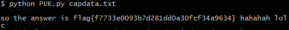
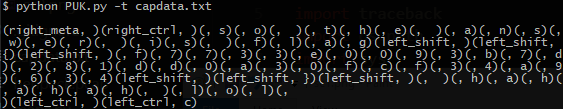

# PUK - Parse USB Keyboard

```
Usage: PUK.py [OPTIONS] [INPUT FILE]
    -o fileName.txt   Output file
    -v                Verbose  (Default if -o is not present.)
    -c                Confirm targets before file I/O.
    -t                Tuple mode (mod_key_1, ..., mod_key_N, base_key)
    -h                Help
```
  This program parses hex data from captured USB keyboard packets. Each line of input should have one base key and up to one mod key. Each line should be 4 or 8 bytes. Tuple mode is harder to read, but should offer more context if mod keys are important.

## Instructions
**1.** Extract hex data from the packets in the capture file.  
   The commands below **extract** the **data**, **remove** **blank** and **0x0** **lines**, and **store** the **results** in `capdata.txt`.
   - `$ tshark -r henpeck.pcap -T fields -e usb.capdata | grep -E "." | grep -v '0000000000000000' > capdata.txt`

**2.** Use the `PUK.py` script on the file created in step 1 to decode the hex data.

## Examples
    1. $ python PUK.py capdata.txt
This is usually easier to read, but that extra c on the end is out of context.  
  

    2.  $ python PUK.py -t capdata.txt
This mode reveals that the **`c`** on the end was part of a terminate signal.


## To Do
**1.** Expand key map and include alt codes. Maybe translated in norm, and not in tuple mode.
   - e.g. `left_alt` + `3` = `♥`

**2.** Too many arguments semi-breaks the cli arg regex.

## Credit
I got the idea for this program by participating in NahamconCTF 2021, and I think the HenPeck problem was created by **@JohnHammond**.

**@MightyPork** created the [KeyMap Reference](https://gist.github.com/MightyPork/6da26e382a7ad91b5496ee55fdc73db2) I used to understand what was going on. That Gist page also inspired me to make this project.
